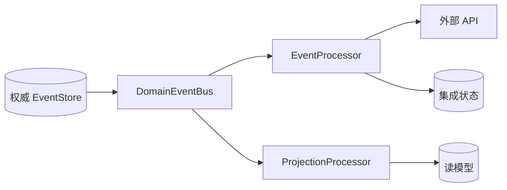
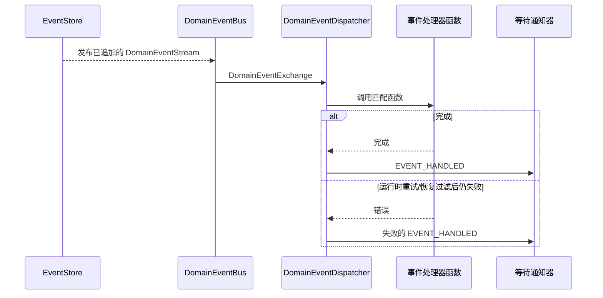

# 事件处理器

事件处理器在命令产生并追加权威事件流之后响应领域事件。它适用于通知、集成与不应放进源聚合事务的应用副作用。

事件处理器属于派生处理。它写入的数据库状态或外部效果不是事件历史，必须拥有自己的重放、幂等与恢复规则。

## 概述

沿用 `CreateOrder` 示例：

```text
CreateOrder -> 追加 OrderCreated -> PROCESSED
                              |-> 快照策略 -> SNAPSHOT
                              |-> 投影 -> PROJECTED
                              |-> 事件处理器 -> EVENT_HANDLED
```

三个下游分支彼此独立。`EVENT_HANDLED` 表示匹配的事件处理器函数完成，不表示快照或投影处理完成。


```mermaid
flowchart LR
    Store[(权威 EventStore)] --> Bus[DomainEventBus]
    Bus --> EP[EventProcessor]
    EP --> API[外部 API]
    EP --> DB[(集成状态)]
    Bus --> PP[ProjectionProcessor]
    PP --> Read[(读模型)]
```

## 事件处理器 vs 投影处理器

| 关注点 | `@EventProcessor` | `@ProjectionProcessor` |
|---|---|---|
| 主要用途 | 应用/集成响应 | 维护查询模型 |
| 等待阶段 | `EVENT_HANDLED` | `PROJECTED` |
| 典型效果 | 发送通知、调用服务、显式发送命令 | upsert/delete 读模型行或文档 |
| 返回值 | 函数调用的完成/错误 | 投影更新的完成/错误 |
| 恢复归属 | 处理器重试/幂等/补偿 | 投影重放/检查点/幂等设计 |

事件需要协调多个聚合命令时使用 Saga。从事件处理器返回命令体或事件体不会自动发布它。

## 创建事件处理器

`@EventProcessor` 是 Spring 组件 stereotype。框架解析 `onEvent` 方法或显式标注 `@OnEvent` 的方法，并注册匹配的消息函数。

### 基本结构

```kotlin
@EventProcessor
class OrderEventProcessor(
    private val notificationPort: NotificationPort,
) {
    @OnEvent
    fun onOrderCreated(event: OrderCreated): Mono<Void> =
        notificationPort.sendOrderCreated(
            operationId = event.orderId,
            event = event,
        )
}
```

返回的 `Mono` 必须代表副作用完成。在方法内部启动无法跟踪的 subscription 会让 `EVENT_HANDLED` 过早完成，并使失败脱离分发器。

### 事件处理方法

第一个参数决定支持的事件类型，可以是事件体、`DomainEvent<T>` 或 `DomainEventExchange<T>`。其他参数可由 Wow 的 function accessor 基础设施注入。

```kotlin
@EventProcessor
class OrderAuditProcessor {
    fun onEvent(event: OrderCreated): Mono<Void> = record(event)

    @OnEvent
    fun onPaid(event: DomainEvent<OrderPaid>): Mono<Void> =
        record(event.aggregateId, event.body)
}
```

约定的方法名 `onEvent` 无需 `@OnEvent`。方法使用其他名称，或需要 topic/retry 元数据时添加注解。

### 按聚合名称过滤

`@OnEvent` 接受聚合名称：

```kotlin
@OnEvent("order")
fun onOrderCreated(event: OrderCreated): Mono<Void> = record(event)
```

未指定名称时，topic 解析使用事件体元数据。同一事件类型可能出现在多个聚合 topic，而处理器只应消费其中一部分时，显式指定聚合名称。

## 事件处理流程


```mermaid
sequenceDiagram
    participant E as EventStore
    participant B as DomainEventBus
    participant D as DomainEventDispatcher
    participant P as 事件处理器函数
    participant W as 等待通知器

    E-->>B: 发布已追加的 DomainEventStream
    B->>D: DomainEventExchange
    D->>P: 调用匹配函数
    alt 完成
        P-->>D: 完成
        D->>W: EVENT_HANDLED
    else 运行时重试/恢复过滤后仍失败
        P-->>D: 错误
        D->>W: 失败的 EVENT_HANDLED
    end
```

追加早于这条流程发生。不能把处理器失败描述为事件存储回滚。

## 反应式事件处理

组合完整操作并返回：

```kotlin
@OnEvent
fun onOrderCreated(event: DomainEvent<OrderCreated>): Mono<Void> =
    reservationPort.upsert(
        operationId = event.id,
        orderId = event.aggregateId.id,
        items = event.body.items,
    ).then()
```

不要使用 `block()` 或嵌套 `subscribe()`。分发器只能通过返回的 publisher 观测成功、错误、超时、重试与确认。

## 每个处理器的多个处理程序

一个处理器类可以包含多个事件函数：

```kotlin
@EventProcessor
class OrderNotificationProcessor(private val port: NotificationPort) {
    fun onEvent(event: OrderCreated) = port.created(event)

    @OnEvent
    fun onPaid(event: OrderPaid) = port.paid(event)

    @OnEvent
    fun onShipped(event: OrderShipped) = port.shipped(event)
}
```

每个函数都有独立元数据，并可由 `EVENT_HANDLED` 等待目标选择。响应需要一个特定副作用时，不要使用空函数选择器。

## 错误处理

处理器失败发生在权威追加之后。应按业务后果选择恢复方式：

- 瞬时且可安全重复的操作：使用有界策略重试；
- 必须最终完成的持久工作：记录/检查点化，并补偿或重放；
- 不可安全重复的外部操作：先在外部边界引入幂等键，再启用重试；
- 永久输入/领域不匹配：显式失败并修复代码/数据，不要无限重试。

### 使用补偿

不要混淆两层机制：

- 运行时 `RetryableFilter` 使用自身配置的 Reactor 重试策略，对已经分类为可恢复的错误进行即时重试；
- 启用 compensation 后，补偿 filter 读取所选函数的 `@Retry`，用于分类错误并持久化补偿重试规格。`@Retry(enabled = false)` 表示该函数不记录补偿。

两条路径都要求副作用幂等：

```kotlin
@Retry(
    maxRetries = 3,
    minBackoff = 2,
    recoverable = [TimeoutException::class],
)
@OnEvent
fun onOrderCreated(event: DomainEvent<OrderCreated>): Mono<Void> =
    reservationPort.upsert(operationId = event.id, order = event.body)
```

即时重试不是持久补偿。启用补偿模块时，`@Retry.maxRetries`、`minBackoff` 与 `executionTimeout` 描述补偿记录；它们不承诺事件分发器会同步执行相同次数。部分外部效果需要反向或后续业务动作时，使用补偿或命令/Saga 工作流显式建模并观测该动作。

### 错误传播

通过响应式 publisher 返回错误。分发器的重试/filter/错误处理才能进行分类，等待调用方也才能观察失败的 `EVENT_HANDLED`。

除非处理器已经把恢复责任持久转交到其他位置，否则不要吞掉错误并产生成功等待信号。反过来，处理器抛错也无法回滚已追加的源事件。

需要触发聚合行为时，显式发送命令：

```kotlin
@OnEvent
fun onOrderCreated(event: DomainEvent<OrderCreated>): Mono<Void> =
    commandGateway.sendAndWaitForSent(
        ReserveInventory(event.aggregateId.id).toCommandMessage(
            requestId = event.id,
        ),
    ).then()
```

此处 `SENT` 只证明新命令已被接受。调用方确实需要跟踪到更晚阶段时，使用 Saga/链式等待。

## 最佳实践

### 1. 幂等性

使用稳定的事件派生操作键，例如事件 ID、事件流 ID，或目标系统支持的带聚合版本键。内存中的“已见”集合不是持久幂等。

```kotlin
integrationRepository.upsert(
    operationId = event.id,
    value = map(event.body),
)
```

事件存储的 `requestId` 检查保护命令追加，不会为事件处理器的外部调用去重。

### 2. 顺序保证

Wow 分发器使用聚合身份进行调度/亲和，但应用不能据此推断跨聚合 ID、处理器函数、实例或外部系统的全局顺序。目标系统要求顺序时，应持久化源聚合/版本，并显式拒绝或延迟有缺口的数据。

### 3. 性能考虑

- 保持 publisher 非阻塞；
- 在集成边界限制远程调用并发与超时；
- 事件已包含所需事实时不要重新加载源聚合；
- 仅在业务与等待语义允许时批处理；
- 分别度量处理器滞后与命令 `PROCESSED` 延迟。

不要仅为同步而把慢副作用移动到聚合事务；应等待正确的下游阶段。

### 4. 测试

把函数作为响应式单元测试，并断言幂等键：

```kotlin
@Test
fun `uses event id as notification operation id`() {
    val event = orderCreatedDomainEvent(id = "event-1")

    StepVerifier.create(processor.onOrderCreated(event))
        .verifyComplete()

    verify { notificationPort.sendOrderCreated("event-1", event.body) }
}
```

依赖 topic 过滤、`@Retry`、函数级 `EVENT_HANDLED`、补偿或真实外部持久化时，增加分发器/集成测试。

## 配置

事件处理器作为 Spring 组件发现，并注册到领域事件函数 registrar。运行时总线、分发器、重试分类与补偿配置决定实际运维行为；仅完成组件发现不代表投递保证。

## 相关主题

- [事件存储](./eventstore) -- 权威追加与重放边界
- [命令网关](./command-gateway) -- 函数级 `EVENT_HANDLED` 等待
- [投影处理器](./projection) -- 派生查询模型与 `PROJECTED`
- [Saga](./saga) -- 显式跨聚合命令协调
- [事件补偿](./event-compensation) -- 持久失败恢复
