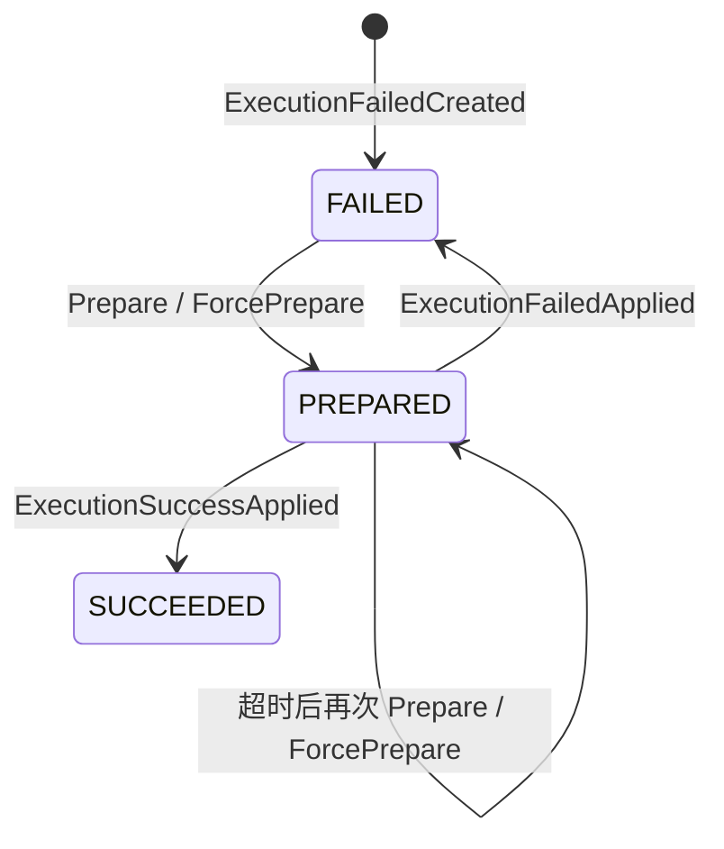

# 事件补偿

事件补偿用于恢复**已经提交的事件，其目标处理函数执行失败**的场景。它保存失败事实，稍后把原事件重新投递给同一个函数；它不会撤销原命令、删除事件历史或自动生成业务反向操作。

:::warning 补偿不是回滚
原领域事件在处理函数运行前已经进入 EventStore。补偿重放可能再次调用外部系统，因此处理函数仍须以事件 ID、聚合 ID 与版本等稳定身份保证幂等。
:::

## 事件补偿解决什么问题

普通事件处理器、无状态 Saga、投影与快照都运行在已提交事件之后。进程内重试可以吸收短暂故障，但不能跨越进程退出，也不会留下可查询的恢复状态。事件补偿补上这段持久化缺口：

```text
Processor / Saga / Projection:
已提交事件 -> 目标函数 -> 即时重试耗尽 -> ExecutionFailed

Snapshot:
已提交状态事件 -> SnapshotFunctionFilter 首次失败 -> ExecutionFailed

ExecutionFailed -> 自动调度或人工准备 -> 原事件 + 原目标函数重新投递
```

它只负责“再次执行失败的函数”。若业务需要用一条反向命令抵消先前效果，应由 [Saga](./saga.md) 表达业务补偿，而不是由 `ExecutionFailed` 代替领域决策。

## 即时重试与持久补偿

两层恢复机制拥有不同策略：

| 层 | 触发与持续时间 | 策略来源 | 是否留下持久记录 |
| --- | --- | --- | --- |
| `RetryableFilter` | Processor、Saga 与 Projection 当前调用中的可恢复异常 | 运行时全局异常分类；默认重试 3 次，最小退避 2 秒 | 否 |
| `EventCompensationFilter` | 内层处理链最终仍失败 | 函数 `@Retry` 或服务端默认重试规格 | 是 |

在包含 `RetryableFilter` 的 Processor、Saga 与 Projection 链中，补偿过滤器包在即时重试过滤器外层，所以持久补偿只接收即时重试耗尽后的错误。Snapshot 链处理 `StateEventExchange`，没有注册当前唯一面向 `DomainEventExchange` 的 `RetryableFilter`；`StateEventCompensationFilter` 直接包裹 `SnapshotFunctionFilter`，因此 Snapshot 首次失败即可进入持久补偿。`@Retry` 的 `recoverable`、`unrecoverable`、`maxRetries`、`minBackoff` 与 `executionTimeout` 属于持久补偿，不会改写即时重试策略。`@Retry(enabled = false)` 只禁止失败分支创建 `ExecutionFailed` 或发送 `ApplyExecutionFailed`；已有补偿执行成功时仍会写回 `ApplyExecutionSuccess`。

完整属性、默认值和 YAML 见[事件补偿配置参考](../../reference/config/compensation.md)。

## 失败记录创建

`EventCompensationFilter` 只处理已经匹配到目标函数的 exchange。首次失败没有补偿 ID 时，它发送 `CreateExecutionFailed`，记录：

- 原事件 ID、聚合身份与版本；
- 目标函数的 context、processor、名称和 `FunctionKind`；
- 错误代码、消息、绑定错误与堆栈；
- 执行时间、重试规格与恢复性分类。

没有函数信息时，错误原样传播，不创建记录。显式 `@Retry(enabled = false)` 时，失败也原样传播：首次执行不发送 `CreateExecutionFailed`，带补偿 ID 的失败不发送 `ApplyExecutionFailed`。这个检查只在错误分支；带补偿 ID 的执行成功仍发送 `ApplyExecutionSuccess`。补偿命令发送成功后，原处理错误继续交给 dispatcher 的错误边界；若补偿命令本身发送失败，则由发送错误终止这条响应式链，不能把“原错误已记录”当作既成事实。

重放 exchange 的 header 已带有 `compensationId`。再次失败发送 `ApplyExecutionFailed`，成功则发送 `ApplyExecutionSuccess`，两者都写回同一个 `ExecutionFailed` 聚合。

## ExecutionFailed 状态机



| 状态 | 含义 | 可接受的结果命令 |
| --- | --- | --- |
| `FAILED` | 最近一次执行失败，等待到期或人工处理 | Prepare；ForcePrepare |
| `PREPARED` | 已准备一次重放，等待成功、失败或超时 | ApplyExecutionFailed；ApplyExecutionSuccess |
| `SUCCEEDED` | 目标函数的补偿重放已成功 | 无新的 prepare/apply |

普通 `PrepareCompensation` 只接受 `FAILED` 或已经超时的 `PREPARED`，且 `retries < maxRetries`。`ForcePrepareCompensation` 可以越过重试次数上限，但仍拒绝 `SUCCEEDED` 和尚未超时的 `PREPARED`。每次准备都会增加 `retries`，并据当前重试规格重算 `retryAt`、`timeoutAt` 与 `nextRetryAt`。

`isRetryable` 只描述状态与次数，不包含恢复性分类。`RECOVERABLE`、`UNKNOWN` 或 `UNRECOVERABLE` 是否进入自动调度，由查询层另行决定。

## 调度与准备重试

补偿服务的 scheduler 查询同时满足以下条件的记录：

- 恢复性是 `RECOVERABLE` 或 `UNKNOWN`；
- 尚未达到普通重试上限；
- `nextRetryAt` 已到期；
- 当前为 `FAILED`，或为已经超过 `timeoutAt` 的 `PREPARED`。

每个候选项收到 `PrepareCompensation`。聚合产生 `CompensationPrepared` 后，应用侧 `CompensationEventProcessor` 只处理本地聚合元数据，并按记录中的事件版本与目标函数重放：`EVENT` 重新发送领域事件流，`STATE_EVENT` 从历史重建对应状态事件。补偿 header 使 dispatcher 只匹配记录中的 context、processor 与函数名，而不是再次调用同事件的全部函数。

## 成功、再次失败与不可恢复

重放成功后，外层补偿过滤器发送 `ApplyExecutionSuccess`，状态进入 `SUCCEEDED`。重放再次失败时发送 `ApplyExecutionFailed`，更新错误、执行时间与恢复性并回到 `FAILED`；后续是否再调度取决于新的分类、次数和时间条件。

`UNRECOVERABLE` 记录仍会持久化，但自动查询排除它。它保留诊断和人工决策依据，不意味着记录已解决。通知也只说明补偿状态发生变化，不能证明外部业务一致性已经恢复。

## 人工介入边界

人工操作可以普通准备、强制准备、调整重试规格、重新分类恢复性或修改已迁移的目标函数。状态机仍是最终约束：

- 强制准备只越过次数上限，不越过成功状态或未超时的执行；
- 重新分类会改变自动调度资格，应先核对异常和已有副作用；
- 修改函数标识只适合已确认的处理器迁移，不能用来把失败任意转交给其他逻辑；
- 任何重放前都要确认目标副作用具备幂等保护。

认证、授权、审批、审计和网络隔离属于部署方的运营边界，不由 `ExecutionFailed` 聚合自动提供。

## 验证与运营入口

先用领域和核心测试验证状态机、捕获与重放路径：

```bash
./gradlew :wow-compensation-domain:check :wow-compensation-core:check
```

- 配置键、默认值、完整 YAML 与停用边界：见[事件补偿配置参考](../../reference/config/compensation.md)。
- Dashboard、管理命令、可运行示例与部署验证：见[事件补偿示例](../../reference/example/compensation.md)。
- 处理函数的幂等、顺序与响应式完成：见[事件处理器](./processor.md)。
