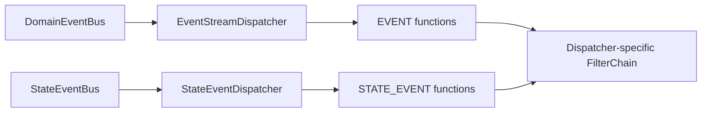

# 事件分发管线

事件分发把已提交的领域事实路由到匹配函数。它决定消息从哪条总线进入、哪些函数会执行、横切 Filter 以什么顺序包裹函数，以及处理结束后何时通知与确认；它不把下游处理并入源聚合事务。

## DomainEventBus 与 StateEventBus

| 总线 | 消息 | 对应函数 |
| --- | --- | --- |
| `DomainEventBus` | `DomainEventStream`，一次命令追加的有序事件批次 | `FunctionKind.EVENT` |
| `StateEventBus` | `StateEvent`，事件流及该版本溯源后的聚合状态 | `FunctionKind.STATE_EVENT` |

两者都是 `MessageBus`，但 topic kind、订阅与 transport 确认语义相互独立。发送完成只代表具体 Bus 实现的发送边界，不等于处理函数完成，也不承诺 exactly-once。领域事件何时成为权威历史见[事件溯源](../domain/event-sourcing.md)。

## Composite Dispatcher

`DomainEventDispatcher`、`ProjectionDispatcher` 与 `StatelessSagaDispatcher` 都基于 `CompositeEventDispatcher`。一个 Composite Dispatcher 创建两个子分发器，并共享聚合调度器：



`EventStreamDispatcher` 只保留 `FunctionKind.EVENT`，`StateEventDispatcher` 只保留 `FunctionKind.STATE_EVENT`。各自按注册函数支持的聚合 topic 建立订阅；没有对应函数的聚合不会为该 dispatcher 创建消费路径。

一个收到的事件流使用 `concatMap` 逐事件处理。同一事件匹配到的多个函数使用 `flatMap`，因此不能依赖函数之间的执行顺序。聚合调度器只提供同一 group key 内的串行边界，不提供跨 dispatcher、进程或外部系统的全局顺序。

## 函数注册与选择

Spring 启动时，Processor、Saga 和 Projection 的 AutoRegistrar 把已解析的消息函数注册到各自 `MessageFunctionRegistrar`。函数元数据至少包含：

- `FunctionKind`；
- context、processor 与函数名；
- 支持的事件体类型；
- 支持的命名聚合 topic。

分发时先按 `FunctionKind` 拆分注册表，再按 topic 与事件体类型选择函数。普通消息匹配所有符合条件的函数；补偿消息还必须匹配 header 中记录的 context、processor 与函数名。选择完成后，dispatcher 把函数写入 exchange，函数 Filter 再从 exchange 取出并调用它。

应用如何声明 Processor 或 Saga 函数分别见[事件处理器](./processor.md)和 [Saga](./saga.md)；本页只定义注册后的运行管线。

## Filter 顺序

每类 dispatcher 从 Spring 收集兼容 exchange 类型的 `ExchangeFilter`，用 `@FilterType` 选出属于自己的 Filter，再按 `@Order` 排序。当前关键相对顺序分为两种：

```text
Processor / Saga / Projection:
Notifier -> DomainEventCompensationFilter -> RetryableFilter -> FunctionFilter

Snapshot:
SnapshotNotifierFilter -> StateEventCompensationFilter -> SnapshotFunctionFilter
```

Filter 从左到右进入、从右到左观察完成或错误。唯一的 `RetryableFilter` bean 面向 `DomainEventExchange`；Snapshot 链收集 `StateEventExchange` Filter，因此没有即时重试层。模块是否启用和自定义 Filter 还会改变实际集合，应以启动日志中的 `Build ... FilterChain` 为当前实例证据。

## 通知器

在这组关键 Filter 中，通知器位于最外层，并只在内层处理链成功完成后发送对应 wait signal：

| Dispatcher | 通知阶段 |
| --- | --- |
| `DomainEventDispatcher` | `EVENT_HANDLED` |
| `StatelessSagaDispatcher` | `SAGA_HANDLED` |
| `ProjectionDispatcher` | `PROJECTED` |
| `SnapshotDispatcher` | `SNAPSHOT` |

通知采用 `notifyAndForget`；通知失败会记录日志，不反向改变已经完成的处理结果。每个阶段只证明对应函数边界完成，不证明其他 dispatcher、后续命令或外部系统完成。调用方等待语义见[完成语义](../command/completion.md)。

## RetryableFilter

`RetryableFilter` 在 Processor、Saga 与 Projection 链中包裹函数 Filter，并对内层 publisher 重新订阅。默认只重试运行时分类为 `RECOVERABLE` 的异常，最多重试 3 次，最小退避 2 秒；最终错误继续向外传播。Snapshot 的 `StateEventExchange` 链不包含这个 Filter。

它没有持久状态，进程退出后不能恢复，也不读取函数 `@Retry` 的持久补偿参数。重试会再次调用同一函数，所以目标副作用必须幂等。

## CompensationFilter 插入点

启用补偿模块时，`DomainEventCompensationFilter` 会进入事件处理器、无状态 Saga 与 Projection 的领域/状态事件函数链，位于通知器之后、`RetryableFilter` 之前；`StateEventCompensationFilter` 进入 Snapshot 链，位于 `SnapshotNotifierFilter` 之后并直接包裹 `SnapshotFunctionFilter`：

- 内层最终失败时，首次执行创建 `ExecutionFailed`，补偿执行更新已有记录；
- 带补偿 ID 的内层执行成功时，写回 `ApplyExecutionSuccess`；
- 过滤器处理完记录后，错误仍交给 dispatcher 的 `ErrorHandler`。

这保证 wait 通知不会在失败记录尚未写回时先宣告成功。Processor、Saga 与 Projection 的持久记录接收内层即时重试后仍未恢复的错误；Snapshot 没有该层，首次函数失败即可进入持久补偿。完整状态机见[事件补偿](./compensation.md)。

## Ack 与失败边界

单个函数错误默认由对应 `Handler` 的 `ErrorHandler` 处理；事件处理器、Saga 与 Projection 的默认值是 `LogResumeErrorHandler`，会记录并恢复。领域事件流或状态事件的函数处理终止后，`AbstractAggregateEventDispatcher` 通过 `finallyAck` 确认原 exchange；Snapshot 的函数 Filter 也对自己的状态事件 exchange 使用 `finallyAck`。这些确认在成功和错误终止时都会执行，再由具体 Bus Adapter 映射到自己的确认动作。

因此需要分开理解三个边界：

| 边界 | 能证明什么 | 不能证明什么 |
| --- | --- | --- |
| 函数 publisher 完成 | 本次函数调用完成 | 外部系统 exactly-once |
| wait notifier | 对应处理阶段已发出信号 | 其他分支或后续命令完成 |
| exchange ack | Bus Adapter 接受确认 | 事件历史被回滚或业务一致性已恢复 |

源事件在分发前已经提交。函数失败、补偿记录失败或 ack 失败都不能回滚 EventStore；应用仍需为 broker 重投、即时重试和补偿重放提供稳定幂等键。

## 源码入口

- [`DomainEventBus`](https://github.com/Ahoo-Wang/Wow/blob/main/wow-core/src/main/kotlin/me/ahoo/wow/event/DomainEventBus.kt) / [`StateEventBus`](https://github.com/Ahoo-Wang/Wow/blob/main/wow-core/src/main/kotlin/me/ahoo/wow/eventsourcing/state/StateEventBus.kt)
- [`CompositeEventDispatcher`](https://github.com/Ahoo-Wang/Wow/blob/main/wow-core/src/main/kotlin/me/ahoo/wow/event/dispatcher/CompositeEventDispatcher.kt) / [`AbstractAggregateEventDispatcher`](https://github.com/Ahoo-Wang/Wow/blob/main/wow-core/src/main/kotlin/me/ahoo/wow/event/dispatcher/AbstractAggregateEventDispatcher.kt)
- [`DomainEventFunctionRegistrar`](https://github.com/Ahoo-Wang/Wow/blob/main/wow-core/src/main/kotlin/me/ahoo/wow/event/dispatcher/DomainEventFunctionRegistrar.kt) / [`DomainEventFunctionFilter`](https://github.com/Ahoo-Wang/Wow/blob/main/wow-core/src/main/kotlin/me/ahoo/wow/event/dispatcher/DomainEventFunctionFilter.kt)
- [`NotifierFilters`](https://github.com/Ahoo-Wang/Wow/blob/main/wow-core/src/main/kotlin/me/ahoo/wow/command/wait/NotifierFilters.kt) / [`RetryableFilter`](https://github.com/Ahoo-Wang/Wow/blob/main/wow-core/src/main/kotlin/me/ahoo/wow/messaging/handler/RetryableFilter.kt)
- [`CompensationFilter`](https://github.com/Ahoo-Wang/Wow/blob/main/compensation/wow-compensation-core/src/main/kotlin/me/ahoo/wow/compensation/core/CompensationFilter.kt) / [`FilterChainBuilder`](https://github.com/Ahoo-Wang/Wow/blob/main/wow-core/src/main/kotlin/me/ahoo/wow/filter/FilterChainBuilder.kt)

最小框架验证：

```bash
./gradlew :wow-core:test --tests "me.ahoo.wow.event.DomainEventDispatcherTest"
./gradlew :wow-core:test --tests "me.ahoo.wow.messaging.handler.RetryableExchangeFilterTest"
```
