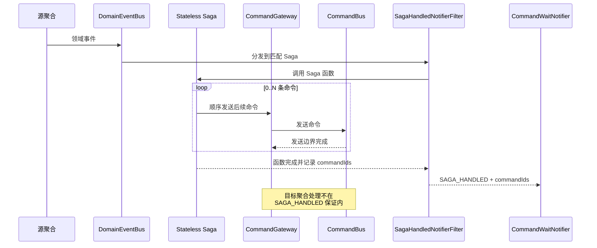

# Saga

Wow 的 `@StatelessSaga` 是无状态事件编排器：它接收领域事件或状态事件并生成下一步命令。每个目标聚合仍在自己的本地事务中处理命令；Saga 不创建跨聚合 ACID 事务。

Stateless Saga 把一个已发生的事实转换为 0..N 条顺序发送的后续命令。



## 何时使用 Saga

当一个已提交事件需要驱动其他聚合的业务行为时使用 Saga，例如转账准备完成后向目标账户发送入账命令。只需通知、审计或调用外部集成时使用[事件处理器](./processor.md)；不要用 Saga 包装一个不生成命令的普通副作用。

无状态 Saga 不保存流程实例。每个事件函数必须仅依赖当前事件及可注入上下文，明确返回本次需要发送的 0..N 条命令。

## 无状态 Saga 契约

```text
已提交事件 -> 匹配 Saga 函数 -> 0..N 条命令 -> CommandGateway.send
```

Saga 与普通 Processor 共用事件函数解析、类型/topic 匹配、领域事件/状态事件分发和响应式 filter 链。区别在于 `StatelessSagaFunction` 会把函数结果转换为命令、按顺序发送，并把命令流记录到 exchange 供 `SAGA_HANDLED` 通知使用。

源事件在 Saga 运行前已经提交。函数或命令发送失败都不能回滚源事件。

## 定义 Saga 函数

`@StatelessSaga` 同时是 Spring 组件标记。函数可使用 `onEvent` / `onStateEvent` 约定名，或显式使用 `@OnEvent` / `@OnStateEvent`；第一个参数也可以是事件体、`DomainEvent<T>` 或 `DomainEventExchange<T>`。

```kotlin
@StatelessSaga
class CartSaga {
    @OnEvent
    fun onOrderCreated(event: DomainEvent<OrderCreated>): CommandBuilder? {
        if (!event.body.fromCart) return null

        return RemoveCartItem(
            productIds = event.body.items.map { it.productId }.toSet(),
        ).commandBuilder()
            .aggregateId(event.ownerId)
    }
}
```

只有需要聚合最新状态时才使用 `@OnStateEvent` 并把状态声明为后续注入参数。需要显式选择目标聚合 ID、请求 ID 或其他命令字段时返回 `CommandBuilder`。

## 从事件生成 0..N 条命令

函数可以同步、挂起或响应式返回以下结果：

| 返回结果 | 发送行为 |
| --- | --- |
| `null` / `Mono.empty()` | 发送 0 条命令 |
| 命令体 | 转换为 `CommandMessage` 后发送 1 条 |
| `CommandBuilder` | 按 builder 的目标与显式字段创建并发送 1 条 |
| `CommandMessage<*>` | 保留现有消息并发送 1 条 |
| `Iterable<*>`、`Flux`、`Publisher` 或 `Flow` | 收集并按结果顺序发送 N 条 |

`StatelessSagaFunction` 对多条命令使用 `concatMap`：前一条 [`CommandGateway.send`](../command/sending.md) 完成后才发送下一条。保持返回顺序稳定；顺序变化不仅改变业务流程，也会改变默认 request ID。

## requestId 与上下文传播

对命令体或 `CommandBuilder`，框架只补充缺失字段：

- 默认 `requestId` 为 `${domainEvent.id}-${index}`，索引从 `0` 开始；
- 保留显式 `requestId`；
- 缺失的 `tenantId`、`spaceId` 从源事件传播；
- 设置源事件为 upstream，并传播消息 header。

预构造的 `CommandMessage` 保留自己的消息与 `requestId`，同时传播源事件 header。

同一事件以相同顺序重投时，默认 request ID 保持稳定，可与[命令网关的幂等检查](../command/reliability.md)协作。它不保证外部副作用幂等，也不能保护不同事件生成的语义重复命令。

## 业务补偿

Saga 的业务补偿是一个明确的领域动作。例如 `EntryFailed` 可以生成 `UnlockAmount`：

```kotlin
@OnEvent
fun onEntryFailed(event: EntryFailed): UnlockAmount =
    UnlockAmount(event.sourceId, event.amount)
```

这条命令表达业务上如何抵消先前效果。它不会删除 `Prepared`、`EntryFailed` 等已提交事件，也不是数据库回滚。

不要把业务补偿与处理失败恢复混为一谈。Saga 决定“失败事实之后应发什么业务命令”；Compensation 决定“同一处理函数失败后如何持久记录并重投”。后者的权威说明见[事件补偿](./compensation.md)。

## 等待集成

Saga 函数完成并且生成命令的 `CommandGateway.send` 全部完成后，运行时产生 `SAGA_HANDLED`。该信号包含本次命令流的 `commandId`，但只证明命令发送边界完成，不证明目标聚合已经处理命令。

调用方只关心 Saga 已发出命令时等待匹配的 `SAGA_HANDLED`。若还必须等待每条后续命令的某个阶段，使用 `CommandWait.chain(...)` 指定 Saga 函数与 tail stage/function。完整阶段、函数匹配和提前到达信号处理见[完成语义](../command/completion.md)。

## 测试与失败边界

使用 `SagaSpec` 直接验证事件到命令的映射，不需要启动消息代理：

```kotlin
class CartSagaSpec : SagaSpec<CartSaga>({
    on {
        whenEvent(orderCreatedFromCart, ownerId = ownerId) {
            expectNoError()
            expectCommandType(RemoveCartItem::class)
            expectCommand<RemoveCartItem> {
                aggregateId.id.assert().isEqualTo(ownerId)
            }
        }
    }
    on {
        whenEvent(orderCreatedNotFromCart, ownerId = ownerId) {
            expectNoCommand()
        }
    }
})
```

至少覆盖正常命令、0 命令分支和每条业务补偿分支。依赖默认 request ID、上下文传播、多命令顺序或预构造消息时，增加针对完整 `CommandMessage` 的断言；依赖真实发送、链式等待或失败恢复时，再增加集成测试。

Saga 函数错误或任一 `CommandGateway.send` 错误都会沿响应式链传播，随后才由即时重试或已启用的持久 Compensation 处理。即使失败发生在部分命令已被总线接受之后，源事件和已接受命令也不会自动撤销；因此命令处理与业务补偿都必须可安全重投。

**完成标志：** 0..N 映射、命令顺序、request ID/上下文传播和业务补偿分支均有测试；等待合同没有把 `SAGA_HANDLED` 误写成后续命令完成。
