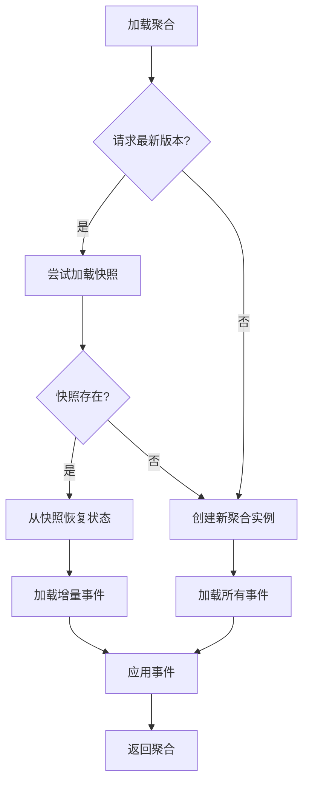

# 事件存储

事件存储（EventStore）是事件溯源架构的核心组件，负责持久化和检索领域事件流。它是聚合根状态重建的基础，确保所有状态变更都以不可变事件的形式被记录。

## 事件溯源

<center>


</center>

在传统架构中，数据库只存储当前状态，历史变更记录往往丢失。而在事件溯源架构中：

- **完整历史记录**：每次状态变更都作为事件被永久存储
- **可追溯性**：可以通过重放事件重建任意时间点的状态
- **审计友好**：天然支持操作审计和数据分析

## 核心接口

`EventStore` 接口定义了事件存储的核心操作：

```kotlin
interface EventStore {
    /**
     * 追加领域事件流到事件存储
     * 确保事务一致性并处理版本冲突
     */
    fun append(eventStream: DomainEventStream): Mono<Void>

    /**
     * 按版本范围加载聚合的领域事件流
     * 范围是闭区间: [headVersion, tailVersion]
     */
    fun load(
        aggregateId: AggregateId,
        headVersion: Int = 1,
        tailVersion: Int = Int.MAX_VALUE - 1
    ): Flux<DomainEventStream>

    /**
     * 按事件时间范围加载聚合的领域事件流
     * 范围是闭区间: [headEventTime, tailEventTime]
     */
    fun load(
        aggregateId: AggregateId,
        headEventTime: Long,
        tailEventTime: Long
    ): Flux<DomainEventStream>
}
```

## 领域事件流

`DomainEventStream` 表示一个命令产生的一组领域事件：

```kotlin
interface DomainEventStream : EventMessage<DomainEventStream, List<DomainEvent<*>>> {
    val aggregateId: AggregateId
    val size: Int
}
```

事件流的关键特性：

- **一对一关系**：一个命令产生一个事件流
- **版本递增**：事件按版本号单调递增排序
- **原子性**：事件流中的所有事件作为一个整体被持久化
- **不可变性**：事件一旦创建就不可修改

## 异常处理

事件存储会抛出以下异常：

| 异常类型 | 说明 |
|---------|------|
| `EventVersionConflictException` | 版本冲突，通常由于并发写入导致 |
| `DuplicateAggregateIdException` | 聚合ID重复（初始版本时） |
| `DuplicateRequestIdException` | 请求ID重复，用于幂等性保证 |

## 实现

### 内存实现

`InMemoryEventStore` 适用于测试和开发环境：

```kotlin
class InMemoryEventStore : AbstractEventStore() {
    private val events = ConcurrentHashMap<AggregateId, CopyOnWriteArrayList<DomainEventStream>>()
    
    // 线程安全的内存存储实现
}
```

### MongoDB 实现

`MongoEventStore` 是生产环境推荐的实现之一：

```kotlin
class MongoEventStore(private val database: MongoDatabase) : AbstractEventStore() {
    // 使用 MongoDB 存储事件流
    // 支持唯一索引保证版本一致性和请求幂等性
}
```

MongoDB 存储特性：
- 使用 `aggregateId + version` 唯一索引防止版本冲突
- 使用 `requestId` 唯一索引保证幂等性
- 按版本号升序排序查询

### 其他实现

Wow 框架还提供以下事件存储实现：

- **R2DBC**: 支持关系型数据库（MySQL、PostgreSQL 等）
- **Redis**: 适用于高性能场景

## 聚合状态重建

通过事件溯源仓库重建聚合状态：

```kotlin
class EventSourcingStateAggregateRepository(
    private val stateAggregateFactory: StateAggregateFactory,
    private val snapshotRepository: SnapshotRepository,
    private val eventStore: EventStore
) : StateAggregateRepository {

    override fun <S : Any> load(
        aggregateId: AggregateId,
        metadata: StateAggregateMetadata<S>,
        tailVersion: Int
    ): Mono<StateAggregate<S>> {
        // 1. 尝试从快照加载（如果请求最新版本）
        // 2. 从事件存储加载增量事件
        // 3. 应用事件重建状态
    }
}
```

加载流程：



## 配置

```yaml
wow:
  eventsourcing:
    store:
      storage: mongo  # 事件存储类型 (mongo, r2dbc, redis, in_memory)
```

## 最佳实践

1. **选择合适的存储**：根据业务需求选择事件存储实现
   - 生产环境推荐使用 MongoDB 或 R2DBC
   - 开发测试可以使用 InMemory 实现

2. **结合快照优化**：对于事件数量较多的聚合，启用[快照](./snapshot)减少事件重放

3. **监控版本冲突**：版本冲突是正常的并发控制行为，但频繁冲突可能需要优化业务流程

4. **利用请求幂等性**：通过 `requestId` 实现命令的幂等处理，防止重复执行

## 相关主题

- [快照](./snapshot) - 了解如何使用快照优化聚合加载性能
- [商业智能](./bi) - 了解如何利用事件流进行数据分析
