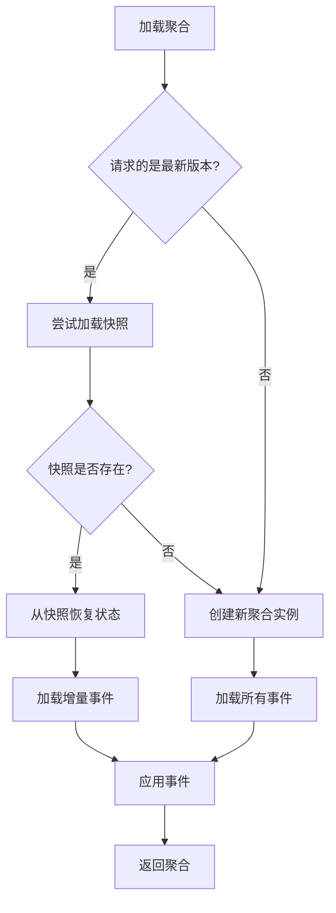
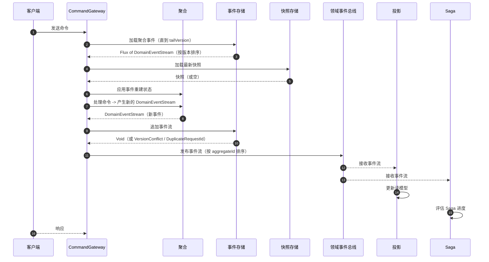
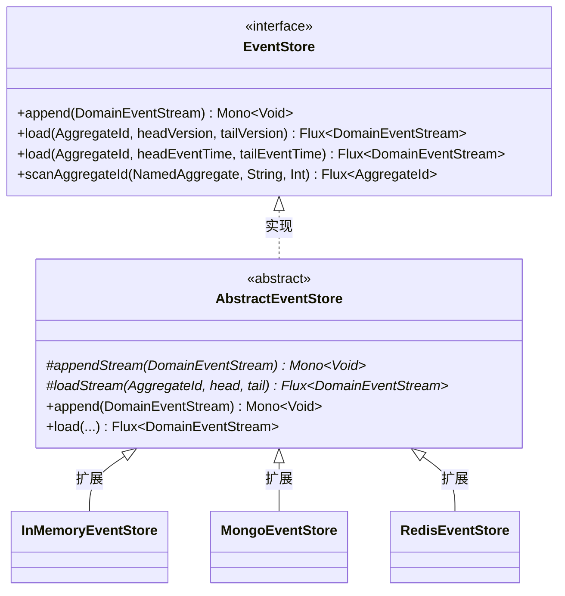
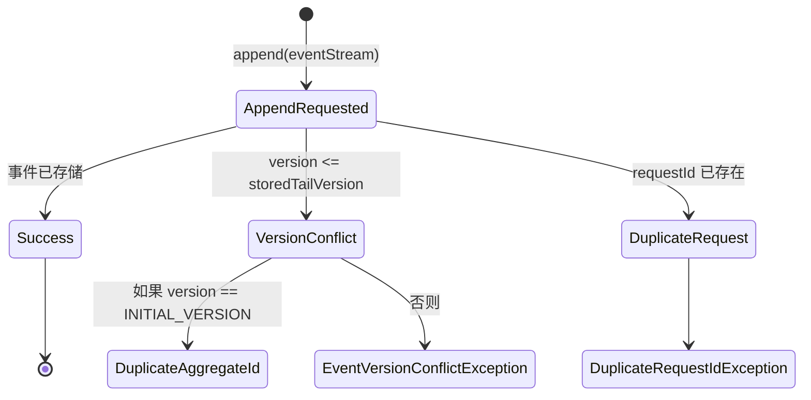

# 事件存储

事件存储是事件溯源架构的持久化基石。与传统的 CRUD 数据库覆盖状态并丢弃历史不同，事件存储充当每个领域事件的**不可变、仅追加的账本**。每一次状态变更 -- `OrderCreated`、`ItemAdded`、`PaymentProcessed` -- 都被记录且永远不能被修改或删除。

## 事件溯源

<center>


</center>

在传统架构中，数据库只存储当前状态，历史变更记录往往会丢失。而在事件溯源架构中：

- **完整历史**：每一次状态变更都作为事件永久存储
- **可追溯性**：通过重放事件可以重建任意时间点的状态
- **审计友好**：天然支持操作审计和数据分析
- **解耦消费者**：投影、Saga 和外部系统独立订阅同一事件流

## 核心接口

`EventStore` 接口定义了事件存储的核心操作，并承担按命名聚合分页扫描聚合 ID 的职责：

```kotlin
interface EventStore : AggregateIdScanner {
    fun append(eventStream: DomainEventStream): Mono<Void>
    fun load(
        aggregateId: AggregateId,
        headVersion: Int = 1,
        tailVersion: Int = Int.MAX_VALUE - 1
    ): Flux<DomainEventStream>
    fun load(
        aggregateId: AggregateId,
        headEventTime: Long,
        tailEventTime: Long
    ): Flux<DomainEventStream>
    fun last(aggregateId: AggregateId): Mono<DomainEventStream>
    fun scanAggregateId(
        namedAggregate: NamedAggregate,
        afterId: String = AggregateIdScanner.FIRST_ID,
        limit: Int = 10
    ): Flux<AggregateId>
}
```

### 领域事件流

`DomainEventStream` 表示单个命令产生的领域事件集合：

```kotlin
interface DomainEventStream : EventMessage<DomainEventStream, List<DomainEvent<*>>> {
    val aggregateId: AggregateId
    val size: Int
}
```

关键特性：
- **一对一**：一个命令产生一个事件流
- **原子性**：流中的所有事件作为单个单元持久化
- **不可变性**：事件一旦创建就不能被修改

### 核心概念

| 概念 | 描述 | 源码 |
|---|---|---|
| `DomainEvent` | 关于聚合内过去业务行为的不可变事实 | [DomainEvent.kt:52-95](https://github.com/Ahoo-Wang/Wow/blob/main/wow-api/src/main/kotlin/me/ahoo/wow/api/event/DomainEvent.kt#L52-L95) |
| `DomainEventStream` | 单个命令产生的有序领域事件批次 | [DomainEventStream.kt:51-125](https://github.com/Ahoo-Wang/Wow/blob/main/wow-core/src/main/kotlin/me/ahoo/wow/event/DomainEventStream.kt#L51-L125) |
| `EventStore` | 追加、加载事件流并扫描聚合 ID 的核心接口 | [EventStore.kt](https://github.com/Ahoo-Wang/Wow/blob/main/wow-core/src/main/kotlin/me/ahoo/wow/eventsourcing/EventStore.kt) |
| `SnapshotStore` | 通过带版本的快照检查点优化聚合加载 | [SnapshotStore.kt:27-58](https://github.com/Ahoo-Wang/Wow/blob/main/wow-core/src/main/kotlin/me/ahoo/wow/eventsourcing/snapshot/SnapshotStore.kt#L27-L58) |

## 聚合状态重建

框架**不**在传统数据库中存储当前的聚合状态。相反，每个聚合的状态是其**事件历史的函数**。


```mermaid
flowchart TD
    A[加载聚合] --> B{请求的是最新版本?}
    B -->|是| C[尝试加载快照]
    B -->|否| D[创建新聚合实例]
    C --> E{快照是否存在?}
    E -->|是| F[从快照恢复状态]
    E -->|否| D
    F --> G[加载增量事件]
    D --> H[加载所有事件]
    G --> I[应用事件]
    H --> I
    I --> J[返回聚合]
```

`EventSourcingStateAggregateRepository` 实现了这种重建机制：

1. **快照优先加载**：在请求最新版本时，仓库首先从快照存储加载。如果存在快照，它将作为增量重放的起点。
2. **全新聚合创建**：如果不存在快照，通过 `StateAggregateFactory` 创建新的聚合实例。
3. **事件应用**：事件按版本顺序重放，每次调用 `stateAggregate.onSourcing(it)` 来变更内存中的状态。

## 事件溯源生命周期

下图展示了从命令接收、事件持久化、总线发布到下游处理的完整生命周期：


```mermaid
sequenceDiagram
    autonumber
    participant Client as 客户端
    participant CommandGateway
    participant Aggregate as 聚合
    participant EventStore as 事件存储
    participant SnapshotStore as 快照存储
    participant DomainEventBus as 领域事件总线
    participant Projection as 投影
    participant Saga

    Client->>CommandGateway: 发送命令
    CommandGateway->>EventStore: 加载聚合事件（直到 tailVersion）
    EventStore-->>CommandGateway: Flux of DomainEventStream（按版本排序）
    CommandGateway->>SnapshotStore: 加载最新快照
    SnapshotStore-->>CommandGateway: 快照（或空）
    CommandGateway->>Aggregate: 应用事件重建状态
    CommandGateway->>Aggregate: 处理命令 -> 产生新的 DomainEventStream
    Aggregate-->>CommandGateway: DomainEventStream（新事件）
    CommandGateway->>EventStore: 追加事件流
    EventStore-->>CommandGateway: Void（或 VersionConflict / DuplicateRequestId）
    CommandGateway->>DomainEventBus: 发布事件流（按 aggregateId 排序）
    DomainEventBus-->>Projection: 接收事件流
    DomainEventBus-->>Saga: 接收事件流
    Projection->>Projection: 更新读模型
    Saga->>Saga: 评估 Saga 进度
    Client-->>CommandGateway: 响应
```

## 架构

框架定义了清晰的接口层次结构，支持多种持久化后端。每个实现都扩展了 `AbstractEventStore`，后者提供集中的日志记录、输入验证和错误映射。


```mermaid
classDiagram
    class EventStore {
        <<interface>>
        +append(DomainEventStream) Mono~Void~
        +load(AggregateId, headVersion, tailVersion) Flux~DomainEventStream~
        +load(AggregateId, headEventTime, tailEventTime) Flux~DomainEventStream~
        +scanAggregateId(NamedAggregate, String, Int) Flux~AggregateId~
    }
    class AbstractEventStore {
        <<abstract>>
        #appendStream(DomainEventStream)* Mono~Void~
        #loadStream(AggregateId, head, tail)* Flux~DomainEventStream~
        +append(DomainEventStream) Mono~Void~
        +load(...) Flux~DomainEventStream~
    }
    class InMemoryEventStore
    class MongoEventStore
    class RedisEventStore

    EventStore <|.. AbstractEventStore : 实现
    AbstractEventStore <|-- InMemoryEventStore : 扩展
    AbstractEventStore <|-- MongoEventStore : 扩展
    AbstractEventStore <|-- RedisEventStore : 扩展
```

`AbstractEventStore` 应用**模板方法模式**来集中处理横切关注点：

- **`append()`**（公开、具体）：记录操作日志，委托给 `appendStream()`，并升级版本冲突异常。
- **`load()`**（公开、具体）：验证版本/时间范围，然后委托给 `loadStream()`。
- **`appendStream()` / `loadStream()`**（受保护、抽象）：每个后端实现存储特定的逻辑。

## 异常处理

事件存储定义了层次化的类型异常：

| 异常类型 | 描述 | 行为 |
|---|---|---|
| `EventVersionConflictException` | 并发写入导致的版本冲突 | 实现 `RecoverableException` -- 可安全重试 |
| `DuplicateAggregateIdException` | 尝试创建已存在的聚合 | 致命 -- 表示 ID 冲突 |
| `DuplicateRequestIdException` | 相同命令已被处理 | 幂等 -- 成功情况，不是错误 |


```mermaid
stateDiagram-v2
    [*] --> AppendRequested: append(eventStream)
    AppendRequested --> Success: 事件已存储
    AppendRequested --> VersionConflict: version <= storedTailVersion
    AppendRequested --> DuplicateRequest: requestId 已存在

    VersionConflict --> DuplicateAggregateId: 如果 version == INITIAL_VERSION
    VersionConflict --> EventVersionConflictException: 否则
    DuplicateRequest --> DuplicateRequestIdException
    Success --> [*]
```

## 实现对比

| 特性 | MongoDB | Redis | 内存 |
|---|---|---|---|
| **持久性** | 持久（磁盘） | 可配置 | 易失（内存） |
| **版本范围查询** | 是 | 是 (ZRANGEBYSCORE) | 是 (内存) |
| **时间范围查询** | 是 | 否 | 是 (内存) |
| **并发控制** | 唯一复合索引 | Lua 脚本（原子） | 同步映射 |
| **分片支持** | 分片集合 | Redis 集群 | 不适用 |
| **生产就绪** | 高 | 中 | 仅开发/测试 |

### 每种实现的存储模式

**MongoDB** 为每种聚合类型使用独立的集合。集合名称由聚合的上下文名称和聚合名称派生（例如 `order_event_stream`）。文档使用唯一复合索引 `(aggregate_id, version)` 和 `(aggregate_id, request_id)` 进行索引 ([EventStreamSchemaInitializer.kt:51-69](https://github.com/Ahoo-Wang/Wow/blob/main/wow-mongo/src/main/kotlin/me/ahoo/wow/mongo/EventStreamSchemaInitializer.kt#L51-L69))。

**Redis** 将事件流存储在按聚合 ID 键的**有序集合**中。每个成员是 JSON 序列化的 `DomainEventStream`，按版本号评分。追加操作使用 Lua 脚本实现原子性 -- 在单个事务中检查版本冲突和重复请求 ID ([RedisEventStore.kt:44-65](https://github.com/Ahoo-Wang/Wow/blob/main/wow-redis/src/main/kotlin/me/ahoo/wow/redis/eventsourcing/RedisEventStore.kt#L44-L65))。不支持时间范围加载。


## 配置

```yaml
wow:
  eventsourcing:
    store:
      storage: mongo
    snapshot:
      enabled: true
      strategy: version_offset  # all, version_offset
      version-offset: 10
      storage: mongo
```

| 属性 | 类型 | 默认值 | 描述 |
|---|---|---|---|
| `wow.eventsourcing.store.storage` | `StorageType` | `mongo` | 事件存储后端 |
| `wow.eventsourcing.snapshot.enabled` | `Boolean` | `true` | 启用快照机制 |
| `wow.eventsourcing.snapshot.strategy` | `Strategy` | `all` | 快照策略 (all, version_offset) |
| `wow.eventsourcing.snapshot.version-offset` | `Int` | `5` | 版本间隔阈值 |
| `wow.eventsourcing.snapshot.storage` | `StorageType` | `mongo` | 快照存储后端 |

## 最佳实践

1. **为长期聚合启用快照**：将 `strategy` 设置为 `version_offset`，偏移量设为 5-20，以避免拥有大量事件的聚合出现线性性能下降。

2. **监控版本冲突**：偶尔出现 `EventVersionConflictException` 是正常的。高频出现则表明存在竞争 -- 考虑重新设计聚合边界。

3. **利用请求幂等性**：`requestId` 字段保证重试命令不会产生重复事件 -- 对于至少一次投递至关重要。

4. **保持事件不可变且声明式**：事件应代表简单事实，而非条件逻辑。聚合的溯源函数只是将事件叠加到状态上。

5. **仅在测试中使用内存存储**：`InMemoryEventStore` 是线程安全的但具有易失性。请勿部署到生产环境。

## 相关主题

- [快照](./snapshot) -- 通过快照优化聚合加载
- [命令网关](./command-gateway) -- 命令如何路由到聚合
- [Saga](./saga) -- 跨聚合的分布式事务
- [投影](./projection) -- 投影如何消费事件流
- [商业智能](./bi) -- 利用事件流进行数据分析
