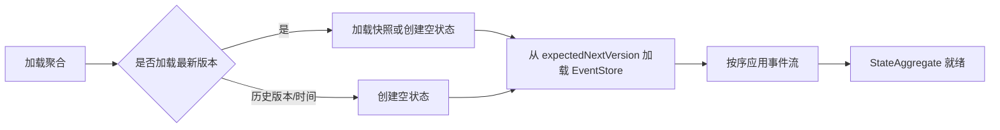
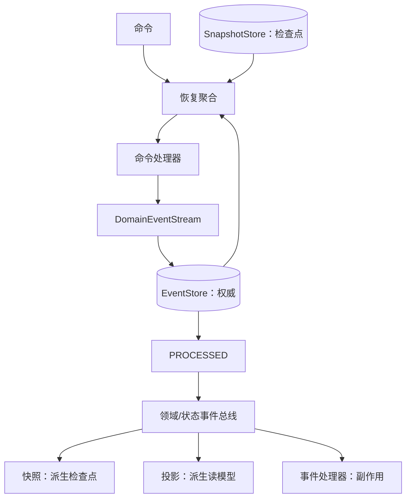

# 事件存储

事件存储保存 Wow 的聚合权威历史。命令产生领域事件时，在 `DomainEventStream` 追加完成之前不能视为 `PROCESSED`。快照用于加速加载，投影与事件处理器用于派生其他状态或副作用；二者都不能取代事件历史。

## 事件溯源

<center>


</center>

以示例 `CreateOrder` 命令为例，聚合返回 `OrderCreated`。Wow 把它包装成事件流，其中包含聚合身份、`commandId`、`requestId`、版本、消息头与有序事件体。后续命令通过重放该历史恢复 `OrderState`。

核心归属边界如下：

| 数据 | 角色 | 恢复来源 |
|---|---|---|
| 领域事件流 | 权威业务历史 | 事件存储 |
| 快照 | 可替换的加载检查点/当前状态物化 | 从事件历史重建 |
| 投影 | 特定用途读模型 | 按投影恢复设计重放/重处理事件 |
| 事件处理器副作用 | 集成/应用结果 | 处理器自己的幂等、重试与补偿设计 |

## 核心接口

```kotlin
interface EventStore :
    RequestIdExistenceChecker,
    AggregateIdScanner,
    AutoCloseable {
    fun append(eventStream: DomainEventStream): Mono<Void>

    fun load(
        aggregateId: AggregateId,
        headVersion: Int = 1,
        tailVersion: Int = Int.MAX_VALUE - 1,
    ): Flux<DomainEventStream>

    fun load(
        aggregateId: AggregateId,
        headEventTime: Long,
        tailEventTime: Long,
    ): Flux<DomainEventStream>

    fun single(aggregateId: AggregateId, version: Int): Mono<DomainEventStream>
    fun last(aggregateId: AggregateId): Mono<DomainEventStream>
}
```

版本与时间范围都包含首尾边界。`AbstractEventStore` 验证范围参数；接口本身不规定存储引擎、Schema、事务技术或重试策略。

### 领域事件流

`DomainEventStream` 是一次命令执行产生的非空有序事件批次。所有事件属于同一聚合，版本/序列单调推进。事件流保留 `commandId` 与 `requestId`，可用于审计与重复查询。

```kotlin
eventStore.append(eventStream)
    .thenReturn(eventStream)
```

`SimpleCommandAggregate` 在追加前先把新事件流应用到工作内存状态，再调用 `EventStore.append`。追加失败时，命令处理失败且该聚合实例过期；重试必须重新恢复状态，不能把未提交的内存状态当成权威状态。

### 核心概念

| 概念 | 契约 |
|---|---|
| `DomainEvent<T>` | 不可变、具名且带 revision 的业务事实 |
| `DomainEventStream` | 一条命令产生的事件，以 command/request ID 关联 |
| 聚合版本 | 追加与重放的乐观顺序边界 |
| `requestId` | 记录在事件流中的操作身份，按聚合检查 |
| `EventStore` | 追加与历史加载契约 |
| `SnapshotStore` | 独立、可替换的检查点存储 |

## 聚合状态重建

对于非创建命令，`RetryableAggregateProcessor` 通过 `StateAggregateRepository` 获取当前状态。`EventSourcingStateAggregateRepository`：

1. 加载最新版本时先请求最新快照；
2. 没有快照时创建空状态聚合；
3. 从 `stateAggregate.expectedNextVersion` 加载到目标尾版本；
4. 用 `stateAggregate.onSourcing` 依次应用事件流。


```mermaid
flowchart LR
    Load[加载聚合] --> Snapshot{是否加载最新版本}
    Snapshot -->|是| Checkpoint[加载快照或创建空状态]
    Snapshot -->|历史版本/时间| Empty[创建空状态]
    Checkpoint --> History[从 expectedNextVersion 加载 EventStore]
    Empty --> History
    History --> Replay[按序应用事件流]
    Replay --> Ready[StateAggregate 就绪]
```

按历史版本/时间恢复时不使用最新快照，因为来自未来的检查点会污染目标时点。

## 事件溯源生命周期

一条成功命令经历以下归属转换：

1. `SENT`：命令总线已接受命令，尚未证明历史追加。
2. 恢复：非创建命令加载快照与后续事件历史。
3. 执行：聚合规则返回 `DomainEventStream`。
4. 溯源：新事件流更新工作内存状态。
5. 追加：`EventStore.append` 提交新的权威历史。
6. `PROCESSED`：命令分发管道完成，其中包括追加。
7. 发布：事件流/状态事件进入下游快照、投影、Saga 与事件处理路径。
8. `SNAPSHOT`、`PROJECTED` 或 `EVENT_HANDLED`：选中的下游路径完成。

这些下游阶段是 `PROCESSED` 之后的并列分支，不是单一全局事务。

## 架构


```mermaid
flowchart TB
    Command[命令] --> Restore[恢复聚合]
    EventStore[(EventStore：权威)] --> Restore
    SnapshotStore[(SnapshotStore：检查点)] --> Restore
    Restore --> Handler[命令处理器]
    Handler --> Stream[DomainEventStream]
    Stream --> EventStore
    EventStore --> Processed[PROCESSED]
    Processed --> Bus[领域/状态事件总线]
    Bus --> Snapshot[快照：派生检查点]
    Bus --> Projection[投影：派生读模型]
    Bus --> Processor[事件处理器：副作用]
```

应用应通过 `StateAggregateRepository` 加载聚合，不要自行拼接事件与快照数据。

## 异常处理

`EventStore.append` 声明 `EventVersionConflictException`、`DuplicateAggregateIdException` 与 `DuplicateRequestIdException`。`AbstractEventStore` 把初始版本冲突映射为 `DuplicateAggregateIdException`；存储实现负责把实际存储错误映射到该契约。

不能因为接口声明了异常，就假设每个自定义后端都会原子检查版本、聚合创建与请求 ID。必须验证所选实现及其契约测试。

`RetryableAggregateProcessor` 只对分类为可恢复的错误执行有界退避重试。重试可能重新执行恢复与命令处理，所以处理器及其注入服务必须遵守自己的重试/幂等边界。不可恢复的业务错误会立即失败。

## 实现对比

| 实现 | 典型用途 | 契约说明 |
|---|---|---|
| `InMemoryEventStore` | 测试与本地示例 | 易失，不代表生产持久性 |
| MongoDB 模块 | 持久事件存储 | 验证实际索引、write concern、拓扑与模块测试 |
| Redis 模块 | 持久事件存储 | 验证 Lua/脚本行为、持久化模式与模块测试 |
| 自定义 `EventStore` | 应用专用后端 | 必须定义追加原子性、冲突映射、顺序与关闭行为 |

核心接口刻意不承诺所有后端具备完全相同的运维能力。例如，某个实现可以不支持按时间范围加载或聚合扫描。

### 每种实现的存储模式

Schema 与原子性属于所选存储模块，而非 `wow-core`。用于生产前至少验证：

- 单聚合事件流的唯一键与排序键；
- `requestId` 查询如何建立索引或扫描；
- 并发追加时的原子行为；
- 序列化兼容与事件 revision 策略；
- 备份、恢复、保留与损坏检测；
- 范围加载与聚合扫描的行为。

不要照搬本指南中的某个 Schema，并把它当成运行中后端的证明。

## 配置

```yaml
wow:
  eventsourcing:
    store:
      storage: mongo
    snapshot:
      enabled: true
      strategy: all
      storage: mongo
```

事件存储与快照存储可以使用同一种技术，但契约仍然独立。快照丢失应只影响加载成本或当前状态查询可用性，不能改变权威历史定义。

## 最佳实践

1. 保持事件体为不可变事实，并测试溯源行为。
2. 重试同一命令意图时复用一个稳定的 `requestId`。
3. 把 `PROCESSED` 视为事件追加边界，不要当成下游可见性证明。
4. 通过 `StateAggregateRepository` 恢复，不要在应用代码中再写一套重放算法。
5. 测试所选后端的并发与重复行为，不要从 `EventStore` KDoc 泛化。
6. 让投影与外部副作用可安全重放/幂等，并明确重试或补偿的归属。
7. 监控版本冲突；持续竞争可能说明聚合边界不合理。

## 相关主题

- [快照](./snapshot) -- 加载检查点与 `SNAPSHOT` 语义
- [命令网关](./command-gateway) -- 验证、幂等与等待阶段
- [事件处理器](./event-processor) -- 下游副作用与 `EVENT_HANDLED`
- [投影](./projection) -- 特定用途读模型与 `PROJECTED`
- [Saga](./saga) -- 跨聚合协调
