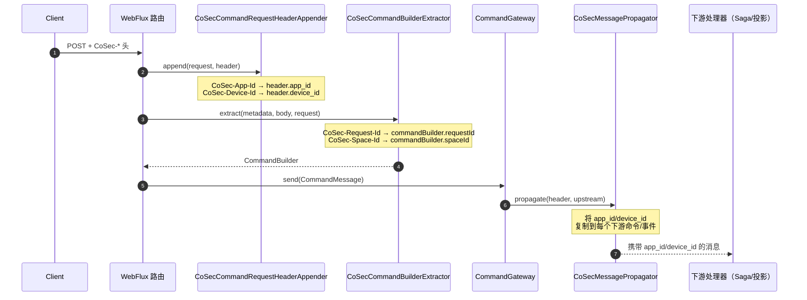

# CoSec

CoSec 扩展将 [CoSec](https://github.com/Ahoo-Wang/CoSec) 安全框架与 Wow 的 WebFlux 命令和查询端点集成，处理安全上下文的注入与传播。

## 工作原理

CoSec 集成提供四个核心组件：

1. **CommandRequestHeaderAppender** — 从 HTTP 请求头中提取 `CoSec-App-Id` 和 `CoSec-Device-Id`，附加到命令 Header 中
2. **CommandBuilderExtractor** — 从 HTTP 请求头中提取 `CoSec-Request-Id` 和 `CoSec-Space-Id`，注入到 CommandBuilder 中
3. **MessagePropagator** — 在处理链中将 `app_id` 和 `device_id` 从上游消息 Header 向下游传播
4. **RewriteRequestCondition** — 从 `CoSec-Space-Id` 请求头（兜底取请求 space）解析查询的 `spaceId`，使快照/事件流查询按调用方的 space 隔离

## 安装

添加 `wow-cosec` 依赖，并在 Spring Boot Starter 中启用 `cosec-support` 能力：

```kotlin [Gradle(Kotlin)]
implementation("me.ahoo.wow:wow-spring-boot-starter") {
    capabilities { requireCapability("cosec-support") }
}
```

## 自动配置

当 `wow-cosec` 和 CoSec 同时在 classpath 上时，`CoSecAutoConfiguration` 会自动注册安全集成 Bean，无需额外配置。

## 使用方式

该集成是透明的：客户端在每个命令 HTTP 请求上发送 CoSec 头，框架会沿命令管道传播这些上下文，
使下游的 Saga、投影和事件处理器都能观察到调用方的 app、device、request 与 space 上下文。

### 发送 CoSec 头

```http
POST /tenant/{tenantId}/owner/{ownerId}/sales-order
Content-Type: application/json
Command-Wait-Stage: PROCESSED
CoSec-App-Id: wow-shop
CoSec-Device-Id: 7f6e5d4c-3b2a-1f0e-9d8c-7b6a5f4e3d2c
CoSec-Request-Id: 550e8400-e29b-41d4-a716-446655440000
CoSec-Space-Id: production

{
  "items": [...]
}
```

### 上下文如何流转



| 头 | 提取者 | 注入位置 |
|---|---|---|
| `CoSec-App-Id` | `CoSecCommandRequestHeaderAppender` | 命令 `header.app_id`，并传播到下游消息 |
| `CoSec-Device-Id` | `CoSecCommandRequestHeaderAppender` | 命令 `header.device_id`，并传播到下游消息 |
| `CoSec-Request-Id` | `CoSecCommandBuilderExtractor` | `CommandBuilder.requestId`（幂等性） |
| `CoSec-Space-Id` | `CoSecCommandBuilderExtractor` + `CoSecRewriteRequestCondition` | `CommandBuilder.spaceId`；对于读侧查询，`CoSecRewriteRequestCondition` 先解析 `Wow-Space-Id` 头，仅在其为空时才回退到 `CoSec-Space-Id` |

要在处理器内访问传播的上下文，从消息头读取即可：

```kotlin
@StatelessSaga
class OrderSaga {
    fun onEvent(event: OrderCreated, exchange: DomainEventExchange<*>): Mono<Void> {
        val appId = exchange.message.header["app_id"]
        val deviceId = exchange.message.header["device_id"]
        // ... 使用调用方的 app/device 上下文
        return Mono.empty()
    }
}
```
