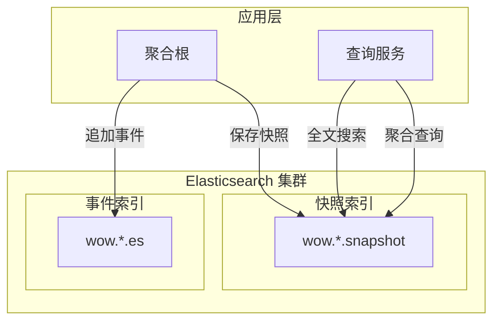

# Elasticsearch

_Elasticsearch_ 扩展提供了对 _Elasticsearch_ 的支持，适用于需要全文搜索和复杂查询的场景。它实现了以下接口：

- `EventStore` - 事件存储
- `EventStreamQueryService` - 事件流查询服务
- `SnapshotRepository` - 快照仓储
- `SnapshotQueryService` - 快照查询服务

## 架构概述



## 安装

::: code-group
```kotlin [Gradle(Kotlin)]
implementation("me.ahoo.wow:wow-elasticsearch")
implementation("org.springframework.boot:spring-boot-starter-data-elasticsearch")
```
```groovy [Gradle(Groovy)]
implementation 'me.ahoo.wow:wow-elasticsearch'
implementation 'org.springframework.boot:spring-boot-starter-data-elasticsearch'
```
```xml [Maven]
<dependency>
    <groupId>me.ahoo.wow</groupId>
    <artifactId>wow-elasticsearch</artifactId>
    <version>${wow.version}</version>
</dependency>
<dependency>
    <groupId>org.springframework.boot</groupId>
    <artifactId>spring-boot-starter-data-elasticsearch</artifactId>
</dependency>
```
:::

## 配置

### Spring Data Elasticsearch 配置

```yaml
spring:
  elasticsearch:
    uris:
      - http://localhost:9200
    username: elastic
    password: your-password
```

### Wow 配置

```yaml
wow:
  eventsourcing:
    store:
      storage: elasticsearch
    snapshot:
      storage: elasticsearch
```

## 索引命名规则

| 数据类型 | 索引命名格式 | 示例 |
|---------|------------|------|
| 事件流 | `wow.{contextName}.{aggregateName}.es` | `wow.order-service.order.es` |
| 快照 | `wow.{contextName}.{aggregateName}.snapshot` | `wow.order-service.order.snapshot` |

## 配置事件流索引模板

```http request
POST _index_template/wow-event-stream-template
{
  "index_patterns": [
    "wow.*.es"
  ],
  "template": {
    "settings": {
      "number_of_shards": 3,
      "number_of_replicas": 2
    },
    "mappings": {
      "properties": {
        "aggregateId": {
          "type": "keyword"
        },
        "aggregateName": {
          "type": "keyword"
        },
        "body": {
          "properties": {
            "bodyType": {
              "type": "keyword"
            },
            "id": {
                "type": "keyword"
            },
            "name": {
              "type": "keyword"
            },
            "revision": {
              "type": "keyword"
            }
          }
        },
        "commandId": {
          "type": "keyword"
        },
        "contextName": {
          "type": "keyword"
        },
        "createTime": {
          "type": "long"
        },
        "header": {
          "properties": {
            "upstream_id": {
              "type": "keyword"
            },
            "upstream_name": {
              "type": "keyword"
            }
          }
        },
        "id": {
          "type": "keyword"
        },
        "requestId": {
          "type": "keyword"
        },
        "tenantId": {
          "type": "keyword"
        },
        "version": {
          "type": "integer"
        }
      },
      "dynamic_templates": [
        {
          "string_as_keyword": {
            "match_mapping_type": "string",
            "mapping": {
              "type": "keyword"
            }
          }
        }
      ]
    }
  }
}
```

## 配置快照索引模板

```http request
POST _index_template/wow-snapshot-template
{
  "index_patterns": [
    "wow.*.snapshot"
  ],
  "template": {
    "settings": {
      "number_of_shards": 3,
      "number_of_replicas": 2
    },
    "mappings": {
      "properties": {
        "contextName": {
          "type": "keyword"
        },
        "aggregateName": {
          "type": "keyword"
        },
        "tenantId": {
          "type": "keyword"
        },
        "aggregateId": {
          "type": "keyword"
        },
        "version": {
          "type": "integer"
        },
        "eventId": {
          "type": "keyword"
        },
        "firstOperator": {
          "type": "keyword"
        },
        "operator": {
          "type": "keyword"
        },
        "firstEventTime": {
          "type": "long"
        },
        "eventTime": {
          "type": "long"
        },
        "snapshotTime": {
          "type": "long"
        },
        "deleted": {
          "type": "boolean"
        },
        "state": {
          "properties": {
            "id": {
              "type": "keyword"
            },
            "tenantId": {
              "type": "keyword"
            }
          }
        }
      },
      "dynamic_templates": [
        {
          "id_string_as_keyword": {
            "match": "id",
            "match_mapping_type": "string",
            "mapping": {
              "type": "keyword"
            }
          }
        },
        {
          "id_suffix_string_as_keyword": {
            "match": "*Id",
            "match_mapping_type": "string",
            "mapping": {
              "type": "keyword"
            }
          }
        }
      ]
    }
  }
}
```

## 全文搜索

利用 Elasticsearch 的全文搜索能力，可以对快照状态进行复杂查询：

### 为状态字段添加全文索引

```http request
POST _index_template/wow-order-snapshot-template
{
  "index_patterns": [
    "wow.*.order.snapshot"
  ],
  "template": {
    "mappings": {
      "properties": {
        "state": {
          "properties": {
            "description": {
              "type": "text",
              "analyzer": "ik_max_word",
              "search_analyzer": "ik_smart"
            },
            "customerName": {
              "type": "text",
              "fields": {
                "keyword": {
                  "type": "keyword"
                }
              }
            }
          }
        }
      }
    }
  }
}
```

### 执行全文搜索

```kotlin
// 使用 QueryService 进行全文搜索
val condition = Condition.all()
    .match("state.description", "手机")
    .range("state.totalAmount", 100, 500)
    .limit(10)

snapshotQueryService.dynamicQuery(condition)
```

## 聚合查询

Elasticsearch 提供强大的聚合功能：

### 统计分析

```kotlin
// 按状态统计订单数量
val aggregation = SearchRequest.of { s ->
    s.index("wow.order-service.order.snapshot")
        .aggregations("status_count") { a ->
            a.terms { t ->
                t.field("state.status")
            }
        }
}
```

### 时间范围聚合

```kotlin
// 按天统计订单金额
val aggregation = SearchRequest.of { s ->
    s.index("wow.order-service.order.snapshot")
        .aggregations("daily_amount") { a ->
            a.dateHistogram { d ->
                d.field("eventTime")
                    .calendarInterval(CalendarInterval.Day)
            }
            .aggregations("total") { sa ->
                sa.sum { sum ->
                    sum.field("state.totalAmount")
                }
            }
        }
}
```

## 索引设计建议

### 分片策略

```http request
PUT wow.order-service.order.snapshot
{
  "settings": {
    "number_of_shards": 5,
    "number_of_replicas": 1
  }
}
```

| 数据量 | 推荐分片数 | 推荐副本数 |
|--------|---------|---------|
| < 100万 | 1-3 | 1 |
| 100万-1000万 | 3-5 | 1-2 |
| > 1000万 | 5-10 | 2 |

### 索引生命周期管理 (ILM)

```http request
PUT _ilm/policy/wow-snapshot-policy
{
  "policy": {
    "phases": {
      "hot": {
        "actions": {
          "rollover": {
            "max_size": "50gb",
            "max_age": "30d"
          }
        }
      },
      "warm": {
        "min_age": "30d",
        "actions": {
          "shrink": {
            "number_of_shards": 1
          }
        }
      },
      "cold": {
        "min_age": "90d",
        "actions": {
          "freeze": {}
        }
      }
    }
  }
}
```

## 性能优化

### 批量索引

Elasticsearch 扩展支持批量操作，优化索引性能：

```yaml
spring:
  elasticsearch:
    rest:
      connection-timeout: 5s
      read-timeout: 30s
```

### 查询优化

1. **使用 Filter 替代 Query**：对于精确匹配使用 filter 提高缓存命中率
2. **限制返回字段**：使用 `_source` 过滤只返回需要的字段
3. **分页优化**：大数据量分页使用 `search_after` 替代 `from/size`

## 故障排查

### 常见问题

#### 1. 索引映射冲突

**解决方案**：
- 检查动态模板配置
- 使用严格映射模式

#### 2. 集群状态为黄色或红色

**解决方案**：
- 检查节点状态
- 增加副本或重新分配分片

#### 3. 查询性能慢

**解决方案**：
- 优化查询语句
- 增加索引分片
- 使用缓存

## 完整配置示例

```yaml
spring:
  elasticsearch:
    uris:
      - http://es-node-1:9200
      - http://es-node-2:9200
      - http://es-node-3:9200
    username: elastic
    password: your-password
    connection-timeout: 5s
    socket-timeout: 30s

wow:
  eventsourcing:
    store:
      storage: elasticsearch
    snapshot:
      enabled: true
      strategy: all
      storage: elasticsearch
```

## 最佳实践

1. **预定义映射**：在生产环境中预先创建索引模板，避免动态映射问题
2. **合理分片**：根据数据量设置合适的分片数，避免过多小分片
3. **使用别名**：使用索引别名便于零停机迁移
4. **启用 ILM**：使用索引生命周期管理自动管理索引
5. **监控集群**：监控集群健康状态和性能指标