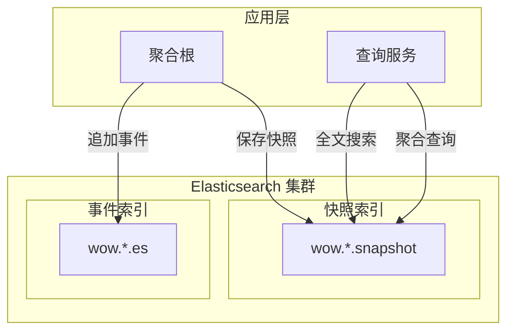

# Elasticsearch

_Elasticsearch_ 扩展提供了对 _Elasticsearch_ 的支持，适用于需要全文搜索和复杂查询的场景。它实现了以下接口：

- `EventStore` - 事件存储
- `EventStreamQueryService` - 事件流查询服务
- `SnapshotStore` - 快照存储
- `SnapshotQueryService` - 快照查询服务

## 架构概述


```mermaid
flowchart TB
    subgraph Application["应用层"]
        AR[聚合根]
        QS[查询服务]
    end
    
    subgraph Elasticsearch["Elasticsearch 集群"]
        subgraph EventIndex["事件索引"]
            ES["wow.*.es"]
        end
        subgraph SnapshotIndex["快照索引"]
            SS["wow.*.snapshot"]
        end
    end
    
    AR -->|追加事件| ES
    AR -->|保存快照| SS
    QS -->|全文搜索| SS
    QS -->|聚合查询| SS

```

## 安装

::: code-group
```kotlin [Gradle(Kotlin)]
implementation("me.ahoo.wow:wow-elasticsearch")
implementation("org.springframework.boot:spring-boot-starter-data-elasticsearch")
```
```groovy [Gradle(Groovy)]
implementation 'me.ahoo.wow:wow-elasticsearch'
implementation 'org.springframework.boot:spring-boot-starter-data-elasticsearch'
```
```xml [Maven]
<dependency>
    <groupId>me.ahoo.wow</groupId>
    <artifactId>wow-elasticsearch</artifactId>
    <version>${wow.version}</version>
</dependency>
<dependency>
    <groupId>org.springframework.boot</groupId>
    <artifactId>spring-boot-starter-data-elasticsearch</artifactId>
</dependency>
```
:::

## 配置

### Spring Data Elasticsearch 配置

```yaml
spring:
  elasticsearch:
    uris:
      - http://localhost:9200
    username: elastic
    password: your-password
```

### Wow 配置

```yaml
wow:
  eventsourcing:
    store:
      storage: elasticsearch
    snapshot:
      storage: elasticsearch
```

- 配置类：[ElasticsearchProperties](https://github.com/Ahoo-Wang/Wow/blob/main/wow-spring-boot-starter/src/main/kotlin/me/ahoo/wow/spring/boot/starter/elasticsearch/ElasticsearchProperties.kt)
- 前缀：`wow.elasticsearch.`

| 名称 | 数据类型 | 默认值 | 描述 |
|---|---|---|---|
| `enabled` | `Boolean` | `true` | 是否启用 Elasticsearch 扩展 |
| `auto-init-template` | `Boolean` | `true` | 在应用启动完成前安装所需的索引模板 |
| `event-store-batch.enabled` | `Boolean` | `false` | 使用 Bulk `create` 批量处理并发的事件流追加 |
| `event-store-batch.max-size` | `Int` | `128` | 每个批量批次的最大事件流数 |
| `event-store-batch.max-delay` | `Duration` | `1ms` | 收集部分批次的等待时长上限 |
| `event-store-batch.max-pending-appends` | `Int` | `4096` | 等待或正在写入的追加请求上限；必须不小于 `max-size` |
| `event-store-batch.lane-count` | `Int` | `1` | 串行写入通道数；同一聚合的追加保持在同一通道 |
| `snapshot-store-batch.enabled` | `Boolean` | `false` | 使用 Bulk 脚本 upsert 批量处理并发快照保存 |
| `snapshot-store-batch.max-size` | `Int` | `128` | 每个批量批次的最大快照数 |
| `snapshot-store-batch.max-delay` | `Duration` | `1ms` | 收集部分快照批次的等待时长上限 |
| `snapshot-store-batch.max-pending-saves` | `Int` | `4096` | 等待或正在写入的保存请求上限；必须不小于 `max-size` |
| `snapshot-store-batch.lane-count` | `Int` | `1` | 串行写入通道数；同一聚合的保存保持在同一通道 |

应用启动完成前会安装所需索引模板；请求失败或未确认会导致启动失败。仅当索引模板由外部系统管理时，才应设置
`wow.elasticsearch.auto-init-template=false`。内置模板不会固定分片数和副本数，这些拓扑参数应由集群或更高优先级的
运维模板管理。

## 写入批处理

EventStore 与 SnapshotStore 的写入批处理默认关闭，可按需启用：

```yaml
wow:
  elasticsearch:
    event-store-batch:
      enabled: true
      max-size: 128
      max-delay: 1ms
      max-pending-appends: 4096
      lane-count: 1
    snapshot-store-batch:
      enabled: true
      max-size: 128
      max-delay: 1ms
      max-pending-saves: 4096
      lane-count: 1
```

EventStore 使用 Bulk `create`，不会覆盖已有事件文档；单项 409 只会作为
对应 append 的事件版本冲突返回，Bulk 中其他成功项仍会返回给各自调用者。

SnapshotStore 使用带 scripted upsert 的 Bulk `update`，direct 路径使用相同的
原子脚本：输入版本大于或等于 `_source.version` 时完整替换已存快照，只有较低
版本为 no-op。同版本覆盖支持快照重建。升级前文档的 Elasticsearch `_version`
是内部写入计数器时同样安全，不需要迁移版本元数据。

## 索引命名规则

| 数据类型 | 索引命名格式 | 示例 |
|---------|------------|------|
| 事件流 | `wow.{contextName}.{aggregateName}.es` | `wow.order-service.order.es` |
| 快照 | `wow.{contextName}.{aggregateName}.snapshot` | `wow.order-service.order.snapshot` |

## 配置事件流索引模板

```http request
POST _index_template/wow-event-stream-template
{
  "index_patterns": [
    "wow.*.es"
  ],
  "template": {
    "mappings": {
      "properties": {
        "aggregateId": {
          "type": "keyword"
        },
        "aggregateName": {
          "type": "keyword"
        },
        "body": {
          "properties": {
            "bodyType": {
              "type": "keyword"
            },
            "id": {
                "type": "keyword"
            },
            "name": {
              "type": "keyword"
            },
            "revision": {
              "type": "keyword"
            }
          }
        },
        "commandId": {
          "type": "keyword"
        },
        "contextName": {
          "type": "keyword"
        },
        "createTime": {
          "type": "long"
        },
        "header": {
          "properties": {
            "upstream_id": {
              "type": "keyword"
            },
            "upstream_name": {
              "type": "keyword"
            }
          }
        },
        "id": {
          "type": "keyword"
        },
        "requestId": {
          "type": "keyword"
        },
        "tenantId": {
          "type": "keyword"
        },
        "version": {
          "type": "integer"
        }
      },
      "dynamic_templates": [
        {
          "string_as_keyword": {
            "match_mapping_type": "string",
            "mapping": {
              "type": "keyword"
            }
          }
        }
      ]
    }
  }
}
```

## 配置快照索引模板

```http request
POST _index_template/wow-snapshot-template
{
  "index_patterns": [
    "wow.*.snapshot"
  ],
  "template": {
    "mappings": {
      "properties": {
        "contextName": {
          "type": "keyword"
        },
        "aggregateName": {
          "type": "keyword"
        },
        "tenantId": {
          "type": "keyword"
        },
        "aggregateId": {
          "type": "keyword"
        },
        "version": {
          "type": "integer"
        },
        "eventId": {
          "type": "keyword"
        },
        "firstOperator": {
          "type": "keyword"
        },
        "operator": {
          "type": "keyword"
        },
        "firstEventTime": {
          "type": "long"
        },
        "eventTime": {
          "type": "long"
        },
        "snapshotTime": {
          "type": "long"
        },
        "deleted": {
          "type": "boolean"
        },
        "state": {
          "properties": {
            "id": {
              "type": "keyword"
            },
            "tenantId": {
              "type": "keyword"
            }
          }
        }
      },
      "dynamic_templates": [
        {
          "id_string_as_keyword": {
            "match": "id",
            "match_mapping_type": "string",
            "mapping": {
              "type": "keyword"
            }
          }
        },
        {
          "id_suffix_string_as_keyword": {
            "match": "*Id",
            "match_mapping_type": "string",
            "mapping": {
              "type": "keyword"
            }
          }
        }
      ]
    }
  }
}
```

## 全文搜索

利用 Elasticsearch 的全文搜索能力，可以对快照状态进行复杂查询：

### 为状态字段添加全文索引

```http request
POST _index_template/wow-order-snapshot-template
{
  "index_patterns": [
    "wow.*.order.snapshot"
  ],
  "priority": 100,
  "template": {
    "mappings": {
      "properties": {
        "state": {
          "properties": {
            "description": {
              "type": "text",
              "analyzer": "standard"
            },
            "customerName": {
              "type": "text",
              "fields": {
                "keyword": {
                  "type": "keyword"
                }
              }
            }
          }
        }
      }
    }
  }
}
```

更高的优先级会使聚合模板覆盖 Wow 默认快照模板。上例为简洁起见只展示自定义字段；生产模板还必须包含快照所需的
基础映射，或者通过 component template 组合基础映射与自定义映射。

::: tip
如果需要中文分词支持，可以安装 [IK 分析器插件](https://github.com/medcl/elasticsearch-analysis-ik)，然后使用 `ik_max_word` 和 `ik_smart` 分析器。
:::

### 执行全文搜索

```kotlin
// 使用 QueryService 进行全文搜索
val condition = Condition.all()
    .match("state.description", "搜索关键词")
    .range("state.totalAmount", 100, 500)
    .limit(10)

snapshotQueryService.dynamicQuery(condition)
```

## 聚合查询

Elasticsearch 提供强大的聚合功能：

### 统计分析

```kotlin
// 按状态统计订单数量
val aggregation = SearchRequest.of { s ->
    s.index("wow.order-service.order.snapshot")
        .aggregations("status_count") { a ->
            a.terms { t ->
                t.field("state.status")
            }
        }
}
```

### 时间范围聚合

```kotlin
// 按天统计订单金额
val aggregation = SearchRequest.of { s ->
    s.index("wow.order-service.order.snapshot")
        .aggregations("daily_amount") { a ->
            a.dateHistogram { d ->
                d.field("eventTime")
                    .calendarInterval(CalendarInterval.Day)
            }
            .aggregations("total") { sa ->
                sa.sum { sum ->
                    sum.field("state.totalAmount")
                }
            }
        }
}
```

## 索引设计建议

### 分片策略

```http request
PUT wow.order-service.order.snapshot
{
  "settings": {
    "number_of_shards": 5,
    "number_of_replicas": 1
  }
}
```

| 数据量 | 推荐分片数 | 推荐副本数 |
|--------|---------|---------|
| < 100万 | 1-3 | 1 |
| 100万-1000万 | 3-5 | 1-2 |
| > 1000万 | 5-10 | 2 |

### 索引生命周期管理 (ILM)

```http request
PUT _ilm/policy/wow-snapshot-policy
{
  "policy": {
    "phases": {
      "hot": {
        "actions": {
          "rollover": {
            "max_size": "50gb",
            "max_age": "30d"
          }
        }
      },
      "warm": {
        "min_age": "30d",
        "actions": {
          "shrink": {
            "number_of_shards": 1
          }
        }
      },
      "cold": {
        "min_age": "90d",
        "actions": {
          "freeze": {}
        }
      }
    }
  }
}
```

## 性能优化

### 批量索引

Elasticsearch 扩展支持批量操作，优化索引性能：

```yaml
spring:
  elasticsearch:
    connection-timeout: 5s
    socket-timeout: 30s
```

### 查询优化

1. **使用 Filter 替代 Query**：对于精确匹配使用 filter 提高缓存命中率
2. **限制返回字段**：使用 `_source` 过滤只返回需要的字段
3. **全量列表查询**：`ListQuery.limit=0` 使用 PIT + `search_after` 流式返回全部匹配结果；`1..10_000` 使用单次请求，更大的正数 limit 使用同一内部分页器。10,000 只是内部批大小，不是结果上限。
4. **分页查询**：`PagedQuery` 保持 `from/size` 语义，仍受 Elasticsearch `index.max_result_window` 限制。需要完整结果集时应使用列表查询。

## 故障排查

### 常见问题

#### 1. 索引映射冲突

**解决方案**：
- 检查动态模板配置
- 使用严格映射模式

#### 2. 集群状态为黄色或红色

**解决方案**：
- 检查节点状态
- 增加副本或重新分配分片

#### 3. 查询性能慢

**解决方案**：
- 优化查询语句
- 增加索引分片
- 使用缓存

## 完整配置示例

```yaml
spring:
  elasticsearch:
    uris:
      - http://es-node-1:9200
      - http://es-node-2:9200
      - http://es-node-3:9200
    username: elastic
    password: your-password
    connection-timeout: 5s
    socket-timeout: 30s

wow:
  eventsourcing:
    store:
      storage: elasticsearch
    snapshot:
      enabled: true
      strategy: all
      storage: elasticsearch
```

## 最佳实践

1. **预定义映射**：在生产环境中预先创建索引模板，避免动态映射问题
2. **合理分片**：根据数据量设置合适的分片数，避免过多小分片
3. **使用别名**：使用索引别名便于零停机迁移
4. **启用 ILM**：使用索引生命周期管理自动管理索引
5. **监控集群**：监控集群健康状态和性能指标
