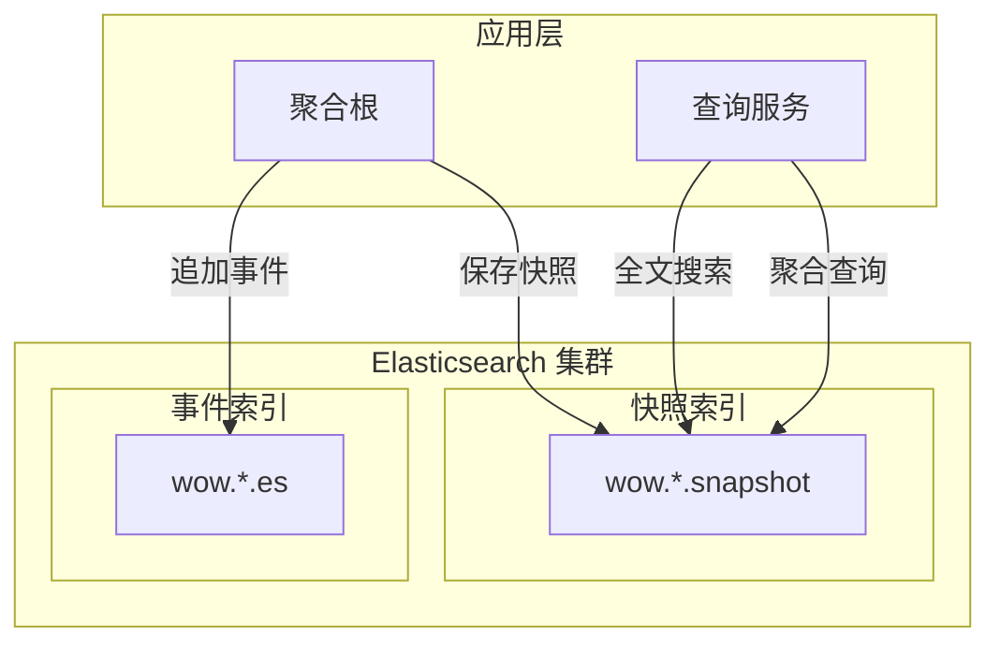

# Elasticsearch

_Elasticsearch_ 扩展提供了对 _Elasticsearch_ 的支持，适用于需要全文搜索和复杂查询的场景。它实现了以下接口：

- `EventStore` - 事件存储
- `EventStreamQueryService` - 事件流查询服务
- `SnapshotStore` - 快照存储
- `SnapshotQueryService` - 快照查询服务

## 架构概述


```mermaid
flowchart TB
    subgraph Application["应用层"]
        AR[聚合根]
        QS[查询服务]
    end
    
    subgraph Elasticsearch["Elasticsearch 集群"]
        subgraph EventIndex["事件索引"]
            ES["wow.*.es"]
        end
        subgraph SnapshotIndex["快照索引"]
            SS["wow.*.snapshot"]
        end
    end
    
    AR -->|追加事件| ES
    AR -->|保存快照| SS
    QS -->|全文搜索| SS
    QS -->|聚合查询| SS

```

## 安装

::: code-group
```kotlin [Gradle(Kotlin)]
implementation("me.ahoo.wow:wow-elasticsearch")
implementation("org.springframework.boot:spring-boot-starter-data-elasticsearch")
```
```groovy [Gradle(Groovy)]
implementation 'me.ahoo.wow:wow-elasticsearch'
implementation 'org.springframework.boot:spring-boot-starter-data-elasticsearch'
```
```xml [Maven]
<dependency>
    <groupId>me.ahoo.wow</groupId>
    <artifactId>wow-elasticsearch</artifactId>
    <version>${wow.version}</version>
</dependency>
<dependency>
    <groupId>org.springframework.boot</groupId>
    <artifactId>spring-boot-starter-data-elasticsearch</artifactId>
</dependency>
```
:::

## 配置

### Spring Data Elasticsearch 配置

```yaml
spring:
  elasticsearch:
    uris:
      - http://localhost:9200
    username: elastic
    password: ${ELASTICSEARCH_PASSWORD}
```

### Wow 配置

```yaml
wow:
  eventsourcing:
    store:
      storage: elasticsearch
    snapshot:
      storage: elasticsearch
```

- 配置类：[ElasticsearchProperties](https://github.com/Ahoo-Wang/Wow/blob/main/wow-spring-boot-starter/src/main/kotlin/me/ahoo/wow/spring/boot/starter/elasticsearch/ElasticsearchProperties.kt)
- 查询配置类：[ElasticsearchQueryProperties](https://github.com/Ahoo-Wang/Wow/blob/main/wow-spring-boot-starter/src/main/kotlin/me/ahoo/wow/spring/boot/starter/elasticsearch/ElasticsearchQueryProperties.kt)
- 前缀：`wow.elasticsearch.`

| 名称 | 数据类型 | 默认值 | 描述 |
|---|---|---|---|
| `enabled` | `Boolean` | `true` | 是否启用 Elasticsearch 扩展 |
| `auto-init-template` | `Boolean` | `true` | 在应用启动完成前安装所需的索引模板 |
| `event-store-batch.enabled` | `Boolean` | `false` | 使用 Bulk `create` 批量处理并发的事件流追加 |
| `event-store-batch.max-size` | `Int` | `128` | 每个批量批次的最大事件流数 |
| `event-store-batch.max-delay` | `Duration` | `1ms` | 收集部分批次的等待时长上限 |
| `event-store-batch.max-pending-appends` | `Int` | `4096` | 等待或正在写入的追加请求上限；必须不小于 `max-size` |
| `event-store-batch.lane-count` | `Int` | `1` | 串行写入通道数；同一聚合的追加保持在同一通道 |
| `snapshot-store-batch.enabled` | `Boolean` | `false` | 使用 Bulk 脚本 upsert 批量处理并发快照保存 |
| `snapshot-store-batch.max-size` | `Int` | `128` | 每个批量批次的最大快照数 |
| `snapshot-store-batch.max-delay` | `Duration` | `1ms` | 收集部分快照批次的等待时长上限 |
| `snapshot-store-batch.max-pending-saves` | `Int` | `4096` | 等待或正在写入的保存请求上限；必须不小于 `max-size` |
| `snapshot-store-batch.lane-count` | `Int` | `1` | 串行写入通道数；同一聚合的保存保持在同一通道 |
| `query.batch-size` | `Int` | `10000` | PIT + `search_after` 列表查询的内部批大小，取值范围 `1..10000` |
| `query.keep-alive` | `Duration` | `1m` | PIT 的保持时间，必须大于 `0` |

应用启动完成前会安装所需索引模板；请求失败或未确认会导致启动失败。仅当索引模板由外部系统管理时，才应设置
`wow.elasticsearch.auto-init-template=false`。内置模板不会固定分片数和副本数，这些拓扑参数应由集群或更高优先级的
运维模板管理。

## 写入批处理

EventStore 与 SnapshotStore 的写入批处理默认关闭，可按需启用：

```yaml
wow:
  elasticsearch:
    event-store-batch:
      enabled: true
      max-size: 128
      max-delay: 1ms
      max-pending-appends: 4096
      lane-count: 1
    snapshot-store-batch:
      enabled: true
      max-size: 128
      max-delay: 1ms
      max-pending-saves: 4096
      lane-count: 1
```

EventStore 使用 Bulk `create`，不会覆盖已有事件文档；单项 409 只会作为
对应 append 的事件版本冲突返回，Bulk 中其他成功项仍会返回给各自调用者。

SnapshotStore 使用带 scripted upsert 的 Bulk `update`，direct 路径使用相同的
原子脚本：输入版本大于或等于 `_source.version` 时完整替换已存快照，只有较低
版本为 no-op。同版本覆盖支持快照重建。升级前文档的 Elasticsearch `_version`
是内部写入计数器时同样安全，不需要迁移版本元数据。

## 索引命名规则

| 数据类型 | 索引命名格式 | 示例 |
|---------|------------|------|
| 事件流 | `wow.{contextName}.{aggregateName}.es` | `wow.order-service.order.es` |
| 快照 | `wow.{contextName}.{aggregateName}.snapshot` | `wow.order-service.order.snapshot` |

## 快照查询字段解析

快照查询使用协商后的运行时 Query Schema。Wow 先合并 System 骨架、JSON Schema/注解、Classpath 文件、Bean 和工作目录文件，
再由 Elasticsearch Mapping 绑定物理字段与可执行能力。声明来源从低到高依次为 JSON Schema、Classpath、Bean、工作目录；高优先级
只覆盖显式声明的叶子。约定文件位置固定为：

```text
classpath:wow-query-schema/{contextName}/{aggregateName}/{model}.json
./config/wow-query-schema/{contextName}/{aggregateName}/{model}.json
```

最终 Schema 按 QueryService 缓存且没有 TTL。`GET /{aggregate}/snapshot/schema` 返回不含物理 binding 的公共元数据；Mapping、索引或
声明修正后，调用 `POST /{aggregate}/snapshot/schema/refresh` 重新协商当前服务实例。刷新失败保留旧缓存，不会广播到其他实例。

字段选择规则如下：

| Query 操作 | Mapping 要求 |
|---|---|
| `EQ`、`NE`、`IN`、`NOT_IN`、`ALL_IN`、`TRUE`、`FALSE` | 可执行 term 查询，包括受支持的 doc-value-only 字段 |
| `CONTAINS`、`STARTS_WITH`、`ENDS_WITH` | `keyword` 或 `wildcard` |
| 范围操作 | numeric、date、ip、keyword 或 `*_range`，支持适用的 `doc_values=true,index=false` 字段 |
| `IS_EMPTY`、null 与存在性操作 | 已索引或可通过 doc values 查询的叶子字段；object/nested 容器本身不提供存在性能力。Elasticsearch 空数组没有索引值，因此 `IS_EMPTY` 编译为 `NOT EXISTS` |
| `MATCH` | `text`、`match_only_text`、`search_as_you_type` 或 `semantic_text` |
| 排序 | 启用 `doc_values` 的可排序字段、启用 `fielddata` 的已索引 `text` 字段，或可排序 runtime field |

`_score`、`_doc` 和 `_shard_doc` 是 Elasticsearch 元数据排序字段，不参与 Mapping 字段解析并保持原样传递。
`text.fielddata=true` 会占用较多堆内存，通常仍应优先使用 `keyword` multi-field；doc-values 字段和 runtime field
排序不要求 `index=true`。

动态后代不会单独出现在 Mapping 中，也无法仅凭当前 Mapping 证明索引设置、历史文档和写入边界始终具有相同语义。因此首期
Elasticsearch 最终 Schema 不发布动态后代能力：`STRICT` 拒绝未知后代；`COMPATIBLE` 仅对普通未知路径保留原有后端回退。
固定 System `tags.*` 涉及 ABAC，不允许这种回退，即使 Schema 暂时不可用也会失败关闭。显式映射的 typed sub-field 仍使用自身能力。

例如，同一逻辑字段可同时支持全文搜索和精确查询：

```json
{
  "properties": {
    "state": {
      "properties": {
        "customerName": {
          "type": "text",
          "fields": {
            "keyword": { "type": "keyword" }
          }
        }
      }
    }
  }
}
```

| Query 操作 | 客户端字段 | 实际字段 |
|---|---|---|
| `SEARCH` | `state.customerName` | `state.customerName` |
| `EQ`、`IN`、排序 | `state.customerName` | `state.customerName.keyword` |
| projection | `state.customerName` | `state.customerName`（不重写） |

客户端始终使用逻辑字段，不需要固定写入 `.keyword` 或 `.text`。

`SEARCH` 的默认 `TERMS` 模式使用 `multi_match`；`PHRASE` 模式使用 `multi_match(type = phrase)`，字段解析规则不变。

对于 multi-field，依次选择当前字段、`.keyword`/`.text`、`.exact`，最后才选择唯一的兼容子字段；存在多个兼容候选时
查询失败，避免静默改变语义。projection 仍使用逻辑字段，`ELEMENT_MATCH` 的父路径
必须映射为 `nested`。自定义 `AbstractElasticsearchFilterConverter` 继续负责解释自己的物理字段，不经过上述重写。

Field alias 继承其目标字段的查询与排序能力，并继续使用 alias 名称生成查询。Mapping 中声明的 runtime field 也会按
其类型参与能力解析；runtime 查询会在查询时计算，且当 Elasticsearch 设置 `search.allow_expensive_queries=false` 时
可能被集群拒绝。projection 仍按逻辑路径作用于 `_source`，不会把 field alias 或 runtime field 改写为其目标字段。

每个聚合必须解析到一个物理快照索引。alias 或 data stream 如果解析出多个索引，查询会失败；这种拓扑需要先收敛为
单个物理索引，或由应用自行实现基于 `_field_caps` 的查询方案。

## 刷新运行时查询 Schema

先使用 `GET /{aggregate}/snapshot/schema` 查看当前聚合的逻辑字段与能力；按已注册聚合刷新当前实例的 Schema：

```bash
curl -X POST http://localhost:8080/order/snapshot/schema/refresh
```

该 POST 路由使用独立授权策略，可限制为维护角色。它重新读取 Mapping、约定文件和其他 Schema 来源；成功后返回新的公共 Metadata。Elasticsearch 凭据仍需要目标索引的 `view_index_metadata` 权限，因为后端 Adapter 必须读取 Mapping。

权限不足、索引不存在或 Mapping 无法解析时，刷新返回错误但保留已有成功缓存。刷新不修改 Elasticsearch Mapping、不重建索引，也不回填历史快照；它只影响收到请求的本实例，不广播。多副本部署需要逐 Pod 调用；在途查询继续使用开始编译时取得的旧 Schema。

发布 Mapping 时先更新索引并完成必要的 reindex 或快照重建，再逐 Pod 刷新 Schema，并在每个 Pod 运行代表性的精确、全文和排序查询后完成发布。

## 配置事件流索引模板

内置模板关闭自动日期探测，业务日期字段应在聚合专用模板中显式映射。事件条目使用 `nested`；`body[].body`
仍保留在 `_source`，但不参与索引，避免任意载荷因 Mapping 冲突阻断持久化。单个事件流最多包含 10,000 个事件，
与 Elasticsearch 默认的 nested-object 上限一致。

`ELEMENT_MATCH` 内使用相对子字段，解析器会根据 nested 父路径补全：

```kotlin
filter {
    "body".elementMatch {
        "name" eq "Created"
    }
}
```

```json
{
  "filter": {
    "op": "ELEMENT_MATCH",
    "field": "body",
    "predicate": { "op": "EQ", "field": "name", "value": "Created" }
  }
}
```

需要检索载荷或自定义 nested 语义时，应用必须提供高优先级模板和匹配的查询转换器。由于 composable template
不会按优先级合并，该模板必须完整复现内置基础 Mapping。

```http request
POST _index_template/wow-event-stream-template
{
  "index_patterns": [
    "wow.*.es"
  ],
  "template": {
    "mappings": {
      "date_detection": false,
      "properties": {
        "aggregateId": {
          "type": "keyword"
        },
        "aggregateName": {
          "type": "keyword"
        },
        "body": {
          "type": "nested",
          "properties": {
            "body": {
              "type": "object",
              "enabled": false
            },
            "bodyType": {
              "type": "keyword"
            },
            "id": {
                "type": "keyword"
            },
            "name": {
              "type": "keyword"
            },
            "revision": {
              "type": "keyword"
            }
          }
        },
        "commandId": {
          "type": "keyword"
        },
        "contextName": {
          "type": "keyword"
        },
        "createTime": {
          "type": "long"
        },
        "header": {
          "properties": {
            "upstream_id": {
              "type": "keyword"
            },
            "upstream_name": {
              "type": "keyword"
            }
          }
        },
        "id": {
          "type": "keyword"
        },
        "requestId": {
          "type": "keyword"
        },
        "tenantId": {
          "type": "keyword"
        },
        "ownerId": {
          "type": "keyword"
        },
        "spaceId": {
          "type": "keyword"
        },
        "version": {
          "type": "integer"
        }
      },
      "dynamic_templates": [
        {
          "string_as_keyword": {
            "match_mapping_type": "string",
            "mapping": {
              "type": "keyword",
              "ignore_above": 8191
            }
          }
        }
      ]
    }
  }
}
```

## 配置快照索引模板

```http request
POST _index_template/wow-snapshot-template
{
  "index_patterns": [
    "wow.*.snapshot"
  ],
  "template": {
    "mappings": {
      "date_detection": false,
      "properties": {
        "contextName": {
          "type": "keyword"
        },
        "aggregateName": {
          "type": "keyword"
        },
        "tenantId": {
          "type": "keyword"
        },
        "aggregateId": {
          "type": "keyword"
        },
        "version": {
          "type": "integer"
        },
        "eventId": {
          "type": "keyword"
        },
        "ownerId": {
          "type": "keyword"
        },
        "spaceId": {
          "type": "keyword"
        },
        "firstOperator": {
          "type": "keyword"
        },
        "operator": {
          "type": "keyword"
        },
        "firstEventTime": {
          "type": "long"
        },
        "eventTime": {
          "type": "long"
        },
        "snapshotTime": {
          "type": "long"
        },
        "deleted": {
          "type": "boolean"
        },
        "tags": {
          "type": "object",
          "dynamic": true
        },
        "state": {
          "properties": {
            "id": {
              "type": "keyword"
            },
            "tenantId": {
              "type": "keyword"
            }
          }
        }
      },
      "dynamic_templates": [
        {
          "tags_strings_as_keyword": {
            "match_mapping_type": "string",
            "path_match": "tags.*",
            "mapping": {
              "type": "keyword",
              "ignore_above": 8191
            }
          }
        },
        {
          "id_string_as_keyword": {
            "match": "id",
            "match_mapping_type": "string",
            "mapping": {
              "type": "keyword",
              "ignore_above": 8191
            }
          }
        },
        {
          "id_suffix_string_as_keyword": {
            "match": "*Id",
            "match_mapping_type": "string",
            "mapping": {
              "type": "keyword",
              "ignore_above": 8191
            }
          }
        }
      ]
    }
  }
}
```

## 全文搜索

利用 Elasticsearch 的全文搜索能力，可以对快照状态进行复杂查询：

### 为状态字段添加全文索引

以下内容只是自定义 `state.properties` 片段，不能作为索引模板直接提交：

```json
{
  "state": {
    "properties": {
      "description": {
        "type": "text",
        "analyzer": "standard"
      },
      "customerName": {
        "type": "text",
        "fields": {
          "keyword": {
            "type": "keyword"
          }
        }
      }
    }
  }
}
```

发布 `wow-order-snapshot-template` 时，先复制上文完整的内置快照模板，将该片段合并到
`mappings.properties`，收窄 `index_patterns`，最后设置 `priority: 100`。高优先级 composable template 会替换而非
合并 Wow 默认模板，绝不能单独发布上述片段。也可以通过运维自有的基础 component template 和自定义 component
template 组合出完整 Mapping。

::: tip
如果需要中文分词支持，可以安装 [IK 分析器插件](https://github.com/medcl/elasticsearch-analysis-ik)，然后使用 `ik_max_word` 和 `ik_smart` 分析器。
:::

### 执行全文搜索

```kotlin
// 使用 QueryService 进行全文搜索
listQuery {
    filter {
        search("搜索关键词", "state.description")
        "state.totalAmount".between(100, 500)
    }
    sort {
        "state.customerName".asc()
    }
    limit(10)
}.dynamicQuery(snapshotQueryService)
```

## 聚合查询

`ElasticsearchSnapshotQueryService.aggregate()` 编译通用 `AggregationQuery` 合同。第一个 Element 按绝对 `nested` 路径解析，后续 Elements 及其 filters 相对当前 nested 作用域解析。Terms 分组复用现有精确字段解析器，包括标准 `.keyword` multi-field；纯字段数值指标仍解析为可执行物理字段，类型不匹配时保留 Elasticsearch 错误。

计算型数值指标使用框架生成、参数化的请求级 `double` runtime field；缺失、不可读取、非数值、多值、除零或非有限中间结果不会产生值。它受集群 `search.allow_expensive_queries` 约束，集群仍可拒绝这类查询。

在最内层作用域，Wow 使用 composite sources 与 metric sub-aggregations。按 group alias 排序遵循 composite source 顺序，只读取满足 `limit` 所需的分页。按 metric alias 排序成本更高：它会遍历全部 composite buckets，并在客户端维护精确的有界 Top-N，而不使用近似的 `terms` 或 `bucket_sort` 方案。

Composite 分页复用普通查询 pager 的 point-in-time 生命周期；完成、错误或取消时都会关闭最新 PIT。自定义 filter converter 以及 runtime field、`copy_to`、`null_value`、类型强制转换等自定义 mapping 不提供可移植性保证；调用方必须提供可执行的物理路径。

## 索引设计建议

### 分片策略

```http request
PUT wow.order-service.order.snapshot
{
  "settings": {
    "number_of_shards": 5,
    "number_of_replicas": 1
  }
}
```

| 数据量 | 推荐分片数 | 推荐副本数 |
|--------|---------|---------|
| < 100万 | 1-3 | 1 |
| 100万-1000万 | 3-5 | 1-2 |
| > 1000万 | 5-10 | 2 |

### 索引生命周期管理 (ILM)

```http request
PUT _ilm/policy/wow-snapshot-policy
{
  "policy": {
    "phases": {
      "hot": {
        "actions": {
          "rollover": {
            "max_size": "50gb",
            "max_age": "30d"
          }
        }
      },
      "warm": {
        "min_age": "30d",
        "actions": {
          "shrink": {
            "number_of_shards": 1
          }
        }
      },
      "cold": {
        "min_age": "90d",
        "actions": {
          "freeze": {}
        }
      }
    }
  }
}
```

## 性能优化

### 批量索引

Elasticsearch 扩展支持批量操作，优化索引性能：

```yaml
spring:
  elasticsearch:
    connection-timeout: 5s
    socket-timeout: 30s
```

### 查询优化

1. **使用 Filter 替代 Query**：对于精确匹配使用 filter 提高缓存命中率
2. **限制返回字段**：使用 `_source` 过滤只返回需要的字段
3. **全量列表查询**：`ListQuery.limit=0` 使用 PIT + `search_after` 流式返回全部匹配结果；默认情况下，`1..10_000` 使用单次请求，更大的正数 limit 使用同一内部分页器。10,000 只是默认内部批大小，不是结果上限。
4. **分页查询**：`PagedQuery` 保持 `from/size` 语义，仍受 Elasticsearch `index.max_result_window` 限制。需要完整结果集时应使用列表查询。

PIT 列表查询未指定 `sort` 时只按 `_shard_doc` 扫描，结果顺序不属于契约。需要相关性顺序时应显式添加 `_score DESC`。

当目标索引的 `index.max_result_window` 小于 10,000 时，将 `wow.elasticsearch.query.batch-size` 配置为不超过该值；当慢速订阅者消费一批数据可能超过默认 `1m` 时，应增大 `wow.elasticsearch.query.keep-alive`。

## 故障排查

### 常见问题

#### 1. 查询报字段未映射、能力不兼容或 multi-field 存在歧义

使用 `GET /{aggregate}/snapshot/schema` 检查当前聚合的逻辑字段与能力；需要重读 Mapping 时，调用
`POST /{aggregate}/snapshot/schema/refresh`。多个兼容子字段时，使用 `.keyword`、`.text` 或 `.exact` 的约定名称消除歧义。

#### 2. 刷新端点不可用或刷新失败

确认应用已注册 WebFlux query route，并且该聚合的 GET/POST 路由已按当前实例的 OpenAPI 路径 materialize。refresh 使用独立路由授权，可与普通查询分别限制。`500` 表示 Schema 声明冲突，`503` 表示 Mapping 或其他 Schema 来源不可用；后者应检查索引是否存在及 `view_index_metadata` 权限。刷新失败不会删除旧缓存。

#### 3. alias 或 data stream 无法解析

确认快照别名只指向一个物理索引。当前 Resolver 不合并多索引 Mapping，需要多索引查询时由应用基于
`_field_caps` 实现。

#### 4. 更新索引模板并刷新后，历史数据仍无法查询

索引模板只影响之后创建的索引，Mapping 刷新也只更新 Wow 的能力缓存。根据 Mapping 变更类型执行
`PUT /{indexName}/_mapping`、reindex 或快照重建，并核对结果数、排序和快照版本。

#### 5. runtime field 查询被拒绝

检查集群的 `search.allow_expensive_queries`。保持该限制时，将高频查询字段落到物理 Mapping，不要依赖 runtime field。

## 完整配置示例

```yaml
spring:
  elasticsearch:
    uris:
      - http://es-node-1:9200
      - http://es-node-2:9200
      - http://es-node-3:9200
    username: elastic
    password: ${ELASTICSEARCH_PASSWORD}
    connection-timeout: 5s
    socket-timeout: 30s

wow:
  elasticsearch:
    query:
      batch-size: 10000
      keep-alive: 1m
  eventsourcing:
    store:
      storage: elasticsearch
    snapshot:
      enabled: true
      strategy: all
      storage: elasticsearch
```

## 最佳实践

1. **预定义映射**：在首个快照写入前安装高优先级的聚合索引模板，避免动态映射锁定错误类型
2. **合理分片**：根据数据量设置合适的分片数，避免过多小分片
3. **限制别名拓扑**：Wow 快照查询使用的 alias 或 data stream 必须只解析到一个物理索引
4. **重建后核对**：Mapping 变更需要 reindex 或快照重建时，核对结果数、排序和快照版本
5. **监控集群**：监控集群健康状态、PIT 数量和查询延迟
