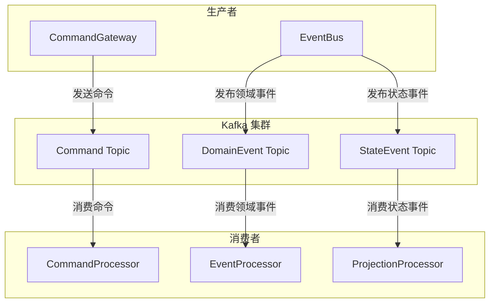

# Kafka

_Kafka_ 扩展提供了对 Apache Kafka 的支持，实现了 `CommandBus`、`DomainEventBus` 和 `StateEventBus`，是生产环境推荐的消息总线实现。

## 架构概述



## 安装

::: code-group
```kotlin [Gradle(Kotlin)]
implementation("me.ahoo.wow:wow-kafka")
```
```groovy [Gradle(Groovy)]
implementation 'me.ahoo.wow:wow-kafka'
```
```xml [Maven]
<dependency>
    <groupId>me.ahoo.wow</groupId>
    <artifactId>wow-kafka</artifactId>
    <version>${wow.version}</version>
</dependency>
```
:::

## 配置

- 配置类：[KafkaProperties](https://github.com/Ahoo-Wang/Wow/blob/main/wow-spring-boot-starter/src/main/kotlin/me/ahoo/wow/spring/boot/starter/kafka/KafkaProperties.kt)
- 前缀：`wow.kafka.`

| 名称                  | 数据类型                  | 说明          | 默认值    |
|---------------------|-----------------------|-------------|--------|
| `enabled`           | `Boolean`             | 是否启用        | `true` |
| `bootstrap-servers` | `List<String>`        | Kafka 服务器地址 |        |
| `topic-prefix`      | `String`              | 主题前缀        | `wow.` |
| `properties`        | `Map<String, String>` | 公共配置        |        |
| `producer`          | `Map<String, String>` | 生产者配置       |        |
| `consumer`          | `Map<String, String>` | 消费者配置       |        |

**YAML 配置样例**

```yaml
wow:
  command:
    bus:
      type: kafka
  event:
    bus:
      type: kafka
  eventsourcing:
    state:
      bus:
        type: kafka
  kafka:
    bootstrap-servers: localhost:9092
    topic-prefix: 'wow.'
```

## Topic 命名规则

Kafka 扩展使用以下规则生成 Topic 名称：

| 消息类型 | Topic 命名格式 | 示例 |
|---------|--------------|------|
| Command | `{prefix}{contextName}.{aggregateName}.command` | `wow.order-service.order.command` |
| DomainEvent | `{prefix}{contextName}.{aggregateName}.event` | `wow.order-service.order.event` |
| StateEvent | `{prefix}{contextName}.{aggregateName}.state` | `wow.order-service.order.state` |

::: tip
通过 `topic-prefix` 配置可以为所有 Topic 添加统一前缀，便于在多环境或多项目中区分。
:::

## 分区策略

Kafka 扩展默认使用聚合根 ID 作为分区键，确保同一聚合根的所有消息发送到同一分区，保证消息顺序性。

```mermaid
flowchart LR
    subgraph Messages["消息"]
        M1["Order-001 命令"]
        M2["Order-002 命令"]
        M3["Order-001 事件"]
    end
    
    subgraph Partitions["分区"]
        P0["Partition 0"]
        P1["Partition 1"]
    end
    
    M1 -->|hash(Order-001)| P0
    M2 -->|hash(Order-002)| P1
    M3 -->|hash(Order-001)| P0
```

## 生产者优化

```yaml
wow:
  kafka:
    producer:
      # 批量发送配置
      batch.size: 16384
      linger.ms: 5
      # 压缩配置
      compression.type: lz4
      # 可靠性配置
      acks: all
      retries: 3
      # 幂等性
      enable.idempotence: true
```

| 配置项 | 说明 | 推荐值 |
|-------|------|--------|
| `batch.size` | 批量大小（字节） | 16384 |
| `linger.ms` | 等待时间（毫秒） | 5 |
| `compression.type` | 压缩类型 | lz4 |
| `acks` | 确认级别 | all |
| `enable.idempotence` | 幂等性 | true |

## 消费者优化

```yaml
wow:
  kafka:
    consumer:
      # 拉取配置
      fetch.min.bytes: 1024
      fetch.max.wait.ms: 500
      max.poll.records: 500
      # 自动提交配置
      enable.auto.commit: false
      # 会话超时
      session.timeout.ms: 30000
      heartbeat.interval.ms: 10000
```

| 配置项 | 说明 | 推荐值 |
|-------|------|--------|
| `fetch.min.bytes` | 最小拉取字节数 | 1024 |
| `max.poll.records` | 单次最大拉取记录数 | 500 |
| `enable.auto.commit` | 自动提交 | false |
| `session.timeout.ms` | 会话超时时间 | 30000 |

## 消费者组

每个处理器对应一个独立的消费者组，消费者组 ID 格式为：

```
{contextName}.{processorName}
```

例如：`order-service.OrderProjectionProcessor`

## 故障排查

### 常见问题

#### 1. 连接超时

```
org.apache.kafka.common.errors.TimeoutException: Failed to update metadata
```

**解决方案**：
- 检查 `bootstrap-servers` 配置是否正确
- 确认网络连通性
- 检查 Kafka 服务是否正常运行

#### 2. Topic 不存在

```
org.apache.kafka.common.errors.UnknownTopicOrPartitionException
```

**解决方案**：
- 确认 Kafka 配置允许自动创建 Topic
- 或手动创建所需 Topic

#### 3. 消费者重平衡频繁

**解决方案**：
- 增加 `session.timeout.ms` 和 `heartbeat.interval.ms`
- 优化消息处理性能
- 减少 `max.poll.records`

### 监控指标

建议监控以下 Kafka 指标：

| 指标 | 说明 | 告警阈值 |
|------|------|---------|
| Consumer Lag | 消费延迟 | > 10000 |
| Request Rate | 请求速率 | 根据业务设定 |
| Error Rate | 错误率 | > 1% |
| Replication ISR | 同步副本数 | < 副本因子 |

## 完整配置示例

```yaml
wow:
  command:
    bus:
      type: kafka
      local-first:
        enabled: true
  event:
    bus:
      type: kafka
      local-first:
        enabled: true
  eventsourcing:
    state:
      bus:
        type: kafka
        local-first:
          enabled: true
  kafka:
    enabled: true
    bootstrap-servers:
      - kafka-0:9092
      - kafka-1:9092
      - kafka-2:9092
    topic-prefix: 'wow.'
    properties:
      security.protocol: SASL_SSL
      sasl.mechanism: PLAIN
    producer:
      acks: all
      retries: 3
      batch.size: 16384
      linger.ms: 5
      compression.type: lz4
      enable.idempotence: true
    consumer:
      fetch.min.bytes: 1024
      fetch.max.wait.ms: 500
      max.poll.records: 500
      enable.auto.commit: false
      session.timeout.ms: 30000
      heartbeat.interval.ms: 10000
```

## 最佳实践

1. **启用 LocalFirst 模式**：减少网络延迟，提高本地消息处理效率
2. **配置幂等性**：启用 `enable.idempotence` 保证消息精确一次投递
3. **合理设置分区数**：根据消费者数量和吞吐量需求配置分区
4. **监控消费延迟**：及时发现和处理消费积压问题
5. **使用压缩**：启用 LZ4 压缩减少网络传输和存储开销