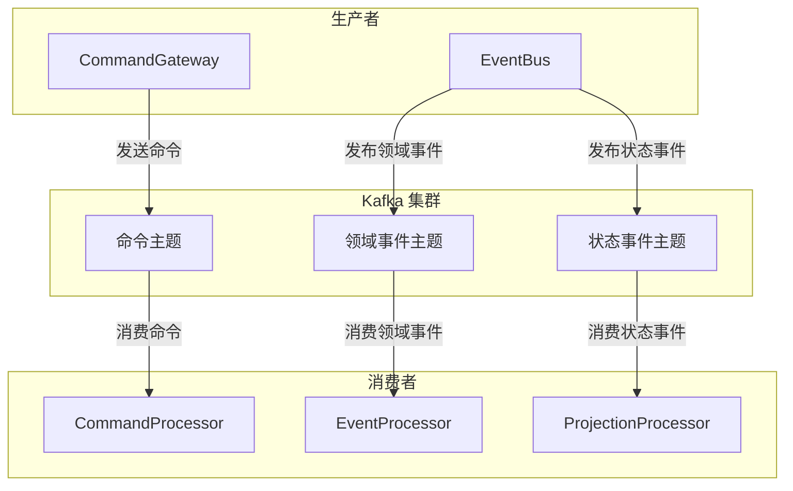
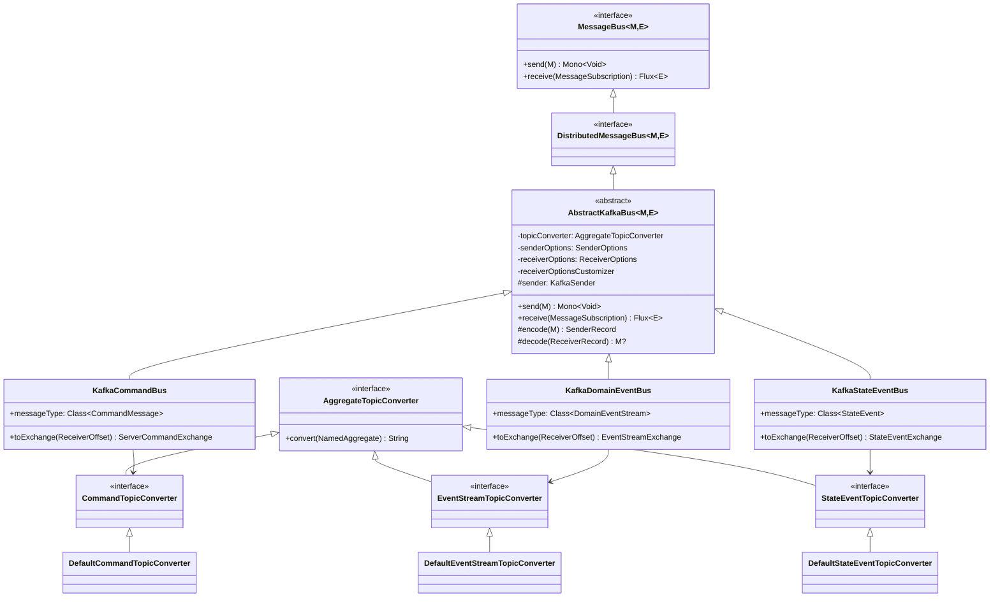
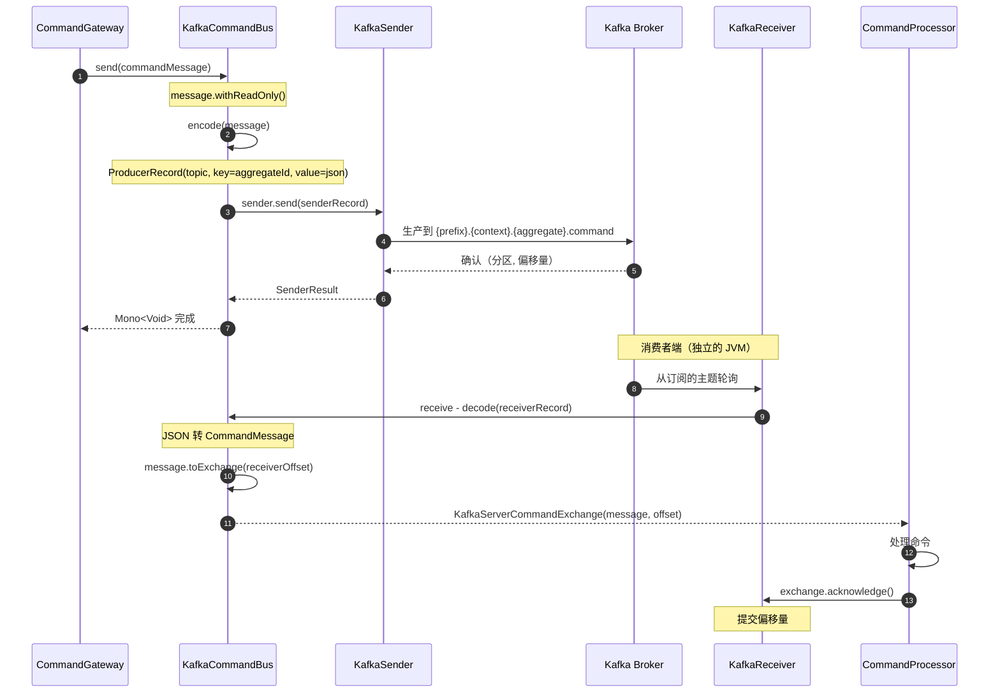
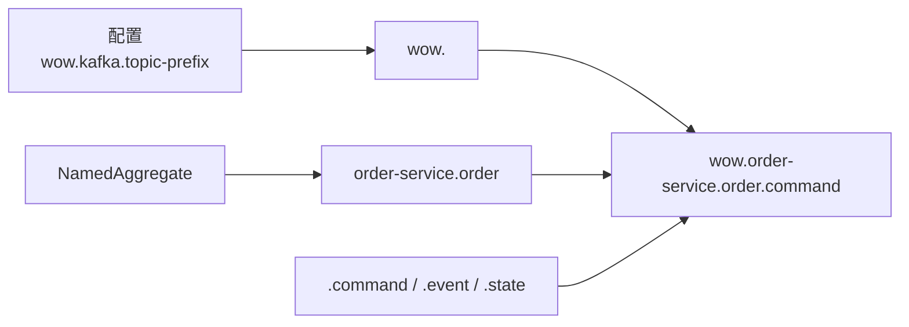
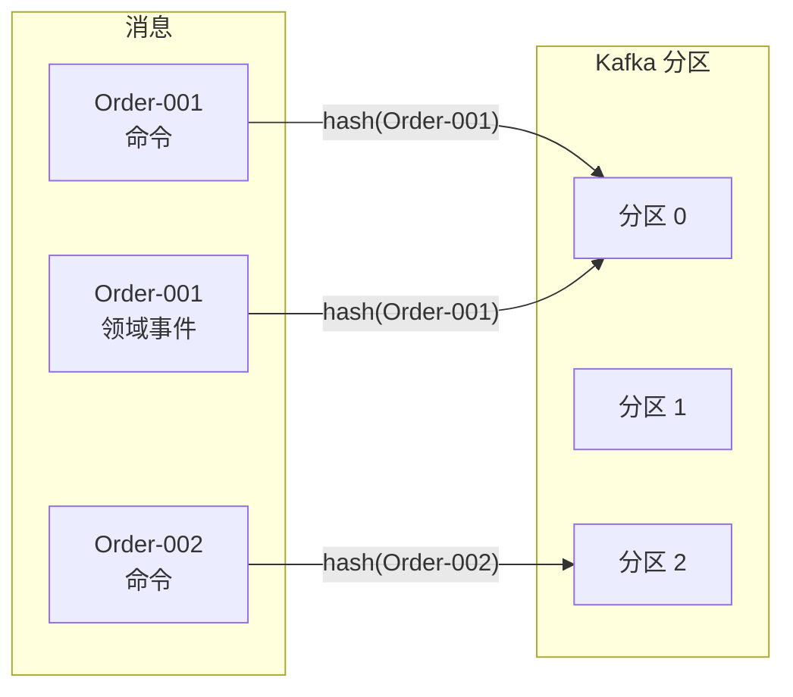
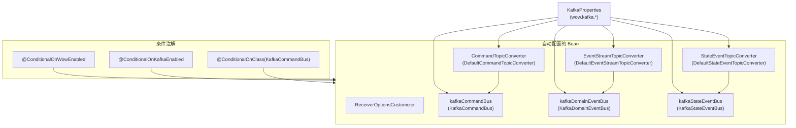

# Kafka

_Kafka_ 扩展提供对 Apache Kafka 的支持，实现了 `CommandBus`、`DomainEventBus` 和 `StateEventBus`。它是生产环境的 **默认和推荐的分布式消息总线** 实现。三种具体总线实现——`KafkaCommandBus`、`KafkaDomainEventBus` 和 `KafkaStateEventBus`——均构建在由 [reactor-kafka](https://projectreactor.io/docs/kafka/release/reference/) 驱动的共享响应式管道之上。

## 架构概述

### 高层流程


```mermaid
flowchart TB
    subgraph Producer["生产者"]
        CG[CommandGateway]
        EB[EventBus]
    end
    
    subgraph Kafka["Kafka 集群"]
        CT[命令主题]
        DET[领域事件主题]
        SET[状态事件主题]
    end
    
    subgraph Consumer["消费者"]
        CP[CommandProcessor]
        EP[EventProcessor]
        PP[ProjectionProcessor]
    end
    
    CG -->|发送命令| CT
    EB -->|发布领域事件| DET
    EB -->|发布状态事件| SET
    
    CT -->|消费命令| CP
    DET -->|消费领域事件| EP
    SET -->|消费状态事件| PP
```

### 类层级

所有三个 Kafka 总线实现都扩展了 `AbstractKafkaBus`，后者本身实现了 `DistributedMessageBus` 接口。每个总线专门处理一种消息类型，从专用的 Kafka 主题生产和消费。


```mermaid
classDiagram
    direction TB
    class MessageBus~M,E~ {
        <<interface>>
        +send(M) Mono~Void~
        +receive(MessageSubscription) Flux~E~
    }
    class DistributedMessageBus~M,E~ {
        <<interface>>
    }
    class AbstractKafkaBus~M,E~ {
        <<abstract>>
        -topicConverter: AggregateTopicConverter
        -senderOptions: SenderOptions
        -receiverOptions: ReceiverOptions
        -receiverOptionsCustomizer
        #sender: KafkaSender
        +send(M) Mono~Void~
        +receive(MessageSubscription) Flux~E~
        #encode(M) SenderRecord
        #decode(ReceiverRecord) M?
    }
    class KafkaCommandBus {
        +messageType: Class~CommandMessage~
        +toExchange(ReceiverOffset) ServerCommandExchange
    }
    class KafkaDomainEventBus {
        +messageType: Class~DomainEventStream~
        +toExchange(ReceiverOffset) EventStreamExchange
    }
    class KafkaStateEventBus {
        +messageType: Class~StateEvent~
        +toExchange(ReceiverOffset) StateEventExchange
    }
    class AggregateTopicConverter {
        <<interface>>
        +convert(NamedAggregate) String
    }
    class CommandTopicConverter {
        <<interface>>
    }
    class EventStreamTopicConverter {
        <<interface>>
    }
    class StateEventTopicConverter {
        <<interface>>
    }
    class DefaultCommandTopicConverter
    class DefaultEventStreamTopicConverter
    class DefaultStateEventTopicConverter

    MessageBus~M,E~ <|-- DistributedMessageBus~M,E~
    DistributedMessageBus~M,E~ <|-- AbstractKafkaBus~M,E~
    AbstractKafkaBus~M,E~ <|-- KafkaCommandBus
    AbstractKafkaBus~M,E~ <|-- KafkaDomainEventBus
    AbstractKafkaBus~M,E~ <|-- KafkaStateEventBus
    AggregateTopicConverter <|-- CommandTopicConverter
    AggregateTopicConverter <|-- EventStreamTopicConverter
    AggregateTopicConverter <|-- StateEventTopicConverter
    CommandTopicConverter <|-- DefaultCommandTopicConverter
    EventStreamTopicConverter <|-- DefaultEventStreamTopicConverter
    StateEventTopicConverter <|-- DefaultStateEventTopicConverter
    KafkaCommandBus --> CommandTopicConverter
    KafkaDomainEventBus --> EventStreamTopicConverter
    KafkaStateEventBus --> StateEventTopicConverter
```

`AbstractKafkaBus` 基类使用 `reactor-kafka` 集中了整个响应式发送/接收管道。它包装了一个 `KafkaSender` 用于生产消息，并为每个订阅配置一个 `KafkaReceiver` 用于消费消息。每个具体的子类只需要声明其 `messageType`（用于 JSON 反序列化）和一个 `toExchange` 工厂方法，该方法构造携带确认信息的交换对象。

### 三种总线，三种主题类型

| 总线 | 核心接口 | 消息类型 | 交换类型 | 主题后缀 | Source |
|---|---|---|---|---|---|
| `KafkaCommandBus` | `DistributedCommandBus` | `CommandMessage<*>` | `KafkaServerCommandExchange` | `.command` | [KafkaCommandBus.kt](https://github.com/Ahoo-Wang/Wow/blob/main/wow-kafka/src/main/kotlin/me/ahoo/wow/kafka/KafkaCommandBus.kt) |
| `KafkaDomainEventBus` | `DistributedDomainEventBus` | `DomainEventStream` | `KafkaEventStreamExchange` | `.event` | [KafkaDomainEventBus.kt](https://github.com/Ahoo-Wang/Wow/blob/main/wow-kafka/src/main/kotlin/me/ahoo/wow/kafka/KafkaDomainEventBus.kt) |
| `KafkaStateEventBus` | `DistributedStateEventBus` | `StateEvent<*>` | `KafkaStateEventExchange` | `.state` | [KafkaStateEventBus.kt](https://github.com/Ahoo-Wang/Wow/blob/main/wow-kafka/src/main/kotlin/me/ahoo/wow/kafka/KafkaStateEventBus.kt) |

## 端到端消息流

以下时序图追踪了命令通过 Kafka 总线的生命周期，从 `CommandGateway` 经过 Kafka 到接收端的 `CommandProcessor`。领域事件和状态事件遵循相同的模式，使用各自的主题转换器和交换类型。


```mermaid
sequenceDiagram
    autonumber
    participant CG as CommandGateway
    participant KCB as KafkaCommandBus
    participant KS as KafkaSender
    participant K as Kafka Broker
    participant KR as KafkaReceiver
    participant CP as CommandProcessor

    CG->>KCB: send(commandMessage)
    Note over KCB: message.withReadOnly()
    KCB->>KCB: encode(message)
    Note over KCB: ProducerRecord(topic, key=aggregateId, value=json)
    KCB->>KS: sender.send(senderRecord)
    KS->>K: 生产到 {prefix}.{context}.{aggregate}.command
    K-->>KS: 确认（分区, 偏移量）
    KS-->>KCB: SenderResult
    KCB-->>CG: Mono<Void> 完成

    Note over KR,K: 消费者端（独立的 JVM）
    K->>KR: 从订阅的主题轮询
    KR->>KCB: receive - decode(receiverRecord)
    Note over KCB: JSON 转 CommandMessage
    KCB->>KCB: message.toExchange(receiverOffset)
    KCB-->>CP: KafkaServerCommandExchange(message, offset)
    CP->>CP: 处理命令
    CP->>KR: exchange.acknowledge()
    Note over KR: 提交偏移量
```

流程中可见的关键行为特征：

1. **非阻塞响应式管道**：`send` 和 `receive` 都返回响应式类型（`Mono<Void>`、`Flux<E>`）——发送方永远不会阻塞。
2. **只读标记**：每条消息在序列化前都会在 [AbstractKafkaBus.kt:57](https://github.com/Ahoo-Wang/Wow/blob/main/wow-kafka/src/main/kotlin/me/ahoo/wow/kafka/AbstractKafkaBus.kt#L57) 处标记为只读，防止传输过程中的意外修改。
3. **分区键是聚合 ID**：记录键始终设置为 `message.aggregateId.id`，代码位于 [AbstractKafkaBus.kt:106](https://github.com/Ahoo-Wang/Wow/blob/main/wow-kafka/src/main/kotlin/me/ahoo/wow/kafka/AbstractKafkaBus.kt#L106)，保证每个聚合的有序处理。
4. **保留间隙的手动偏移量管理**：偏移量通过 `exchange.acknowledge()` 显式确认。延迟提交可防止后完成的记录越过仍在处理的早期记录提交偏移量。

## 安装

::: code-group
```kotlin [Gradle(Kotlin)]
implementation("me.ahoo.wow:wow-kafka")
```
```groovy [Gradle(Groovy)]
implementation 'me.ahoo.wow:wow-kafka'
```
```xml [Maven]
<dependency>
    <groupId>me.ahoo.wow</groupId>
    <artifactId>wow-kafka</artifactId>
    <version>${wow.version}</version>
</dependency>
```
:::

当使用 `wow-spring-boot-starter` 时，Kafka 集成作为可选的功能能力（`kafka-support`）包含在内。如果 starter 在没有完整依赖集的情况下使用，请显式添加它：

```kotlin
implementation("me.ahoo.wow:wow-spring-boot-starter")
implementation("me.ahoo.wow:wow-kafka")
```

## 配置

- 配置类： [KafkaProperties](https://github.com/Ahoo-Wang/Wow/blob/main/wow-spring-boot-starter/src/main/kotlin/me/ahoo/wow/spring/boot/starter/kafka/KafkaProperties.kt)
- 前缀： `wow.kafka.`

| 名称 | 数据类型 | 必填 | 默认值 | 描述 |
|---|---|---|---|---|
| `enabled` | `Boolean` | 否 | `true` | 是否启用 |
| `bootstrap-servers` | `List<String>` | **是** | -- | Kafka 服务器地址 |
| `topic-prefix` | `String` | 否 | `wow.` | 主题前缀 |
| `properties` | `Map<String, String>` | 否 | `{}` | 通用配置 |
| `producer` | `Map<String, String>` | 否 | `{}` | 生产者配置 |
| `consumer` | `Map<String, String>` | 否 | `{}` | 消费者配置 |
| `receiver.prefetch-batches` | `Int` | 否 | `1` | 响应式接收端预取的 Kafka 轮询批次数 |
| `receiver.max-deferred-commits` | `Int` | 否 | `1` | 为保留偏移量间隙而缓存的最大乱序提交数 |
| `receiver.retry-attempts` | `Long` | 否 | `3` | 每次连续接收失败的重试次数 |
| `receiver.retry-backoff` | `Duration` | 否 | `10s` | 接收端重试的最小退避时间 |
| `receiver.decode-failure-strategy` | `FAIL` / `ACKNOWLEDGE` | 否 | `FAIL` | 无效记录是终止接收端还是显式跳过 |

### 总线类型选择

每种总线（命令、领域事件、状态事件）可以通过 `*.bus.type` 属性独立选择其实现。Kafka 是所有三种总线的 **默认值**：

| 属性 | 默认值 |
|---|---|
| `wow.command.bus.type` | `kafka` |
| `wow.event.bus.type` | `kafka` |
| `wow.eventsourcing.state.bus.type` | `kafka` |

有效值为：`kafka`、`redis`、`in_memory`、`no_op`。

**YAML 配置示例**

```yaml
wow:
  command:
    bus:
      type: kafka
  event:
    bus:
      type: kafka
  eventsourcing:
    state:
      bus:
        type: kafka
  kafka:
    bootstrap-servers: localhost:9092
    topic-prefix: 'wow.'
    receiver:
      prefetch-batches: 1
      max-deferred-commits: 1
      retry-attempts: 3
      retry-backoff: 10s
      decode-failure-strategy: FAIL
```

### SenderOptions 和 ReceiverOptions

`KafkaProperties` 类提供两个构建器方法，将通用 `properties` 映射与特定类型的 `producer` 或 `consumer` 映射合并：

- `buildSenderOptions()`——合并 `properties` + `producer`，自动设置 `KEY_SERIALIZER_CLASS_CONFIG` 和 `VALUE_SERIALIZER_CLASS_CONFIG` 为 `StringSerializer`。
- `buildReceiverOptions()`——合并 `properties` + `consumer`，自动设置反序列化器为 `StringDeserializer`。

所有序列化都在应用层以 JSON 字符串执行（通过 [AbstractKafkaBus.kt:108](https://github.com/Ahoo-Wang/Wow/blob/main/wow-kafka/src/main/kotlin/me/ahoo/wow/kafka/AbstractKafkaBus.kt#L108) 中的 `message.toJsonString()`），因此 Kafka 客户端只需传输原始字符串。这避免了对任何特定领域的序列化格式的耦合。

### 接收端重试策略

当 `KafkaReceiver` 遇到错误时，在传播错误之前最多重试 **3 次，最小退避时间为 10 秒**。重试计数启用 `transientErrors(true)`，因此成功接收记录后，下一次连续失败会重新获得完整重试预算。

```kotlin
Retry.backoff(3, Duration.ofSeconds(10))
    .transientErrors(true)
```

可通过 `wow.kafka.receiver.retry-attempts` 和 `wow.kafka.receiver.retry-backoff` 调整该策略。

### 解码失败策略

接收端会验证 JSON 解码结果以及传输不变量：Kafka key 必须等于解码后的聚合 ID，记录 Topic 必须与解码后的聚合匹配。默认 `FAIL` 策略不会确认无效记录，并以不包含消息载荷的元数据诊断信息终止接收流。

仅在明确接受无效记录的数据丢失时，才设置 `wow.kafka.receiver.decode-failure-strategy: ACKNOWLEDGE`。失败处理器完成后才会确认记录。需要死信队列的应用可以提供自定义 `KafkaRecordDecodeFailureHandler`：正常完成表示允许确认，返回错误则保持记录未确认。

## 主题命名规则

主题从三个组成部分派生：可配置的 **前缀**、**命名聚合**（上下文 + 聚合名称）以及每种总线类型的 **固定后缀**。


```mermaid
graph LR
    Config[配置<br>wow.kafka.topic-prefix] --> Prefix["wow."]
    Named[NamedAggregate] --> Ident["order-service.order"]
    Prefix --> Topic
    Ident --> Topic
    Suffix[".command / .event / .state"] --> Topic
    Topic["wow.order-service.order.command"]
```

| 消息类型 | 主题命名格式 | 示例 |
|---|---|---|
| 命令 | `{prefix}{contextName}.{aggregateName}.command` | `wow.order-service.order.command` |
| 领域事件 | `{prefix}{contextName}.{aggregateName}.event` | `wow.order-service.order.event` |
| 状态事件 | `{prefix}{contextName}.{aggregateName}.state` | `wow.order-service.order.state` |

::: tip
`topic-prefix` 配置允许您为所有主题添加统一前缀，便于区分多个环境或项目。主题前缀默认值为 `"wow."`（在 [Wow.kt:37](https://github.com/Ahoo-Wang/Wow/blob/main/wow-api/src/main/kotlin/me/ahoo/wow/api/Wow.kt#L37) 中定义的 `Wow.WOW_PREFIX` 常量），但可以根据多租户或多环境部署进行自定义。
:::

## 分区策略

Kafka 扩展默认使用聚合根 ID 作为分区键，确保同一聚合根的所有消息发送到同一分区，保证消息排序。


```mermaid
flowchart LR
    subgraph Messages["消息"]
        C1["Order-001<br>命令"]
        C2["Order-002<br>命令"]
        E1["Order-001<br>领域事件"]
    end
    subgraph Partitions["Kafka 分区"]
        P0["分区 0"]
        P1["分区 1"]
        P2["分区 2"]
    end
    C1 -->|"hash(Order-001)"| P0
    C2 -->|"hash(Order-002)"| P2
    E1 -->|"hash(Order-001)"| P0
```

这种设计是事件溯源的基础：事件必须按照发布顺序消费才能正确重建聚合状态。Broker 级别的分区键强制执行使这在不同消费者再均衡之间具有弹性。

## 自动配置

当启用 Kafka 且 `wow-kafka` 模块在 classpath 上时，`KafkaAutoConfiguration` 类装配所有 Bean。

### Bean 装配


```mermaid
graph TB
    subgraph Conditions["条件注解"]
        C1["@ConditionalOnWowEnabled"]
        C2["@ConditionalOnKafkaEnabled"]
        C3["@ConditionalOnClass(KafkaCommandBus)"]
    end
    subgraph Beans["自动配置的 Bean"]
        B1["ReceiverOptionsCustomizer"]
        B2["CommandTopicConverter<br>(DefaultCommandTopicConverter)"]
        B3["kafkaCommandBus<br>(KafkaCommandBus)"]
        B4["EventStreamTopicConverter<br>(DefaultEventStreamTopicConverter)"]
        B5["kafkaDomainEventBus<br>(KafkaDomainEventBus)"]
        B6["StateEventTopicConverter<br>(DefaultStateEventTopicConverter)"]
        B7["kafkaStateEventBus<br>(KafkaStateEventBus)"]
    end
    Config["KafkaProperties<br>(wow.kafka.*)"] --> B2
    Config --> B3
    Config --> B4
    Config --> B5
    Config --> B6
    Config --> B7

    B2 --> B3
    B4 --> B5
    B6 --> B7

    C1 --> Beans
    C2 --> Beans
    C3 --> Beans
```

每个总线 Bean 都受到 `@ConditionalOnProperty` 的保护，检查对应的 `*.bus.type` 属性。这意味着您可以选择性地对特定消息类型禁用 Kafka：

```yaml
wow:
  command:
    bus:
      type: kafka       # 命令通过 Kafka（默认）
  event:
    bus:
      type: in_memory   # 仅本地领域事件
  eventsourcing:
    state:
      bus:
        type: kafka     # 状态事件通过 Kafka
```

### ConditionalOnKafkaEnabled

自定义的 `@ConditionalOnKafkaEnabled` 注解是一个专注的组合，用于启用/禁用整个 `KafkaAutoConfiguration` 类。它检查 `wow.kafka.enabled = true`（缺失时也匹配）。

### ReceiverOptionsCustomizer

`ReceiverOptionsCustomizer` 接口允许将自定义行为注入到 `KafkaReceiver` 创建管道中。每个具体总线接受一个可选的自定义器，自动配置注册 `NoOpReceiverOptionsCustomizer` 作为默认值。

## 生产者优化

```yaml
wow:
  kafka:
    producer:
      # 批量配置
      batch.size: 16384
      linger.ms: 5
      # 压缩配置
      compression.type: lz4
      # 可靠性配置
      acks: all
      retries: 3
      # 幂等性
      enable.idempotence: true
```

| 配置 | 描述 | 推荐值 |
|---|---|---|
| `batch.size` | 批量大小（字节） | 16384 |
| `linger.ms` | 等待时间（毫秒） | 5 |
| `compression.type` | 压缩类型 | lz4 |
| `acks` | 确认级别 | all |
| `enable.idempotence` | 幂等性 | true |

## 消费者优化

```yaml
wow:
  kafka:
    consumer:
      # 拉取配置
      fetch.min.bytes: 1024
      fetch.max.wait.ms: 500
      max.poll.records: 500
      # 自动提交配置
      enable.auto.commit: false
      # 会话超时
      session.timeout.ms: 30000
      heartbeat.interval.ms: 10000
```

| 配置 | 描述 | 推荐值 |
|---|---|---|
| `fetch.min.bytes` | 最小拉取字节数 | 1024 |
| `max.poll.records` | 最大轮询记录数 | 500 |
| `enable.auto.commit` | 自动提交 | false |
| `session.timeout.ms` | 会话超时 | 30000 |

## 消费者组

每个处理器对应一个独立的 Kafka 消费者组。消费者组 ID 格式为：

```
{contextName}.{processorName}
```

例如：`order-service.OrderProjectionProcessor`

这是在 [AbstractKafkaBus.kt:81-84](https://github.com/Ahoo-Wang/Wow/blob/main/wow-kafka/src/main/kotlin/me/ahoo/wow/kafka/AbstractKafkaBus.kt#L81-L84) 中设置的，其中 `ConsumerConfig.GROUP_ID_CONFIG` 属性根据当前处理上下文动态注入到 `ReceiverOptions` 中。这确保了每个处理器实例独立跟踪自己的偏移量，支持跨处理器类型的并行消费，同时维护每个消费者组内的有序性。

## 关键设计决策

### 1. Kafka 层的字符串序列化

Kafka 客户端始终使用 `StringSerializer`/`StringDeserializer`。领域对象在交给生产者之前由应用程序（`message.toJsonString()`）序列化为 JSON 字符串。这将 Kafka 传输格式与领域序列化格式解耦——您可以在不修改 Kafka 配置的情况下更改序列化策略。

### 2. 只读消息保护

在序列化前，每条消息通过 [AbstractKafkaBus.kt:57](https://github.com/Ahoo-Wang/Wow/blob/main/wow-kafka/src/main/kotlin/me/ahoo/wow/kafka/AbstractKafkaBus.kt#L57) 处的 `message.withReadOnly()` 标记为只读。这防止了传输期间对消息状态的意外修改，这是事件溯源的关键不变量，其中事件必须是不可变的。

### 3. 手动偏移量确认

框架禁用了自动提交。每个 `Exchange` 都包装一个 `ReceiverOffset` 并暴露 `acknowledge()` 方法。聚合分组乱序完成时，延迟提交会保留偏移量间隙，后续记录的确认不会越过仍在处理的早期记录。

核心处理器使用 `finallyAck`，因此业务处理错误在错误路径完成后也会被确认。是否重新投递取决于失败阶段：默认 `FAIL` 策略下的接收/解码失败保持未确认，而已进入 Exchange 处理流程的记录即使处理器报告错误也会被确认。

### 4. 用于发送反馈的相关元数据

发送时，每个 `SenderRecord` 携带一个 `Sinks.Empty<Void>` 作为相关元数据。发送结果要么是错误发出要么是空完成，为调用方提供具有背压感知的发送确认。

## 监控和可观察性

虽然 Kafka Broker 指标（消费者滞后、请求速率、ISR）应在基础设施层面监控，但 Wow 框架贡献了几个应用层信号：

| 信号 | 来源 | 揭示内容 |
|---|---|---|
| 发送错误 | [AbstractKafkaBus.kt](https://github.com/Ahoo-Wang/Wow/blob/main/wow-kafka/src/main/kotlin/me/ahoo/wow/kafka/AbstractKafkaBus.kt) 中的 `doOnNext` | Kafka Broker 不可用、主题创建问题 |
| 解码错误 | `KafkaRecordDecodeFailureHandler` | 模式/版本不匹配、损坏的消息、key/topic 不变量不匹配 |
| 接收端重试 | `KafkaReceiverPolicy.retrySpec` | 连续的 Broker/网络故障 |
| 关闭事件 | [AbstractKafkaBus.kt](https://github.com/Ahoo-Wang/Wow/blob/main/wow-kafka/src/main/kotlin/me/ahoo/wow/kafka/AbstractKafkaBus.kt) 中的 `close()` | 优雅关闭覆盖 |

## 故障排除

### 常见问题

#### 1. 连接超时

```
org.apache.kafka.common.errors.TimeoutException: Failed to update metadata
```

**解决方案**：
- 验证从应用程序主机可以访问 `wow.kafka.bootstrap-servers` 地址。
- 检查应用程序与 Kafka Broker 之间的网络连接和防火墙规则。
- 确认 Kafka Broker 进程正在运行并在配置的端口上监听。

#### 2. 未知主题或分区

```
org.apache.kafka.common.errors.UnknownTopicOrPartitionException
```

**解决方案**：
- 确保 Kafka Broker 具有 `auto.create.topics.enable=true`（默认值），或手动预先创建所需的主题。
- 验证 `topic-prefix` 配置与预期的主题名称匹配。

#### 3. 频繁的消费者再均衡

**症状**：消费者组经历重复的再均衡，导致处理暂停。

**解决方案**：
- 在消费者配置中增加 `session.timeout.ms` 和 `heartbeat.interval.ms`。
- 减少 `max.poll.records` 以缩短轮询之间的时间。
- 确保消息处理时间始终低于 `max.poll.interval.ms`（默认 5 分钟）。

#### 4. 消息解码失败

**症状**：来自 `decode()` 的错误日志显示 `Failed to decode ReceiverRecord`

**解决方案**：
- 验证所有生产者和消费者运行相同版本的 `wow-kafka` 和领域模型类。
- 检查领域事件或命令类是否以向后不兼容的方式被修改。
- 在生产部署中使用模式演进策略。

### 监控指标

以下 Kafka 指标应进行监控：

| 指标 | 描述 | 告警阈值 |
|---|---|---|
| 消费者滞后 | 消费延迟 | > 10000 |
| 请求速率 | 请求速率 | 基于业务 |
| 错误率 | 错误率 | > 1% |
| 副本 ISR | 同步副本数 | < 副本因子 |

## 完整配置示例

```yaml
wow:
  command:
    bus:
      type: kafka
      local-first:
        enabled: true
  event:
    bus:
      type: kafka
      local-first:
        enabled: true
  eventsourcing:
    state:
      bus:
        type: kafka
        local-first:
          enabled: true
  kafka:
    enabled: true
    bootstrap-servers:
      - kafka-0:9092
      - kafka-1:9092
      - kafka-2:9092
    topic-prefix: 'wow.'
    receiver:
      prefetch-batches: 1
      max-deferred-commits: 1
      retry-attempts: 3
      retry-backoff: 10s
      decode-failure-strategy: FAIL
    properties:
      security.protocol: SASL_SSL
      sasl.mechanism: PLAIN
    producer:
      acks: all
      retries: 3
      batch.size: 16384
      linger.ms: 5
      compression.type: lz4
      enable.idempotence: true
    consumer:
      fetch.min.bytes: 1024
      fetch.max.wait.ms: 500
      max.poll.records: 500
      enable.auto.commit: false
      session.timeout.ms: 30000
      heartbeat.interval.ms: 10000
```

## 最佳实践

1. **启用 LocalFirst 模式**：`local-first` 总线配置（默认启用）当处理器位于同一位置时在同一 JVM 内本地路由消息，减少服务内通信的 Kafka 往返。
2. **启用幂等生产者**：在生产者配置中设置 `enable.idempotence: true`，以保证生产者级别的精确一次投递，防止重试场景中的重复消息。
3. **使用压缩**：在生产者配置中启用 `compression.type: lz4`，减少网络带宽和存储开销。LZ4 在压缩比和 CPU 成本之间提供了出色的平衡。
4. **将分区数与拓扑匹配**：根据预期的消费者并行度配置 Kafka 分区数。由于排序是按分区的（按聚合 ID），更高的分区数会增加并行度但不会影响排序保证。
5. **监控消费者滞后**：将消费者组滞后作为主要健康指标进行追踪。超过业务 SLA 阈值的滞后表明存在需要调查的处理瓶颈。
6. **使用 Testcontainers 进行测试**：`wow-kafka` 测试依赖项包括 `testcontainers-kafka`。使用 `wow-tck`（技术兼容性套件）测试作为集成测试模式的参考。
7. **按环境自定义主题前缀**：为开发、预发布和生产环境使用不同的 `topic-prefix` 值，以隔离消息流（例如 `dev.wow.`、`staging.wow.`、`wow.`）。

## 相关主题

| 主题 | 描述 |
|---|---|
| [配置参考](../../reference/config/infrastructure.md#kafka) | `wow.kafka.*` 的完整属性参考 |
| [Spring Boot Starter](spring-boot-starter.md) | 自动配置和功能变体 |
| [命令网关](../command-gateway.md) | 命令网关和等待计划 |
| [事件处理器](../event-processor.md) | 事件处理管道 |
| [可观察性](../advanced/observability.md) | 监控和追踪集成 |
| [配置](../configuration.md) | 框架配置原则 |
