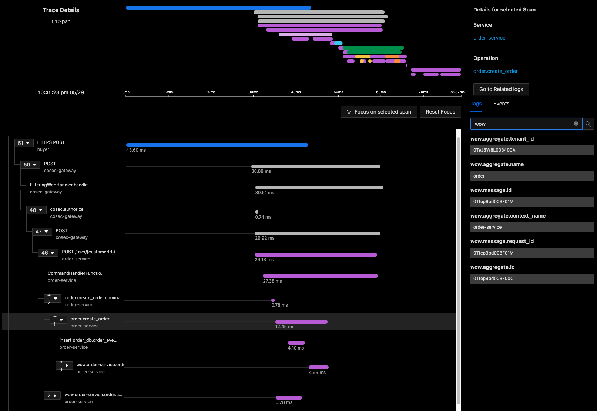

# OpenTelemetry

OpenTelemetry 是一个厂商中立的开源项目，旨在为跟踪和监控分布式应用程序提供标准 API、工具和库。
由 Cloud Native Computing Foundation（CNCF）和 OpenTelemetry 社区支持。

其主要目标是为开发人员提供一致的跟踪解决方案，帮助他们收集、生成和导出分布式系统的跟踪数据，以更好地理解应用程序的性能、行为和异常。
OpenTelemetry 支持多种编程语言和框架，如 Java、Python、Go、Node.js，使得开发人员可以轻松集成跟踪功能。

OpenTelemetry 项目提供以下核心功能：
- 分布式追踪：捕获请求在不同服务和组件之间的传递，形成调用链，以追踪整个分布式请求的路径和执行时间。
- 指标收集：收集和导出性能指标，如请求速率、响应时间、错误率等，助力开发人员监控和优化性能。
- 日志记录：收集应用程序的日志数据，与跟踪和指标数据相关联，提供深入了解应用程序行为和问题的视角。

Wow 的 `wow-opentelemetry` 模块刻意只负责**分布式链路追踪**：它为框架核心操作提供
instrumenter；Wow 指标仍是 Micrometer meter，由 Micrometer Registry 负责导出。该模块本身
不会初始化 OpenTelemetry SDK 或 exporter。

- `AggregateInstrumenter`: 聚合根仪表器，用于记录聚合根的操作。
- `EventProcessorInstrumenter`: 事件处理器仪表器，用于记录事件处理器的操作。
- `EventStoreInstrumenter`: 事件存储仪表器，用于记录事件存储的操作。
- `CommandProducerInstrumenter`: 命令生产者仪表器，用于记录命令生产者的操作。
- `EventProducerInstrumenter`: 事件生产者仪表器，用于记录事件生产者的操作。
- `StateEventProducerInstrumenter`: 状态事件生产者仪表器，用于记录状态事件生产者的操作。
- `ProjectionInstrumenter`: 投影仪表器，用于记录投影的操作。
- `StatelessSagaInstrumenter`: 无状态Saga仪表器，用于记录无状态Saga的操作。
- `SnapshotInstrumenter`: 快照仪表器，用于记录快照的操作。
- `SnapshotStoreInstrumenter`: 快照存储仪表器，用于记录快照存储的操作。
- `WaitPlanInstrumenter`: 命令等待计划仪表器，用于记录命令等待/通知的操作。

支持以下属性标签：

- `wow.aggregate.context_name`: 聚合根的上下文名称。
- `wow.aggregate.tenant_id`: 聚合根的租户ID。
- `wow.aggregate.name`: 聚合根的名称。
- `wow.aggregate.id`: 聚合根的ID。
- `wow.message.id`: 消息ID
- `wow.message.request_id`: 命令消息的请求ID。
- `wow.message.trace_id`: 通过消息头传播的 Trace ID。



## 安装

Gradle 构建的 Spring Boot 应用推荐请求 starter 的 `opentelemetry-support` capability。这是单一的
依赖入口：它会引入 `wow-opentelemetry`，并启用对应的 Wow 自动配置。

::: code-group
```kotlin [Gradle(Kotlin)]
implementation("me.ahoo.wow:wow-spring-boot-starter") {
    capabilities {
        requireCapability("me.ahoo.wow:opentelemetry-support")
    }
}
```
```groovy [Gradle(Groovy)]
implementation('me.ahoo.wow:wow-spring-boot-starter') {
    capabilities {
        requireCapability('me.ahoo.wow:opentelemetry-support')
    }
}
```
```xml [Maven]
<!-- Maven 不解析 Gradle feature capability。应用保留 wow-spring-boot-starter，
     并显式加入链路追踪模块。 -->
<dependency>
    <groupId>me.ahoo.wow</groupId>
    <artifactId>wow-opentelemetry</artifactId>
    <version>${wow.version}</version>
</dependency>
```
:::

不使用 Spring Boot 自动配置时，可以直接依赖 `wow-opentelemetry`，并自行注册 tracing filters
和 decorators。

## OTLP 快速接入

推荐使用 OpenTelemetry Java Agent 作为运行时。它会在 Wow 创建 tracing instrumenters 前初始化
`GlobalOpenTelemetry`：

```bash
export JAVA_TOOL_OPTIONS="-javaagent:/opt/otel/opentelemetry-javaagent.jar"
export OTEL_SERVICE_NAME=order-service
export OTEL_EXPORTER_OTLP_ENDPOINT=http://otel-collector:4318
java -jar your-app.jar
```

统一端点使用 OTLP/HTTP，Agent 自动追加 `/v1/traces`。如果应用同时引入 Spring Boot Actuator、
`spring-boot-opentelemetry` 和 `micrometer-registry-otlp`，Micrometer 会复用相同的服务名与端点，
并自动追加 `/v1/metrics`；不需要配置 Wow 专用 exporter。

存在 `micrometer-registry-otlp` 时，不要再开启 Java Agent 的 Micrometer bridge，否则两条路径会
重复导出应用指标。依赖、鉴权、验证方法和 signal-specific endpoint 覆盖方式参见
[可观测性配置](/zh/reference/config/observability)。

## 配置

当 starter 自动配置生效且 `wow-opentelemetry` 位于 classpath 时，Wow 默认开启链路追踪。无需
移除依赖即可关闭：

```yaml
wow:
  opentelemetry:
    enabled: false
```

如果不使用 Agent 而是自行创建 SDK，请在 Wow 应用上下文创建 tracing filters 和 decorators 前
初始化 `GlobalOpenTelemetry`；若在 Wow tracing instrumenters 初始化后才注册 SDK，则时机过晚。

## 链路追踪如何装配

`WowOpenTelemetryAutoConfiguration` 注册了五个 `ExchangeFilter` Bean（均为 `@ConditionalOnMissingBean`，可逐一覆盖），
以及一个 `TracingBeanPostProcessor`，用于装饰命令/事件/状态事件总线、事件存储和快照存储：

| Bean | 过滤阶段 | Span 名称模式 |
|---|---|---|
| `TraceAggregateFilter` | 聚合命令处理 | `{aggregateName}.{commandName}` |
| `TraceProjectionFilter` | 投影事件处理 | `{processorName}.{functionName}({eventType})`（通过 `EventProcessorSpanNameExtractor`） |
| `TraceStatelessSagaFilter` | Saga 事件处理 | `{processorName}.{functionName}({eventType})`（同一提取器） |
| `TraceSnapshotFilter` | 快照创建 | `{aggregateName}.snapshot` |
| `TraceEventProcessorFilter` | 通用事件处理器 | `{processorName}.{functionName}({eventType})`（同一提取器） |

每个 span 都携带上文列出的 `wow.aggregate.*` 与 `wow.message.*` 属性，以及 OpenTelemetry 传播上下文，
因此一条命令的完整路径（命令总线 → 聚合 → 事件存储 → 投影 → Saga）会呈现为一条分布式链路。

## 链路追踪示例

对于 `order` 聚合上的 `CreateOrder` 命令（触发一个 Saga 和一个投影），链路层级如下：

```text
order.create_order                         (TraceAggregateFilter —— 聚合命令)
├── order.OrderCreated.event.append        (TracingEventStore —— 事件持久化)
├── order.OrderCreated.event send          (TracingEventBus —— 消息发布)
│   ├── OrderSaga.onEvent(OrderCreated)         (TraceStatelessSagaFilter —— Saga 处理器)
│   └── OrderProjection.onEvent(OrderCreated)  (TraceProjectionFilter —— 投影处理器)
└── order.snapshot                         (TraceSnapshotFilter —— 快照创建)
```

投影、Saga 和事件处理器的 span 名称使用函数的 `qualifiedName` 格式（`{processorName}.{functionName}({eventType})`）。生产者仪表器把上下文注入消息，因此消费者 span 是生产者 span 的子节点，而不是同级节点；同一命令的 span 通过上下文传播共享 trace ID。
