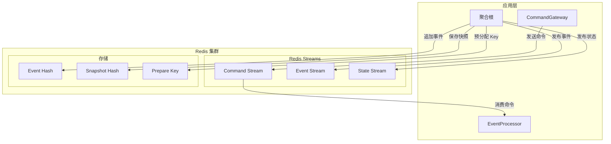

# Redis

_Redis_ 扩展提供了对 Redis 的支持，适用于需要高性能和低延迟的场景。它实现了以下接口：

- `CommandBus` - 命令总线
- `DomainEventBus` - 领域事件总线
- `StateEventBus` - 状态事件总线
- `EventStore` - 事件存储
- `SnapshotRepository` - 快照仓储
- `PrepareKey` - 预分配 Key

## 架构概述



## 安装

::: code-group
```kotlin [Gradle(Kotlin)]
implementation("me.ahoo.wow:wow-redis")
implementation("org.springframework.boot:spring-boot-starter-data-redis-reactive")
```
```groovy [Gradle(Groovy)]
implementation 'me.ahoo.wow:wow-redis'
implementation 'org.springframework.boot:spring-boot-starter-data-redis-reactive'
```
```xml [Maven]
<dependency>
    <groupId>me.ahoo.wow</groupId>
    <artifactId>wow-redis</artifactId>
    <version>${wow.version}</version>
</dependency>
<dependency>
    <groupId>org.springframework.boot</groupId>
    <artifactId>spring-boot-starter-data-redis-reactive</artifactId>
</dependency>
```
:::

## 配置

- 配置类：[RedisProperties](https://github.com/Ahoo-Wang/Wow/blob/main/wow-spring-boot-starter/src/main/kotlin/me/ahoo/wow/spring/boot/starter/redis/RedisProperties.kt)
- 前缀：`wow.redis.`

| 名称                  | 数据类型                  | 说明          | 默认值    |
|---------------------|-----------------------|-------------|--------|
| `enabled`           | `Boolean`             | 是否启用        | `true` |

**YAML 配置样例**

```yaml
spring:
  data:
    redis:
      host: localhost
      port: 6379
      password: your-password

wow:
  command:
    bus:
      type: redis
  event:
    bus:
      type: redis
  eventsourcing:
    store:
      storage: redis
    snapshot:
      storage: redis
    state:
      bus:
        type: redis
  redis:
    enabled: true
```

## 命令总线

Redis 命令总线使用 Redis Streams 实现消息传递：

### Stream 命名规则

```
{prefix}{contextName}.{aggregateName}.command
```

示例：`wow.order-service.order.command`

### 消费者组

每个处理器对应一个消费者组：

```
{contextName}.{processorName}
```

## 事件总线

### 领域事件 Stream

```
{prefix}{contextName}.{aggregateName}.event
```

### 状态事件 Stream

```
{prefix}{contextName}.{aggregateName}.state
```

## 事件存储

Redis 事件存储使用 Hash 结构存储事件流：

### 数据结构

```
Key: {prefix}{contextName}.{aggregateName}:{aggregateId}:es
Field: {version}
Value: {eventStreamJson}
```

### 请求幂等性

使用单独的 Key 存储请求 ID 实现幂等性：

```
Key: {prefix}{contextName}.{aggregateName}:{aggregateId}:req:{requestId}
TTL: 配置的过期时间
```

## 快照存储

快照使用 Hash 结构存储：

```
Key: {prefix}{contextName}.{aggregateName}:{aggregateId}:snapshot
Value: {snapshotJson}
```

## 预分配 Key

PrepareKey 使用 String 结构：

```
Key: {prefix}prepare:{keyName}:{key}
Value: {preparedValue}
TTL: 根据配置或永久
```

## 连接池配置

```yaml
spring:
  data:
    redis:
      lettuce:
        pool:
          min-idle: 8
          max-idle: 16
          max-active: 32
          max-wait: 1000ms
```

| 参数 | 说明 | 推荐值 |
|------|------|--------|
| `min-idle` | 最小空闲连接 | 8 |
| `max-idle` | 最大空闲连接 | 16 |
| `max-active` | 最大活动连接 | 32 |
| `max-wait` | 最大等待时间 | 1000ms |

## 集群配置

```yaml
spring:
  data:
    redis:
      cluster:
        nodes:
          - redis-node-1:6379
          - redis-node-2:6379
          - redis-node-3:6379
        max-redirects: 3
      lettuce:
        cluster:
          refresh:
            adaptive: true
            period: 30s
```

## 哨兵配置

```yaml
spring:
  data:
    redis:
      sentinel:
        master: mymaster
        nodes:
          - sentinel-1:26379
          - sentinel-2:26379
          - sentinel-3:26379
```

## 性能优化

### Pipeline 批量操作

Redis 扩展自动使用 Pipeline 优化批量操作，减少网络往返次数。

### 内存优化

1. **合理设置 TTL**：为临时数据设置过期时间
2. **压缩存储**：启用数据压缩减少内存占用
3. **监控内存**：定期检查内存使用情况

### 建议配置

```yaml
# Redis 服务端配置建议
maxmemory 4gb
maxmemory-policy allkeys-lru
tcp-keepalive 300
timeout 0
```

## 故障排查

### 常见问题

#### 1. 连接超时

```
org.springframework.data.redis.RedisConnectionFailureException
```

**解决方案**：
- 检查 Redis 服务状态
- 验证网络连通性
- 调整连接超时配置

#### 2. 内存不足

```
OOM command not allowed when used memory > 'maxmemory'
```

**解决方案**：
- 增加 Redis 内存限制
- 配置合理的过期策略
- 清理不必要的数据

#### 3. Stream 消费延迟

**解决方案**：
- 增加消费者数量
- 优化消息处理逻辑
- 检查 Redis 服务性能

## 监控指标

建议监控以下 Redis 指标：

| 指标 | 说明 | 告警阈值 |
|------|------|---------|
| `used_memory` | 内存使用 | > 80% maxmemory |
| `connected_clients` | 连接数 | > 1000 |
| `blocked_clients` | 阻塞客户端数 | > 10 |
| `keyspace_hits/misses` | 缓存命中率 | < 90% |

## 完整配置示例

```yaml
spring:
  data:
    redis:
      host: localhost
      port: 6379
      password: your-password
      database: 0
      lettuce:
        pool:
          min-idle: 8
          max-idle: 16
          max-active: 32
          max-wait: 1000ms
        shutdown-timeout: 100ms

wow:
  command:
    bus:
      type: redis
      local-first:
        enabled: true
  event:
    bus:
      type: redis
      local-first:
        enabled: true
  eventsourcing:
    store:
      storage: redis
    snapshot:
      enabled: true
      strategy: all
      storage: redis
    state:
      bus:
        type: redis
        local-first:
          enabled: true
  redis:
    enabled: true
```

## 最佳实践

1. **启用 LocalFirst 模式**：本地消息优先处理，减少网络延迟
2. **使用集群模式**：生产环境使用 Redis 集群保证高可用和扩展性
3. **合理配置连接池**：根据并发量配置适当的连接池大小
4. **监控内存使用**：定期监控 Redis 内存使用，避免 OOM
5. **启用持久化**：配置 RDB 或 AOF 持久化防止数据丢失