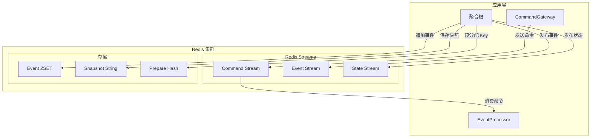

# Redis

_Redis_ 扩展提供了对 Redis 的支持，适用于需要高性能和低延迟的场景。它实现了以下接口：

- `CommandBus` - 命令总线
- `DomainEventBus` - 领域事件总线
- `StateEventBus` - 状态事件总线
- `EventStore` - 事件存储
- `SnapshotStore` - 快照存储
- `PrepareKey` - 预分配 Key

## 架构概述


```mermaid
flowchart TB
    subgraph Application["应用层"]
        CG[CommandGateway]
        EP[EventProcessor]
        AR[聚合根]
    end
    
    subgraph Redis["Redis 集群"]
        subgraph Streams["Redis Streams"]
            CS["Command Stream"]
            ES["Event Stream"]
            SS["State Stream"]
        end
        subgraph Storage["存储"]
            EH["Event ZSET"]
            SH["Snapshot String"]
            PK["Prepare Hash"]
        end
    end
    
    CG -->|发送命令| CS
    AR -->|发布事件| ES
    AR -->|发布状态| SS
    AR -->|追加事件| EH
    AR -->|保存快照| SH
    AR -->|预分配 Key| PK
    CS -->|消费命令| EP

```

## 安装

::: code-group
```kotlin [Gradle(Kotlin)]
implementation("me.ahoo.wow:wow-redis")
implementation("org.springframework.boot:spring-boot-starter-data-redis-reactive")
```
```groovy [Gradle(Groovy)]
implementation 'me.ahoo.wow:wow-redis'
implementation 'org.springframework.boot:spring-boot-starter-data-redis-reactive'
```
```xml [Maven]
<dependency>
    <groupId>me.ahoo.wow</groupId>
    <artifactId>wow-redis</artifactId>
    <version>${wow.version}</version>
</dependency>
<dependency>
    <groupId>org.springframework.boot</groupId>
    <artifactId>spring-boot-starter-data-redis-reactive</artifactId>
</dependency>
```
:::

## 配置

- 配置类：[RedisProperties](https://github.com/Ahoo-Wang/Wow/blob/main/wow-spring-boot-starter/src/main/kotlin/me/ahoo/wow/spring/boot/starter/redis/RedisProperties.kt)
- 前缀：`wow.redis.`

| 名称                  | 数据类型                  | 说明          | 默认值    |
|---------------------|-----------------------|-------------|--------|
| `enabled`           | `Boolean`             | 是否启用        | `true` |
| `message-bus.recovery.enabled` | `Boolean` | 是否恢复被遗留的 pending 消息 | `true` |
| `message-bus.recovery.min-idle-time` | `Duration` | 触发恢复前的最小空闲时间 | `5m` |
| `message-bus.recovery.interval` | `Duration` | pending 消息扫描间隔 | `30s` |
| `message-bus.recovery.batch-size` | `Long` | 每页 `XPENDING` 最大记录数 | `100` |

**YAML 配置样例**

```yaml
spring:
  data:
    redis:
      host: localhost
      port: 6379
      password: your-password

wow:
  command:
    bus:
      type: redis
  event:
    bus:
      type: redis
  eventsourcing:
    store:
      storage: redis
    snapshot:
      storage: redis
    state:
      bus:
        type: redis
  prepare:
    storage: redis
  redis:
    enabled: true
    message-bus:
      recovery:
        enabled: true
        min-idle-time: 5m
        interval: 30s
        batch-size: 100
```

## 命令总线

Redis 命令总线使用 Redis Streams 实现消息传递：

### Stream 命名规则

```
{contextAlias}.{aggregateName}:command
```

示例：`order-service.order:command`

### 消费者组

每个处理器对应一个消费者组：

```
{contextName}.{processorName}
```

### Pending 消息恢复

Redis 消息总线会在 `min-idle-time` 后恢复旧 consumer 遗留在 Pending Entries List（PEL）中的记录。
恢复流程使用 consumer lease、有界 `XPENDING` 扫描和原子 `XCLAIM`。恢复链路失败不会终止实时消费，
而会在下一轮扫描时重试。

消息语义仍为 at-least-once，因此 handler 必须幂等；`min-idle-time` 必须覆盖最长 handler 执行、
重试和优雅停机时间。恢复默认开启。仅应在临时回滚时设置
`wow.redis.message-bus.recovery.enabled=false`；关闭后会恢复旧行为，使被遗留的 PEL 记录可能永久滞留。

Pending 恢复与实时消费并发运行。Redis Streams 不保证较旧的恢复消息一定先于较新的实时消息交付，
因此 handler 除了处理重复投递，还必须容忍恢复期间的乱序。

缺少 `msg` 字段或 JSON 非法的记录不会再终止 consumer。此类记录保留在 PEL 中供人工诊断，同时输出
不含 payload 的错误日志和 `RedisMessageBusObservation.RecordDecodeFailed` 观测事件。应用可注册非阻塞的
`RedisMessageBusObserver` Bean 接入指标或告警。

## 事件总线

### 领域事件 Stream

```
{contextAlias}.{aggregateName}:event
```

### 状态事件 Stream

```
{contextAlias}.{aggregateName}:state
```

## 事件存储

Redis EventStore 只使用 canonical v2 Key 布局。用户可控的组成部分使用无填充 Base64URL 编码；聚合 ID
扫描索引使用小写、定宽 UTF-16 十六进制编码，使 Redis 字典序与 `String` 顺序一致。分桶的 Redis
Cluster hash tag 会将单条事件流、请求 ID 索引和聚合 ID 索引放在同一个 slot 中，因此追加与唯一性检查
可以在一个 Lua 脚本中原子完成。

### 数据结构

```
resolvedContextAlias = 已配置的 context alias；未配置时为 contextName
scope = Base64URL(UTF-8(resolvedContextAlias)) + "." + Base64URL(UTF-8(aggregateName))
identity = Base64URL(UTF-8(aggregateId.id)) + "." + Base64URL(UTF-8(tenantId))
bucket = aggregateId.id.hashCode().mod(128) // Java/Kotlin UTF-16 String.hashCode

事件流 ZSET Key: {v2:es:<scope>:<bucket>}:<identity>
Score: {version}
Member: {eventStreamJson}

请求 ID SET Key: {v2:es:<scope>:<bucket>}:<identity>:req_idx
Member: {requestId}

聚合 ID ZSET Key: {v2:es:<scope>:<bucket>}:ids
Score: 0
Member: {aggregateIdUtf16Hex}.{Base64URL(tenantId)}
```

### 请求幂等性

请求 ID 存储在上面的同分桶 SET Key 中。

### 聚合 ID 扫描

`EventStore.scanAggregateId` 会扫描分桶的聚合 ID 索引，并按字典序合并结果。对于同一个 named
aggregate，`AggregateId.id` 不受 `tenantId` 影响，必须保持唯一；若尝试在另一个租户创建相同 ID，追加
Lua 脚本会在写入事件或 request ID 前以 `DuplicateAggregateIdException` 原子拒绝。

## 快照存储

快照使用 String value 存储：

```
Key: v2:snapshot:{<scope>.<identity>}
Value: {snapshotJson}
```

### 升级边界

运行时只读写 canonical v2，不会双读、双写或迁移已发布的不兼容布局。Spring Boot starter 启动时会
针对解析到自动配置 `RedisEventStore` 的本地聚合，精确检查 v8.6 的共享 request index Key 和 v8.8
的分桶 aggregate ID index Key。发现匹配项时会报告聚合与 Redis Key 并阻止启动。Redis 不可用时检查
同样失败关闭，且不能禁用。直接使用库、独立构造的自定义 store、已退役聚合以及仅使用 Redis snapshot
的场景必须离线审计。

禁止新旧版本混合滚动发布。离线切换步骤与回滚边界见[迁移指南](../migration.md#redis-eventstore-canonical-v2-布局)。

## 预分配 Key

PrepareKey 使用 Hash 结构：

```
Key: v2:prepare:{Base64URL(UTF-8(name)).Base64URL(UTF-8(key))}
Field: value = {preparedValueJson}
Field: ttlAt = {expirationTimestamp}
```

## 连接池配置

连接池需要应用 classpath 中存在 Apache Commons Pool 2。`redis-support` capability 不会引入这个
可选依赖；缺少它时，下面的连接池参数不会生效。

```yaml
spring:
  data:
    redis:
      lettuce:
        pool:
          min-idle: 8
          max-idle: 16
          max-active: 32
          max-wait: 1000ms
```

| 参数 | 说明 | 推荐值 |
|------|------|--------|
| `min-idle` | 最小空闲连接 | 8 |
| `max-idle` | 最大空闲连接 | 16 |
| `max-active` | 最大活动连接 | 32 |
| `max-wait` | 最大等待时间 | 1000ms |

## 集群配置

```yaml
spring:
  data:
    redis:
      cluster:
        nodes:
          - redis-node-1:6379
          - redis-node-2:6379
          - redis-node-3:6379
        max-redirects: 3
      lettuce:
        cluster:
          refresh:
            adaptive: true
            period: 30s
```

## 哨兵配置

```yaml
spring:
  data:
    redis:
      sentinel:
        master: mymaster
        nodes:
          - sentinel-1:26379
          - sentinel-2:26379
          - sentinel-3:26379
```

## 性能优化

### 批量操作

EventStore 使用 Lua 脚本保证追加操作的原子性。Snapshot 与 MessageBus 操作逐条发送，扩展不会自动
对任意批处理启用 Pipeline。

### 内存优化

1. **隔离权威数据与缓存数据**：不要对 EventStore Key 使用缓存淘汰策略
2. **规划 Stream 容量**：ACK 只会从 PEL 移除记录，不会删除 Stream 记录；Wow 当前不会自动 trim Stream
3. **监控内存与持久化**：根据持久性要求配置持久化、复制和告警

### 建议配置

```yaml
# Redis 服务端配置建议
maxmemory 4gb
maxmemory-policy noeviction
tcp-keepalive 300
timeout 0
```

Redis 作为权威 EventStore 时不得使用 `allkeys-lru`；它可能独立淘汰事件流、幂等索引、聚合索引或快照。

## 故障排查

### 常见问题

#### 1. 连接超时

```
org.springframework.data.redis.RedisConnectionFailureException
```

**解决方案**：
- 检查 Redis 服务状态
- 验证网络连通性
- 调整连接超时配置

#### 2. 内存不足

```
OOM command not allowed when used memory > 'maxmemory'
```

**解决方案**：
- 增加 Redis 内存限制
- 配置合理的过期策略
- 清理不必要的数据

#### 3. Stream 消费延迟

**解决方案**：
- 增加消费者数量
- 优化消息处理逻辑
- 检查 Redis 服务性能

## 监控指标

建议监控以下 Redis 指标：

| 指标 | 说明 | 告警阈值 |
|------|------|---------|
| `used_memory` | 内存使用 | > 80% maxmemory |
| `connected_clients` | 连接数 | > 1000 |
| `blocked_clients` | 阻塞客户端数 | > 10 |
| `keyspace_hits/misses` | 缓存命中率 | < 90% |

## 完整配置示例

```yaml
spring:
  data:
    redis:
      host: localhost
      port: 6379
      password: your-password
      database: 0
      lettuce:
        pool:
          min-idle: 8
          max-idle: 16
          max-active: 32
          max-wait: 1000ms
        shutdown-timeout: 100ms

wow:
  command:
    bus:
      type: redis
      local-first:
        enabled: true
  event:
    bus:
      type: redis
      local-first:
        enabled: true
  eventsourcing:
    store:
      storage: redis
    snapshot:
      enabled: true
      strategy: all
      storage: redis
    state:
      bus:
        type: redis
        local-first:
          enabled: true
  prepare:
    storage: redis
  redis:
    enabled: true
```

## 最佳实践

1. **启用 LocalFirst 模式**：本地消息优先处理，减少网络延迟
2. **使用集群模式**：生产环境使用 Redis 集群保证高可用和扩展性
3. **合理配置连接池**：引入 Commons Pool 2，并根据实测并发量配置连接池大小
4. **监控内存使用**：定期监控 Redis 内存使用，避免 OOM
5. **启用持久化**：配置 RDB 或 AOF 持久化防止数据丢失
