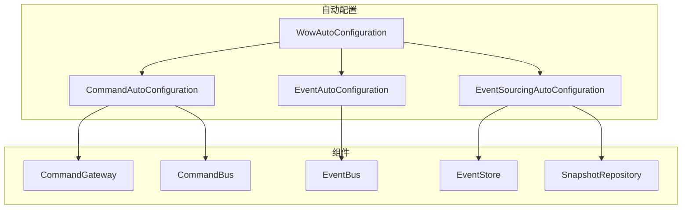

# Spring-Boot-Starter

_Spring-Boot-Starter_ 模块集成了所有 _Wow_ 扩展，提供了自动装配的能力，使 _Wow_ 框架在 _Spring Boot_ 项目中更加便捷地使用。

::: tip
该模块的公共配置文档请参考 [配置](../../reference/config/basic)。
:::

## 安装

::: code-group
```kotlin [Gradle(Kotlin)]
implementation("me.ahoo.wow:wow-spring-boot-starter")
```
```groovy [Gradle(Groovy)]
implementation 'me.ahoo.wow:wow-spring-boot-starter'
```
```xml [Maven]
<dependency>
    <groupId>me.ahoo.wow</groupId>
    <artifactId>wow-spring-boot-starter</artifactId>
    <version>${wow.version}</version>
</dependency>
```
:::

## 自动配置原理

Spring Boot Starter 使用 Spring Boot 的自动配置机制，根据类路径和配置属性自动装配 Wow 框架组件。



## 自动配置类

| 配置类 | 说明 | 条件 |
|-------|------|------|
| `WowAutoConfiguration` | 核心自动配置 | 始终启用 |
| `CommandAutoConfiguration` | 命令总线配置 | `wow.enabled=true` |
| `EventAutoConfiguration` | 事件总线配置 | `wow.enabled=true` |
| `EventSourcingAutoConfiguration` | 事件溯源配置 | `wow.enabled=true` |
| `KafkaAutoConfiguration` | Kafka 配置 | classpath 包含 Kafka |
| `MongoAutoConfiguration` | MongoDB 配置 | classpath 包含 MongoDB |
| `RedisAutoConfiguration` | Redis 配置 | classpath 包含 Redis |
| `R2dbcAutoConfiguration` | R2DBC 配置 | classpath 包含 R2DBC |
| `WebFluxAutoConfiguration` | WebFlux 配置 | classpath 包含 WebFlux |

## 配置属性完整列表

### 核心配置 (wow.*)

| 属性 | 类型 | 默认值 | 说明 |
|------|------|--------|------|
| `wow.enabled` | Boolean | true | 是否启用 Wow 框架 |
| `wow.context-name` | String | ${spring.application.name} | 限界上下文名称 |

### 命令配置 (wow.command.*)

| 属性 | 类型 | 默认值 | 说明 |
|------|------|--------|------|
| `wow.command.bus.type` | BusType | kafka | 命令总线类型 |
| `wow.command.bus.local-first.enabled` | Boolean | true | 本地优先模式 |
| `wow.command.idempotency.enabled` | Boolean | true | 启用幂等性检查 |
| `wow.command.idempotency.bloom-filter.ttl` | Duration | 60s | BloomFilter TTL |
| `wow.command.idempotency.bloom-filter.expected-insertions` | Long | 1000000 | 预期插入数 |
| `wow.command.idempotency.bloom-filter.fpp` | Double | 0.00001 | 误判率 |

### 事件配置 (wow.event.*)

| 属性 | 类型 | 默认值 | 说明 |
|------|------|--------|------|
| `wow.event.bus.type` | BusType | kafka | 事件总线类型 |
| `wow.event.bus.local-first.enabled` | Boolean | true | 本地优先模式 |

### 事件溯源配置 (wow.eventsourcing.*)

| 属性 | 类型 | 默认值 | 说明 |
|------|------|--------|------|
| `wow.eventsourcing.store.storage` | EventStoreStorage | mongo | 事件存储类型 |
| `wow.eventsourcing.snapshot.enabled` | Boolean | true | 启用快照 |
| `wow.eventsourcing.snapshot.strategy` | Strategy | all | 快照策略 |
| `wow.eventsourcing.snapshot.version-offset` | Int | 5 | 版本偏移量 |
| `wow.eventsourcing.snapshot.storage` | SnapshotStorage | mongo | 快照存储类型 |
| `wow.eventsourcing.state.bus.type` | BusType | kafka | 状态事件总线类型 |

## Bean 装配说明

### 核心 Bean

```kotlin
@Bean
@ConditionalOnMissingBean
fun commandGateway(
    commandBus: CommandBus,
    waitStrategyRegistrar: WaitStrategyRegistrar
): CommandGateway {
    return DefaultCommandGateway(commandBus, waitStrategyRegistrar)
}

@Bean
@ConditionalOnMissingBean
fun stateAggregateRepository(
    stateAggregateFactory: StateAggregateFactory,
    snapshotRepository: SnapshotRepository,
    eventStore: EventStore
): StateAggregateRepository {
    return EventSourcingStateAggregateRepository(
        stateAggregateFactory,
        snapshotRepository,
        eventStore
    )
}
```

### 条件装配

Wow 框架使用多种条件注解控制 Bean 的装配：

| 注解 | 说明 |
|------|------|
| `@ConditionalOnMissingBean` | 仅在缺少该 Bean 时创建 |
| `@ConditionalOnProperty` | 根据配置属性决定是否创建 |
| `@ConditionalOnClass` | 根据类路径决定是否创建 |
| `@ConditionalOnBean` | 根据其他 Bean 存在与否决定是否创建 |

## 自定义配置

### 覆盖默认 Bean

```kotlin
@Configuration
class CustomWowConfiguration {
    
    @Bean
    fun customCommandGateway(
        commandBus: CommandBus,
        waitStrategyRegistrar: WaitStrategyRegistrar
    ): CommandGateway {
        // 自定义实现
        return CustomCommandGateway(commandBus, waitStrategyRegistrar)
    }
}
```

### 自定义事件处理器

```kotlin
@Configuration
class EventProcessorConfiguration {
    
    @Bean
    fun customEventProcessor(
        eventBus: EventBus
    ): EventProcessor {
        return CustomEventProcessor(eventBus)
    }
}
```

## 多模块项目配置

### 项目结构

```
my-project/
├── my-project-api/          # API 模块（命令、事件定义）
├── my-project-domain/       # 领域模块（聚合根）
├── my-project-server/       # 服务模块（启动入口）
└── build.gradle.kts
```

### API 模块配置

```kotlin
// my-project-api/build.gradle.kts
dependencies {
    api("me.ahoo.wow:wow-api")
}
```

### 领域模块配置

```kotlin
// my-project-domain/build.gradle.kts
plugins {
    id("com.google.devtools.ksp")
}

dependencies {
    implementation(project(":my-project-api"))
    implementation("me.ahoo.wow:wow-core")
    ksp("me.ahoo.wow:wow-compiler")
    testImplementation("me.ahoo.wow:wow-tck")
}
```

### 服务模块配置

```kotlin
// my-project-server/build.gradle.kts
dependencies {
    implementation(project(":my-project-domain"))
    implementation("me.ahoo.wow:wow-spring-boot-starter")
    implementation("me.ahoo.wow:wow-kafka")
    implementation("me.ahoo.wow:wow-mongo")
    implementation("me.ahoo.wow:wow-webflux")
}
```

## 元数据加载

Spring Boot Starter 自动加载编译器生成的元数据：

```kotlin
@Configuration
class MetadataConfiguration {
    
    init {
        // 自动扫描并加载 wow-metadata.json
        MetadataSearcher.search()
    }
}
```

元数据文件位置：`META-INF/wow/wow-metadata.json`

## 处理器注册

### 聚合处理器

```kotlin
@AggregateRoot
class Order(private val state: OrderState) {
    // 自动注册为聚合处理器
}
```

### Saga 处理器

```kotlin
@StatelessSaga
class OrderSaga {
    // 自动注册为 Saga 处理器
}
```

### 投影处理器

```kotlin
@ProjectionProcessor
class OrderProjection {
    // 自动注册为投影处理器
}
```

## 完整配置示例

```yaml
spring:
  application:
    name: order-service
  data:
    mongodb:
      uri: mongodb://localhost:27017/order_db

wow:
  enabled: true
  context-name: order-service
  command:
    bus:
      type: kafka
      local-first:
        enabled: true
    idempotency:
      enabled: true
      bloom-filter:
        ttl: PT60S
        expected-insertions: 1000000
        fpp: 0.00001
  event:
    bus:
      type: kafka
      local-first:
        enabled: true
  eventsourcing:
    store:
      storage: mongo
    snapshot:
      enabled: true
      strategy: all
      storage: mongo
    state:
      bus:
        type: kafka
        local-first:
          enabled: true
  kafka:
    bootstrap-servers: localhost:9092
    topic-prefix: 'wow.'
  mongo:
    enabled: true
    auto-init-schema: true
```

## 最佳实践

1. **模块分离**：将 API、领域和服务模块分离，便于维护和复用
2. **使用编译器**：启用 wow-compiler 生成元数据和查询属性导航
3. **配置外化**：使用 Spring Boot 配置文件外化配置
4. **条件装配**：利用 `@ConditionalOnMissingBean` 允许自定义覆盖
5. **启用本地优先**：启用 LocalFirst 模式提升性能