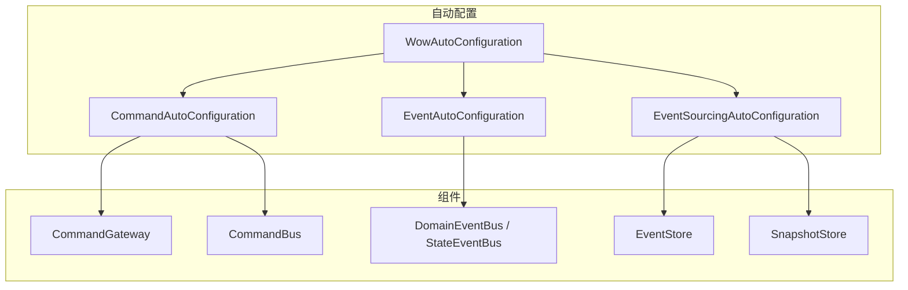

# Spring-Boot-Starter

_Spring-Boot-Starter_ 模块集成了所有 _Wow_ 扩展，提供了自动装配的能力，使 _Wow_ 框架在 _Spring Boot_ 项目中更加便捷地使用。

::: tip
该模块的公共配置文档请参考 [配置](../../reference/config/core)。
:::

## 安装

::: code-group
```kotlin [Gradle(Kotlin)]
implementation("me.ahoo.wow:wow-spring-boot-starter")
```
```groovy [Gradle(Groovy)]
implementation 'me.ahoo.wow:wow-spring-boot-starter'
```
```xml [Maven]
<dependency>
    <groupId>me.ahoo.wow</groupId>
    <artifactId>wow-spring-boot-starter</artifactId>
    <version>${wow.version}</version>
</dependency>
```
:::

## 自动配置原理

Spring Boot Starter 使用 Spring Boot 的自动配置机制，根据类路径和配置属性自动装配 Wow 框架组件。

### Gradle 特性能力（Feature Variants）

`wow-spring-boot-starter` 声明了可选的 Gradle 特性能力（feature capabilities），应用模块只引入所需的基础设施。通过 `capabilities { requireCapability("<group>:<capability>") }` 请求某个能力：

| 能力 | 引入 |
|---|---|
| `mongo-support` | `wow-mongo`（MongoDB EventStore / SnapshotStore / PrepareKey / 查询服务） |
| `redis-support` | `wow-redis`（Redis EventStore / SnapshotStore / PrepareKey / 消息总线） |
| `elasticsearch-support` | `wow-elasticsearch`（Elasticsearch EventStore / SnapshotStore / 查询服务） |
| `kafka-support` | `wow-kafka`（分布式 CommandBus / DomainEventBus / StateEventBus） |
| `webflux-support` | `wow-webflux`（WebFlux 命令/查询路由处理器、全局错误处理） |
| `opentelemetry-support` | `wow-opentelemetry`（链路追踪仪表器） |
| `openapi-support` | `wow-openapi`（OpenAPI schema/路由生成） |
| `cosec-support` | `wow-cosec`（CoSec 授权集成） |
| `mock-support` | `wow-mock`（进程内测试替身） |

这些能力是可选的；你也可以按各扩展文档所述，直接声明单个 `wow-*` 依赖。


```mermaid
flowchart TB
    subgraph AutoConfig["自动配置"]
        WC[WowAutoConfiguration]
        CC[CommandAutoConfiguration]
        EC[EventAutoConfiguration]
        ESC[EventSourcingAutoConfiguration]
    end
    
    subgraph Components["组件"]
        CG[CommandGateway]
        CB[CommandBus]
        EB[DomainEventBus / StateEventBus]
        ES[EventStore]
        SR[SnapshotStore]
    end
    
    WC --> CC
    WC --> EC
    WC --> ESC
    CC --> CG
    CC --> CB
    EC --> EB
    ESC --> ES
    ESC --> SR
```

## 自动配置类

| 配置类 | 说明 | 条件 |
|-------|------|------|
| `WowAutoConfiguration` | 核心自动配置 | 始终启用 |
| `CommandAutoConfiguration` | 命令总线配置 | `wow.enabled=true` |
| `EventAutoConfiguration` | 事件总线配置 | `wow.enabled=true` |
| `EventSourcingAutoConfiguration` | 事件溯源配置 | `wow.enabled=true` |
| `KafkaAutoConfiguration` | Kafka 配置 | classpath 包含 Kafka |
| `MongoEventSourcingAutoConfiguration` | MongoDB 事件/快照存储配置 | classpath 包含 Mongo 支持 |
| `RedisEventSourcingAutoConfiguration` / `RedisMessageBusAutoConfiguration` | Redis 事件溯源/消息总线配置 | classpath 包含 Redis 支持 |
| `WebFluxAutoConfiguration` | WebFlux 配置 | classpath 包含 WebFlux |

## 配置属性完整列表

### 核心配置 (wow.*)

| 属性 | 类型 | 默认值 | 说明 |
|------|------|--------|------|
| `wow.enabled` | Boolean | true | 是否启用 Wow 框架 |
| `wow.context-name` | String | ${spring.application.name} | 限界上下文名称 |

### 命令配置 (wow.command.*)

| 属性 | 类型 | 默认值 | 说明 |
|------|------|--------|------|
| `wow.command.bus.type` | BusType | kafka | 命令总线类型 |
| `wow.command.bus.local-first.enabled` | Boolean | true | 本地优先模式 |
| `wow.command.idempotency.enabled` | Boolean | true | 启用幂等性检查 |
| `wow.command.idempotency.bloom-filter.ttl` | Duration | 60s | BloomFilter TTL |
| `wow.command.idempotency.bloom-filter.expected-insertions` | Long | 1000000 | 预期插入数 |
| `wow.command.idempotency.bloom-filter.fpp` | Double | 0.00001 | 误判率 |

### 事件配置 (wow.event.*)

| 属性 | 类型 | 默认值 | 说明 |
|------|------|--------|------|
| `wow.event.bus.type` | BusType | kafka | 事件总线类型 |
| `wow.event.bus.local-first.enabled` | Boolean | true | 本地优先模式 |

### 事件溯源配置 (wow.eventsourcing.*)

| 属性 | 类型 | 默认值 | 说明 |
|------|------|--------|------|
| `wow.eventsourcing.store.storage` | `StorageType` | mongo | 事件存储类型 |
| `wow.eventsourcing.snapshot.enabled` | Boolean | true | 启用快照 |
| `wow.eventsourcing.snapshot.strategy` | Strategy | all | 快照策略 |
| `wow.eventsourcing.snapshot.version-offset` | Int | 5 | 版本偏移量 |
| `wow.eventsourcing.snapshot.storage` | `StorageType` | mongo | 快照存储类型 |
| `wow.eventsourcing.state.bus.type` | BusType | kafka | 状态事件总线类型 |

## Bean 装配与覆盖

自动配置按命令、事件、事件溯源、存储、传输、查询、可观测性和集成能力拆分。基础设施配置由对应的 classpath capability 与配置条件激活。许多非存储扩展点使用 `@ConditionalOnMissingBean`；例如，在声明它的自动配置条件允许时，自定义 `CommandGateway` 可以替换默认实现。应检查具体的 `@Bean` 声明，不能假定所有接口都可直接覆盖。

`EventStore` 与 `SnapshotStore` 使用不同的装配模型。存储 capability 发布 `EventStoreBinding` 和 `SnapshotStoreBinding`，`StorageRoutingAutoConfiguration` 再基于这些 binding 构建 `@Primary` 路由存储。接入自定义后端时，应注册具名 binding，并通过 `wow.eventsourcing.storage-routing` 选择它们；如果该后端还提供查询路由，则需要对应的 `EventStreamQueryServiceFactoryBinding` 与 `SnapshotQueryServiceFactoryBinding`。若要整体替换内置存储 capability，应先排除或关闭对应的存储自动配置。仅声明普通的 `EventStore` 或 `SnapshotStore` Bean，不会自动覆盖已启用的存储 capability。

准确的依赖、属性和覆盖边界请以各扩展文档及[配置参考](../../reference/config/core)为准。内部实现类的构造函数不是配置 API，可能独立演进。

## 多模块项目配置

### 项目结构

```
my-project/
├── my-project-api/          # API 模块（命令、事件定义）
├── my-project-domain/       # 领域模块（聚合根）
├── my-project-server/       # 服务模块（启动入口）
└── build.gradle.kts
```

### API 模块配置

```kotlin
// my-project-api/build.gradle.kts
dependencies {
    api("me.ahoo.wow:wow-api")
}
```

### 领域模块配置

```kotlin
// my-project-domain/build.gradle.kts
plugins {
    id("com.google.devtools.ksp")
}

dependencies {
    implementation(project(":my-project-api"))
    implementation("me.ahoo.wow:wow-core")
    ksp("me.ahoo.wow:wow-compiler")
    testImplementation("me.ahoo.wow:wow-tck")
}
```

### 服务模块配置

```kotlin
// my-project-server/build.gradle.kts
dependencies {
    implementation(project(":my-project-domain"))
    implementation("me.ahoo.wow:wow-spring-boot-starter")
    implementation("me.ahoo.wow:wow-kafka")
    implementation("me.ahoo.wow:wow-mongo")
    implementation("me.ahoo.wow:wow-webflux")
}
```

## 元数据加载

编译器将聚合元数据写入 `META-INF/wow-metadata.json`。运行时，`MetadataSearcher` 会惰性合并应用 classpath 中所有同名资源；应用无需调用 `MetadataSearcher.search()`，也无需注册额外的元数据配置 Bean。

## 处理器注册

### 聚合处理器

```kotlin
@AggregateRoot
class Order(private val state: OrderState) {
    // 自动注册为聚合处理器
}
```

### Saga 处理器

```kotlin
@StatelessSaga
class OrderSaga {
    // 自动注册为 Saga 处理器
}
```

### 投影处理器

```kotlin
@ProjectionProcessor
class OrderProjection {
    // 自动注册为投影处理器
}
```

## 完整配置示例

```yaml
spring:
  application:
    name: order-service
  mongodb:
    uri: mongodb://localhost:27017/order_db

wow:
  enabled: true
  context-name: order-service
  command:
    bus:
      type: kafka
      local-first:
        enabled: true
    idempotency:
      enabled: true
      bloom-filter:
        ttl: PT60S
        expected-insertions: 1000000
        fpp: 0.00001
  event:
    bus:
      type: kafka
      local-first:
        enabled: true
  eventsourcing:
    store:
      storage: mongo
    snapshot:
      enabled: true
      strategy: all
      storage: mongo
    state:
      bus:
        type: kafka
        local-first:
          enabled: true
  kafka:
    bootstrap-servers: localhost:9092
    topic-prefix: 'wow.'
  mongo:
    enabled: true
    auto-init-schema: true
```

## 最佳实践

1. **模块分离**：将 API、领域和服务模块分离，便于维护和复用
2. **使用编译器**：启用 wow-compiler 生成元数据和查询属性导航
3. **配置外化**：使用 Spring Boot 配置文件外化配置
4. **条件装配**：利用 `@ConditionalOnMissingBean` 允许自定义覆盖
5. **审慎选择 Local-First**：仅在本地投递语义符合部署拓扑时保留默认值，并验证准入失败回退、带标记副本过滤与重复处理
