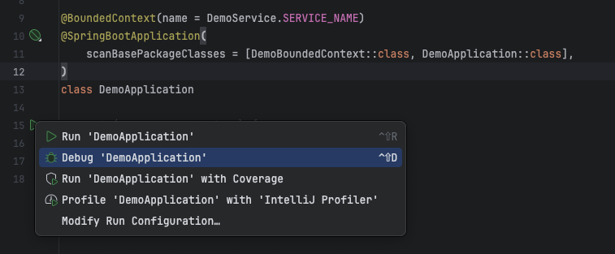
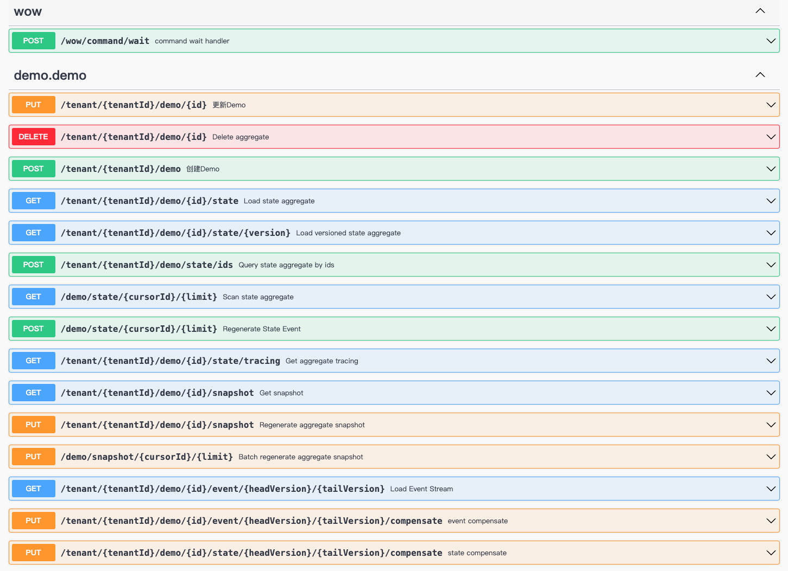

# 快速上手

> 使用 [Wow 项目模板](https://github.com/Ahoo-Wang/wow-project-template) 快速创建基于 _Wow_ 框架的 _DDD_ 项目。

## 创建项目

[](https://github.com/new?template_name=wow-project-template&template_owner=Ahoo-Wang)

点击上方按钮即可从 [Wow 项目模板](https://github.com/Ahoo-Wang/wow-project-template) 创建你自己的项目仓库，然后克隆到本地。

- 修改 `settings.gradle.kts` 文件，将 `rootProject.name` 修改为项目名称
- 修改 `api/{package}/DemoService`
- 修改 `domain/{package}/DemoBoundedContext`


## 项目模块

| 模块                   | 说明                                                                                                                                |
|----------------------|-----------------------------------------------------------------------------------------------------------------------------------|
| api                  | **API 层**，定义聚合命令（Command）、领域事件（Domain Event）以及查询视图模型（Query View Model）。充当各个模块之间通信的“发布语言”，同时提供详细的 API 文档，助力开发者理解和使用接口。             |
| domain               | **领域层**，包含聚合根和业务约束的实现。聚合根充当领域模型的入口点，负责协调领域对象的操作，确保业务规则的正确执行。业务约束包括领域对象的验证规则、领域事件的处理等。模块内附有详细的领域模型文档，助力团队深入了解业务逻辑。                 |
| server               | **宿主服务**，应用程序的启动点。负责整合其他模块，并提供应用程序的入口。涉及配置依赖项、连接数据库、启动 API 服务等任务。此外，server 模块提供了容器化部署的支持，包括 Docker 构建镜像和 Kubernetes 部署文件，简化了部署过程。 |
| client               | **客户端库**，使用 [fetcher-generator](https://github.com/Ahoo-Wang/fetcher) 自动生成的 TypeScript 客户端库，提供类型安全的 API 调用接口，方便前端或其他服务与后端交互。      |
| code-coverage-report | **测试覆盖率**，用于生成详细的测试覆盖率报告，以及验证覆盖率是否符合要求。帮助开发团队了解项目测试的全面性和质量。                                                                       |
| dependencies         | **依赖项管理**，这个模块负责管理项目的依赖关系，确保各个模块能够正确地引用和使用所需的外部库和工具。                                                                              |
| bom                  | **项目的 BOM（Bill of Materials）**                                                                                                    |
| libs.versions.toml   | **依赖版本配置文件**，明确了项目中各个库的版本，方便团队协作和保持版本的一致性。                                                                                        |
| deploy               | **Kubernetes 部署文件**，提供了在 Kubernetes 上部署应用程序所需的配置文件，简化了部署过程。                                                                       |
| Dockerfile           | **server Docker 构建镜像**，通过 Dockerfile 文件定义了应用程序的容器化构建步骤，方便部署和扩展。                                                                   |
| document             | **项目文档**，包括 UML 图和上下文映射图，为团队成员提供了对整个项目结构和业务逻辑的清晰理解。                                                                               |

## 安装 _server_ 依赖

1. 使用 _Kafka_ 作为消息引擎：命令总线以及事件总线

::: code-group
```kotlin [Gradle(Kotlin)]
implementation("me.ahoo.wow:wow-kafka")
```
```groovy [Gradle(Groovy)]
implementation 'me.ahoo.wow:wow-kafka'
```
```xml [Maven]
<dependency>
    <groupId>me.ahoo.wow</groupId>
    <artifactId>wow-kafka</artifactId>
    <version>${wow.version}</version>
</dependency>
```
:::

2. 使用 _MongoDB_ 作为事件存储以及快照存储

::: code-group
```kotlin [Gradle(Kotlin)]
implementation("me.ahoo.wow:wow-mongo")
implementation("org.springframework.boot:spring-boot-starter-data-mongodb-reactive")
```
```groovy [Gradle(Groovy)]
implementation 'me.ahoo.wow:wow-mongo'
implementation 'org.springframework.boot:spring-boot-starter-data-mongodb-reactive'
```
```xml [Maven]
  <dependencies>
    <dependency>
        <groupId>me.ahoo.wow</groupId>
        <artifactId>wow-mongo</artifactId>
        <version>${wow.version}</version>
    </dependency>
    <dependency>
      <groupId>org.springframework.boot</groupId>
      <artifactId>spring-boot-starter-data-mongodb-reactive</artifactId>
    </dependency>
  </dependencies>
```
:::

3. 使用 [CosId](https://github.com/Ahoo-Wang/CosId) 作为全局、聚合根 ID 生成器

::: code-group
```kotlin [Gradle(Kotlin)]
implementation("me.ahoo.cosid:cosid-mongo")
```
```groovy [Gradle(Groovy)]
implementation 'me.ahoo.cosid:cosid-mongo'
```
```xml [Maven]
<dependency>
    <groupId>me.ahoo.cosid</groupId>
    <artifactId>cosid-mongo</artifactId>
    <version>${cosid.version}</version>
</dependency>
```
:::

## 应用配置

```yaml {20,23,29,34}
management:
  endpoint:
    health:
      show-details: always
      probes:
        enabled: true
  endpoints:
    web:
      exposure:
        include:
          - health
          - wow
          - cosid
          - cosidGenerator
          - cosidStringGenerator
springdoc:
  show-actuator: true
spring:
  application:
    name: <your-service-name>
  mongodb:
    uri: <mongodb-uri>

cosid:
  machine:
    enabled: true
    distributor:
      type: mongo
  generator:
    enabled: true
wow:
  kafka:
    bootstrap-servers: <kafka-bootstrap-servers>
```

## 启动服务



> 访问：[http://localhost:8080/swagger-ui.html](http://localhost:8080/swagger-ui.html)



## 领域建模

::: tip 聚合模式
接下来的案例中，我们将使用[聚合模式](modeling)来建模。
:::

### 命令聚合根

*命令聚合根* 负责接收命令处理函数，执行相应的业务逻辑，并返回领域事件。

```kotlin {2,5}
@Suppress("unused")
@AggregateRoot
class Demo(private val state: DemoState) {

    @OnCommand
    fun onCreate(command: CreateDemo): DemoCreated {
        return DemoCreated(
            data = command.data,
        )
    }

    @OnCommand
    fun onUpdate(command: UpdateDemo): DemoUpdated {
        return DemoUpdated(
            data = command.data
        )
    }
}
```

### 状态聚合根

*状态聚合根* 负责维护聚合状态数据，接收并处理领域事件并变更聚合状态数据。

::: warning 
状态聚合根 `setter` 访问器设置为 `private`，避免命令聚合根直接变更聚合状态数据。
:::

```kotlin {3,5}
class DemoState(override val id: String) : Identifier {
    var data: String? = null
        private set

    @OnSourcing
    fun onCreated(event: DemoCreated) {
        data = event.data
    }

    @OnSourcing
    fun onUpdated(event: DemoUpdated) {
        data = event.data
    }
}
```

## 编写单元测试

为了保证代码质量，我们需要编写单元测试来验证聚合根的行为是否符合预期。

### 测试聚合根

```kotlin
class DemoSpec : AggregateSpec<Demo, DemoState>({
  on {
    val create = CreateDemo(
      data = "data"
    )
    whenCommand(create) {
      expectNoError()
      expectEventType(DemoCreated::class)
      expectState {
        data.assert().isEqualTo(create.data)
      }
      fork {
        val update = UpdateDemo(
          data = "newData"
        )
        whenCommand(update) {
          expectNoError()
          expectEventType(DemoUpdated::class)
          expectState {
            data.assert().isEqualTo(update.data)
          }
        }
      }
    }
  }
})
```

## CI 验证

Wow 仓库使用 GitHub Actions 与 JDK 17。提交变更前，建议在本地运行与 CI 对齐的核心检查：

```shell
./gradlew allLocalTest
./gradlew allContractTest
./gradlew detekt
```

权威配置以 [Local Test](https://github.com/Ahoo-Wang/Wow/blob/main/.github/workflows/local-test.yml)、[Contract Test](https://github.com/Ahoo-Wang/Wow/blob/main/.github/workflows/contract-test.yml) 和 [Static Analysis](https://github.com/Ahoo-Wang/Wow/blob/main/.github/workflows/static-analysis.yml) 为准。应用项目应根据目标镜像仓库和运行环境单独设计发布、部署阶段，不应直接复制绑定特定云厂商或凭据的流水线模板。
