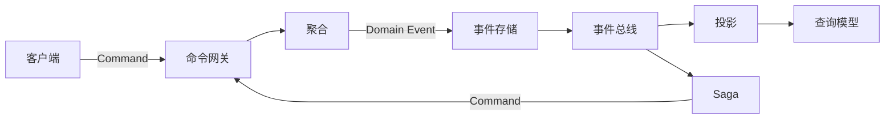

# Wow 文档导览

不必按侧边栏从头读到尾。先选择你当前要完成的任务，然后只阅读必要页面。

::: tip 第一次接触 Wow？
用 15 分钟阅读[简介](./introduction.md)和[核心概念](./core-concepts.md)；想直接运行代码，进入[快速上手](./getting-started.md)。
已有 Spring Boot 服务则从[接入现有项目](./existing-project.md)开始。
:::

## 一张图理解主链路

命令由聚合执行业务决策，领域事件作为权威历史持久化；投影生成适合读取的模型，Saga 根据事件发出跨聚合命令。详细语义见[核心概念](./core-concepts.md)和[数据流](./advanced/data-flow.md)。

## 按任务选择入口

| 你要完成的任务 | 先读 | 然后读 | 完成标志 |
| --- | --- | --- | --- |
| 判断 Wow 是否适合项目 | [简介](./introduction.md) | [生产最佳实践](./best-practices.md) | 能说明收益、运行成本和不适用场景 |
| 运行第一个应用 | [快速上手](./getting-started.md) | [配置](./configuration.md) | 领域测试通过，真实命令到达 `SNAPSHOT`，状态可读回 |
| 接入现有 Spring Boot 服务 | [接入现有项目](./existing-project.md) | [Spring Boot Starter](./extensions/spring-boot-starter.md) | KSP 元数据、自动路由、命令和快照闭环均通过 |
| 学习完整 Kotlin 应用 | [订单与购物车](../reference/example/order.md) | [应用测试](./application-testing.md) | 能追踪命令、事件、状态、Saga、投影和重启恢复 |
| 设计聚合和业务约束 | [聚合建模](./modeling.md) | [测试套件](./test-suite.md) | 命令产生领域事件，溯源后状态可验证 |
| 建立应用发布门禁 | [应用测试](./application-testing.md) | [生产最佳实践](./best-practices.md) | 领域、HTTP、真实 Adapter、恢复和安全反例都有证据 |
| 演进已持久化事件 | [事件演进](./advanced/event-evolution.md) | [事件存储](./eventstore.md) | Upgrader 注册、顺序、历史回放与回滚均有证据 |
| 提供写入 API 和完成语义 | [命令网关](./command-gateway.md) | [OpenAPI](./open-api.md) | 能区分 `SENT`、`PROCESSED`、`SNAPSHOT` 和 `PROJECTED` |
| 建立查询模型 | [投影](./projection.md) | [查询服务](./query.md) | 投影可重试且幂等，查询边界清晰 |
| 编排跨聚合流程 | [Saga](./saga.md) | [事件补偿](./event-compensation.md) | 正常、重试、不可恢复路径都有测试 |
| 选择存储和消息实现 | [模块依赖](./advanced/module-dependencies.md) | [扩展](./extensions/spring-boot-starter.md) | 只引入实际需要的后端和 Starter capability |
| 准备上生产 | [生产最佳实践](./best-practices.md) | [备份、恢复与重放](./recovery.md) | 幂等、恢复、容量、告警和回滚均有证据 |
| 处理异常或卡住 | [故障排查](./troubleshooting.md) | 对应的核心/扩展页 | 已定位失败阶段，而不只是扩大超时 |
| 迁移旧系统或旧版本 | [迁移指南](./migration.md) | 选定的迁移路径 | 库存、对账、切流、回滚门禁完整 |

## 三条建议路径

### 15 分钟：建立概念

1. [简介](./introduction.md)
2. [核心概念](./core-concepts.md)
3. [架构概览](./advanced/architecture.md)

### 60 分钟：完成一个垂直切片

1. [快速上手](./getting-started.md)
2. 已有服务改读[接入现有项目](./existing-project.md)
3. [聚合建模](./modeling.md)
4. [测试套件](./test-suite.md)
5. [命令网关](./command-gateway.md)
6. [投影](./projection.md)与[查询服务](./query.md)

### 生产评估：从风险开始

1. [生产最佳实践](./best-practices.md)
2. [备份、恢复与重放](./recovery.md)
3. [应用测试](./application-testing.md)
4. [可观测性](./advanced/observability.md)
5. [故障排查](./troubleshooting.md)
6. [迁移指南](./migration.md)
7. [事件演进](./advanced/event-evolution.md)

## 如何使用不同类型的文档

- **指南**：解释为什么和怎样完成任务。
- **参考**：查找精确配置、示例和生态资源。
- **API**：从顶部导航进入 Dokka，查找 Kotlin/Java 符号和签名。
- **[入门导航](../onboarding/)**：按贡献者、架构师、管理者或产品经理角色阅读。
- **[文章](../articles/)**：从具体问题理解设计取舍，不代替 API 与配置参考。

::: warning 版本和事实来源
文档解释仓库，但不代替仓库。当文字与当前 tag 的公开契约、配置类、测试或发布说明不一致时，以选定版本的源码为准。
:::
