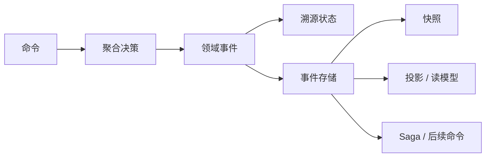

# 简介

Wow 是面向 Kotlin/Java 的响应式 CQRS 与事件溯源框架。它把一次业务写入明确表达为**命令 → 聚合决策 → 领域事件 → 溯源状态**，再让投影、Saga 和其他处理器响应已持久化的事件。

框架不是绕过领域建模的捷径。它提供运行时与测试机制，让团队把更多精力放在业务规则上，同时保留“请求了什么、领域做出什么决策、状态如何变化”的证据。

::: tip 选择下一页
- 先证明可运行链路：[快速上手](./getting-started.md)
- 先统一术语：[核心概念](./core-concepts.md)
- 按任务选择路径：[文档导览](./index.md)
:::

## 背景

随着业务规则增长，围绕表结构的 CRUD 容易把决策分散到 Controller、Service、数据库约束和脚本中。领域驱动设计可以把决策收回到明确边界；事件溯源可以保留状态为何变化。两者也会带来事件演进、异步完成、重放、幂等和运维等新成本。

Wow 统一命令调度、聚合加载、事件持久化、快照、投影、Saga、等待阶段、路由生成和领域测试。它既可用于微服务，也可用于模块化单体；是否适用取决于领域和运行模型，而不是部署拓扑本身。

## 六项价值主张

以下六点说明 Wow 可能带来的价值。每一点都是有边界的能力，不是无条件结果承诺。

### 1. 业务价值

命令表达业务意图，聚合保护不变量，领域事件表达已发生的事实，使核心讨论围绕领域行为，而不是 HTTP 或数据库装配。Wow 负责把这些工件连接到元数据和运行时组件；正确的业务边界仍需团队与领域专家共同发现。

### 2. 性能与伸缩性

聚合边界、追加式事件存储和消息抽象，可以减少领域规则对具体存储拓扑的直接耦合，但不会消除热点聚合、大事件、后端上限和部署约束。评估选定版本时，应使用[框架测试与基准](./test-runtime.md#基准分三种用途)中的可复现任务；脱离代码版本、硬件和参数的历史吞吐数据不是当前性能保证。

### 3. 读写分离与同步延迟

CQRS 允许为读取建立专用查询模型，但读模型可能晚于写入完成。固定等待既不能证明完成，也会浪费快速路径。Wow 等待计划允许调用方声明实际需要的 `PROCESSED`、`SNAPSHOT` 或 `PROJECTED` 等阶段，并接收对应信号。详见[完成语义](./command/completion.md)。

### 4. 工程质量

Given → When → Expect 测试 DSL 无需启动完整基础设施，即可验证命令、事件、错误和溯源状态。这能减少测试装配噪音，但不能替代 HTTP、真实 Adapter、恢复、安全和升级测试。详见[测试套件](./test-suite.md)与[应用测试](./application-testing.md)。

### 5. 商业智能

命令和状态事件已经携带业务语义，分析链路可以消费比数据库字段变化更丰富的数据。Wow BI 能为 ClickHouse 等分析存储生成同步脚本；延迟、数据质量、模式演进和运行保障仍由应用负责。详见 [Wow 商业智能](./bi.md)与[商业智能运维](./bi-operations.md)。

  

### 6. 操作审计

命令记录意图，领域事件记录事实，两者可用于回答谁请求了什么、最终产生了什么结果。Wow 不会自动满足保留期限、访问控制、隐私或合规要求，应用必须自行设计并验证这些策略。详见[聚合命令](./bi.md#聚合命令)。

## 核心运行模型

[领域模型](./domain/)负责聚合边界、事件历史、快照与生命周期；[命令](./command/)负责命令定义、发送、完成与可靠性；[事件与协作](./event/)负责 Processor、Saga、补偿与事件分发。投影和查询仍由[投影](./projection.md)与[查询服务](./query.md)负责。跨能力交接见[数据流](./advanced/data-flow.md)，运行时启停见[运行时生命周期](./advanced/runtime-lifecycle.md)。

完整的运行时架构与数据流如下：

  

## 适用边界

| 更适合 | 需谨慎评估 |
| --- | --- |
| 丰富业务规则需要明确的聚合一致性边界 | 简单 CRUD 几乎没有领域决策 |
| 状态历史、重放或审计数据源有业务价值 | 当前状态和单个数据库事务已经足够 |
| 写行为与多种读模型需要独立演进 | 所有读模型必须在写事务中同步变化 |
| 跨聚合流程需要可观测进度和恢复机制 | 团队无法承担幂等、事件演进和最终一致性运维 |

::: warning
Wow 不会自动发现领域边界，补偿也不等于数据库回滚。选择基础设施前，先定义业务所有权与失败语义。
:::

## 引入 Wow 后要承担的成本

- **事件演进**：持久化事件是长期契约，旧版本与重放需要兼容性测试。
- **最终一致性**：产品和 API 必须定义用户真正需要哪个完成阶段。
- **幂等与重试**：消息可能重复投递，处理器副作用必须能够安全重试。
- **运行保障**：容量、存储、消息、备份恢复、告警、补偿和回滚都需要环境证据。
- **响应式边界**：阻塞 I/O 必须与 Reactor 命令、事件管道显式隔离。
- **迁移切换**：改造已有写入链路时必须定义切换和回滚边界，本地测试不能证明生产就绪。

## 主要能力

| 需求 | 继续阅读 |
| --- | --- |
| 建模聚合决策与溯源状态 | [领域模型](./domain/) |
| 定义、发送命令并声明完成语义 | [命令](./command/) |
| 建立面向查询的视图 | [投影](./projection.md)、[查询服务](./query.md) |
| 处理事件并编排跨聚合流程 | [事件与协作](./event/) |
| 验证领域与应用行为 | [测试套件](./test-suite.md)、[应用测试](./application-testing.md) |
| 暴露生成契约与路由 | [OpenAPI](./open-api.md)、[WebFlux](./extensions/webflux.md) |
| 观测运行管道 | [OpenTelemetry](./extensions/opentelemetry.md)、[指标](./advanced/metrics.md) |

## 下一步

- 新应用：[快速上手](./getting-started.md) → [领域模型](./domain/) → [命令](./command/) → [测试套件](./test-suite.md)
- 已有应用：[接入现有项目](./existing-project.md) → [Spring Boot Starter](./extensions/spring-boot-starter.md)
- 架构与运维：[架构概览](./advanced/architecture.md) → [生产最佳实践](./best-practices.md) → [可观测性](./advanced/observability.md)
- 按角色阅读：[入门导航](../onboarding/)
