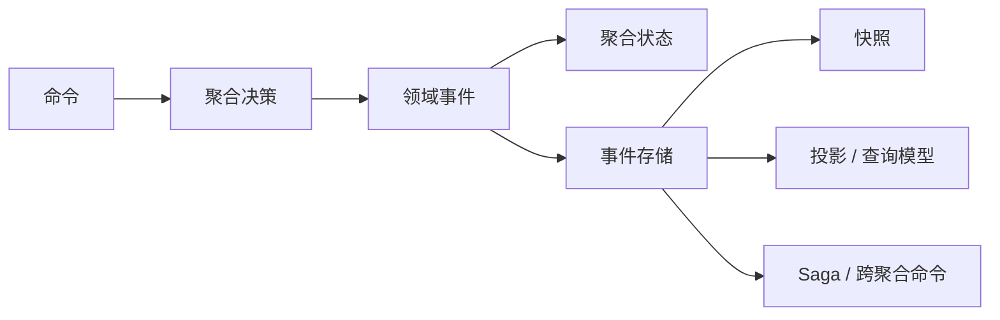

# 简介

  

Wow 是一个面向 Kotlin/Java 应用的响应式 DDD、CQRS 与事件溯源框架。它把命令调度、聚合加载、事件持久化、投影、Saga、等待语义和测试支持组成一条明确的运行链路。

框架的重点不是“少写几个 CRUD 接口”，而是让业务决策以**命令 → 领域事件 → 状态**的形式可见、可测试、可追溯。DDD 和事件溯源也不是微服务专属：如果边界和运行成本合适，Wow 同样可用于模块化单体。

::: tip 只想找到下一页？
- 先运行代码：[快速上手](./getting-started.md)
- 先建立心智模型：[核心概念](./core-concepts.md)
- 按任务选择路径：[文档导览](./index.md)
:::

## 一句话理解 Wow

> 客户端发送命令，聚合根据当前状态执行业务决策并返回领域事件；事件先应用到聚合状态并持久化，持久化完成后再驱动投影、Saga 和其他事件处理器。

这条链路有多个“完成”阶段。命令已进入总线（`SENT`）、已被聚合处理（`PROCESSED`）、快照已保存（`SNAPSHOT`）和查询模型已更新（`PROJECTED`）不是同一件事。[命令网关](./command-gateway.md#等待计划)允许调用方声明它真正需要的阶段。

## Wow 解决什么问题

| 问题 | Wow 提供的机制 | 继续阅读 |
| --- | --- | --- |
| 业务规则散落在 Controller、Service 和数据库脚本中 | 以聚合、命令处理函数和溯源函数明确决策边界 | [聚合建模](./modeling.md) |
| 只看当前表记录，难以回答“为什么变成这样” | 持久化不可变的领域事件，并通过重放重建状态 | [事件存储](./eventstore.md) |
| 写入成功后查询模型尚未更新 | 为不同完成阶段提供可声明的等待计划 | [命令网关](./command-gateway.md) |
| 写模型与复杂查询相互牵制 | 用投影生成针对查询场景的读模型 | [投影](./projection.md)、[查询服务](./query.md) |
| 跨聚合或跨服务流程难以观测与恢复 | 用无状态 Saga 编排命令，用重试和补偿处理失败 | [Saga](./saga.md)、[事件补偿](./event-compensation.md) |
| 领域测试需要启动数据库和完整应用 | 用 Given → When → Expect DSL 直接验证命令、事件和状态 | [测试套件](./test-suite.md) |

## 核心运行模型

1. **接收命令**：`CommandGateway` 构建并发送命令消息，同时处理验证、幂等和等待计划。
2. **加载聚合**：运行时从快照和后续事件恢复当前状态。
3. **执行决策**：命令处理函数校验业务不变量，返回一个或多个领域事件。
4. **溯源与持久化**：溯源函数将事件应用到状态，然后事件流以乐观并发约束追加到 `EventStore`。
5. **分发派生工作**：事件总线将事件交给投影、Saga 和事件处理器。
6. **返回声明的结果**：调用方可等待聚合处理、快照、特定投影或 Saga 函数完成。

详细的组件和调度顺序见[数据流](./advanced/data-flow.md)和[运行时生命周期](./advanced/runtime-lifecycle.md)。

## 适用与不适用场景

| 更适合 | 需谨慎评估 |
| --- | --- |
| 业务规则多，需要显式维护聚合不变量 | 几乎没有业务规则的简单 CRUD |
| 需要保留状态演进历史、重放或审计数据源 | 不需要历史，且单库事务已经完全满足需求 |
| 写模型和多种查询模型需要独立演进 | 必须在单个数据库事务中同步更新所有读模型 |
| 需要显式观测跨聚合的长流程 | 团队无法承担事件模型演进、幂等和最终一致性的运营责任 |

::: warning
Wow 不会自动把不清晰的领域边界变清晰，也不会把补偿等同于数据库回滚。如果业务决策和所有权边界未定义，先做建模，不要先加基础设施。
:::

## 引入 Wow 后要承担的成本

- **事件演进**：已持久化的事件是长期契约，需要兼容旧版本并验证重放。
- **最终一致性**：投影、Saga 和外部处理器可以异步完成，产品和 API 必须明确完成语义。
- **幂等与重试**：分布式总线可能重复投递，事件处理副作用必须可重试。
- **运行证据**：本地测试通过不等于生产就绪；存储、消息、容量、备份恢复、告警和回滚都需要独立验证。
- **响应式边界**：核心管道使用 Reactor；阻塞 I/O 必须显式隔离，不能隐藏在命令或事件链路中。

## 主要能力

- [聚合建模](./modeling.md)：用 `@AggregateRoot`、命令处理函数和溯源函数表达领域行为。
- [事件存储](./eventstore.md)与[快照](./snapshot.md)：保留事件历史并加速聚合恢复。
- [命令网关](./command-gateway.md)：提供幂等、验证、等待计划和 LocalFirst 语义。
- [投影](./projection.md)与[查询服务](./query.md)：从事件构建面向读取的模型。
- [Saga](./saga.md)与[事件补偿](./event-compensation.md)：编排跨聚合流程并管理失败恢复。
- [测试套件](./test-suite.md)：在不启动完整基础设施的情况下验证领域行为。
- [OpenAPI](./open-api.md)与 [WebFlux](./extensions/webflux.md)：根据元数据和运行时路由暴露命令与查询端点。
- [OpenTelemetry](./extensions/opentelemetry.md)与[指标](./advanced/metrics.md)：观测命令、事件、投影、Saga 和存储链路。

## 架构图

  

### 命令处理传播链

  

## 下一步

- 应用开发者：[快速上手](./getting-started.md) → [聚合建模](./modeling.md) → [测试套件](./test-suite.md)
- 架构与运维评估：[架构概览](./advanced/architecture.md) → [生产最佳实践](./best-practices.md) → [可观测性](./advanced/observability.md)
- 按角色阅读：[入门导航](../onboarding/)
