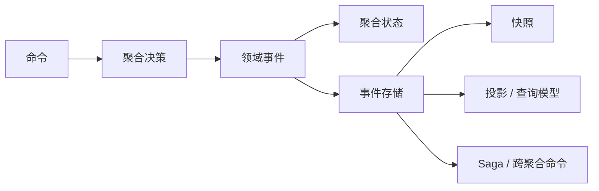

# 简介

  

::: info 关键词
**<Badge type="tip" text="领域驱动" />**
**<Badge type="tip" text="事件驱动" />**
**<Badge type="tip" text="测试驱动" />**
**<Badge type="tip" text="声明式设计" />**
**<Badge type="tip" text="响应式编程" />**
**<Badge type="tip" text="命令查询职责分离" />**
**<Badge type="tip" text="事件溯源" />**
:::

Wow 是一个面向 Kotlin/Java 应用、基于领域驱动设计和事件溯源的现代响应式 CQRS 框架，源自多年的生产实践并持续演进。它把命令调度、聚合加载、事件持久化、投影、Saga、等待语义和测试支持组成一条明确的运行链路。

Wow 旨在帮助开发者构建现代化、高性能且易于维护的应用，在发挥领域驱动设计和事件溯源优势的同时，降低这些模式的实践成本与学习门槛。

框架的重点不是“少写几个 CRUD 接口”，而是让业务决策以**命令 → 领域事件 → 状态**的形式可见、可测试、可追溯。DDD 和事件溯源也不是微服务专属：如果边界和运行成本合适，Wow 同样可用于模块化单体。

::: tip 只想找到下一页？
- 先运行代码：[快速上手](./getting-started.md)
- 先建立心智模型：[核心概念](./core-concepts.md)
- 按任务选择路径：[文档导览](./index.md)
:::

## 背景

随着业务发展和复杂性增加，传统架构与开发方式会逐渐暴露瓶颈。领域驱动设计和事件溯源有助于提高系统的灵活性、可维护性与可追溯性，但在实践中也伴随着建模、基础设施和学习曲线的挑战。

Wow 的目标，是以相对简单且一致的方式把这些理念融入应用开发，让开发者更专注于业务逻辑与领域模型，而不是反复搭建命令分发、事件持久化、投影、Saga 和测试基础设施。

经过持续的生产实践与演进，框架积累的经验既形成了当前能力，也促使项目持续补齐测试、可观测性、恢复和版本演进等工程约束。

## 对于开发者而言，Wow 意味着什么？

::: info 作者视角
我曾告诫团队：如果我们过于依赖数据驱动设计而忽视领域驱动设计，最终很容易只围绕表结构和 CRUD 工作。这里强调的不是给开发者贴标签，而是把研发关注点从技术动作重新拉回业务价值、领域知识和问题解决能力。
:::

### 业务价值

软件系统的核心价值体现在业务价值上。研发人员不应只关注技术实现，还应与领域专家一起洞察业务细节；完成一个业务系统后，开发者也应当沉淀为理解该领域的人。

使用 Wow，意味着把关注点放在领域模型和业务决策上。开发者编写领域模型，框架负责连接命令、事件、状态、OpenAPI 与运行时组件，从而减少重复的技术装配。

《实现领域驱动设计》强调应把主要投入放在核心域。Wow 希望通过降低建模和测试成本，让团队也能在确有收益的支撑子域中采用 DDD；是否值得采用，仍应结合业务复杂度和长期维护成本判断。

### 性能与伸缩性

随着业务发展，系统需要面对吞吐、存储和伸缩问题。传统架构中的关系模型、分片规则和跨分片事务，往往会渗透进业务代码。Wow 通过聚合边界、事件存储和消息抽象降低业务模型与具体存储拓扑的耦合，使后端替换和水平扩展不必直接改写领域规则。

这并不代表应用会自动获得无限伸缩能力。实际结果仍取决于聚合热点、事件大小、存储实现、消息系统和部署方式。评估当前版本时，请使用[测试运行体系](./test-runtime.md#基准-smoke)中的可复现 JMH 任务；不要把脱离代码版本、硬件和运行参数的历史吞吐数据当作当前性能承诺。

### 读写分离与同步延迟

读写分离常用于优化查询，但也会带来同步延迟：下单已经写入成功，订单查询模型可能尚未更新；商品已经修改，Elasticsearch 中也可能暂时搜索不到。

固定等待 1 秒既浪费大多数快速请求的时间，也无法保证慢请求已经完成。Wow 的命令等待计划允许调用方根据场景等待 `PROCESSED`、`SNAPSHOT` 或 `PROJECTED` 等阶段，再返回结果。详见[命令等待计划](./command-gateway.md#等待计划)。

### 工程质量

传统领域测试经常被数据库连接、事务、数据清理和完整应用启动拖累。Wow 的 Given → When → Expect 测试套件让测试直接围绕命令、事件和状态展开，开发者可以把主要精力放在领域模型是否符合预期上。

在原有团队实践中，领域模型覆盖率下限通常设为 **85%**，部分模块会自然达到 **95%**，同类项目的 API 测试缺陷数也曾明显下降。这些数字是团队经验，不是对所有项目的通用承诺；当前仓库的质量结论应以模块测试、覆盖率门禁和 CI 结果为准。详见[测试套件](./test-suite.md)与[测试运行体系](./test-runtime.md)。

## 一句话理解 Wow

> 客户端发送命令，聚合根据当前状态执行业务决策并返回领域事件；事件先应用到聚合状态并持久化，持久化完成后再驱动投影、Saga 和其他事件处理器。

这条链路有多个“完成”阶段。命令已进入总线（`SENT`）、已被聚合处理（`PROCESSED`）、快照处理已完成（`SNAPSHOT`）和查询模型已更新（`PROJECTED`）不是同一件事。[命令网关](./command-gateway.md#等待计划)允许调用方声明它真正需要的阶段。

## Wow 解决什么问题

| 问题 | Wow 提供的机制 | 继续阅读 |
| --- | --- | --- |
| 业务规则散落在 Controller、Service 和数据库脚本中 | 以聚合、命令处理函数和溯源函数明确决策边界 | [聚合建模](./modeling.md) |
| 只看当前表记录，难以回答“为什么变成这样” | 持久化不可变的领域事件，并通过重放重建状态 | [事件存储](./eventstore.md) |
| 写入成功后查询模型尚未更新 | 为不同完成阶段提供可声明的等待计划 | [命令网关](./command-gateway.md) |
| 写模型与复杂查询相互牵制 | 用投影生成针对查询场景的读模型 | [投影](./projection.md)、[查询服务](./query.md) |
| 跨聚合或跨服务流程难以观测与恢复 | 用无状态 Saga 编排命令，用重试和补偿处理失败 | [Saga](./saga.md)、[事件补偿](./event-compensation.md) |
| 领域测试需要启动数据库和完整应用 | 用 Given → When → Expect DSL 直接验证命令、事件和状态 | [测试套件](./test-suite.md) |

## 对于企业而言，Wow 意味着什么？

### 商业智能

商业智能依赖及时、丰富且具有业务语义的数据。除聚合当前状态外，Wow 还可以把状态事件（`StateEvent`）和聚合命令（`Command`）作为分析数据源，使分析系统能看到“发生了什么”和“为什么发生”，而不只是数据库字段如何变化。

  

传统 CDC 链路通常从表字段变化反推业务语义；Wow 的事件和命令已经携带领域含义，可减少这部分转换工作。项目的 BI 能力可以生成面向 ClickHouse 等分析存储的同步脚本，但具体实时性、数据质量和运行保障仍由应用配置与运维体系决定。

详见 [Wow 商业智能](./bi.md)和[商业智能运维](./bi-operations.md)。

### 操作审计

操作审计需要回答谁发起了什么操作，以及该操作产生了哪些业务结果。聚合命令表达操作意图，领域事件表达已发生的业务事实，两者可以共同构成比数据库字段变更更清晰的审计数据源。

Wow 提供这些数据源与同步机制，但不会自动满足保留期限、访问控制、隐私或合规要求；这些约束仍需在具体系统中设计和验证。详见 [Wow 操作审计](./bi.md#聚合命令)。

## 核心运行模型

1. **接收命令**：`CommandGateway` 构建并发送命令消息，同时处理验证、幂等和等待计划。
2. **加载聚合**：运行时从快照和后续事件恢复当前状态。
3. **执行决策**：命令处理函数校验业务不变量，返回一个或多个领域事件。
4. **溯源与持久化**：溯源函数将事件应用到状态，然后事件流以乐观并发约束追加到 `EventStore`。
5. **分发派生工作**：事件总线将事件交给投影、Saga 和事件处理器。
6. **返回声明的结果**：调用方可等待聚合处理、快照、特定投影或 Saga 函数完成。

详细的组件和调度顺序见[数据流](./advanced/data-flow.md)和[运行时生命周期](./advanced/runtime-lifecycle.md)。

## 适用与不适用场景

| 更适合 | 需谨慎评估 |
| --- | --- |
| 业务规则多，需要显式维护聚合不变量 | 几乎没有业务规则的简单 CRUD |
| 需要保留状态演进历史、重放或审计数据源 | 不需要历史，且单库事务已经完全满足需求 |
| 写模型和多种查询模型需要独立演进 | 必须在单个数据库事务中同步更新所有读模型 |
| 需要显式观测跨聚合的长流程 | 团队无法承担事件模型演进、幂等和最终一致性的运营责任 |

::: warning
Wow 不会自动把不清晰的领域边界变清晰，也不会把补偿等同于数据库回滚。如果业务决策和所有权边界未定义，先做建模，不要先加基础设施。
:::

## 引入 Wow 后要承担的成本

- **事件演进**：已持久化的事件是长期契约，需要兼容旧版本并验证重放。
- **最终一致性**：投影、Saga 和外部处理器可以异步完成，产品和 API 必须明确完成语义。
- **幂等与重试**：分布式总线可能重复投递，事件处理副作用必须可重试。
- **运行证据**：本地测试通过不等于生产就绪；存储、消息、容量、备份恢复、告警和回滚都需要独立验证。
- **响应式边界**：核心管道使用 Reactor；阻塞 I/O 必须显式隔离，不能隐藏在命令或事件链路中。

## 主要能力

- [聚合建模](./modeling.md)：用 `@AggregateRoot`、命令处理函数和溯源函数表达领域行为。
- [事件存储](./eventstore.md)与[快照](./snapshot.md)：保留事件历史并加速聚合恢复。
- [命令网关](./command-gateway.md)：提供幂等、验证、等待计划和 LocalFirst 语义。
- [投影](./projection.md)与[查询服务](./query.md)：从事件构建面向读取的模型。
- [Saga](./saga.md)与[事件补偿](./event-compensation.md)：编排跨聚合流程并管理失败恢复。
- [测试套件](./test-suite.md)：在不启动完整基础设施的情况下验证领域行为。
- [OpenAPI](./open-api.md)与 [WebFlux](./extensions/webflux.md)：根据元数据和运行时路由暴露命令与查询端点。
- [OpenTelemetry](./extensions/opentelemetry.md)与[指标](./advanced/metrics.md)：观测命令、事件、投影、Saga 和存储链路。

  

## 架构图

  

### 命令处理传播链

  

## 下一步

- 应用开发者：[快速上手](./getting-started.md) → [聚合建模](./modeling.md) → [测试套件](./test-suite.md)
- 架构与运维评估：[架构概览](./advanced/architecture.md) → [生产最佳实践](./best-practices.md) → [可观测性](./advanced/observability.md)
- 按角色阅读：[入门导航](../onboarding/)
