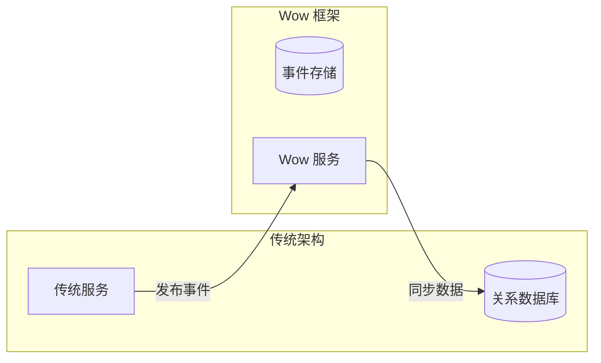

# 迁移指南

本指南帮助您从传统架构迁移到 Wow 框架，以及在不同版本之间升级。

## 版本升级指南

### 升级步骤

1. **备份数据**：在升级前备份事件存储和快照数据
2. **阅读更新日志**：查看 [Release Notes](https://github.com/Ahoo-Wang/Wow/releases)
3. **更新依赖版本**：修改 build.gradle.kts 或 pom.xml
4. **运行测试**：确保所有测试通过
5. **灰度发布**：逐步升级生产环境

### 依赖版本更新

::: code-group
```kotlin [Gradle(Kotlin)]
// 更新 wow 版本
implementation("me.ahoo.wow:wow-spring-boot-starter:新版本号")
```
```xml [Maven]
<dependency>
    <groupId>me.ahoo.wow</groupId>
    <artifactId>wow-spring-boot-starter</artifactId>
    <version>新版本号</version>
</dependency>
```
:::

### 破坏性变更检查

升级前请检查以下内容：

1. **API 变更**：检查是否有接口签名变更
2. **配置变更**：检查配置属性是否有变更
3. **元数据变更**：重新生成元数据文件

## 从传统架构迁移

### 迁移策略

#### 渐进式迁移

推荐使用渐进式迁移策略，逐步将功能模块迁移到事件溯源架构：



#### 迁移步骤

1. **识别边界上下文**：确定要迁移的业务模块
2. **设计领域模型**：定义聚合根、命令和事件
3. **实现双写**：同时写入旧系统和新系统
4. **验证一致性**：确保数据一致性
5. **切换读写**：逐步切换到新系统

### 数据迁移

#### 历史数据导入

对于需要保留历史数据的场景，推荐使用**迁移命令**将迁移逻辑封装在领域/聚合根中。这种方式确保迁移遵循与常规操作相同的命令处理流程，保持一致性和正确的事件溯源语义：

```kotlin
// 1. 定义迁移命令
@CreateAggregate
data class MigrateOrder(
    val customerId: String,
    val items: List<OrderItem>,
    val createdAt: Long
)

// 2. 在聚合根中处理
@AggregateRoot
class Order(private val state: OrderState) {
    @OnCommand
    fun onMigrate(command: MigrateOrder): OrderCreated {
        return OrderCreated(
            customerId = command.customerId,
            items = command.items,
            createdAt = command.createdAt
        )
    }
}

// 3. 发送命令进行迁移
fun migrateHistoricalData(legacyOrders: List<LegacyOrder>) {
    legacyOrders.forEach { order ->
        val command = MigrateOrder(
            customerId = order.customerId,
            items = order.items.map { /* convert */ },
            createdAt = order.createdAt
        )
        commandGateway.send(command).block()
    }
}
```

#### 快照初始化

对于大量历史数据，建议直接创建快照：

```kotlin
fun initializeSnapshot(legacyOrder: LegacyOrder) {
    val snapshot = StateAggregate(
        aggregateId = AggregateId(legacyOrder.id),
        version = 1,
        state = OrderState(
            id = legacyOrder.id,
            status = legacyOrder.status,
            // 其他字段映射
        )
    )
    
    snapshotRepository.save(snapshot)
}
```

### 代码迁移

#### 从 CRUD 到命令模式

**传统 CRUD 代码**：

```kotlin
// 传统服务
@Service
class OrderService(private val orderRepository: OrderRepository) {
    
    fun createOrder(request: CreateOrderRequest): Order {
        val order = Order(
            id = UUID.randomUUID().toString(),
            customerId = request.customerId,
            items = request.items,
            status = OrderStatus.CREATED
        )
        return orderRepository.save(order)
    }
    
    fun updateOrderStatus(orderId: String, status: OrderStatus) {
        val order = orderRepository.findById(orderId)
        order.status = status
        orderRepository.save(order)
    }
}
```

**迁移后的 Wow 代码**：

```kotlin
// 命令定义
@CreateAggregate
data class CreateOrder(
    val customerId: String,
    val items: List<OrderItem>
)

@CommandRoute
data class UpdateOrderStatus(
    @AggregateId val id: String,
    val status: OrderStatus
)

// 聚合根
@AggregateRoot
class Order(private val state: OrderState) {
    
    @OnCommand
    fun onCreate(command: CreateOrder): OrderCreated {
        return OrderCreated(
            customerId = command.customerId,
            items = command.items
        )
    }
    
    @OnCommand
    fun onUpdateStatus(command: UpdateOrderStatus): OrderStatusUpdated {
        return OrderStatusUpdated(command.status)
    }
}

// 状态聚合根
class OrderState : Identifier {
    lateinit var id: String
    lateinit var customerId: String
    var items: List<OrderItem> = emptyList()
    var status: OrderStatus = OrderStatus.CREATED
    
    fun onSourcing(event: OrderCreated) {
        this.customerId = event.customerId
        this.items = event.items
    }
    
    fun onSourcing(event: OrderStatusUpdated) {
        this.status = event.status
    }
}
```

#### 从直接查询到投影

**传统查询代码**：

```kotlin
@Repository
interface OrderRepository : JpaRepository<Order, String> {
    fun findByCustomerId(customerId: String): List<Order>
    fun findByStatus(status: OrderStatus): List<Order>
}
```

**迁移后的投影代码**：

```kotlin
@ProjectionProcessor
class OrderListProjection(
    private val orderViewRepository: OrderViewRepository
) {
    
    @OnEvent
    fun onOrderCreated(event: OrderCreated, aggregateId: AggregateId) {
        val view = OrderView(
            id = aggregateId.id,
            customerId = event.customerId,
            status = OrderStatus.CREATED
        )
        orderViewRepository.save(view)
    }
    
    @OnEvent
    fun onOrderStatusUpdated(event: OrderStatusUpdated, aggregateId: AggregateId) {
        orderViewRepository.updateStatus(aggregateId.id, event.status)
    }
}
```

## 兼容性说明

### 数据格式兼容性

Wow 框架使用 JSON 序列化事件和快照数据，确保了良好的前向兼容性：

- **新增字段**：新字段会被忽略（向后兼容）
- **删除字段**：使用默认值（需要处理）
- **修改字段类型**：需要事件升级器

### 事件升级

使用 `@Event` 注解的 `revision` 属性进行事件版本控制：

```kotlin
@Event(revision = "1.0")
data class OrderCreatedV1(
    val orderId: String,
    val items: List<OrderItem>
)

@Event(revision = "2.0")
data class OrderCreated(
    val orderId: String,
    val items: List<OrderItem>,
    val customerId: String // 新增字段
)
```

### 消息格式兼容性

确保消息格式的兼容性：

1. **添加字段**：安全，使用默认值
2. **删除字段**：需要确保消费者可以处理
3. **修改字段名**：不兼容，需要版本控制

## 已知问题

### 版本特定问题

请查阅 [GitHub Issues](https://github.com/Ahoo-Wang/Wow/issues) 获取最新的已知问题列表。

### 常见迁移问题

1. **事件重放顺序**：确保事件按版本顺序追加
2. **时间戳处理**：保留原始时间戳
3. **ID 生成**：保持 ID 格式一致

## 迁移检查清单

- [ ] 备份现有数据
- [ ] 更新依赖版本
- [ ] 检查破坏性变更
- [ ] 更新配置文件
- [ ] 重新生成元数据
- [ ] 运行单元测试
- [ ] 运行集成测试
- [ ] 灰度发布验证
- [ ] 全量发布
- [ ] 监控验证

## 回滚计划

如果迁移失败，请按照以下步骤回滚：

1. 停止新服务
2. 恢复旧服务
3. 验证数据一致性
4. 分析失败原因
5. 修复问题后重试
