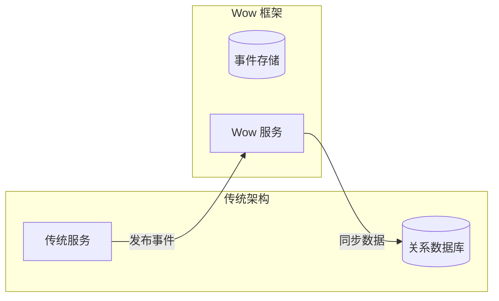

# 迁移指南

本指南帮助您从传统架构迁移到 Wow 框架，以及在不同版本之间升级。

## 版本升级指南

### 升级步骤

1. **备份数据**：在升级前备份事件存储和快照数据
2. **阅读更新日志**：查看 [Release Notes](https://github.com/Ahoo-Wang/Wow/releases)
3. **更新依赖版本**：修改 build.gradle.kts 或 pom.xml
4. **运行测试**：确保所有测试通过
5. **灰度发布**：逐步升级生产环境

### 依赖版本更新

::: code-group
```kotlin [Gradle(Kotlin)]
// 更新 wow 版本
implementation("me.ahoo.wow:wow-spring-boot-starter:新版本号")
```
```xml [Maven]
<dependency>
    <groupId>me.ahoo.wow</groupId>
    <artifactId>wow-spring-boot-starter</artifactId>
    <version>新版本号</version>
</dependency>
```
:::

### 破坏性变更检查

升级前请检查以下内容：

1. **API 变更**：检查是否有接口签名变更
2. **配置变更**：检查配置属性是否有变更
3. **元数据变更**：重新生成元数据文件

## Redis EventStore Canonical v2 布局（v8.9.0 引入）

从 v8.6.x 或 v8.8.x 升级到 v8.9.0 时，必须把 Redis 持久化视为存储格式硬切换。Redis EventStore、
Redis SnapshotStore 与 Redis PrepareKey 只读写 canonical v2 Key，不提供旧布局回退、双写或内置迁移器；
旧运行时也无法读取新的 v2 写入。新 EventStore 还会强制同一个 named aggregate 下的 `AggregateId.id`
在所有租户之间唯一。

Spring Boot starter 会精确检查已发布 v8.6 与 v8.8 EventStore 成功写入时必然创建的哨兵 Key。检查范围
仅包括解析到自动配置 `RedisEventStore` 的本地聚合，不在运行时使用 `SCAN`，因此支持 Redis Cluster；
发现不兼容数据会阻止启动。该守卫不覆盖直接使用库、独立构造的自定义 store、已从元数据移除的聚合或
仅将 snapshot 路由到 Redis 的场景。旧 snapshot 没有与 aggregate 无关的精确哨兵。canonical v2 会
忽略旧 snapshot Key；缺少 v2 snapshot 时，聚合加载会回放事件，但普通加载不会自动持久化重建后的
snapshot。

精确 Key 守卫不能替代离线数据审计。历史 alias 变更、Key eviction、手工删除或破坏旧索引，都可能让
哨兵消失但留下孤立事件流。解析后的 context alias（已配置 alias 时使用 alias，否则使用 `contextName`）
与 aggregate name 共同构成 v2 持久化 Key scope。迁移 manifest 必须固定每个历史 source alias 到目标
resolved alias 的映射；写入后变更 resolved alias 或 aggregate name 必须另做离线 Key 迁移。

必须采用离线切换：

1. 停止入口流量和全部旧版本 writer，将 in-flight append 排空为零，再创建一致的 Redis 备份并记录
   事件数量与版本基线。禁止新旧版本混合滚动发布。
2. 在每个 Cluster primary 的每个 logical database 中盘点全部旧 event ZSET、v8.6 shared request SET、
   v8.8 per-stream request SET、v8.8 bucket ids ZSET、旧 snapshot 与 PrepareKey Hash；记录 source Key、
   Redis type、cardinality、checksum 与 target mapping。历史 Key 中的 identity 只用于定位，最终身份以
   event/snapshot JSON 为准。
3. 按 named aggregate 审计不同租户之间是否存在重复 `AggregateId.id`。迁移前必须解决所有冲突；
   canonical v2 有意不允许同一个 ID 存在两个所有者。
4. 首次运行必须要求 v2 目标 scope 为空。可丢弃数据只能清除 inventory 中的旧 Key，或使用空的专用
   database；与 message bus 或应用数据共库时禁止 `FLUSHDB`。完整源数据集保持不可变以供回滚。
5. 使用单独评审的离线迁移器。持久化 manifest 必须记录 source Key、target Keys、源/目标 checksum、
   状态和最后完成批次。恢复执行时只有 manifest 与 checksum 一致才能复用 target，否则失败且不得覆盖。
   复制必须幂等；缺少 manifest 复核的半成品 target 不得被接受。
6. 保持每个 event ZSET member 与 score，校验 identity 一致且 score/version 连续。v2 request-ID SET 以
   已提交事件 JSON 为唯一权威来源。对 v8.6，必须双向比较 shared SET 与 `union(event.requestId)`，分别
   报告 shared-only 与 event-only 差异，禁止 fan-out。对 v8.8，逐流计算 source SET 与该流事件 requestId
   的 symmetric difference。差集非空时必须失败，除非记录了明确且已评审的处置策略。
7. 在 128 个 bucket 空间中重建所有非空聚合 ID 索引。bucket 公式是
   `aggregateId.id.hashCode().mod(128)`，使用 Java/Kotlin UTF-16 `String.hashCode`；Key 与 member 必须
   严格使用 canonical v2 codec。运行时不会执行该转换。
8. 校验有序 member+score checksum、首尾版本、request-ID 集合、完整 ID 索引、aggregate-ID scan 结果
   和代表性状态回放。失败时必须保留 manifest 和最后验证 cursor，随后清理半成品或从该 cursor 恢复；
   此期间不得启动应用。
9. 全部验证通过后，原地迁移必须移除或迁出 inventory 中的每个旧 Key；哨兵 Key 最后删除，随后重新
   inventory 并要求旧 Key 为零。使用独立 target database 时，完整源数据集在回滚观察期内保持只读。
10. 先让一个新实例连接 target 并完成隔离 ID 的读写 smoke test。显式执行 snapshot regeneration，校验
    snapshot 数量与版本后再切流量和扩容。应依据完整 inventory 调用单 ID regenerate 路由；只有审计
    证明全部 ID 严格大于 `AggregateIdScanner.FIRST_ID` 时，batch 路由才能视为不会漏项。

回滚必须同时切换应用与数据。尚无生产 v2 写入时，可以重新连接未改动的旧数据集并启动旧运行时；一旦
已有生产 v2 写入，必须先停止流量和全部 v2 writer，再反向迁移或重放这些写入，之后才能启动旧运行时。
仅恢复切换时备份会丢失此后的所有 v2 写入。推荐使用独立 target database/namespace。

强制精确 Key 检查属于启动期内部不变量，不提供关闭开关，也不作为兼容或迁移配置暴露。

Redis 布局内部 API 有意不保持源码、JVM 二进制与行为兼容。已移除 `AggregateKeyConverter`、
`RedisWrappedKey`、`RedisSnapshotRepository`、`EventStreamKeyConverter`、`DefaultSnapshotKeyConverter`、
`PrepareKeyConverter` 与 `RedisEventStore.SCRIPT_EVENT_STEAM_APPEND`；同时移除
`redisSnapshotRepository` Bean alias 和自定义 snapshot-key converter 构造参数。新的
`SCRIPT_EVENT_STREAM_APPEND` 为 internal，不提供公开替代。canonical converter 输出已改变，PrepareKey
现在包含 `name`，v2 会拒绝空 aggregate/prepare ID 与 unpaired UTF-16 surrogate。应用代码应使用
`EventStore`、`SnapshotStore` 与 `PrepareKey`；单独评审的离线工具应独立实现并校验 v2 codec。

## Mongo 所有权保护与 Snapshot Checkpoint

本次升级保留仅含 aggregate name 的 Mongo collection 命名，但新增持久化
`wow_database_metadata` 所有权标记。支持的部署布局是一个 MongoDB database 只属于一个 bounded
context。

上线前：

1. 检查所有已配置的 event-stream、snapshot 与 prepare database，以及其中的 `*_event_stream`、
   `*_snapshot`、`*_snapshot_checkpoint` 和 `prepare_*` collection。
2. 确认每个 database 只属于一个 `wow.context-name`；历史混写数据库必须先拆分。
3. 先升级数据库的真实所有者。第一个新版本实例会扫描存量 aggregate collection，再原子认领标记。
   存量 `prepare_*` 文档没有 context 元数据，因此 prepare-only database 会由首个升级 context 认领，
   上线前必须先审计其映射关系。
4. 审计现有受管索引。缺失索引会创建；key 顺序、unique、TTL、partial filter、collation、sparse 或
   hidden 选项不兼容时会阻止启动，必须执行受控迁移。

不要通过修改所有权标记绕过 context 冲突。应先迁移或删除旧数据；只有明确重新分配空数据库时才删除
标记。

历史 snapshot checkpoint 默认关闭：

```yaml
wow:
  eventsourcing:
    snapshot:
      checkpoint:
        enabled: false
        version-interval: 100
```

启用后会创建 `<aggregate>_snapshot_checkpoint` sidecar，并且只保存升级后新产生的匹配版本，不会自动
回填历史。回滚时关闭该功能；在完成验证与保留策略决策前保留 sidecar。

## 从传统架构迁移

### 迁移策略

#### 渐进式迁移

推荐使用渐进式迁移策略，逐步将功能模块迁移到事件溯源架构：


```mermaid
flowchart LR
    subgraph Legacy["传统架构"]
        LDB[(关系数据库)]
        LS[传统服务]
    end
    
    subgraph Wow["Wow 框架"]
        ES[(事件存储)]
        WS[Wow 服务]
    end
    
    LS -->|发布事件| WS
    WS -->|同步数据| LDB

```

#### 迁移步骤

1. **识别边界上下文**：确定要迁移的业务模块
2. **设计领域模型**：定义聚合根、命令和事件
3. **实现双写**：同时写入旧系统和新系统
4. **验证一致性**：确保数据一致性
5. **切换读写**：逐步切换到新系统

### 数据迁移

#### 历史数据导入

对于需要保留历史数据的场景，建议定义迁移命令：

```kotlin
// 1. 定义迁移命令
@CreateAggregate
data class MigrateOrder(
    val orderId: String,
    val customerId: String,
    val items: List<OrderItem>,
    val createdAt: Long
)

// 2. 在聚合根中处理迁移命令
@AggregateRoot
class Order(private val state: OrderState) {
    @OnCommand
    fun onMigrate(command: MigrateOrder): OrderCreated {
        return OrderCreated(
            orderId = command.orderId,
            customerId = command.customerId,
            items = command.items,
            createdAt = command.createdAt
        )
    }
}

// 3. 发送迁移命令
fun migrateHistoricalData(legacyOrders: List<LegacyOrder>) {
    legacyOrders.forEach { order ->
        val command = MigrateOrder(
            orderId = order.id,
            customerId = order.customerId,
            items = order.items.map { /* 转换 */ },
            createdAt = order.createdAt
        )
        commandGateway.send(command).block()
    }
}
```

### 代码迁移

#### 从 CRUD 到命令模式

**传统 CRUD 代码**：

```kotlin
// 传统服务
@Service
class OrderService(private val orderRepository: OrderRepository) {
    
    fun createOrder(request: CreateOrderRequest): Order {
        val order = Order(
            id = UUID.randomUUID().toString(),
            customerId = request.customerId,
            items = request.items,
            status = OrderStatus.CREATED
        )
        return orderRepository.save(order)
    }
    
    fun updateOrderStatus(orderId: String, status: OrderStatus) {
        val order = orderRepository.findById(orderId)
        order.status = status
        orderRepository.save(order)
    }
}
```

**迁移后的 Wow 代码**：

```kotlin
// 命令定义
@CreateAggregate
data class CreateOrder(
    val customerId: String,
    val items: List<OrderItem>
)

@CommandRoute
data class UpdateOrderStatus(
    @AggregateId val id: String,
    val status: OrderStatus
)

// 聚合根
@AggregateRoot
class Order(private val state: OrderState) {
    
    @OnCommand
    fun onCreate(command: CreateOrder): OrderCreated {
        return OrderCreated(
            customerId = command.customerId,
            items = command.items
        )
    }
    
    @OnCommand
    fun onUpdateStatus(command: UpdateOrderStatus): OrderStatusUpdated {
        return OrderStatusUpdated(command.status)
    }
}

// 状态聚合根
class OrderState : Identifier {
    lateinit var id: String
    lateinit var customerId: String
    var items: List<OrderItem> = emptyList()
    var status: OrderStatus = OrderStatus.CREATED
    
    fun onSourcing(event: OrderCreated) {
        this.customerId = event.customerId
        this.items = event.items
    }
    
    fun onSourcing(event: OrderStatusUpdated) {
        this.status = event.status
    }
}
```

#### 从直接查询到查询快照

**传统查询代码**：

```kotlin
@Repository
interface OrderRepository : JpaRepository<Order, String> {
    fun findByCustomerId(customerId: String): List<Order>
    fun findByStatus(status: OrderStatus): List<Order>
}
```

**迁移后的查询代码**：

参考 [查询服务](query.md)

```kotlin
class OrderService(
    private val queryService: SnapshotQueryService<OrderState>
) {
    fun getById(id: String): Mono<OrderState> {
        return singleQuery {
            condition {
                id(id)
            }
        }.query(queryService).toState().throwNotFoundIfEmpty()
    }
}
```

## 兼容性说明

### 数据格式兼容性

Wow 框架使用 JSON 序列化事件和快照数据，确保了良好的前向兼容性：

- **新增字段**：新字段会被忽略（向后兼容）
- **删除字段**：使用默认值（需要处理）
- **修改字段类型**：需要事件升级器

### 事件升级

使用 `@Event` 注解的 `revision` 属性进行事件版本控制：

```kotlin
@Event(revision = "1.0")
data class OrderCreatedV1(
    val orderId: String,
    val items: List<OrderItem>
)

@Event(revision = "2.0")
data class OrderCreated(
    val orderId: String,
    val items: List<OrderItem>,
    val customerId: String // 新增字段
)
```

### 消息格式兼容性

确保消息格式的兼容性：

1. **添加字段**：安全，使用默认值
2. **删除字段**：需要确保消费者可以处理
3. **修改字段名**：不兼容，需要版本控制

## 已知问题

### 版本特定问题

请查阅 [GitHub Issues](https://github.com/Ahoo-Wang/Wow/issues) 获取最新的已知问题列表。

### 常见迁移问题

1. **事件重放顺序**：确保事件按版本顺序追加
2. **时间戳处理**：保留原始时间戳
3. **ID 生成**：保持 ID 格式一致

## 迁移检查清单

- [ ] 备份现有数据
- [ ] 更新依赖版本
- [ ] 检查破坏性变更
- [ ] 更新配置文件
- [ ] 重新生成元数据
- [ ] 运行单元测试
- [ ] 运行集成测试
- [ ] 灰度发布验证
- [ ] 全量发布
- [ ] 监控验证

## 回滚计划

如果迁移失败，请按照以下步骤回滚：

1. 停止新服务
2. 恢复旧服务
3. 验证数据一致性
4. 分析失败原因
5. 修复问题后重试
