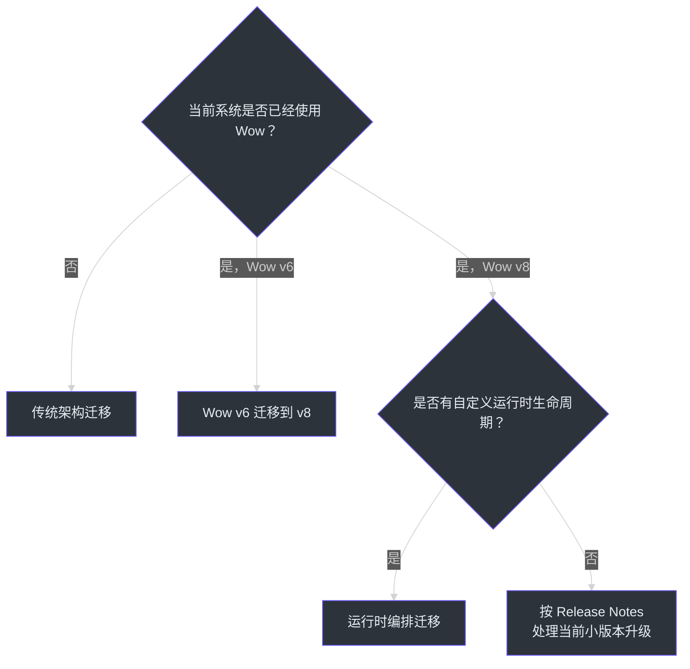
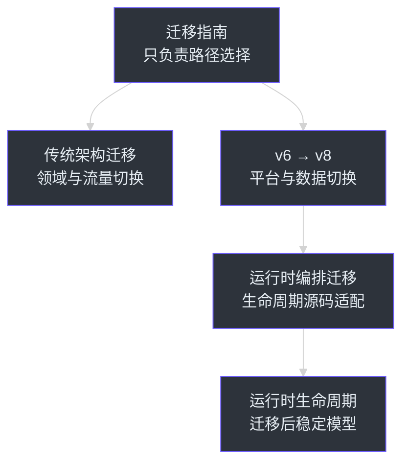
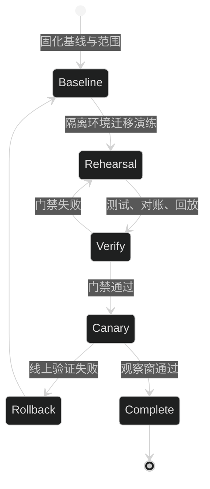

# 迁移指南

迁移有两条主路径：**首次采用 Wow** 解决的是领域边界、数据建模和流量切换；
**Wow v6 → v8** 解决的是精确源 tag 对应的平台差异、源码兼容和存储格式切换。已经使用 Wow v8
且自定义运行时生命周期的系统，还需执行其中的**运行时编排专项迁移**；它不是第三种
业务或数据迁移。请先选择主路径，不要把两套步骤混在同一次发布中。

## 选择迁移路径

| 当前状态 | 目标 | 应阅读 | 不应混入 |
|---|---|---|---|
| 传统 CRUD / 事务脚本 / 直接操作数据库 | 渐进采用 Wow CQRS + Event Sourcing | [传统架构迁移](./migration/traditional-architecture.md) | Wow v6 的版本兼容假设 |
| 使用精确平台基线的 Wow v6 | 使用固定目标平台的 Wow v8 | [Wow v6 迁移到 v8](./migration/v6-to-v8.md) | 重新设计全部业务边界 |
| 已在 Wow v8 上自定义 Dispatcher、MessageBus 或 Spring 生命周期 | 当前统一 `WowRuntime` | [运行时编排迁移](./migration/runtime-orchestration.md) | 业务数据重写 |
| 使用旧 QueryFilter / QueryHandler 扩展查询 | 统一 QueryGateway Policy / ResultPolicy / Backend | [Query Filter 迁移](./migration/query-filter-to-query-policy.md) | 重新引入条件 hook 或双查询引擎 |

```mermaid
%%{init: {"theme": "dark"}}%%
flowchart TD
    Start{"当前系统是否已经使用 Wow？"}
    Start -->|"否"| Traditional["传统架构迁移"]
    Start -->|"是，Wow v6"| V6["Wow v6 迁移到 v8"]
    Start -->|"是，Wow v8"| Custom{"是否有自定义运行时生命周期？"}
    Custom -->|"是"| Runtime["运行时编排迁移"]
    Custom -->|"否"| Release["按 Release Notes<br>处理当前小版本升级"]
    classDef route fill:#2d333b,stroke:#6d5dfc,color:#e6edf3
    class Start,Traditional,V6,Custom,Runtime,Release route
```

<!-- Sources:
- README.zh-CN.md:47-49
- documentation/docs/zh/guide/migration/traditional-architecture.md
- documentation/docs/zh/guide/migration/v6-to-v8.md
- documentation/docs/zh/guide/migration/runtime-orchestration.md
-->

## 文档边界

```mermaid
%%{init: {"theme": "dark"}}%%
graph TD
    Index["迁移指南<br>只负责路径选择"]
    Traditional["传统架构迁移<br>领域与流量切换"]
    V6["v6 → v8<br>平台与数据切换"]
    Runtime["运行时编排迁移<br>生命周期源码适配"]
    Lifecycle["运行时生命周期<br>迁移后稳定模型"]
    Index --> Traditional
    Index --> V6
    V6 --> Runtime
    Runtime --> Lifecycle
    classDef doc fill:#2d333b,stroke:#6d5dfc,color:#e6edf3
    class Index,Traditional,V6,Runtime,Lifecycle doc
```

<!-- Sources:
- documentation/docs/zh/guide/migration/traditional-architecture.md
- documentation/docs/zh/guide/migration/v6-to-v8.md
- documentation/docs/zh/guide/migration/runtime-orchestration.md
- documentation/docs/zh/guide/advanced/runtime-lifecycle.md
-->

| 文档 | 负责回答 | 核心源码依据 |
|---|---|---|
| 传统架构迁移 | 如何从 CRUD 建立 command、aggregate、event、state，并安全切流？ | [CreateOrder.kt:31-64](https://github.com/Ahoo-Wang/Wow/blob/main/example/example-api/src/main/kotlin/me/ahoo/wow/example/api/order/CreateOrder.kt#L31-L64)、[Order.kt:55-137](https://github.com/Ahoo-Wang/Wow/blob/main/example/example-domain/src/main/kotlin/me/ahoo/wow/example/domain/order/Order.kt#L55-L137) |
| v6 → v8 | 如何按精确 v6 平台基线对齐固定 v8 目标，并处理存储与 API 破坏？ | [v6.21.5 版本基线](https://github.com/Ahoo-Wang/Wow/blob/v6.21.5/gradle/libs.versions.toml)、[v8.0.0 Release](https://github.com/Ahoo-Wang/Wow/releases/tag/v8.0.0)、[当前版本基线](https://github.com/Ahoo-Wang/Wow/blob/main/gradle/libs.versions.toml) |
| 运行时编排迁移 | 如何把多个生命周期 owner 收敛到一个 `WowRuntime`？ | [WowAutoConfiguration.kt:118-152](https://github.com/Ahoo-Wang/Wow/blob/main/wow-spring-boot-starter/src/main/kotlin/me/ahoo/wow/spring/boot/starter/WowAutoConfiguration.kt#L118-L152) |

## 共同完成门禁

无论选择主路径还是运行时编排专项，都应按证据推进，而不是以“应用能启动”作为完成标准。

```mermaid
%%{init: {"theme": "dark"}}%%
stateDiagram-v2
    [*] --> Baseline: 固化基线与范围
    Baseline --> Rehearsal: 隔离环境迁移演练
    Rehearsal --> Verify: 测试、对账、回放
    Verify --> Rehearsal: 门禁失败
    Verify --> Canary: 门禁通过
    Canary --> Rollback: 线上验证失败
    Rollback --> Baseline
    Canary --> Complete: 观察窗通过
    Complete --> [*]
```

<!-- Sources:
- wow-core/src/main/kotlin/me/ahoo/wow/command/CommandFactory.kt:60-103
- wow-core/src/main/kotlin/me/ahoo/wow/command/CommandGateway.kt:75-159
- wow-core/src/main/kotlin/me/ahoo/wow/eventsourcing/snapshot/SnapshotStore.kt:57-71
- wow-spring-boot-starter/src/main/kotlin/me/ahoo/wow/spring/boot/starter/WowAutoConfiguration.kt:118-152
-->

- **范围**：固定 bounded context、数据集、版本起点、目标版本与明确不迁移的内容。
- **基线**：记录测试结果、事件/快照数量、关键业务指标和可回滚备份。
- **验证**：执行单元测试、集成测试、逐聚合对账、代表性事件回放和真实启动/停机。
- **发布**：先单实例或小流量验证，明确新写入出现后的回滚数据处理方式。
- **关闭**：观察窗结束后再清理旧数据、旧 writer、兼容代码和临时同步链路。

## 旧链接导航

原迁移页中的主题已分别移动到 [传统架构迁移](./migration/traditional-architecture.md)、
[Wow v6 迁移到 v8](./migration/v6-to-v8.md) 和
[运行时编排迁移](./migration/runtime-orchestration.md)。以下标题和别名完整保留原页面
的深链接；到达后请继续进入对应的新页面。

### 版本升级指南

参见 [v6 → v8：通用升级步骤](./migration/v6-to-v8.md#通用升级步骤)。

### 从传统架构迁移

参见 [传统架构迁移：迁移总览](./migration/traditional-architecture.md#迁移总览)。

### 数据迁移

参见 [传统架构迁移：用单写者完成历史导入与增量追平](./migration/traditional-architecture.md#_2-用单写者完成历史导入与增量追平)。

### 代码迁移

参见 [传统架构迁移：先迁移边界，不先迁移表](./migration/traditional-architecture.md#_1-先迁移边界-不先迁移表)
和 [对账后分别切换读与写](./migration/traditional-architecture.md#_3-对账后分别切换读与写)。

### 兼容性说明

参见 [传统架构迁移：领域模型继续演进](./migration/traditional-architecture.md#_4-领域模型继续演进)
和 [v6 → v8：破坏性变更检查](./migration/v6-to-v8.md#破坏性变更检查)。

### 已知问题

参见 [Release Notes](https://github.com/Ahoo-Wang/Wow/releases) 和
[故障排查](./troubleshooting.md)。

### 迁移检查清单

参见 [传统架构迁移检查清单](./migration/traditional-architecture.md#完成检查清单)
或 [v6 → v8 验证清单](./migration/v6-to-v8.md#验证清单)。

### 回滚计划

参见本页[共同完成门禁](#共同完成门禁)，以及所选迁移页面的切换和回滚步骤。

### 统一运行时编排

参见 [运行时编排迁移](./migration/runtime-orchestration.md)。

### 移除版本化快照检查点

参见 [v6 → v8：移除版本化快照检查点](./migration/v6-to-v8.md#移除版本化快照检查点)。

### SnapshotStore 原子保存

参见 [v6 → v8：SnapshotStore 原子保存](./migration/v6-to-v8.md#snapshotstore-原子保存)。

### Redis EventStore Canonical v2 布局（v8.9.0 引入）

参见 [v6 → v8：Redis EventStore Canonical v2 布局](./migration/v6-to-v8.md#redis-eventstore-canonical-v2-布局-v8-9-0-引入)。

### Mongo 所有权保护

参见 [v6 → v8：Mongo 所有权保护](./migration/v6-to-v8.md#mongo-所有权保护)。

## 相关页面

| 页面 | 关系 |
|---|---|
| [传统架构迁移](./migration/traditional-architecture.md) | 首次采用 Wow |
| [Wow v6 迁移到 v8](./migration/v6-to-v8.md) | 已使用 Wow 的平台升级 |
| [运行时编排迁移](./migration/runtime-orchestration.md) | v8 生命周期扩展迁移 |
| [故障排查](./troubleshooting.md) | 验证失败时的定位入口 |
