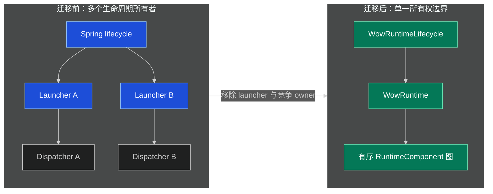
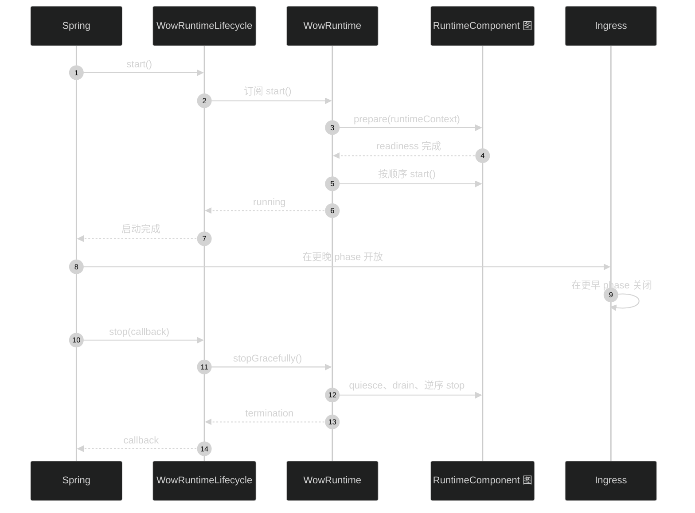
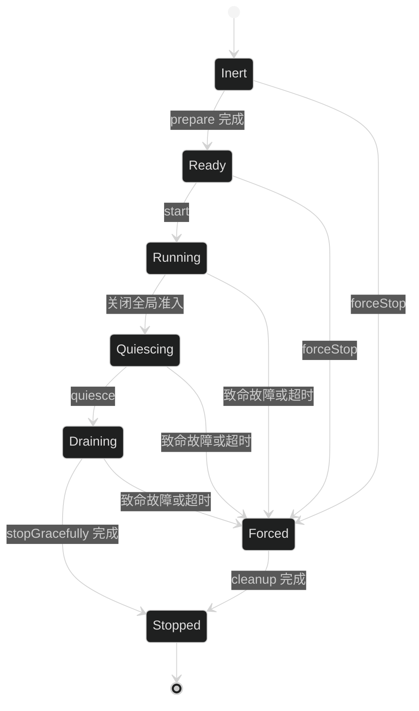

# 运行时编排迁移

本文说明如何从各 Dispatcher 独立 launcher 迁移到 one-shot `WowRuntime`，只负责升级
步骤。迁移后的稳定运行模型与停机语义参见
[运行时生命周期](../advanced/runtime-lifecycle.md)。

event、snapshot 与 message 格式没有变化，无需迁移数据；但自定义生命周期集成必须
重新编译并完成源码迁移。

## 迁移总览

| 旧集成方式 | 必须替换为 | 源码 |
|---|---|---|
| 独立 `MessageDispatcherLauncher` | 一个 `WowRuntime` 统一拥有全部 `RuntimeComponent` | [`WowRuntime.kt:47-76`](https://github.com/Ahoo-Wang/Wow/blob/main/wow-core/src/main/kotlin/me/ahoo/wow/runtime/WowRuntime.kt#L47-L76) |
| Wow 通用生命周期实现 | Runtime 所有的工作使用 `RuntimeComponent`；独立资源仅需关闭时使用 `GracefullyStoppable` | [`RuntimeComponent.kt:18-62`](https://github.com/Ahoo-Wang/Wow/blob/main/wow-core/src/main/kotlin/me/ahoo/wow/runtime/RuntimeComponent.kt#L18-L62)、[`GracefullyStoppable.kt:19-37`](https://github.com/Ahoo-Wang/Wow/blob/main/wow-core/src/main/kotlin/me/ahoo/wow/infra/lifecycle/GracefullyStoppable.kt#L19-L37) |
| constructor、`@PostConstruct` 或 Spring destruction 拥有资源 | 构造保持 inert；仅在 `prepare`/`start` 获取资源；仅由 Runtime 释放 | [`RuntimeComponent.kt:18-33`](https://github.com/Ahoo-Wang/Wow/blob/main/wow-core/src/main/kotlin/me/ahoo/wow/runtime/RuntimeComponent.kt#L18-L33) |
| 用订阅或 demand 推断 readiness | 显式使用 `MessageReceiver.readiness` 与 processing admission callback | [`MessageReceiver.kt:20-89`](https://github.com/Ahoo-Wang/Wow/blob/main/wow-core/src/main/kotlin/me/ahoo/wow/messaging/MessageReceiver.kt#L20-L89) |
| 每个 Dispatcher 独立 timeout | 全 Runtime 共享一个 deadline 与连续静默期 | [`WowRuntime.kt:103-125`](https://github.com/Ahoo-Wang/Wow/blob/main/wow-core/src/main/kotlin/me/ahoo/wow/runtime/WowRuntime.kt#L103-L125) |



<!-- Sources:
- [WowRuntime.kt:47-76](https://github.com/Ahoo-Wang/Wow/blob/main/wow-core/src/main/kotlin/me/ahoo/wow/runtime/WowRuntime.kt#L47-L76)
- [WowAutoConfiguration.kt:118-152](https://github.com/Ahoo-Wang/Wow/blob/main/wow-spring-boot-starter/src/main/kotlin/me/ahoo/wow/spring/boot/starter/WowAutoConfiguration.kt#L118-L152)
-->

## 1. 替换生命周期所有权

移除：

- `MessageDispatcherLauncher` Bean、factory、注入以及直接调用 Dispatcher 生命周期的代码；
- Starter 应用自行声明的 `WowRuntimeLifecycle` Bean；
- Runtime 所有的组件 Bean 上的 Spring `Lifecycle`、`SmartLifecycle`、
  `DisposableBean`、`@PreDestroy` 与显式 destroy method。

Dispatcher 生命周期方法现在是 final template，必须重新编译全部子类。额外的生命周期
所有权应建模为独立 `RuntimeComponent`，而不是 Dispatcher override。
`MainDispatcher` 只保留框架内部拥有 Scheduler 的实现所需的窄化清理 hook。
[`MainDispatcher.kt:193-357`](https://github.com/Ahoo-Wang/Wow/blob/main/wow-core/src/main/kotlin/me/ahoo/wow/messaging/dispatcher/MainDispatcher.kt#L193-L357)

### 非 Spring 应用

显式构造唯一 Runtime。`start()` 返回 cold `Mono<Void>`，必须订阅：

```kotlin
val runtime = WowRuntime(components, shutdownTimeout, shutdownQuietPeriod)
runtime.start().block()
// 应用工作
runtime.stop()
```

### Spring Boot 应用

Starter 拥有 canonical `wowRuntimeLifecycle` 桥接器。Runtime 所有的组件必须是 singleton
Bean，且声明返回类型必须暴露 `RuntimeComponent` 或其子类型。Runtime 直接调用 Spring
暴露的 proxy，不会解包 target。

自定义 Runtime 必须是名为 `wowRuntime` 的直接 singleton Bean，是当前 Context 中唯一
的 `WowRuntime`，并禁用 Spring 推断的 `AutoCloseable.close()` owner：

```kotlin
@Bean(WOW_RUNTIME_BEAN_NAME, destroyMethod = "")
fun customWowRuntime(): WowRuntime =
    WowRuntime(components, shutdownTimeout, shutdownQuietPeriod)
```

Starter 会拒绝 `FactoryBean` product，因为它无法证明销毁所有权唯一。应用提供 canonical
Runtime 时，由该 Runtime 自行拥有组件拓扑；只有 Starter 创建默认 Runtime 时才自动
发现组件。子 `ApplicationContext` 只拥有本地组件。
[`WowAutoConfiguration.kt:118-213`](https://github.com/Ahoo-Wang/Wow/blob/main/wow-spring-boot-starter/src/main/kotlin/me/ahoo/wow/spring/boot/starter/WowAutoConfiguration.kt#L118-L213)



<!-- Sources:
- [WowRuntimeLifecycle.kt:27-44](https://github.com/Ahoo-Wang/Wow/blob/main/wow-spring/src/main/kotlin/me/ahoo/wow/spring/WowRuntimeLifecycle.kt#L27-L44)
- [WowRuntimeLifecycle.kt:76-118](https://github.com/Ahoo-Wang/Wow/blob/main/wow-spring/src/main/kotlin/me/ahoo/wow/spring/WowRuntimeLifecycle.kt#L76-L118)
- [WowRuntimeLifecycle.kt:211-258](https://github.com/Ahoo-Wang/Wow/blob/main/wow-spring/src/main/kotlin/me/ahoo/wow/spring/WowRuntimeLifecycle.kt#L211-L258)
-->

自定义 ingress 若实现 `SmartLifecycle`，其 phase 必须大于 `WOW_RUNTIME_PHASE`，从而在
Runtime ready 后启动、在 Runtime 停机前关闭。应用若以 `DefaultLifecycleProcessor`
替换 `lifecycleProcessor`，Wow 会从实际选中的 Runtime `shutdownTimeout` 推导运行时
phase timeout，并加入完成余量。
[`WowAutoConfiguration.kt:65-89`](https://github.com/Ahoo-Wang/Wow/blob/main/wow-spring-boot-starter/src/main/kotlin/me/ahoo/wow/spring/boot/starter/WowAutoConfiguration.kt#L65-L89)

## 2. 迁移自定义运行时参与者

直接实现 `RuntimeComponent`：

```kotlin
class CustomRuntimeComponent : RuntimeComponent {
    override fun prepare(runtimeContext: RuntimeContext): Mono<Void> =
        prepareResourcesWithoutOpeningProcessing(runtimeContext)

    override fun start() = openIntake()

    override fun quiesce() = closeIntake()

    override fun stopGracefully(): Mono<Void> = drainAndClose()

    override fun forceStop() {
        closeIntake()
        disposeOwnedResources()
    }
}
```

生命周期契约必须满足：

- `prepare` 在组件能够无损保留已准入工作时完成，但不开放 processing；
- `start` 开放 processing；
- `quiesce` 及时、同步且幂等地关闭 intake；
- `stopGracefully` 排空已接受的工作；
- `forceStop` 及时、非阻塞、可重复，并且在 prepare 前也安全。

每次接受完整异步操作前，通过 `RuntimeContext.tryAcquire()` 获取 `RuntimeActivity`，
仅在完整异步链终止时关闭；使用 `reportFailure` 上报 terminal pipeline failure。
[`RuntimeContext.kt:16-45`](https://github.com/Ahoo-Wang/Wow/blob/main/wow-core/src/main/kotlin/me/ahoo/wow/runtime/RuntimeContext.kt#L16-L45)



<!-- Sources:
- [RuntimeComponent.kt:18-62](https://github.com/Ahoo-Wang/Wow/blob/main/wow-core/src/main/kotlin/me/ahoo/wow/runtime/RuntimeComponent.kt#L18-L62)
- [WowRuntime.kt:470-565](https://github.com/Ahoo-Wang/Wow/blob/main/wow-core/src/main/kotlin/me/ahoo/wow/runtime/WowRuntime.kt#L470-L565)
-->

取消 `start()` 订阅会中止并强制停止这个 one-shot Runtime，因此 `forceStop` 执行后，
prepare publisher 必须及时释放资源或终止。Runtime 或 Spring Context 一旦终止便不能
重启，应创建新实例。

## 3. 迁移消息源

自定义 `MessageBus` 若在订阅建立后仍不能立即无损保留新工作，必须 override
`receiver` 并返回：

1. single-use 消息流；
2. hot、可重放的 readiness signal；
3. 幂等的 `openProcessing` callback；
4. 幂等的 `closeProcessing` callback。

映射 receiver 时必须保留全部四项。Runtime 先订阅，再等待 readiness；只在全局 start
pass 开放 processing，并在 detached physical cancellation 前关闭逻辑 processing。
[`MessageReceiver.kt:20-89`](https://github.com/Ahoo-Wang/Wow/blob/main/wow-core/src/main/kotlin/me/ahoo/wow/messaging/MessageReceiver.kt#L20-L89)

Transport 专项检查：

- Redis readiness 创建全部 consumer group，但不在 processing admission 前启动
  stream read。
  [`AbstractRedisMessageBus.kt:76-146`](https://github.com/Ahoo-Wang/Wow/blob/main/wow-redis/src/main/kotlin/me/ahoo/wow/redis/bus/AbstractRedisMessageBus.kt#L76-L146)
- Kafka readiness 在发布就绪前持久化保守的 assignment boundary；Runtime 启动前必须
  预配置 topic。
  [`AbstractKafkaBus.kt:128-185`](https://github.com/Ahoo-Wang/Wow/blob/main/wow-kafka/src/main/kotlin/me/ahoo/wow/kafka/AbstractKafkaBus.kt#L128-L185)
  [`AbstractKafkaBus.kt:260-273`](https://github.com/Ahoo-Wang/Wow/blob/main/wow-kafka/src/main/kotlin/me/ahoo/wow/kafka/AbstractKafkaBus.kt#L260-L273)

自定义 `LocalMessageBus` 的默认 `sendIfSubscribed` 有意返回 `false`。只有当 `true`
能够证明全部目标本地 receiver 已取得 processing admission 时才应 override；
`subscriberCount()` 与 `send()` 的组合不是原子 receipt。普通 `receiver()` consumer
不需要 receipt 协议。Runtime 管理的自定义 consumer 使用内置 in-memory bus 的
`runtimeReceiver()` 显式加入，并在 admission 与 handoff 后调用
`confirmLocalDelivery()`；过滤或无法准入时调用 `rejectLocalDelivery()`。
[`MessageBus.kt:54-107`](https://github.com/Ahoo-Wang/Wow/blob/main/wow-core/src/main/kotlin/me/ahoo/wow/messaging/MessageBus.kt#L54-L107)
[`LocalDeliveryReceipt.kt:252-273`](https://github.com/Ahoo-Wang/Wow/blob/main/wow-core/src/main/kotlin/me/ahoo/wow/messaging/LocalDeliveryReceipt.kt#L252-L273)

## 4. 更新相邻扩展

- 自定义 `AggregateSchedulerSupplier` 必须同时实现 `stopGracefully()` 与
  `forceStop()`；强制停机同步释放优雅停机可能拥有的全部 Scheduler。
  [`AggregateSchedulerSupplier.kt:40-65`](https://github.com/Ahoo-Wang/Wow/blob/main/wow-core/src/main/kotlin/me/ahoo/wow/scheduler/AggregateSchedulerSupplier.kt#L40-L65)
- `AutoRegistrar` 属于初始化工作，现在实现 `SmartInitializingSingleton`。移除手工
  lifecycle 调用以及对已删除 `AUTO_REGISTRAR_PHASE` 的引用。
  [`AutoRegistrar.kt:20-44`](https://github.com/Ahoo-Wang/Wow/blob/main/wow-spring/src/main/kotlin/me/ahoo/wow/spring/AutoRegistrar.kt#L20-L44)

## 5. 检查停机配置

- `wow.shutdown-timeout` 是整个 Runtime 完成 quiesce 与 stop 的唯一 deadline，不再为
  每个 Dispatcher 分别计时；
- `wow.shutdown-quiet-period` 默认 `1s`，必须大于等于零且严格小于 timeout；两个
  Duration 都必须能表示为 64 位有符号纳秒；
- Runtime termination 可能携带原始 pipeline error；Starter 应用发生意外致命终止时
  会关闭 `ApplicationContext`。

Runtime 先关闭全局准入，再静默组件入口、等待连续静默期，最后逆序停止组件。deadline
到期或 cleanup 失败时进入 force stop。
[`WowRuntime.kt:325-468`](https://github.com/Ahoo-Wang/Wow/blob/main/wow-core/src/main/kotlin/me/ahoo/wow/runtime/WowRuntime.kt#L325-L468)
[`WowProperties.kt:24-47`](https://github.com/Ahoo-Wang/Wow/blob/main/wow-spring-boot-starter/src/main/kotlin/me/ahoo/wow/spring/boot/starter/WowProperties.kt#L24-L47)

## 部署与回滚

部署前：

- 重新编译全部自定义 Dispatcher 与生命周期扩展；
- 确认每项 Runtime 所有的资源只有一个 owner；
- 使用生产 timeout 配置执行 `ApplicationContext` 启动与优雅停机测试；
- 测试致命故障、启动取消与 deadline 到期；
- Runtime 启动前预配置 Kafka topic。

禁止混用新旧生命周期拓扑。回滚时应完整停止新的 `ApplicationContext`，同时部署旧
二进制与旧 launcher 配置；不要重启 Runtime 已终止的 Context。

## 源码参考

| 源码 | 职责 |
|---|---|
| [`WowRuntime.kt`](https://github.com/Ahoo-Wang/Wow/blob/main/wow-core/src/main/kotlin/me/ahoo/wow/runtime/WowRuntime.kt) | one-shot 编排、共享 deadline 与致命停机 |
| [`RuntimeComponent.kt`](https://github.com/Ahoo-Wang/Wow/blob/main/wow-core/src/main/kotlin/me/ahoo/wow/runtime/RuntimeComponent.kt) | Runtime 所有的生命周期契约 |
| [`RuntimeContext.kt`](https://github.com/Ahoo-Wang/Wow/blob/main/wow-core/src/main/kotlin/me/ahoo/wow/runtime/RuntimeContext.kt) | 活动准入与致命故障上报 |
| [`MessageReceiver.kt`](https://github.com/Ahoo-Wang/Wow/blob/main/wow-core/src/main/kotlin/me/ahoo/wow/messaging/MessageReceiver.kt) | readiness 与 processing admission |
| [`WowRuntimeLifecycle.kt`](https://github.com/Ahoo-Wang/Wow/blob/main/wow-spring/src/main/kotlin/me/ahoo/wow/spring/WowRuntimeLifecycle.kt) | Spring 生命周期桥接 |
| [`WowAutoConfiguration.kt`](https://github.com/Ahoo-Wang/Wow/blob/main/wow-spring-boot-starter/src/main/kotlin/me/ahoo/wow/spring/boot/starter/WowAutoConfiguration.kt) | Starter 组合根与所有权校验 |

## 相关页面

| 页面 | 关系 |
|---|---|
| [迁移指南](../migration.md) | 升级总览与其他迁移主题 |
| [运行时生命周期](../advanced/runtime-lifecycle.md) | 稳定运行架构与停机语义 |
| [配置](../configuration.md) | 完整 Spring Boot 配置参考 |
| [Spring Boot Starter](../extensions/spring-boot-starter.md) | Starter 自动配置与应用集成 |
