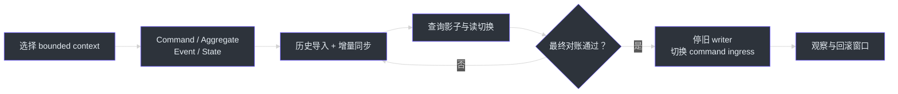
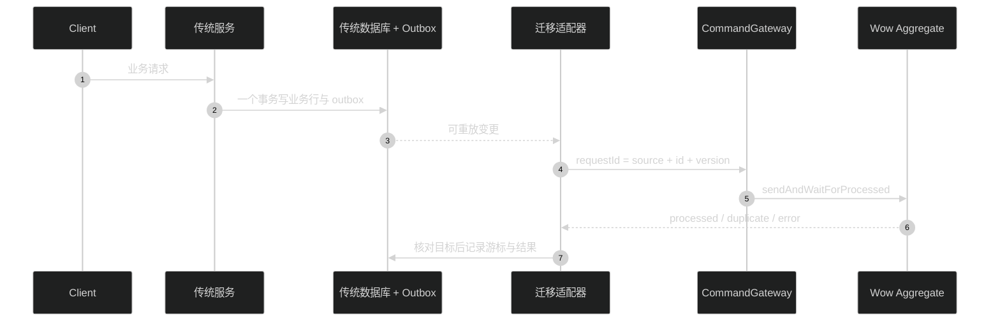
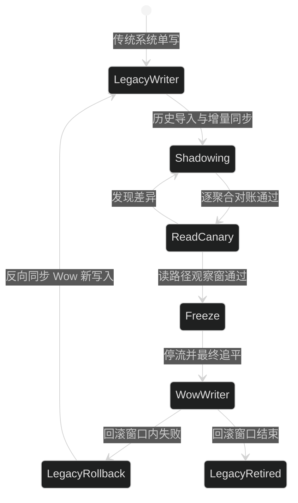

# 传统架构迁移

本指南面向尚未使用 Wow 的传统 CRUD 系统。目标不是一次性重写全部服务，而是以一个
bounded context 为单位建立 Wow 领域模型，在**始终只有一个业务写入权威**的前提下完成
历史导入、增量追平、读路径切换和最终写路径切换。

如果系统已经运行 Wow v6，请改读 [Wow v6 迁移到 v8](./v6-to-v8.md)。

## 迁移总览

| 阶段 | 写入权威 | 主要工作 | 完成门禁 | 来源 |
|---|---|---|---|---|
| 0. 选定边界 | 传统系统 | 选择低耦合 bounded context，固定 ID、租户和不变量 | 领域术语、聚合边界与验收用例得到业务确认 | [建模指南](../modeling.md) |
| 1. 建立 Wow 模型 | 传统系统 | 定义 command、aggregate、domain event 与 state sourcing | `AggregateSpec` 覆盖正常、拒绝和幂等路径 | [CreateOrder.kt:31-64](https://github.com/Ahoo-Wang/Wow/blob/main/example/example-api/src/main/kotlin/me/ahoo/wow/example/api/order/CreateOrder.kt#L31-L64)、[OrderSpec.kt:44-113](https://github.com/Ahoo-Wang/Wow/blob/main/example/example-domain/src/test/kotlin/me/ahoo/wow/example/domain/order/OrderSpec.kt#L44-L113) |
| 2. 影子同步 | 传统系统 | 通过 outbox/CDC 发送可重放同步命令；Wow 不承接生产写入 | 延迟、失败队列与逐聚合对账达到阈值 | [CommandFactory.kt:60-103](https://github.com/Ahoo-Wang/Wow/blob/main/wow-core/src/main/kotlin/me/ahoo/wow/command/CommandFactory.kt#L60-L103) |
| 3. 切换读路径 | 传统系统 | 查询转向 Wow snapshot/projection，保留快速回退 | 新旧查询结果在观察窗内一致 | [OrderQueryController.kt:34-45](https://github.com/Ahoo-Wang/Wow/blob/main/example/example-server/src/main/kotlin/me/ahoo/wow/example/server/order/OrderQueryController.kt#L34-L45) |
| 4. 切换写路径 | Wow | 停流、追平、最终对账后把 command ingress 切到 Wow | 旧 writer 已关闭，Wow 写入与监控验证通过 | [CommandGateway.kt:75-159](https://github.com/Ahoo-Wang/Wow/blob/main/wow-core/src/main/kotlin/me/ahoo/wow/command/CommandGateway.kt#L75-L159) |
| 5. 下线旧模型 | Wow | 只读保留旧数据至回滚窗口结束，再移除旧写路径 | 无回滚依赖、无未处置差异、审计记录完整 | [事件存储](../eventstore.md) |



<!-- Sources:
- documentation/docs/zh/guide/modeling.md
- example/example-api/src/main/kotlin/me/ahoo/wow/example/api/order/CreateOrder.kt:31-64
- example/example-domain/src/main/kotlin/me/ahoo/wow/example/domain/order/Order.kt:55-137
- example/example-domain/src/main/kotlin/me/ahoo/wow/example/domain/order/OrderState.kt:39-99
-->

## 1. 先迁移边界，不先迁移表

表结构通常同时承载多个业务概念，不能直接等价为 aggregate。先从业务用例反推 command，
再确定单个 aggregate 内必须原子保持的不变量；跨 aggregate 协作使用 domain event、Saga 或
projection。当前示例把 `CreateOrder` 建模为创建命令，把规则放在 `Order`，并由
`OrderState.onSourcing` 重建状态，而不是在 handler 内直接修改状态。

- [`CreateOrder.kt:31-64`](https://github.com/Ahoo-Wang/Wow/blob/main/example/example-api/src/main/kotlin/me/ahoo/wow/example/api/order/CreateOrder.kt#L31-L64)
- [`Order.kt:55-137`](https://github.com/Ahoo-Wang/Wow/blob/main/example/example-domain/src/main/kotlin/me/ahoo/wow/example/domain/order/Order.kt#L55-L137)
- [`OrderState.kt:39-99`](https://github.com/Ahoo-Wang/Wow/blob/main/example/example-domain/src/main/kotlin/me/ahoo/wow/example/domain/order/OrderState.kt#L39-L99)

开始迁移前必须固定以下映射：

| 传统模型 | Wow 模型 | 迁移约束 |
|---|---|---|
| 主键 | `AggregateId.id` | 同一 `NamedAggregate` 内必须跨 tenant 唯一；全局唯一主键可原样保留，tenant-local 主键必须先完成碰撞审计和确定性映射 |
| 租户字段 | `tenantId` | 导入、同步与在线 command 使用同一映射 |
| 乐观锁/更新时间 | command `requestId` 与源版本 | 用于幂等和乱序检测，不能只依赖消费 offset |
| 行状态 | domain event 序列 | 用业务事实表达变化，不把当前行机械拆成伪事件历史 |
| 联表查询 | snapshot/projection | 独立设计读模型，不让聚合承担跨边界查询 |

`AggregateId.id` 的唯一性范围是 `NamedAggregate`，不是 `(tenantId, id)`。Redis 会显式拒绝同一
named aggregate 下跨 tenant 的重复 ID；MongoDB 的 event-stream 唯一索引和 Elasticsearch 的文档
ID 也不包含 tenant。若旧系统主键只在 tenant 内唯一，应使用经过版本控制、无歧义的确定性编码
或 UUID v5 等方式生成复合 ID，并保存映射 manifest；历史导入、CDC、在线 command、查询和回滚
必须复用同一映射，不能在每次导入时重新生成。
[`AggregateId.kt:23-26`](https://github.com/Ahoo-Wang/Wow/blob/main/wow-api/src/main/kotlin/me/ahoo/wow/api/modeling/AggregateId.kt#L23-L26)
[`EventStreamSchemaInitializer.kt:65-70`](https://github.com/Ahoo-Wang/Wow/blob/main/wow-mongo/src/main/kotlin/me/ahoo/wow/mongo/EventStreamSchemaInitializer.kt#L65-L70)
[`ElasticsearchEventStreamAppender.kt:38-43`](https://github.com/Ahoo-Wang/Wow/blob/main/wow-elasticsearch/src/main/kotlin/me/ahoo/wow/elasticsearch/eventsourcing/ElasticsearchEventStreamAppender.kt#L38-L43)

## 2. 用单写者完成历史导入与增量追平

迁移期间不要让一个 HTTP 请求依次写传统数据库和 EventStore。第二次写入失败时，两套状态
无法自动原子回滚。推荐保留传统数据库为唯一 writer，通过同一事务中的 outbox 或可恢复 CDC
发布变更，再由迁移适配器发送幂等 command。



<!-- Sources:
- wow-core/src/main/kotlin/me/ahoo/wow/command/CommandFactory.kt:60-103
- wow-core/src/main/kotlin/me/ahoo/wow/command/CommandGateway.kt:75-159
- example/example-domain/src/main/kotlin/me/ahoo/wow/example/domain/order/Order.kt:105-137
-->

历史导入也走 command 边界，显式复用已确定的业务 ID 映射，并使用稳定 `requestId` 阻止重复
写入。重复 `requestId` 不会自动返回上一次成功结果；`sendAndWaitForProcessed` 会以
`CommandResultException` 报告 `DuplicateRequestId`。迁移器只能在核对目标 event/state 与源版本
一致后把该结果视为 already-applied，再推进游标。批处理保持响应式；只有独立离线进程的最外层
入口可以等待完成，服务请求链和 Wow 核心路径中不要调用 `block()`。

```kotlin
fun importOrders(rows: Iterable<LegacyOrder>): Mono<Void> =
    Flux.fromIterable(rows)
        .concatMap(::importOrder)
        .then()

private fun importOrder(row: LegacyOrder): Mono<Void> {
    val aggregateId = legacyOrderIdMapping.requireTargetId(row.tenantId, row.id)
    val command = ImportLegacyOrder.from(row).toCommandMessage(
        aggregateId = aggregateId,
        tenantId = row.tenantId,
        requestId = legacyOrderRequestId(row),
    )
    return commandGateway.sendAndWaitForProcessed(command)
        .then()
        .onErrorResume(CommandResultException::class.java) { error ->
            if (error.commandResult.errorCode != ErrorCodes.DUPLICATE_REQUEST_ID) {
                return@onErrorResume Mono.error(error)
            }
            verifyImportedOrder(
                tenantId = row.tenantId,
                aggregateId = aggregateId,
                sourceVersion = row.version,
            )
        }
}
```

`toCommandMessage` 允许显式传入 `aggregateId`、`tenantId`、`requestId` 与期望版本；
`sendAndWaitForProcessed` 在 aggregate 已处理 command 后完成。示例中的 `verifyImportedOrder` 必须读取
目标 event/state 并核对源版本；不得仅捕获 `DuplicateRequestId` 后无条件吞掉错误。
`legacyOrderRequestId` 应使用带版本、无歧义的编码，不能直接拼接可能包含分隔符的原始字段。
`legacyOrderIdMapping`、`legacyOrderRequestId` 与 `verifyImportedOrder` 均为迁移适配器需要实现的
示意函数，不是 Wow 框架 API。
[`CommandFactory.kt:60-103`](https://github.com/Ahoo-Wang/Wow/blob/main/wow-core/src/main/kotlin/me/ahoo/wow/command/CommandFactory.kt#L60-L103)
[`CommandGateway.kt:127-143`](https://github.com/Ahoo-Wang/Wow/blob/main/wow-core/src/main/kotlin/me/ahoo/wow/command/CommandGateway.kt#L127-L143)
[`DefaultCommandGateway.kt:86-95`](https://github.com/Ahoo-Wang/Wow/blob/main/wow-core/src/main/kotlin/me/ahoo/wow/command/DefaultCommandGateway.kt#L86-L95)
[`DefaultCommandGateway.kt:228-255`](https://github.com/Ahoo-Wang/Wow/blob/main/wow-core/src/main/kotlin/me/ahoo/wow/command/DefaultCommandGateway.kt#L228-L255)

::: warning 不伪造历史
只有确有可信业务事实和顺序时才重建历史 domain event。只有当前行快照时，应发出明确的
`LegacyOrderImported`/`OrderBaselineEstablished` 事件，保留来源、源版本和导入时间；不要把当前状态
臆造成一串从未发生过的业务事件。
:::

## 3. 对账后分别切换读与写

对账至少按 `(tenantId, aggregateId)` 比较存在性、关键业务字段、状态、金额/数量、源版本与
最后同步时间。总数相同不代表逐聚合一致。所有差异必须分类为可重试、已接受或阻断切换。



<!-- Sources:
- example/example-server/src/main/kotlin/me/ahoo/wow/example/server/order/OrderQueryController.kt:34-45
- wow-core/src/main/kotlin/me/ahoo/wow/command/CommandGateway.kt:75-159
- wow-core/src/main/kotlin/me/ahoo/wow/eventsourcing/snapshot/SnapshotStore.kt:35-71
-->

先切读路径通常更容易回退：按租户、用户或请求比例把查询指向
`SnapshotQueryService`/projection，并在后台继续比对旧查询。写切换必须安排短暂停流：

1. 关闭入口并等待传统事务、outbox/CDC 与迁移适配器全部排空。
2. 固化源端游标，执行最后一次逐聚合对账。
3. 禁用传统 writer，再开放 Wow command ingress。
4. 验证创建、更新、拒绝路径、查询可见性、监控与告警。
5. 回滚窗口内保留旧数据只读；若 Wow 已产生新写入，回滚前必须先反向同步这些写入。

## 4. 领域模型继续演进

迁移完成后，新增可选字段仍要有安全默认值；删除、改名或改类型不能只依赖 JSON 宽松解析。
Wow 在 `DomainEventRecord` 物化领域事件前调用按顺序注册的 `EventUpgrader`，可把旧事件记录转换为
当前形状。
[`DomainEventRecord.kt:71-89`](https://github.com/Ahoo-Wang/Wow/blob/main/wow-core/src/main/kotlin/me/ahoo/wow/serialization/event/DomainEventRecord.kt#L71-L89)
[`EventUpgraderFactory.kt:37-73`](https://github.com/Ahoo-Wang/Wow/blob/main/wow-core/src/main/kotlin/me/ahoo/wow/event/upgrader/EventUpgraderFactory.kt#L37-L73)
[`EventUpgraderFactory.kt:89-115`](https://github.com/Ahoo-Wang/Wow/blob/main/wow-core/src/main/kotlin/me/ahoo/wow/event/upgrader/EventUpgraderFactory.kt#L89-L115)

## 完成检查清单

- [ ] bounded context、aggregate、跨 tenant 唯一 ID、tenant 与所有权映射已固定
- [ ] command handler、state sourcing 与领域测试覆盖主要不变量和失败路径
- [ ] 历史导入和增量同步具有稳定 `requestId`、duplicate 核对、重试、死信和游标
- [ ] 迁移期间始终只有一个业务 writer
- [ ] 逐聚合对账通过，差异均有明确处置
- [ ] 读路径和写路径分别灰度，切换与回滚演练通过
- [ ] 回滚窗口内旧数据保持只读，Wow 新写入具备反向同步方案
- [ ] 监控覆盖同步延迟、失败量、对账差异和 command 处理结果

## 相关页面

| 页面 | 关系 |
|---|---|
| [迁移指南](../migration.md) | 选择迁移路径 |
| [Wow v6 迁移到 v8](./v6-to-v8.md) | 已采用 Wow 的版本升级 |
| [建模](../modeling.md) | 聚合、command、event 与 state 设计 |
| [测试套件](../test-suite.md) | 用 `AggregateSpec` 固化领域行为 |
| [查询服务](../query.md) | snapshot/projection 读模型与查询切换 |
| [事件存储](../eventstore.md) | 事件流持久化与回放 |
