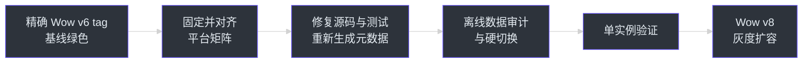
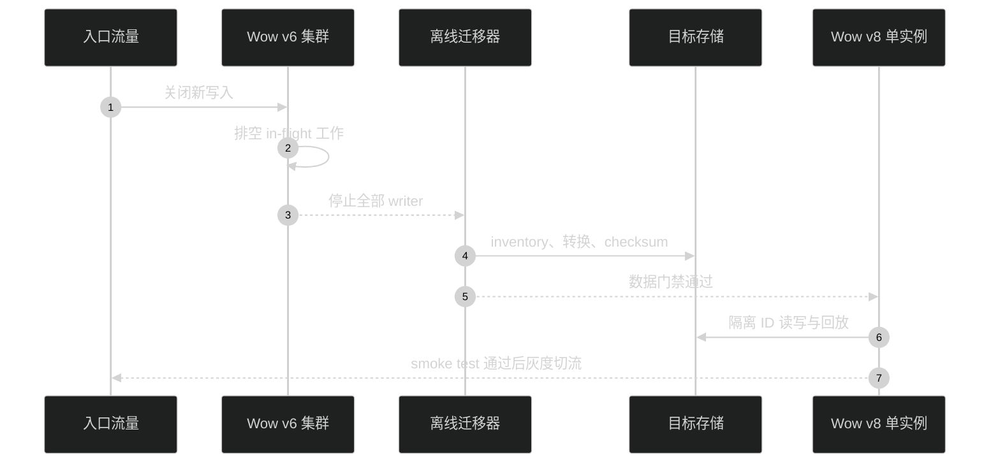
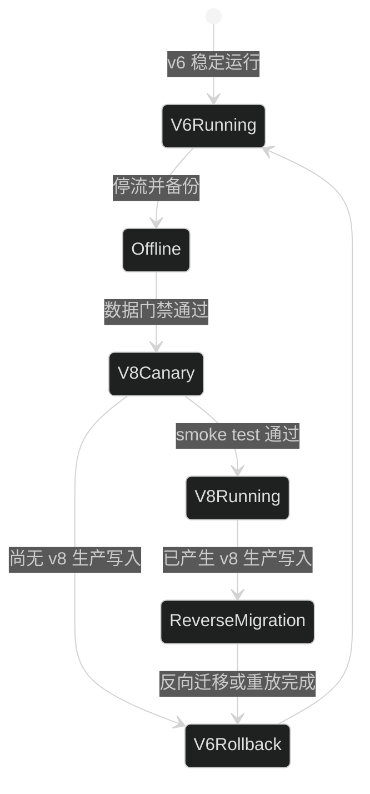

# Wow v6 迁移到 v8

本文只处理已经使用 Wow v6 的系统升级到 Wow v8。传统 CRUD 系统首次采用 Wow，请改读
[传统架构迁移](./traditional-architecture.md)。

Wow v6 与 v8 都要求 Java 17+，但平台差异取决于精确 v6 tag。较早的 `v6.8.0` 使用
Spring Boot 3.5 与 Kotlin 2.2，最新 `v6.21.5` 已使用 Spring Boot 4.0 与 Kotlin 2.3；
必须固定并检查源 tag，不能把“v6”视为单一平台。当前 v8 依赖基线包括 Spring Boot 4.1、
Kotlin 2.4、CosId 3.2、CoAPI 2.1 与 CoCache 4.2。
[`v6.8.0 版本基线`](https://github.com/Ahoo-Wang/Wow/blob/v6.8.0/gradle/libs.versions.toml)
[`v6.21.5 版本基线`](https://github.com/Ahoo-Wang/Wow/blob/v6.21.5/gradle/libs.versions.toml)
[`gradle/libs.versions.toml:3-18`](https://github.com/Ahoo-Wang/Wow/blob/main/gradle/libs.versions.toml#L3-L18)
[`gradle/libs.versions.toml:32-33`](https://github.com/Ahoo-Wang/Wow/blob/main/gradle/libs.versions.toml#L32-L33)

## 迁移总览

| 阶段 | 目标 | 完成门禁 | 主要风险 | 来源 |
|---|---|---|---|---|
| 0. 固化 v6 基线 | 先升级到最新 v6，清除弃用 API | v6 全量测试通过，事件/快照/消息数量有基线 | 带着旧缺陷跨平台定位困难 | [v6.21.5 Release](https://github.com/Ahoo-Wang/Wow/releases/tag/v6.21.5) |
| 1. 平台对齐 | 对精确源 tag 与目标做差异矩阵；只升级确有差异的 Boot、Jackson、Kotlin 与相关依赖 | 编译、单测、集成测试通过 | 误以为所有 v6 都是 Boot 3、Boot 模块化、`tools.jackson` 包名与第三方 starter 不兼容 | [v6.21.5 versions](https://github.com/Ahoo-Wang/Wow/blob/v6.21.5/gradle/libs.versions.toml)、[v8.0.0 Release](https://github.com/Ahoo-Wang/Wow/releases/tag/v8.0.0) |
| 2. Wow API 适配 | 修复 v8 各小版本的源码破坏 | 领域、消息、查询、测试 DSL 全部重新编译 | `CommandGateway`、生命周期扩展与内部存储 API 已变化 | [CommandGateway.kt:75-159](https://github.com/Ahoo-Wang/Wow/blob/main/wow-core/src/main/kotlin/me/ahoo/wow/command/CommandGateway.kt#L75-L159) |
| 3. 数据预迁移 | 在停流条件下完成 Redis/Mongo 审计与转换 | checksum、版本、ID 索引、回放一致 | v8.9 Redis canonical v2 不兼容旧布局 | [RedisEventSourcingAutoConfiguration.kt:200-243](https://github.com/Ahoo-Wang/Wow/blob/main/wow-spring-boot-starter/src/main/kotlin/me/ahoo/wow/spring/boot/starter/redis/RedisEventSourcingAutoConfiguration.kt#L200-L243) |
| 4. 隔离验证与切流 | 单实例 smoke test 后再灰度扩容 | 读写、回放、快照、查询与停机验证通过 | 新旧 writer 混跑会破坏快照和 Redis 回滚边界 | [SnapshotStore.kt:57-71](https://github.com/Ahoo-Wang/Wow/blob/main/wow-core/src/main/kotlin/me/ahoo/wow/eventsourcing/snapshot/SnapshotStore.kt#L57-L71) |



<!-- Sources:
- https://github.com/Ahoo-Wang/Wow/releases/tag/v8.0.0
- README.zh-CN.md:47-49
- gradle/libs.versions.toml:3-18
- gradle/libs.versions.toml:32-33
-->

禁止把旧集群直接做混合版本滚动升级。先在隔离环境完成平台编译与数据演练，再停入口、
排空全部旧 writer、完成数据切换，最后只启动一个 v8 实例验证。



<!-- Sources:
- wow-spring-boot-starter/src/main/kotlin/me/ahoo/wow/spring/boot/starter/redis/RedisEventSourcingAutoConfiguration.kt:200-243
- wow-core/src/main/kotlin/me/ahoo/wow/eventsourcing/snapshot/SnapshotStore.kt:57-71
- wow-mongo/src/main/kotlin/me/ahoo/wow/mongo/MongoDatabaseContextGuard.kt:30-65
-->



<!-- Sources:
- wow-redis/src/main/kotlin/me/ahoo/wow/redis/eventsourcing/RedisEventStore.kt
- wow-spring-boot-starter/src/main/kotlin/me/ahoo/wow/spring/boot/starter/redis/RedisEventSourcingAutoConfiguration.kt:236-243
- wow-core/src/main/kotlin/me/ahoo/wow/eventsourcing/snapshot/SnapshotStore.kt:57-71
-->

## Spring Boot 4 与 Jackson 3

如果固定的 v6 源 tag 仍使用 Spring Boot 3 与 Jackson 2，则 v8 迁移必须包含 Spring Boot 4
与 Jackson 3 的源码适配；直接引用 Jackson `ObjectMapper`、`JsonNode`、Spring Boot
auto-configuration 类或自建 starter 的应用都要显式处理。`v6.21.5` 已使用 Spring Boot 4.0
与 `tools.jackson` 命名空间，从该基线出发只审计精确 source/target delta，不要重复已经完成的
平台主版本迁移。无论源 tag 如何，都不要在固定的 v8 目标下强制回退 Spring Boot 3 或
Jackson 2。Spring Boot 官方建议先使用 classic starter 作为短期编译过渡，再收敛到按功能拆分的 starter。

- [Wow v8.0.0 Release](https://github.com/Ahoo-Wang/Wow/releases/tag/v8.0.0)
- [Spring Boot 4.0 Migration Guide](https://github.com/spring-projects/spring-boot/wiki/Spring-Boot-4.0-Migration-Guide)
- [`v6.21.5 JsonSerializer.kt`](https://github.com/Ahoo-Wang/Wow/blob/v6.21.5/wow-core/src/main/kotlin/me/ahoo/wow/serialization/JsonSerializer.kt)
- [`v6.21.5 SerializationAutoConfiguration.kt`](https://github.com/Ahoo-Wang/Wow/blob/v6.21.5/wow-spring-boot-starter/src/main/kotlin/me/ahoo/wow/spring/boot/starter/serialization/SerializationAutoConfiguration.kt)
- [`JsonSerializer.kt:14-51`](https://github.com/Ahoo-Wang/Wow/blob/main/wow-core/src/main/kotlin/me/ahoo/wow/serialization/JsonSerializer.kt#L14-L51)
- [`SerializationAutoConfiguration.kt:14-30`](https://github.com/Ahoo-Wang/Wow/blob/main/wow-spring-boot-starter/src/main/kotlin/me/ahoo/wow/spring/boot/starter/serialization/SerializationAutoConfiguration.kt#L14-L30)

## 通用升级步骤

### 升级步骤

1. **备份数据**：在升级前备份事件存储和快照数据
2. **阅读更新日志**：查看 [Release Notes](https://github.com/Ahoo-Wang/Wow/releases)
3. **更新依赖版本**：修改 build.gradle.kts 或 pom.xml
4. **运行测试**：确保所有测试通过
5. **硬切后灰度**：停流完成数据切换，只启动一个 v8 实例验证，再灰度切流并仅扩容 v8 实例

### 依赖版本更新

::: code-group
```kotlin [Gradle(Kotlin)]
// 更新 wow 版本
implementation("me.ahoo.wow:wow-spring-boot-starter:8.10.3")
```
```xml [Maven]
<dependency>
    <groupId>me.ahoo.wow</groupId>
    <artifactId>wow-spring-boot-starter</artifactId>
    <version>8.10.3</version>
</dependency>
```
:::

### 破坏性变更检查

升级前请检查以下内容：

1. **API 变更**：检查是否有接口签名变更
2. **配置变更**：检查配置属性是否有变更
3. **元数据变更**：重新生成元数据文件

## 统一运行时编排

运行时生命周期迁移已经拆分为独立专题，使本页保持升级索引职责：

- [运行时编排迁移](./runtime-orchestration.md) 说明源码破坏性变更、
  自定义组件与消息总线、Spring 所有权、验证和回滚；
- [运行时生命周期](../advanced/runtime-lifecycle.md) 说明迁移后的稳定架构与停机语义。

该迁移会改变生命周期扩展契约，但不改变 event、snapshot 与 message 格式，无需迁移
数据。

## 移除版本化快照检查点

v8.9.0 引入的版本化快照检查点能力已被移除，且不提供兼容层。`VersionedSnapshotStore`、
`VersionIntervalCheckpointStrategy`、`CompositeSnapshotStrategy`、对应的 metrics/tracing 装饰器及
`SnapshotCheckpointProperties` 均不再存在。`wow.eventsourcing.snapshot.checkpoint.*` 配置将被忽略，
不再产生 `wow.snapshot.checkpoint.*` 指标与 checkpoint span。该能力没有替代接口；应用应使用仅保存和
加载最新快照的 `SnapshotStore`。

MongoDB 中既有的 `*_snapshot_checkpoint` collection 不再被读取、写入、扫描或自动删除。升级前应备份
event 与 snapshot 数据、停止全部旧版本 writer，并仅在确认不再需要后清理这些 collection。回滚必须
恢复旧运行时并保留其 checkpoint 数据；不支持新旧版本混合部署。

来源：[`refactor(snapshot): remove versioned checkpoint support (#2831)`](https://github.com/Ahoo-Wang/Wow/pull/2831)、
[`SnapshotStore.kt:24-71`](https://github.com/Ahoo-Wang/Wow/blob/main/wow-core/src/main/kotlin/me/ahoo/wow/eventsourcing/snapshot/SnapshotStore.kt#L24-L71)。

## SnapshotStore 原子保存

`SnapshotStore.save()` 的 JVM 签名与快照格式保持不变，但存储契约得到加强：
每个聚合必须使用一次原子 compare-and-write。候选聚合版本大于或等于已存版本时
完整替换快照；版本较低时正常完成且不写入。同版本覆盖是有意行为，使快照重建
路由可以修复陈旧 payload。

自定义 `SnapshotStore` 必须使用后端 CAS、条件更新、事务或等价的原子原语；
客户端先 `load()` 再无条件写入不符合契约。候选快照应只物化一次，比较版本必须
取自同一个待写 payload。在依赖此保证前，应停止全部旧 writer 并排空在途写入：
旧 MongoDB 或 Redis writer 仍可能使新快照版本倒退，旧 Elasticsearch writer
也不会执行同版本覆盖。无需重写数据。回滚会恢复旧保存行为，因此新旧 writer
不得并行运行。

`wow-mongo` 的条件更新使用了要求 MongoDB 5.2 或更高版本的 MQL 表达式；
集成测试验证的版本为 MongoDB 6.0.6。现有服务端版本较低时，必须先升级
MongoDB，再部署此版本运行时。

来源：[`SnapshotStore.kt:57-71`](https://github.com/Ahoo-Wang/Wow/blob/main/wow-core/src/main/kotlin/me/ahoo/wow/eventsourcing/snapshot/SnapshotStore.kt#L57-L71)、
[`MongoSnapshotStore.kt`](https://github.com/Ahoo-Wang/Wow/blob/main/wow-mongo/src/main/kotlin/me/ahoo/wow/mongo/MongoSnapshotStore.kt)、
[`RedisSnapshotStore.kt`](https://github.com/Ahoo-Wang/Wow/blob/main/wow-redis/src/main/kotlin/me/ahoo/wow/redis/eventsourcing/RedisSnapshotStore.kt)、
[`ElasticsearchSnapshotStore.kt`](https://github.com/Ahoo-Wang/Wow/blob/main/wow-elasticsearch/src/main/kotlin/me/ahoo/wow/elasticsearch/eventsourcing/ElasticsearchSnapshotStore.kt)。

## Redis EventStore Canonical v2 布局（v8.9.0 引入）

从 v6.x、v8.6.x 或 v8.8.x 升级到 v8.9.0+ 时，必须把 Redis 持久化视为存储格式硬切换。
v6.21.5 与 v8.6.x 使用 legacy event Key 和 shared request-ID SET；v8.8.x 使用 per-stream request SET
与 bucketed ID 索引。Redis EventStore、Redis SnapshotStore 与 Redis PrepareKey 只读写 canonical v2
Key，不提供旧布局回退、双写或内置迁移器；旧运行时也无法读取新的 v2 写入。新 EventStore 还会
强制同一个 named aggregate 下的 `AggregateId.id` 在所有租户之间唯一。

Spring Boot starter 会精确检查已发布 v6/v8.6 shared layout 与 v8.8 bucketed layout 成功写入时
必然创建的哨兵 Key。检查范围仅包括解析到自动配置 `RedisEventStore` 的本地聚合，不在运行时使用
`SCAN`，因此支持 Redis Cluster；发现不兼容数据会阻止启动。该守卫不覆盖直接使用库、独立构造的
自定义 store、已从元数据移除的聚合或仅将 snapshot 路由到 Redis 的场景。旧 snapshot 没有与
aggregate 无关的精确哨兵。canonical v2 会忽略旧 snapshot Key；缺少 v2 snapshot 时，聚合加载会
回放事件，但普通加载不会自动持久化重建后的 snapshot。

精确 Key 守卫不能替代离线数据审计。历史 alias 变更、Key eviction、手工删除或破坏旧索引，都可能让
哨兵消失但留下孤立事件流。解析后的 context alias（已配置 alias 时使用 alias，否则使用 `contextName`）
与 aggregate name 共同构成 v2 持久化 Key scope。迁移 manifest 必须固定每个历史 source alias 到目标
resolved alias 的映射；写入后变更 resolved alias 或 aggregate name 必须另做离线 Key 迁移。

必须采用离线切换：

1. 停止入口流量和全部旧版本 writer，将 in-flight append 排空为零，再创建一致的 Redis 备份并记录
   事件数量与版本基线。禁止新旧版本混合滚动发布。
2. 在每个 Cluster primary 的每个 logical database 中盘点全部旧 event ZSET、v6/v8.6 shared request SET、
   v8.8 per-stream request SET、v8.8 bucket ids ZSET、旧 snapshot 与 PrepareKey Hash；记录 source Key、
   Redis type、cardinality、checksum 与 target mapping。历史 Key 中的 identity 只用于定位，最终身份以
   event/snapshot JSON 为准。
3. 按 named aggregate 审计不同租户之间是否存在重复 `AggregateId.id`。迁移前必须解决所有冲突；
   canonical v2 有意不允许同一个 ID 存在两个所有者。
4. 首次运行必须要求 v2 目标 scope 为空。可丢弃数据只能清除 inventory 中的旧 Key，或使用空的专用
   database；与 message bus 或应用数据共库时禁止 `FLUSHDB`。完整源数据集保持不可变以供回滚。
5. 使用单独评审的离线迁移器。持久化 manifest 必须记录 source Key、target Keys、源/目标 checksum、
   状态和最后完成批次。恢复执行时只有 manifest 与 checksum 一致才能复用 target，否则失败且不得覆盖。
   复制必须幂等；缺少 manifest 复核的半成品 target 不得被接受。
6. 保持每个 event ZSET member 与 score，校验 identity 一致且 score/version 连续。v2 request-ID SET 以
   已提交事件 JSON 为唯一权威来源。对 v6/v8.6，必须双向比较 shared SET 与
   `union(event.requestId)`，分别报告 shared-only 与 event-only 差异，禁止 fan-out。对 v8.8，逐流计算
   source SET 与该流事件 requestId 的 symmetric difference。差集非空时必须失败，除非记录了明确且
   已评审的处置策略。
7. 在 128 个 bucket 空间中重建所有非空聚合 ID 索引。bucket 公式是
   `aggregateId.id.hashCode().mod(128)`，使用 Java/Kotlin UTF-16 `String.hashCode`；Key 与 member 必须
   严格使用 canonical v2 codec。运行时不会执行该转换。
8. 校验有序 member+score checksum、首尾版本、request-ID 集合、完整 ID 索引、aggregate-ID scan 结果
   和代表性状态回放。失败时必须保留 manifest 和最后验证 cursor，随后清理半成品或从该 cursor 恢复；
   此期间不得启动应用。
9. 全部验证通过后，原地迁移必须移除或迁出 inventory 中的每个旧 Key；哨兵 Key 最后删除，随后重新
   inventory 并要求旧 Key 为零。使用独立 target database 时，完整源数据集在回滚观察期内保持只读。
10. 先让一个新实例连接 target 并完成隔离 ID 的读写 smoke test。显式执行 snapshot regeneration，校验
    snapshot 数量与版本后再切流量和扩容。应依据完整 inventory 调用单 ID regenerate 路由；只有审计
    证明全部 ID 严格大于 `AggregateIdScanner.FIRST_ID` 时，batch 路由才能视为不会漏项。

回滚必须同时切换应用与数据。尚无生产 v2 写入时，可以重新连接未改动的旧数据集并启动旧运行时；一旦
已有生产 v2 写入，必须先停止流量和全部 v2 writer，再反向迁移或重放这些写入，之后才能启动旧运行时。
仅恢复切换时备份会丢失此后的所有 v2 写入。推荐使用独立 target database/namespace。

强制精确 Key 检查属于启动期内部不变量，不提供关闭开关，也不作为兼容或迁移配置暴露。

Redis 布局内部 API 有意不保持源码、JVM 二进制与行为兼容。已移除 `AggregateKeyConverter`、
`RedisWrappedKey`、`RedisSnapshotRepository`、`EventStreamKeyConverter`、`DefaultSnapshotKeyConverter`、
`PrepareKeyConverter` 与 `RedisEventStore.SCRIPT_EVENT_STEAM_APPEND`；同时移除
`redisSnapshotRepository` Bean alias 和自定义 snapshot-key converter 构造参数。新的
`SCRIPT_EVENT_STREAM_APPEND` 为 internal，不提供公开替代。canonical converter 输出已改变，PrepareKey
现在包含 `name`，v2 会拒绝空 aggregate/prepare ID 与 unpaired UTF-16 surrogate。应用代码应使用
`EventStore`、`SnapshotStore` 与 `PrepareKey`；单独评审的离线工具应独立实现并校验 v2 codec。

来源：[`RedisEventStore.kt`](https://github.com/Ahoo-Wang/Wow/blob/main/wow-redis/src/main/kotlin/me/ahoo/wow/redis/eventsourcing/RedisEventStore.kt)、
[`RedisKeyComponentCodec.kt:22-69`](https://github.com/Ahoo-Wang/Wow/blob/main/wow-redis/src/main/kotlin/me/ahoo/wow/redis/RedisKeyComponentCodec.kt#L22-L69)、
[`RedisEventSourcingAutoConfiguration.kt:166-185`](https://github.com/Ahoo-Wang/Wow/blob/main/wow-spring-boot-starter/src/main/kotlin/me/ahoo/wow/spring/boot/starter/redis/RedisEventSourcingAutoConfiguration.kt#L166-L185)、
[`v6.21.5 EventStreamKeyConverter.kt:21-33`](https://github.com/Ahoo-Wang/Wow/blob/v6.21.5/wow-redis/src/main/kotlin/me/ahoo/wow/redis/eventsourcing/EventStreamKeyConverter.kt#L21-L33)、
[`v6.21.5 event_steam_append.lua:12-27`](https://github.com/Ahoo-Wang/Wow/blob/v6.21.5/wow-redis/src/main/resources/event_steam_append.lua#L12-L27)。

## Mongo 所有权保护

本次升级保留仅含 aggregate name 的 Mongo collection 命名，但新增持久化
`wow_database_metadata` 所有权标记。支持的部署布局是一个 MongoDB database 只属于一个 bounded
context。

上线前：

1. 检查所有已配置的 event-stream、snapshot 与 prepare database，以及其中的 `*_event_stream`、
   `*_snapshot` 和 `prepare_*` collection。
2. 确认每个 database 只属于一个 `wow.context-name`；历史混写数据库必须先拆分。
3. 先升级数据库的真实所有者。第一个新版本实例会扫描存量 aggregate collection，再原子认领标记。
   存量 `prepare_*` 文档没有 context 元数据，因此 prepare-only database 会由首个升级 context 认领，
   上线前必须先审计其映射关系。
4. 审计现有受管索引。缺失索引会创建；key 顺序、unique、TTL、partial filter、collation、sparse 或
   hidden 选项不兼容时会阻止启动，必须执行受控迁移。

不要通过修改所有权标记绕过 context 冲突。应先迁移或删除旧数据；只有明确重新分配空数据库时才删除
标记。

来源：[`MongoDatabaseContextGuard.kt:30-132`](https://github.com/Ahoo-Wang/Wow/blob/main/wow-mongo/src/main/kotlin/me/ahoo/wow/mongo/MongoDatabaseContextGuard.kt#L30-L132)。

## 验证清单

- [ ] v6 已升级到最新维护版本，弃用 API 已清除
- [ ] Spring Boot 4、Jackson 3 与所有第三方 starter 已完成兼容性检查
- [ ] 所有 domain、server、integration test 与 KSP 元数据已重新编译
- [ ] event、snapshot、PrepareKey、Redis Key 与 Mongo database 已完成 inventory
- [ ] 数据迁移 manifest、checksum、ID 索引与代表性事件回放一致
- [ ] 单个 v8 实例的读写、查询、快照重建、监控和优雅停机通过
- [ ] 回滚窗口、旧数据只读保留期与 v8 新写入反向迁移方案已经演练

## 相关页面

| 页面 | 关系 |
|---|---|
| [迁移指南](../migration.md) | 选择迁移路径 |
| [传统架构迁移](./traditional-architecture.md) | 面向首次采用 Wow 的系统改造 |
| [运行时编排迁移](./runtime-orchestration.md) | v8 当前生命周期源码破坏与扩展迁移 |
| [运行时生命周期](../advanced/runtime-lifecycle.md) | 迁移后的稳定运行模型 |
| [Redis 扩展](../extensions/redis.md) | Redis 配置与 canonical v2 启动守卫 |
| [Mongo 扩展](../extensions/mongo.md) | Mongo 存储与 database 所有权约束 |
