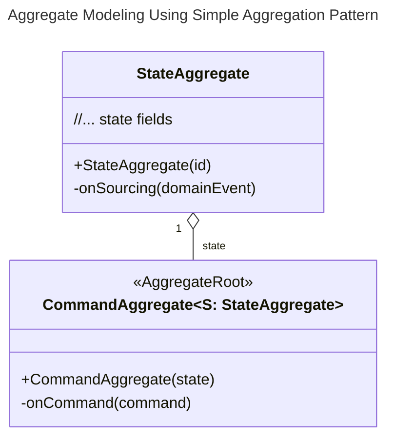
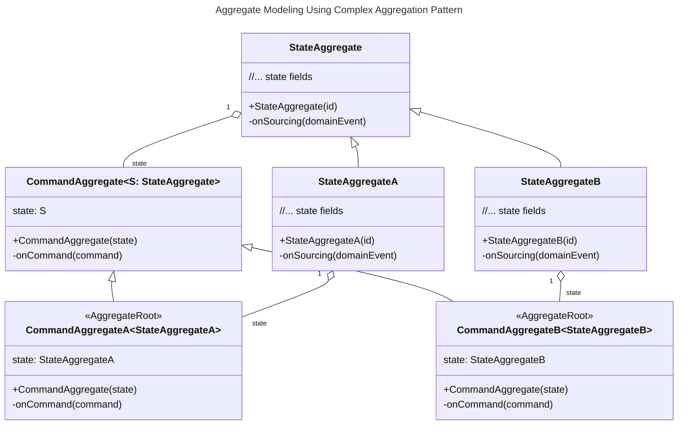
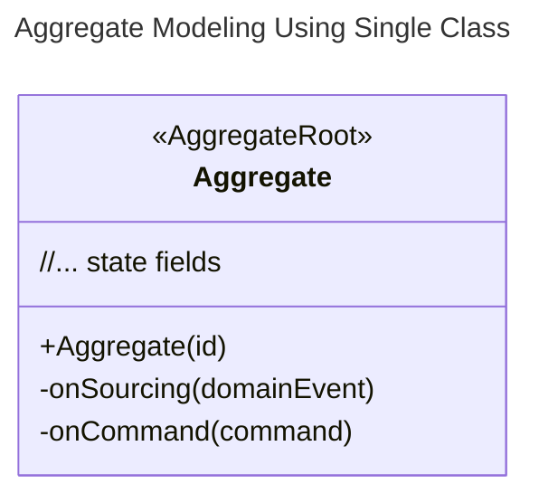
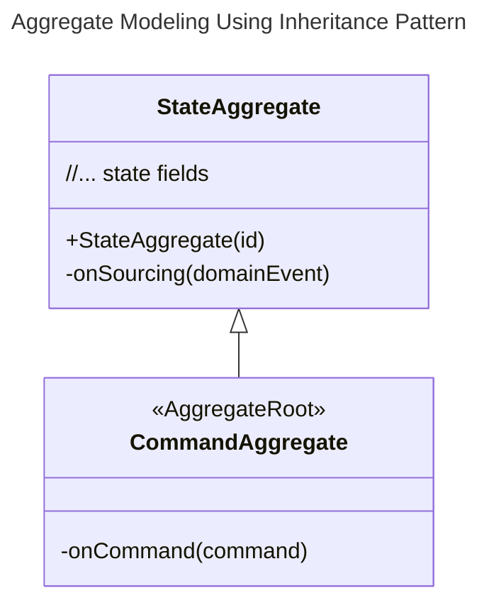

# 聚合根建模

## 风格

:::info
Wow 框架同时支持 Kotlin 和 Java 进行聚合建模。[银行转账示例](../reference/example/transfer)展示了一个完整的 Java 聚合。Kotlin 的默认参数值和伴生对象等特性在 Java 中不可用，但所有核心注解（`@OnCommand`、`@OnSourcing`、`@AggregateRoot` 等）在两种语言中完全一致。
:::

### 聚合模式 (推荐)

聚合模式将命令函数、溯源函数(包含聚合状态数据)分别放置在不同的类中，这样做的好处是可以避免命令函数直接变更聚合状态数据的问题(将`setter`访问器设置为`private`)。
同时职责分离也使得聚合根的命令函数更加专注于命令处理，溯源函数更加专注于聚合状态数据的变更。


#### 简单聚合模式

<center>


```mermaid
---
title: Aggregate Modeling Using Simple Aggregation Pattern
---
classDiagram
    class StateAggregate {
        +StateAggregate(id)
        //... state fields
        -onSourcing(domainEvent)
    }
    class CommandAggregate~S: StateAggregate~ {
        <<AggregateRoot>>
        +CommandAggregate(state)
        -onCommand(command)
    }

StateAggregate "1" o-- "state" CommandAggregate
```

</center>

#### 复杂聚合模式

<center>


```mermaid
---
title: Aggregate Modeling Using Complex Aggregation Pattern
---
classDiagram
    class StateAggregate {
        +StateAggregate(id)
        //... state fields
        -onSourcing(domainEvent)
    }

    class CommandAggregate~S: StateAggregate~ {
        +CommandAggregate(state)
        state: S
        -onCommand(command)
    }

    class StateAggregateA {
        +StateAggregateA(id)
        //... state fields
        -onSourcing(domainEvent)
    }

    class StateAggregateB {
        +StateAggregateB(id)
        //... state fields
        -onSourcing(domainEvent)
    }

    class CommandAggregateA~StateAggregateA~ {
        <<AggregateRoot>>
        +CommandAggregate(state)
        state: StateAggregateA
        -onCommand(command)
    }

    class CommandAggregateB~StateAggregateB~ {
        <<AggregateRoot>>
        +CommandAggregate(state)
        state: StateAggregateB
        -onCommand(command)
    }

StateAggregate "1" o-- "state" CommandAggregate
StateAggregate <|-- StateAggregateA
StateAggregate <|-- StateAggregateB
CommandAggregate <|-- CommandAggregateA
CommandAggregate <|-- CommandAggregateB
StateAggregateA "1" o-- "state" CommandAggregateA
StateAggregateB "1" o-- "state" CommandAggregateB
```

</center>

### 单一类模式

单一类模式将命令函数、溯源函数以及聚合状态数据放置在一起，这样做的好处是简单直接。

::: danger  违反 Event Sourcing 原则
在单一类模式中，命令函数可以直接修改聚合状态数据，这会导致：
- 状态变更无法通过事件追溯
- 破坏了事件溯源的核心价值
- 可能产生不一致的状态变更

**强烈建议**：仅在简单场景或原型开发中使用此模式。
:::

<center>


```mermaid
---
title: Aggregate Modeling Using Single Class
---
classDiagram
    class Aggregate {
        <<AggregateRoot>>
        +Aggregate(id)
        //... state fields
        -onSourcing(domainEvent)
        -onCommand(command)
    }
```

</center>

### 继承模式

继承模式将状态聚合根作为基类，并且将`setter`访问器设置为`private`。以避免命令聚合根在命令函数中修改聚合状态数据。

<center>


```mermaid
---
title: Aggregate Modeling Using Inheritance Pattern
---
classDiagram
    class StateAggregate {
        +StateAggregate(id)
        //... state fields
        -onSourcing(domainEvent)
    }

    class CommandAggregate {
        <<AggregateRoot>>
        -onCommand(command)
    }

    StateAggregate <|-- CommandAggregate
```

</center>


## 约定

### 命令聚合根

命令聚合根负责定义命令处理函数，处理命令并执行相应的业务逻辑，最终返回领域事件。

- 命令聚合根需要添加 `@AggregateRoot` 注解，以便 `wow-compiler` 模块可以生成相应的元数据定义。
- 命令处理函数的 `@OnCommand` 注解不是必须的，默认情况下将命令处理函数命名为 `onCommand` 即表明该函数为命令处理函数。

### 禁用路由生成

使用 `@AggregateRoute(enabled = false)` 阻止聚合的自动命令路由注册：

```kotlin
@AggregateRoot
@AggregateRoute(enabled = false)
class InternalAggregate(val id: String) {
    // 此聚合不会生成 REST API 端点
}
```
- 命令处理函数的第一个参数可以定义为：具体命令(`AddCartItem`)、命令消息(`CommandMessage<AddCartItem>`)、命令消息交换(`CommandExchange<AddCartItem>`)。
- 命令处理函数的其余参数将从 `IOC` 容器中获取。如果你在 `Spring IOC` 容器中注入了某个实例，可以通过参数直接获取。
- 命令处理函数的返回值为一个或者多个领域事件，该领域事件首先会由状态聚合根通过溯源函数将状态变更为最新状态，然后持久化到 `EventStore`。
  - 当返回值类型不明确时，应通过 `@OnCommand.returns` 进行指定。否则 `wow-compiler` 将无法识别返回的领域事件类型。
- 持久化完成后，将会通过 `DomainEventBus` 发布到事件总线。

```kotlin
@AggregateRoot
class Cart(private val state: CartState) {

    @OnCommand(returns = [CartItemAdded::class, CartQuantityChanged::class])
    fun onCommand(command: AddCartItem): Any {
        require(state.items.size < MAX_CART_ITEM_SIZE) {
            "购物车最多只能添加[$MAX_CART_ITEM_SIZE]个商品."
        }
        state.items.firstOrNull {
            it.productId == command.productId
        }?.let {
            return CartQuantityChanged(
                changed = it.copy(quantity = it.quantity + command.quantity),
            )
        }
        val added = CartItem(
            productId = command.productId,
            quantity = command.quantity,
        )
        return CartItemAdded(
            added = added,
        )
    }
}
```

### AfterCommand 钩子

`@AfterCommand` 注解定义命令处理完成后的后置钩子函数。如果方法返回非空值，该值将作为额外的领域事件追加到事件流中。

```kotlin
class OrderAggregate(val id: String) {
    @OnCommand
    fun onCreateOrder(command: CreateOrder): OrderCreated {
        return OrderCreated(...)
    }

    @AfterCommand
    fun afterCreateOrder(exchange: ServerCommandExchange<*>): OrderConfirmed? {
        val result = exchange.getCommandInvokeResult<OrderCreated>()
        // 执行后置处理，可选择返回额外事件
        return null
    }
}
```

可以使用 `include` 和 `exclude` 过滤触发钩子的命令类型：

```kotlin
@AfterCommand(include = [CreateOrder::class], exclude = [CancelOrder::class])
fun onAfterCommand(exchange: ServerCommandExchange<*>): AdditionalEvent? {
    return null
}
```

支持多个 `@AfterCommand` 函数，通过 `@Order` 控制执行顺序。

### 错误处理 OnError

`@OnError` 注解定义命令处理失败时的错误处理函数：

```kotlin
@OnError
fun onError(command: CreateOrder, error: Throwable) {
    // 处理错误，例如记录日志或发布错误事件
}
```

### 状态聚合根

状态聚合根定义了聚合状态数据以及溯源函数。

- 状态聚合根在构造函数中必须定义聚合根 ID 字段。
- 溯源函数的作用是将领域事件应用到聚合状态数据上，从而变更聚合状态数据。
- 溯源函数使用 `@OnSourcing` 注解进行标记。不过，该注解是可选的，默认情况下，当函数名为 `onSourcing` 时，即表明该函数为溯源函数。
- 溯源函数接受的参数为：具体领域事件 (`CartItemAdded`)、领域事件 (`DomainEvent<CartItemAdded>`)。
- 无需为溯源函数定义返回值。

```kotlin
class CartState(val id: String) {
    var items: List<CartItem> = listOf()
        private set

    @OnSourcing
    fun onCartItemAdded(cartItemAdded: CartItemAdded) {
        items = items + cartItemAdded.added
    }
}
```