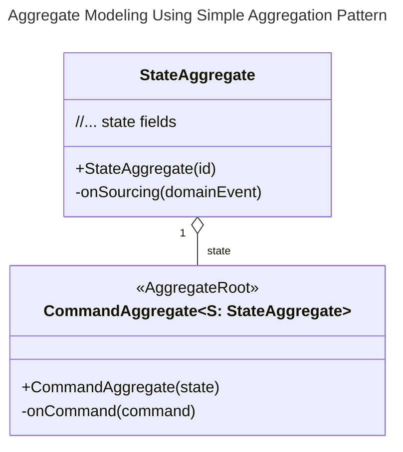
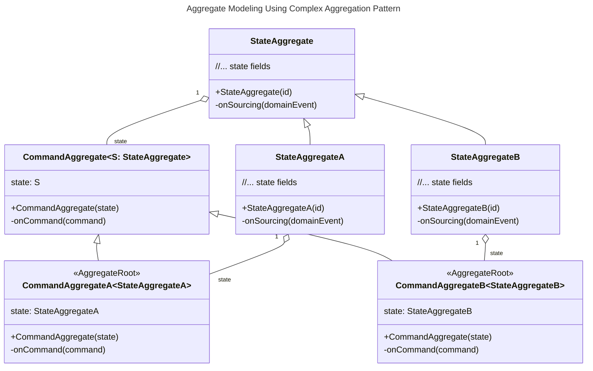
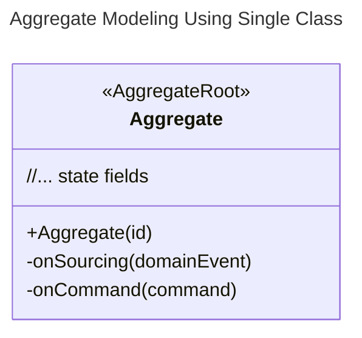
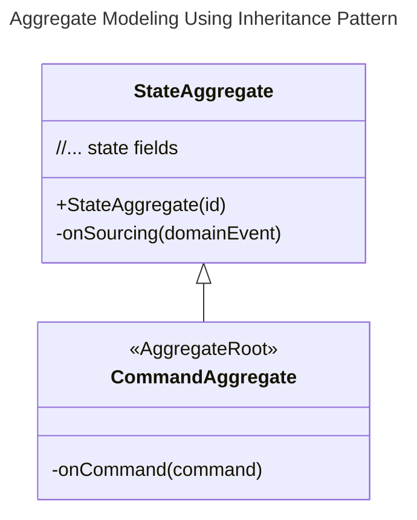

# 聚合根建模

## 风格

### 聚合模式 (推荐)

聚合模式将命令函数、溯源函数(包含聚合状态数据)分别放置在不同的类中，这样做的好处是可以避免命令函数直接变更聚合状态数据的问题(将`setter`访问器设置为`private`)。
同时职责分离也使得聚合根的命令函数更加专注于命令处理，溯源函数更加专注于聚合状态数据的变更。


#### 简单聚合模式

<center>



</center>

#### 复杂聚合模式

<center>



</center>

### 单一类模式

单一类模式将命令函数、溯源函数以及聚合状态数据放置在一起，这样做的好处是简单直接。

::: danger  违反 Event Sourcing 原则
在单一类模式中，命令函数可以直接修改聚合状态数据，这会导致：
- 状态变更无法通过事件追溯
- 破坏了事件溯源的核心价值
- 可能产生不一致的状态变更

**强烈建议**：仅在简单场景或原型开发中使用此模式。
:::

<center>



</center>

### 继承模式

继承模式将状态聚合根作为基类，并且将`setter`访问器设置为`private`。以避免命令聚合根在命令函数中修改聚合状态数据。

<center>



</center>


## 约定

### 命令聚合根

命令聚合根负责接收命令处理函数，执行相应的业务逻辑，并返回领域事件。

- 命令聚合根需要添加 `@AggregateRoot` 注解，以便 `wow-compiler` 模块可以生成相应的元数据定义。
- 命令处理函数的 `@OnCommand` 注解不是必须的，默认情况下将命令处理函数命名为 `onCommand` 即表明该函数为命令处理函数。
- 命令处理函数的第一个参数可以定义为：具体命令(`AddCartItem`)、命令消息(`CommandMessage<AddCartItem>`)、命令消息交换(`CommandExchange<AddCartItem>`)。
- 命令处理函数的其余参数将从 *IOC 容器*中获取。如果你在 _Spring IOC_ 容器中注入了某个实例，可以通过参数直接获取。
- 命令处理函数的返回值为一个或者多个领域事件，该领域事件首先会由状态聚合根通过溯源函数将状态变更为最新状态，然后持久化到 _EventStore_。
  - 当返回值类型不明确时，应通过 `@OnCommand.returns` 进行指定。否则 `wow-compiler` 将无法识别返回的领域事件类型。
- 持久化完成后，将会通过 _DomainEventBus_ 发布到事件总线。

```kotlin
@AggregateRoot
class Cart(private val state: CartState) {

    @OnCommand(returns = [CartItemAdded::class, CartQuantityChanged::class])
    fun onCommand(command: AddCartItem): Any {
        require(state.items.size < MAX_CART_ITEM_SIZE) {
            "购物车最多只能添加[$MAX_CART_ITEM_SIZE]个商品."
        }
        state.items.firstOrNull {
            it.productId == command.productId
        }?.let {
            return CartQuantityChanged(
                changed = it.copy(quantity = it.quantity + command.quantity),
            )
        }
        val added = CartItem(
            productId = command.productId,
            quantity = command.quantity,
        )
        return CartItemAdded(
            added = added,
        )
    }
}
```

### 状态聚合根

状态聚合根定义了聚合状态数据以及溯源函数。

- 状态聚合根在构造函数中必须定义聚合根 ID 字段。
- 溯源函数的作用是将领域事件应用到聚合状态数据上，从而变更聚合状态数据。
- 溯源函数使用 `@OnSourcing` 注解进行标记。不过，该注解是可选的，默认情况下，当函数名为 `onSourcing` 时，即表明该函数为溯源函数。
- 溯源函数接受的参数为：具体领域事件 (`CartItemAdded`)、领域事件 (`DomainEvent<CartItemAdded>`)。
- 无需为溯源函数定义返回值。

```kotlin
class CartState(val id: String) {
    var items: List<CartItem> = listOf()
        private set

    @OnSourcing
    fun onCartItemAdded(cartItemAdded: CartItemAdded) {
        items = items + cartItemAdded.added
    }
}
```