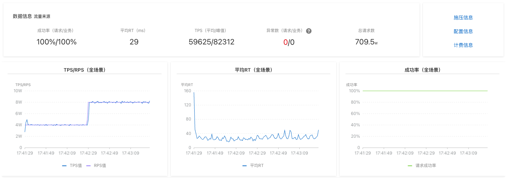
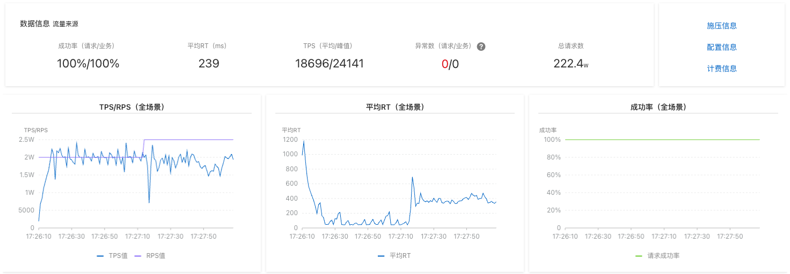
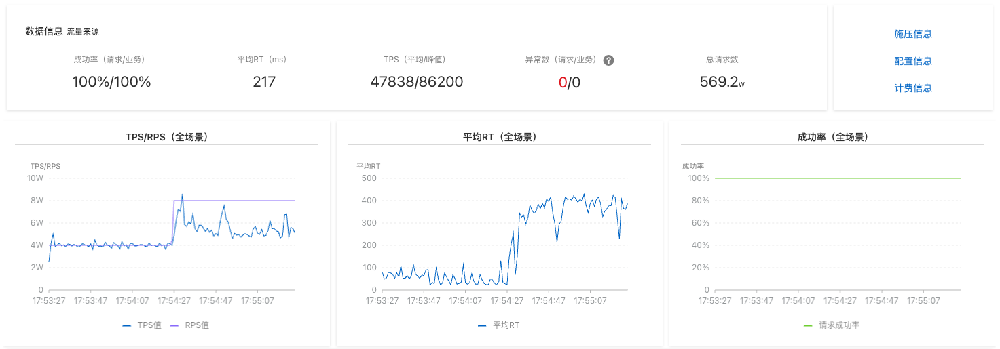
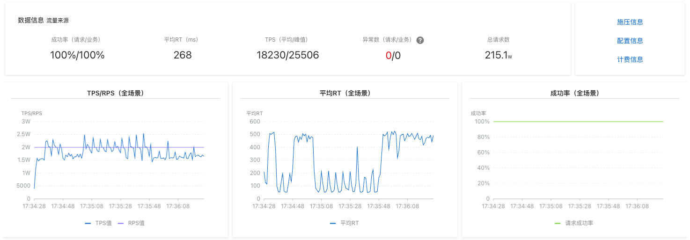

# 性能评测

- 测试代码：[Example](https://github.com/Ahoo-Wang/Wow/tree/main/example)
- 测试场景：加入购物车、下单
- 命令发送等待模式（`WaitPlan`）：`SENT`、`PROCESSED`

## 复现基准测试

### 基础设施（Kubernetes + Helm）

基准测试环境使用
[`deploy/example/perf/`](https://github.com/Ahoo-Wang/Wow/tree/main/deploy/example/perf)
下的 Helm values 文件：

```bash
# 通过 Helm 安装基础设施（具体命令见每个文件的头部注释）
helm install mongodb-test bitnami/mongodb-sharded -n test -f deploy/example/perf/mongo.yaml
helm install redis-test bitnami/redis-cluster -n test -f deploy/example/perf/redis.yaml
helm install kafka-test bitnami/kafka -n test -f deploy/example/perf/kafka.yaml --set kraft.enabled=false --version 23.0.5
helm install zookeeper-test bitnami/zookeeper -n test --set global.storageClass="alicloud-disk-essd" --set replicaCount=3 --set persistence.size=20Gi

# 在 Deployment 之前应用应用 ConfigMap（deployment.yaml 挂载了它）
kubectl apply -f deploy/example/perf/config/mongo_kafka_redis.yaml

# 部署 Wow 示例服务
kubectl apply -f deploy/example/perf/deployment.yaml
```

基准测试的应用配置使用
[`mongo_kafka_redis.yaml`](https://github.com/Ahoo-Wang/Wow/tree/main/deploy/example/perf/config/mongo_kafka_redis.yaml)
—— Kafka 用于命令/事件总线，MongoDB 用于事件存储，Redis 用于快照存储
+ PrepareKey + 消息总线恢复。还提供了替代配置（`in-memory.yaml`、`redis.yaml`、
`kafka_redis.yaml`）用于测试不同的存储拓扑。

### 运行压测

[`deploy/example/request/`](https://github.com/Ahoo-Wang/Wow/tree/main/deploy/example/request)
目录中的 `.http` 请求模板（`AddCartItem.http`、`CreateOrder.http`）包含现成的请求。使用压测工具
（如 k6、Gatling 或 JMeter）指向相同的端点，并将 `Command-Wait-Stage` 头设置为 `SENT` 或 `PROCESSED`。

根据你的基础设施容量调整 `--vus`（虚拟用户数）和 `--duration`。

## 部署环境

- [Redis](https://github.com/Ahoo-Wang/Wow/tree/main/deploy/example/perf/redis.yaml)
- [MongoDB](https://github.com/Ahoo-Wang/Wow/tree/main/deploy/example/perf/mongo.yaml)
- [Kafka](https://github.com/Ahoo-Wang/Wow/tree/main/deploy/example/perf/kafka.yaml)
- [Application-Config](https://github.com/Ahoo-Wang/Wow/tree/main/deploy/example/perf/config/mongo_kafka_redis.yaml)
- [Application-Deployment](https://github.com/Ahoo-Wang/Wow/tree/main/deploy/example/perf/deployment.yaml)

## 压测报告

### 加入购物车

```http request
POST {{host}}/cart/{{$uuid}}/add_cart_item
Content-Type: application/json
Command-Wait-Stage: PROCESSED
Command-Wait-Timeout: 30000
Command-Request-Id: {{$uuid}}

{
  "productId": "{{$uuid}}",
  "quantity": 1
}

> 

```

- [详细报告(PDF)-SENT](../../public/images/perf/Example.Cart.Add@SENT.pdf)
- [详细报告(PDF)-PROCESSED](../../public/images/perf/Example.Cart.Add@PROCESSED.pdf)

> 命令等待计划（`WaitPlan`）为`SENT`模式，加入购物车命令（`AddCartItem`）写请求 API 经过 2 分钟的压测，平均 TPS 为 *59625*，峰值为 *82312*，平均响应时间为 *29* 毫秒。



> 命令等待计划（`WaitPlan`）为`PROCESSED`模式，加入购物车命令（`AddCartItem`）写请求 API 经过 2 分钟的压测，平均 TPS 为 *18696*，峰值为 *24141*，平均响应时间为 *239* 毫秒。



### 下单

```http request
POST {{host}}/customer/{{$uuid}}/tenant/{{$uuid}}/order
Content-Type: application/json
Command-Wait-Stage: PROCESSED
Command-Wait-Timeout: 30000
Command-Request-Id: {{$uuid}}

{
  "fromCart": false,
  "items": [
    {
      "productId": "{{$uuid}}",
      "price": 10,
      "quantity": 10
    }
  ],
  "address": {
    "country": "china",
    "province": "shanghai",
    "city": "shanghai",
    "district": "huangpu",
    "detail": "renmin road 1000"
  }
}

> 
```

- [详细报告(PDF)-SENT](../../public/images/perf/Example.Order.Create@SENT.pdf)
- [详细报告(PDF)-PROCESSED](../../public/images/perf/Example.Order.Create@PROCESSED.pdf)

> 命令等待计划（`WaitPlan`）为`SENT`模式，下单命令（`CreateOrder`）写请求 API 经过 2 分钟的压测，平均 TPS 为 *47838*，峰值为 *86200*，平均响应时间为 *217* 毫秒。



> 命令等待计划（`WaitPlan`）为`PROCESSED`模式，下单命令（`CreateOrder`）写请求 API 经过 2 分钟的压测，平均 TPS 为 *18230*，峰值为 *25506*，平均响应时间为 *268* 毫秒。


