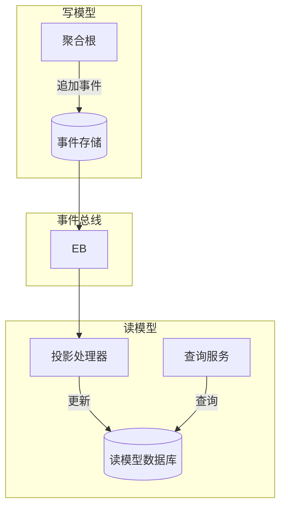

# 投影处理器

*投影处理器*是 Wow 框架中用于在 CQRS 架构中维护读模型的核心组件。它将领域事件转换为针对特定查询和显示需求优化的投影。

## 概述

投影处理器处理领域事件并更新反规范化的读模型以实现高效查询。它们是 CQRS 模式的关键部分，将写模型与读模型分离以优化性能。



## 何时使用投影

### 使用投影的场景

- 需要对聚合数据进行复杂查询
- 相同数据的不同视图表示
- 查询性能至关重要
- 数据需要针对特定访问模式进行优化

### 跳过投影的场景

- 快照模式设置为 `all`（聚合状态已可用）
- 简单的 CRUD 操作就足够
- 数据很少被查询
- 事件补偿控制台直接使用最新快照

```kotlin
// 当 snapshot=all 时，聚合状态始终可用
// 在这种情况下不需要单独的投影
wow:
  eventsourcing:
    snapshot:
      strategy: all
```

## 创建投影处理器

### 基本结构

投影处理器使用 `@ProjectionProcessor` 注解标记，包含事件处理方法：

```kotlin
@ProjectionProcessor
class OrderSummaryProjection(
    private val orderSummaryRepository: OrderSummaryRepository
) {

    @OnEvent
    fun onOrderCreated(event: OrderCreated): Mono<Void> {
        val summary = OrderSummary(
            orderId = event.orderId,
            customerId = event.customerId,
            totalAmount = event.totalAmount,
            status = OrderStatus.CREATED,
            createdAt = event.createdAt
        )
        return orderSummaryRepository.save(summary)
    }

    @OnEvent
    fun onOrderPaid(event: OrderPaid): Mono<Void> {
        return orderSummaryRepository.findById(event.orderId)
            .flatMap { summary ->
                summary.status = OrderStatus.PAID
                summary.paidAt = event.paidAt
                orderSummaryRepository.save(summary)
            }
    }

    @OnEvent
    fun onOrderShipped(event: OrderShipped): Mono<Void> {
        return orderSummaryRepository.findById(event.orderId)
            .flatMap { summary ->
                summary.status = OrderStatus.SHIPPED
                summary.trackingNumber = event.trackingNumber
                orderSummaryRepository.save(summary)
            }
    }
}
```

### 状态事件投影

投影还可以接收聚合状态以及事件：

```kotlin
@ProjectionProcessor
class OrderAnalyticsProjection(
    private val analyticsRepository: AnalyticsRepository
) {

    fun onStateEvent(event: OrderCreated, state: OrderState) {
        val analytics = OrderAnalytics(
            orderId = state.id,
            customerId = state.customerId,
            itemCount = state.items.size,
            totalAmount = state.totalAmount,
            status = state.status
        )
        analyticsRepository.save(analytics)
    }

    fun onStateEvent(event: OrderPaid, state: ReadOnlyStateAggregate<OrderState>) {
        // state 提供完整的聚合状态访问权限
        analyticsRepository.updatePaymentTime(
            orderId = state.aggregateId.id,
            paidAt = state.paidAt
        )
    }
}
```

## 投影模式

### 反规范化视图模式

为特定查询创建反规范化视图：

```kotlin
@ProjectionProcessor
class CustomerOrderViewProjection(
    private val customerOrderViewRepository: CustomerOrderViewRepository
) {

    @OnEvent
    fun onOrderCreated(event: OrderCreated): Mono<Void> {
        val view = CustomerOrderView(
            customerId = event.customerId,
            orderId = event.orderId,
            orderDate = event.createdAt,
            totalAmount = event.totalAmount,
            itemCount = event.items.size
        )
        return customerOrderViewRepository.save(view)
    }

    @OnEvent
    fun onOrderItemAdded(event: OrderItemAdded): Mono<Void> {
        return customerOrderViewRepository.incrementItemCount(
            orderId = event.orderId,
            amount = event.item.price * event.item.quantity
        )
    }
}
```

### 物化视图模式

为复杂查询创建预计算视图：

```kotlin
@ProjectionProcessor
class MonthlySalesReportProjection(
    private val salesReportRepository: MonthlySalesReportRepository
) {

    @OnEvent
    fun onOrderPaid(event: OrderPaid): Mono<Void> {
        val yearMonth = YearMonth.from(event.paidAt)
        return salesReportRepository.upsert(
            yearMonth = yearMonth,
            orderId = event.orderId,
            amount = event.amount
        )
    }
}
```

### 搜索索引投影

维护全文搜索索引：

```kotlin
@ProjectionProcessor
class ProductSearchIndexProjection(
    private val searchIndexService: SearchIndexService
) {

    @OnEvent
    fun onProductCreated(event: ProductCreated): Mono<Void> {
        return searchIndexService.index(
            id = event.productId,
            name = event.name,
            description = event.description,
            category = event.category,
            price = event.price
        )
    }

    @OnEvent
    fun onProductUpdated(event: ProductUpdated): Mono<Void> {
        return searchIndexService.update(
            id = event.productId,
            changes = mapOf(
                "name" to event.name,
                "description" to event.description
            )
        )
    }

    @OnEvent
    fun onProductDeleted(event: ProductDeleted): Mono<Void> {
        return searchIndexService.delete(event.productId)
    }
}
```

## 阻塞投影

对于同步阻塞操作：

```kotlin
@ProjectionProcessor
class BlockingProjection {

    @Blocking
    @OnEvent
    fun onOrderCreated(event: OrderCreated) {
        // 同步阻塞操作
        syncService.processOrder(event)
    }
}
```

## 错误处理

### 重试和补偿

对于关键的投影，结合事件补偿使用：

```kotlin
@ProjectionProcessor
class CriticalProjection(
    private val compensationService: CompensationService
) {

    @Retry(maxRetries = 3, minBackoff = 60)
    @OnEvent
    fun onOrderCreated(event: OrderCreated): Mono<Void> {
        return criticalService.processOrder(event)
            .doOnError { error ->
                compensationService.recordFailure(event, error)
            }
    }
}
```

### 幂等性

确保投影是幂等的：

```kotlin
@ProjectionProcessor
class IdempotentProjection(
    private val eventStore: EventStore
) {

    @OnEvent
    fun onOrderUpdated(event: OrderUpdated): Mono<Void> {
        // 使用事件 ID 检查是否已处理
        return eventStore.exists(event.eventId)
            .filter { !it }
            .flatMap { processUpdate(event) }
            .then()
    }

    private fun processUpdate(event: OrderUpdated): Mono<Void> {
        // 处理更新
    }
}
```

## 性能考虑

### 批量处理

批量处理事件以获得更好的性能：

```kotlin
@ProjectionProcessor
class BatchProjection(
    private val batchProcessor: BatchProcessor
) {
    private val eventBuffer = mutableListOf<OrderCreated>()

    @OnEvent
    fun onOrderCreated(event: OrderCreated): Mono<Void> {
        synchronized(eventBuffer) {
            eventBuffer.add(event)
            if (eventBuffer.size >= 100) {
                val batch = eventBuffer.toList()
                eventBuffer.clear()
                return batchProcessor.processBatch(batch)
            }
        }
        return Mono.empty()
    }
}
```

### 异步处理

使用反应式编程进行非阻塞操作：

```kotlin
@ProjectionProcessor
class AsyncProjection(
    private val asyncService: AsyncService
) {

    @OnEvent
    fun onOrderCreated(event: OrderCreated): Mono<Void> {
        return asyncService.processAsync(event)
            .subscribeOn(Schedulers.boundedElastic())
    }
}
```

## 测试投影

```kotlin
class OrderProjectionSpec : ProjectionSpec<OrderProjection>({
    on {
        val event = mockk<OrderCreated> {
            every { orderId } returns "order-001"
            every { customerId } returns "customer-001"
            every { totalAmount } returns BigDecimal(100)
        }
        whenEvent(event) {
            expectNoError()
            expectSaved<OrderSummary> {
                orderId.assert().isEqualTo("order-001")
                totalAmount.assert().isEqualTo(BigDecimal(100))
            }
        }
    }
})
```

## 配置

投影处理器通过 Spring 组件扫描自动发现，无需额外配置，但你可以控制事件处理：

```yaml
wow:
  event:
    bus:
      type: kafka
      local-first:
        enabled: true  # 优先本地处理事件
```

## 最佳实践

1. **保持投影专注**：每个投影应服务于特定的查询或视图目的
2. **设计幂等性**：优雅处理重复事件
3. **针对查询模式优化**：根据查询方式反规范化数据
4. **监控性能**：跟踪投影处理延迟
5. **优雅处理错误**：为关键投影实现重试和补偿逻辑
6. **考虑最终一致性**：设计时考虑用例所需的最终一致性级别

## 相关主题

- [事件处理器](./event-processor) - 用于一般事件处理
- [查询服务](./query) - 用于查询读模型
- [CQRS 模式](./reference/awesome/cqrs) - 了解 CQRS 架构
- [事件溯源](./eventstore) - 了解事件存储
