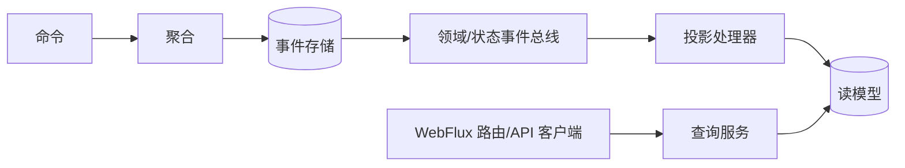

# 投影处理器

投影处理器消费事件并更新读模型，是事件溯源写侧与应用查询模型之间的桥梁：

```text
命令 -> 领域事件 -> 投影处理器 -> 读模型 -> 查询/API 客户端
```

Wow 把领域事件和状态事件分发给已注册处理器。处理器负责写入自己的读存储；`wow-query` 负责查询合同与后端编译。投影注解不会自动创建仓库、集合、索引、HTTP 路由或授权策略。

::: tip 默认选择：先用实时快照
投影不是 Wow 应用的必选组件。对大多数只读取单一聚合当前状态的页面与接口，优先配置 `snapshot.strategy: all`，并使用支持动态查询的快照存储。最新快照可以直接作为读模型，无需把相同的聚合状态再复制到专用投影。
:::

省去投影通常也意味着省去投影处理器、独立读模型与存储结构，以及随之而来的幂等、重放、补偿、延迟监控和集成测试，通常可以极大降低开发与运维成本。只有读需求确实超出聚合当前状态时，才承担这部分成本。参见[将快照作为默认读模型](./snapshot#将快照作为默认读模型)。

这里的“实时”以所选快照策略和后端合同为边界：`all` 会为每个状态事件执行快照保存；等待 `SNAPSHOT` 只能证明该策略返回的响应式链已完成。缓存、副本以及真实查询是否可见，仍应通过实际查询验证。

## 概述


```mermaid
flowchart LR
    C[命令] --> A[聚合]
    A --> E[(事件存储)]
    E --> B[领域/状态事件总线]
    B --> P[投影处理器]
    P --> R[(读模型)]
    Q[查询服务] --> R
    H[WebFlux 路由/API 客户端] --> Q
```

`ProjectionDispatcher` 同时订阅 `DomainEventBus` 与 `StateEventBus`。`ProjectionProcessorAutoRegistrar` 发现带 `@ProjectionProcessor` 的 Spring Bean，`ProjectionFunctionRegistrar` 注册其中的处理函数。

除非调用方明确等待投影阶段，否则这条链路是最终一致的。命令在 `PROCESSED` 阶段成功只表示命令处理完成，并不能证明外部读模型已更新。

## 何时使用投影

默认先跳过投影，确认实时快照无法满足读需求后再引入。投影解决的是“需要另一种读模型”的问题，而不是事件溯源架构的固定步骤。

### 使用投影的场景

- 查询形状不同于聚合状态；
- 页面或报表需要由多个事件形成反规范化数据；
- 读存储需要独立索引、生命周期或后端；
- 搜索或分析视图不应每次加载并重放聚合。

### 跳过投影的场景

- 已存储快照就是所需读形状；
- 用例只是按聚合 ID 点查；
- 不需要持久化读模型；
- 其他消费者已经维护了所需视图。

快照策略与投影设计是两个独立决策。快照用于加速聚合恢复，也可以被查询；专用投影则是应用自有视图。`snapshot = all` 不会自动替代所有投影，禁用快照也不妨碍投影处理器消费事件。

## 创建投影处理器

### 基本结构

在 Spring Bean 上标注 `@ProjectionProcessor`。处理函数可以使用 `onEvent` 命名约定或 `@OnEvent`；非阻塞工作应返回 Reactor 类型：

```kotlin
@ProjectionProcessor
class OrderSummaryProjector(
    private val repository: OrderSummaryRepository,
) {
    @OnEvent
    fun projectCreated(event: DomainEvent<OrderCreated>): Mono<Void> =
        repository.save(
            OrderSummary(
                id = event.aggregateId.id,
                status = "CREATED",
                totalAmount = event.body.items.sumOf { it.totalPrice },
            ),
        ).then()

    @OnEvent
    fun projectPaid(event: DomainEvent<OrderPaid>): Mono<Void> =
        repository.markPaid(event.aggregateId.id)
}
```

`OrderSummaryRepository` 属于应用代码，可以使用 MongoDB、Elasticsearch、R2DBC 或其他响应式适配器；Wow 不会从处理器类推导存储合同。

需要显式按聚合名称过滤时使用 `@OnEvent("order")`。普通处理器通常只需事件参数类型与约定方法名。

### 状态事件投影

状态事件处理函数同时接收事件与已物化聚合状态。当“用最新聚合视图覆盖读模型”比应用增量更简单时，可直接使用状态：

```kotlin
@ProjectionProcessor
class OrderStateProjector(
    private val repository: OrderSummaryRepository,
) {
    @OnStateEvent
    @Suppress("UnusedParameter")
    fun projectPaid(event: DomainEvent<OrderPaid>, state: OrderState): Mono<Void> =
        repository.replace(
            OrderSummary(
                id = state.id,
                status = state.status.name,
                totalAmount = state.totalAmount,
            ),
        ).then()
}
```

当需要聚合 ID、租户、拥有者、空间、版本、标签或删除状态等元数据时，第二个参数也可以是 `ReadOnlyStateAggregate<OrderState>`。也可以用 `@OnStateEvent` 代替命名约定。

## 投影模式

### 反规范化视图模式

按查询真正需要的稳定逻辑字段存储数据。保证事件应用幂等；后端支持时，以原子操作更新一条应用自有记录。

```kotlin
@OnEvent
fun projectAddress(event: DomainEvent<AddressChanged>): Mono<Void> =
    repository.updateAddress(event.aggregateId.id, event.body.shippingAddress).then()
```

不要把事件载荷布局意外暴露为公共查询合同。供 REST 客户端消费的合同应是读模型及其查询模型 Schema。

### 物化视图模式

计数器或汇总数据应维护预计算行，避免每次请求都扫描事件历史：

```kotlin
@OnEvent
fun projectPaid(event: DomainEvent<OrderPaid>): Mono<Void> =
    monthlySales.increment(
        Instant.ofEpochMilli(event.createTime).atZone(ZoneOffset.UTC).toLocalDate(),
        event.body.amount,
    )
```

重复或并发投递会影响结果时，优先使用后端原子操作。如果存储无法保证所需更新语义，应在同一事务或等价原子单元内同时记录已消费事件 ID 与投影更新。

### 搜索索引投影

投影器可以维护 Elasticsearch 文档或其他搜索索引。该索引仍是最终一致投影；映射和全文检索行为属于所选后端，而不是 `@ProjectionProcessor`。

```kotlin
@OnEvent
fun projectName(event: DomainEvent<ProductRenamed>): Mono<Void> =
    searchIndex.rename(event.aggregateId.id, event.body.name).then()
```

## 阻塞投影

同步处理函数必须标注 `@Blocking`，让 Wow 将其识别为阻塞函数：

```kotlin
@ProjectionProcessor
class LegacyProjector(private val repository: LegacyRepository) {
    @Blocking
    @OnEvent
    fun projectCreated(event: DomainEvent<OrderCreated>) {
        repository.save(event.aggregateId.id)
    }
}
```

普通投影路径优先使用响应式适配器。不要在响应式处理函数中调用 `block()`；确实阻塞的依赖应隔离在 `@Blocking` 处理函数后。

## 错误处理

### 重试和补偿

投影执行会经过投影过滤器链。Starter 默认的 `projectionErrorHandler` 是 `LogResumeErrorHandler`：记录失败 exchange 后继续分发。如果应用需要其他失败策略，应注册同名 `projectionErrorHandler` Bean。

`@Retry` 控制处理函数的重试元数据，但不会让非幂等写入自动变安全。事件补偿可以重发失败的领域事件或状态事件处理，却不会回滚已提交的外部副作用。启用重试或补偿前，先让写操作具备安全重放能力。

### 幂等性

投影需要去重时，使用 `DomainEvent<T>` 或 `ReadOnlyStateAggregate` 中的事件标识：

```kotlin
fun onEvent(event: DomainEvent<OrderPaid>): Mono<Void> =
    repository.upsertOnce(event.id, event.aggregateId.id, event.body.amount)
```

事件存储保存聚合事件流，并不是应用投影的“已处理事件”注册表。去重应由投影存储负责，并与投影更新保持原子性。

## 性能考虑

### 批量处理

不要在单例处理器中维护可变内存缓冲区：进程崩溃会丢失缓冲工作，并行分发也会使顺序更复杂。只有测量证明逐事件写入不足时，才使用后端批量 API、Broker 消费批处理或专用持久化暂存表。

### 异步处理

返回完整响应式链，由 Wow 订阅：

```kotlin
@OnEvent
fun projectPaid(event: DomainEvent<OrderPaid>): Mono<Void> =
    repository.markPaid(event.aggregateId.id)
        .then(metrics.recordProjection(event.aggregateId.id))
```

不要在处理函数中调用 `subscribe()`。内部订阅会逃离 Wow 的确认、重试、错误处理和等待阶段生命周期。

## 测试投影

Wow 不提供 `ProjectionSpec` DSL。将处理器作为普通类做单元测试，并验证返回的 Publisher：

```kotlin
@ExtendWith(MockKExtension::class)
class OrderSummaryProjectorTest {
    @MockK
    private lateinit var repository: OrderSummaryRepository

    @Test
    fun `projects created order`() {
        every { repository.save(any()) } returns Mono.empty()
        val projector = OrderSummaryProjector(repository)

        StepVerifier.create(projector.projectCreated(orderCreated))
            .verifyComplete()

        verify(exactly = 1) {
            repository.save(match { it.id == orderCreated.aggregateId.id })
        }
    }
}
```

当合同依赖事件总线、真实序列化、后端原子性、查询 Schema 解析或 HTTP 路由时，应增加集成测试。处理函数单元测试无法证明完整的“事件 -> 投影 -> 查询”链路。

## 配置

使用 `wow-spring-boot-starter` 且 Wow 已启用时，投影基础设施会自动配置。应用负责提供 `@ProjectionProcessor` 与仓库 Bean。事件总线选择决定领域事件和状态事件从哪里消费，但不会生成投影存储。

命令需要等待投影处理时，在命令等待计划中使用 `CommandStage.PROJECTED`，必要时同时指定准确的投影上下文与处理器名称。该等待观察的是 Wow 处理器确认；对于返回响应式链之外启动的工作，它不构成读后写保证。

## 最佳实践

1. 先证明实时快照不够用；引入后让每个投影只服务一个明确读用途。
2. 外部写入保持响应式、可确认并可安全重放。
3. 重复投递会影响结果时，保存或原子约束事件标识。
4. 把投影延迟与失败作为生产可观测信号。
5. 通过查询模型 Schema 发布逻辑查询字段，不暴露物理映射。
6. 映射、原子性和查询行为依赖后端时，使用真实后端测试。

## 相关主题

- [快照](./snapshot) — 默认当前状态读模型、策略与查询边界
- [事件处理器](./event-processor) — 通用事件处理
- [查询](./query) — 查询模型、DSL、聚合与 HTTP 护栏
- [数据权限](./data-access) — 请求作用域、查询过滤与授权边界
- [OpenAPI](./open-api) — 运行时路由与接口发布
- [事件溯源](./eventstore) — 事件持久化与聚合恢复
