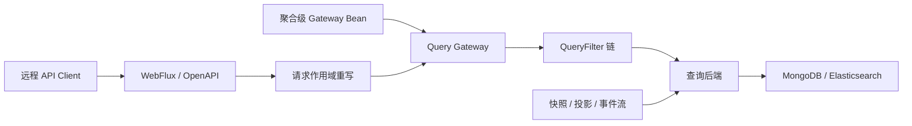

<a id="查询服务"></a>

# 查询

Wow 的“查询”覆盖查询模型、服务端 Query Gateway、JVM 查询后端、HTTP/OpenAPI 合同和远程 API Client；它们共同组成读链路，但分别承担模型、策略、执行、协议和调用职责。

## 选择查询模型与返回结果

先按数据来源和返回形态选择能力，再选择入口：

| 模型与能力 | JVM | HTTP / OpenAPI | API Client |
| --- | --- | --- | --- |
| 快照数据查询 | 支持 | 支持 | 支持 |
| 快照聚合查询 | 支持 | 支持 | 支持，独立聚合接口 |
| 事件流数据查询 | 支持 | 仅 list、paged、count、按版本 load | 不支持 |
| 事件流聚合查询 | 支持 | 支持，JSON/SSE | 不支持 |

数据查询返回快照或事件流文档；聚合查询返回由 group 和 metric 组成的动态表格行。模型与返回合同分别见[数据查询](./query/data-query.md)和[聚合查询](./query/aggregation-query.md)。

## 三个入口

1. [查询网关](./query/query-gateway.md)：服务端策略入口，执行查询重写、过滤链和结果处理。
2. [查询后端](./query/query-backend.md)：受信低层 SPI，提供聚合绑定的 `ObjectNode` Backend 与 Factory。
3. [查询 API 客户端](./query/query-api-client.md)：远程快照查询入口，提供响应式与同步接口；当前不包含事件流客户端。

## 执行链



Gateway 是受管查询的策略边界；直接调用 Factory 会绕过它。过滤器适用范围、WebFlux 请求上下文和绕过条件见[查询网关](./query/query-gateway.md)。

## FilterExpression

`FilterExpression` 使用逻辑字段描述过滤条件，后端适配器负责物理路径与能力：

```json
{"op": "EQ", "field": "state.status", "value": "CREATED"}
```

完整操作符、Element 作用域、相对时间和后端差异见[过滤条件](./query/filter-expression.md)。

## Kotlin DSL

```kotlin
val query = pagedQuery {
    filter { pathState { "status" eq "CREATED" } }
    pagination { index(1); size(20) }
}
```

数据查询 DTO、projection、sort、pagination 与 count 合同见[数据查询](./query/data-query.md)；模型路径分别见[快照查询](./query/snapshot-query.md)和[事件流查询](./query/event-stream-query.md)。

## REST API

快照发布数据查询与 `snapshot/aggregation`；事件流发布 list、paged、count、按版本 load，以及支持 JSON/SSE 的 `event/aggregation`。准确路径与作用域变体以运行实例 OpenAPI 为准。

```http
POST /sales-order/snapshot/paged
Content-Type: application/json
```

快照、事件流和聚合路由分别见[快照查询](./query/snapshot-query.md)、[事件流查询](./query/event-stream-query.md)、[快照聚合](./query/snapshot-aggregation.md)与[事件流聚合](./query/event-stream-aggregation.md)。

<a id="兼容与迁移"></a>

## 兼容性与迁移

V9 的规范 JVM 合同是 `FilterExpression` 与 `FilterDsl`。V9.0.x 暂时保留已弃用的 `Condition`/`Operator`、`ConditionDsl`、旧查询构造器和 count 客户端重载，并统一转换为 `FilterExpression`；这些兼容 API 计划在 9.1.0 删除。REST `condition`/`operator` 入参也在同一窗口内兼容。V9 的 Gateway/Backend 破坏性 JVM 类型映射、兼容边界与 binding 迁移见 [V9 查询迁移](./query/v9-query-migration.md)。

## JSON Schema

通用 JSON Schema 定义线协议，OpenAPI 描述已发布请求，运行时 Query Model Schema 证明逻辑字段的后端能力。快照和事件流分别发布 `snapshot/schema` 与 `event/schema`，以及对应的 refresh 路由。来源、校验模式和 Provider 差异见[查询模型 Schema](./query/query-model-schema.md)。

<a id="查询服务注册器"></a>

## Query Gateway Registrars

`SnapshotQueryGatewayRegistrar` 按状态类型注册 `SnapshotQueryGateway<STATE>`；`EventStreamQueryGatewayRegistrar` 注册无状态泛型的聚合级 Gateway，多候选时按 Bean 名区分。精确命名、Backend 绑定与原始 Factory 边界见[查询后端](./query/query-backend.md)。

## 下一步

1. [查询网关](./query/query-gateway.md)
2. [查询后端](./query/query-backend.md)
3. [查询 API 客户端](./query/query-api-client.md)
4. [过滤条件](./query/filter-expression.md)
5. [数据查询](./query/data-query.md)
6. [快照查询](./query/snapshot-query.md)
7. [事件流查询](./query/event-stream-query.md)
8. [聚合查询](./query/aggregation-query.md)
9. [快照聚合](./query/snapshot-aggregation.md)
10. [事件流聚合](./query/event-stream-aggregation.md)
11. [V9 查询迁移](./query/v9-query-migration.md)
11. [查询模型 Schema](./query/query-model-schema.md)
