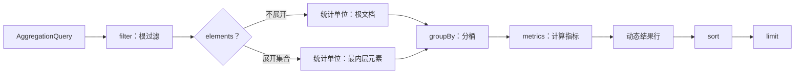

# 聚合查询

`AggregationQuery` 用过滤后的记录构造动态表格行。它至少需要一个 metric；字段都是逻辑字段，所选查询模型和后端负责解析其能力。本页只定义公共 AST，不把 MongoDB 或 Elasticsearch 的物理实现视为同一语义。

## AggregationQuery



`filter`、有序的 `elements`、`groupBy`、`metrics`、`sort` 与 `limit` 共同决定结果。`metrics` 不可为空；`elements`、`groupBy` 与 `sort` 可为空。没有 group 时，结果是整体汇总而非按维度分桶。

## 根过滤条件

`filter` 是作用于查询模型根的 `FilterExpression`，省略时为 `MATCH_ALL`。它使用该模型的绝对逻辑路径；快照和事件流的字段根分别由对应模型页面定义。过滤器的 JSON 形状与 Kotlin DSL 见[过滤条件](./filter-expression.md)。

## Elements：展开集合

每个 `AggregationElement` 有 `path` 和可选 `filter`。Elements 是从外到内的一条有序父子展开链，不是同级集合的列表：

- 第一个 `path` 相对查询模型根，使用绝对逻辑路径；
- 之后的 `path` 相对当前已展开元素；
- Element 的 `filter` 相对它自己的单个元素，且不能含 root-only 过滤器；
- 有 Elements 时，group、metric 与数值表达式的字段相对最内层元素；没有 Elements 时，它们相对查询模型根。

例如 `state.orders` → `lines` 表示先展开根上的 `state.orders`，再在每个 order 内展开 `lines`；它不是分别展开两个根数组。

## Group：分组

`groupBy` 以 alias 作为结果列名。现有 Group AST 只有：

| 类型 | 字段 | 额外参数 |
| --- | --- | --- |
| `TERMS` | `field` | 无 |
| `HISTOGRAM` | `field` | 正且有限的 `interval` |
| `DATE_HISTOGRAM` | `field` | `unit`、可选 `timeZone`（默认 `UTC`） |

`DATE_HISTOGRAM` 的日期单位为 `YEAR`、`QUARTER`、`MONTH`、`WEEK`、`DAY`、`HOUR`、`MINUTE`、`SECOND`。桶边界、时间值与字段能力由实际查询入口及后端决定；公共 AST 不承诺它们在所有后端完全一致。

## Metric：指标

每个 Metric 也有唯一 alias，作为结果列名。

| 类型 | 形状 |
| --- | --- |
| `COUNT` | 统计当前作用域的记录数 |
| `NUMERIC` | 对 Expression 使用 `SUM`、`AVG`、`MIN` 或 `MAX` |
| `ANY` | 选择一个字段值 |

`ANY` 不能替代确定性的 group key：所选的非 null 值不保证在不同执行或后端间稳定。数值 metric 的参与值、null 与有限数值的处理以实际入口为准。

## 算术与时间表达式

`NUMERIC` 的 Expression AST 只有 `FIELD`、有限 `CONSTANT` 与 `BINARY`。`BINARY` 运算符为 `ADD`、`SUBTRACT`、`MULTIPLY`、`DIVIDE`；可嵌套以表达算术式。Kotlin DSL 对应 `field(...)`、`constant(...)` 与 `+`、`-`、`*`、`/`，并提供 `sum`、`avg`、`min`、`max`。

日期分桶不是数值 Expression；它是 `DATE_HISTOGRAM` Group，单位列在上一节。

## 排序、别名与限制

`sort` 只能引用 group 或 metric alias；没有 group 时不能排序。每个 alias 必须唯一、为单段逻辑字段，且不能以 `__wow` 开头。显式 sort 中不得重复字段；未显式排序的 group alias 会按 group 声明顺序追加为 `ASC`，形成有效排序。

`limit` 限制最多返回的结果行，默认是 `100`。下列限制在构造 `AggregationQuery` 时校验：

| 项目 | 上限 |
| --- | ---: |
| `elements` | 5 |
| `groups` | 32 |
| `metrics` | 64 |
| `sorts`（有效排序） | 32 |
| Expression `depth` | 8 |
| Expression `nodes` | 256 |
| 默认 `limit` | 100 |
| 最大 `limit` | 10000 |

## 聚合结果

结果行以 alias 为列名。快照聚合 API Client 的响应式接口返回 `Flux<Map<String, Any?>>`；同步接口收集为 `List<Map<String, Any?>>`。JVM `QueryGateway.aggregate` 返回 `Flux<ObjectNode>`。

下面是最小的公共合同示例：根过滤、一个 group、一个 `COUNT`、指标 alias 与排序。字段名没有预设为 `state.*` 或 `body.*`，应在选定模型后替换为有效逻辑路径。

```kotlin
val query = aggregation {
    filter { "status" eq "READY" }
    terms("status", "status")
    count("recordCount")
    sort { "recordCount".desc() }
    limit(10)
}
```

等价 JSON 适用于实际暴露聚合协议的 Snapshot 与 EventStream HTTP 入口；字段根和 capability 仍由各自的 Query Model Schema 决定。

```json
{
  "filter": { "op": "EQ", "field": "status", "value": "READY" },
  "groupBy": [{ "type": "TERMS", "field": "status", "alias": "status" }],
  "metrics": [{ "type": "COUNT", "alias": "recordCount" }],
  "sort": [{ "field": "recordCount", "direction": "DESC" }],
  "limit": 10
}
```

结果列严格使用 group 和 metric alias：

```json
[
  { "status": "READY", "recordCount": 12 },
  { "status": "PENDING", "recordCount": 4 }
]
```

没有 group 时始终返回一行汇总：空输入时 `COUNT = 0`、`ANY = null`，数值 metric = `null`。有 group 的空输入不产生结果行。自定义 `QueryBackend` 若偏离公共 TCK，必须由该实现独立声明和验证，不能将差异泛化为框架公共合同。

## 先确定统计单位

先问“什么算一条记录”。没有 `elements` 时，每个根文档是一条统计记录；展开后，每个被展开的数组元素是一条统计记录。因此根级 `COUNT` 与元素级 `COUNT` 不等价，即使根过滤相同。多层 Elements 时，统计单位继续变为最内层展开元素。

统计单位由 Elements 链决定，Group 只决定如何把这些记录分桶，Metric 决定在每个桶内计算什么。先选择数据来源和统计单位，再选择字段、group 与 metric。

## 结构限制

除上表的容量限制外，`metrics` 至少为 1，`limit` 必须在 `1..10000`，并且 alias 与 sort 字段都不能重复。`HISTOGRAM.interval` 必须为正有限数，`DATE_HISTOGRAM.timeZone` 必须是有效的 `ZoneId`。这些是 AST 结构校验，不替代 Schema、HTTP 护栏、授权或后端能力检查。

## 选择快照还是事件流

| 统计对象 | 专题 | 选择原因 |
| --- | --- | --- |
| 当前聚合状态与状态集合 | [快照聚合](./snapshot-aggregation.md) | 快照以当前状态为事实来源 |
| 完整事件历史与事件数组 | [事件流聚合](./event-stream-aggregation.md) | 事件流以历史事件为事实来源，支持 JVM 与 HTTP/OpenAPI 聚合及 JSON/SSE；仍无 EventStream API Client |
