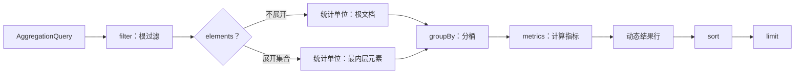

# 聚合查询

`AggregationQuery` 用过滤后的记录构造动态表格行。它至少需要一个 metric；字段都是逻辑字段，所选查询模型和后端负责解析其能力。本页只定义公共 AST，不把 MongoDB 或 Elasticsearch 的物理实现视为同一语义。

## AggregationQuery



`filter`、有序的 `elements`、`groupBy`、`metrics`、`sort` 与 `limit` 共同决定结果。`metrics` 不可为空；`elements`、`groupBy` 与 `sort` 可为空。没有 group 时，结果是整体汇总而非按维度分桶。

## 根过滤条件

`filter` 是作用于查询模型根的 `FilterExpression`，省略时为 `MATCH_ALL`。它使用该模型的绝对逻辑路径；快照和事件流的字段根分别由对应模型页面定义。过滤器的 JSON 形状与 Kotlin DSL 见[过滤条件](./filter-expression.md)。

## Elements：展开集合

每个 `AggregationElement` 有 `path` 和可选 `filter`。Elements 是从外到内的一条有序父子展开链，不是同级集合的列表：

- 第一个 `path` 相对查询模型根，使用绝对逻辑路径；
- 之后的 `path` 相对当前已展开元素；
- Element 的 `filter` 相对它自己的单个元素，且不能含 root-only 过滤器；
- 有 Elements 时，group、metric 与数值表达式的字段相对最内层元素；没有 Elements 时，它们相对查询模型根。

例如 `state.orders` → `lines` 表示先展开根上的 `state.orders`，再在每个 order 内展开 `lines`；它不是分别展开两个根数组。

## Group：分组

`groupBy` 以 alias 作为结果列名。现有 Group AST 只有：

| 类型 | 字段 | 额外参数 |
| --- | --- | --- |
| `TERMS` | `field` | 无 |
| `HISTOGRAM` | `field` | 正且有限的 `interval` |
| `DATE_HISTOGRAM` | `field` | `unit`、可选 `timeZone`（默认 `UTC`） |

`DATE_HISTOGRAM` 的日期单位为 `YEAR`、`QUARTER`、`MONTH`、`WEEK`、`DAY`、`HOUR`、`MINUTE`、`SECOND`。桶边界、时间值与字段能力由实际查询入口及后端决定；公共 AST 不承诺它们在所有后端完全一致。

## Metric：指标

每个 Metric 也有唯一 alias，作为结果列名。

| 类型 | 形状 |
| --- | --- |
| `COUNT` | 统计当前作用域的记录数 |
| `NUMERIC` | 对 Expression 使用 `SUM`、`AVG`、`MIN`、`MAX`、`STDDEV` 或 `VARIANCE` |
| `DISTINCT_COUNT` | 统计 Expression 非空参与值的去重个数，结果为整数；空集为 `0` |
| `PERCENTILE` | 对数值 Expression 计算 `PERCENTILE(p)`，`0 < p < 100`；DSL 的 `median` 等价 `p=50` |
| `ANY` | 选择一个字段值 |
| `DERIVED` | 聚合完成后对已声明 metric 的结果做算术运算（见[派生指标](#derived-metrics)） |

`ANY` 不能替代确定性的 group key：所选的非 null 值不保证在不同执行或后端间稳定。

### 指标级过滤 {#metric-filter}

每种 Metric 还可以带一个可选的记录级 `filter`，DSL 以尾 lambda 表达，省略时为 `MATCH_ALL`。它作用于当前作用域（根文档或最内层 Element）的记录：不满足该 `filter` 的记录只对这个指标零贡献，不影响同查询的其他指标，也不替代根 `filter` 或 Element `filter`。过滤器的 JSON 形状与[过滤条件](./filter-expression.md)一致：

```kotlin
count("paid") { "status" eq "PAID" }
sum("total", "paidTotal") { "status" eq "PAID" }
```

```json
{"type": "COUNT", "alias": "paid", "filter": {"op": "EQ", "field": "status", "value": "PAID"}}
```

空匹配沿用各指标的空集语义：`COUNT` 与 `DISTINCT_COUNT` 返回 `0`，数值 metric、`ANY` 与 `PERCENTILE` 返回 `null`。

以下限制在两个后端一致，并在编译期拒绝：

- metric filter 引用的字段必须为标量；数组及含数组的联合字段不受支持，`IS_EMPTY`/`$size` 一类必然指向数组字段的条件也一并拒绝——尽管其语义本可保真，为保持统一契约不再单独放行；
- `SEARCH` 全文、`ELEMENT_MATCH` 与 `CONTAINS_ALL`（`$all` 语义）不受支持；
- 作用域规则与 Element filter 相同：处于 Element 作用域内的 metric filter 不得引用根级字段或 root-only 过滤器。

版本与已知边界：

- MongoDB 后端使用 metric filter 需要服务端 5.0+（守卫表达式中的 `$not`）；`PERCENTILE` 指标本身仍需 7.0+。旧版本服务端返回其原生错误。
- MongoDB 守卫表达式的 `$gt`/`$lt` 族比较遵循 BSON 全序而非 `$match` 的类型分档，类型混杂数据下计数可能偏多；这是边界情形，不构成后端间逐位一致的承诺。
- HTTP 查询保护不把 metric filter 构造本身单独视为高成本操作符；metric filter 内的算子与根/element 过滤一样受 `wow.webflux.query.allow-expensive-operators` 昂贵算子开关约束，过滤值数与其他 filter 一起计入 `wow.webflux.query.max-filter-values` 上限。

### 派生指标 {#derived-metrics}

`DERIVED` Metric 在聚合完成后对同查询中已声明 metric 的结果做算术运算，为每行计算一个派生值（如客单价、达成率）。它的 Expression AST 只有 `METRIC_REF`、有限 `CONSTANT` 与 `BINARY`；`BINARY` 运算符与数值表达式一致（`ADD`、`SUBTRACT`、`MULTIPLY`、`DIVIDE`），可嵌套。DSL 为 `derived(alias) { ... }`，表达式内用 `ref(metric)` 引用 metric、`constant(value)` 给出常量：

```kotlin
aggregation {
    terms("state.status", "status")
    count("paid") { "status" eq "PAID" }
    sum("amount", "paidAmount") { "status" eq "PAID" }
    derived("paidAov") { ref("paidAmount") / ref("paid") }
    sum("amount", "targetAmount")
    derived("attainment") { ref("paidAmount") / ref("targetAmount") }
    sort { "paidAov".desc() }
}
```

`paidAov` 把两个带指标级过滤的 metric 相除，得到已支付客单价；`attainment` 把已支付金额与目标金额相比，得到达成率。单个派生指标的 JSON 形状如下，`expression` 递归复用 `DerivedExpression` schema：

```json
{
  "type": "DERIVED",
  "alias": "paidAov",
  "expression": {
    "type": "BINARY",
    "operator": "DIVIDE",
    "left": {"type": "METRIC_REF", "metric": "paidAmount"},
    "right": {"type": "METRIC_REF", "metric": "paid"}
  }
}
```

引用规则在构造 `AggregationQuery` 时校验，违反即抛 `IllegalArgumentException`：

- `METRIC_REF` 只能引用同一查询中先于该派生指标声明的 metric（含更早的派生指标）；声明序即求值序，引用图天然无环。未知别名与 group alias 一律拒绝；
- 不能引用 `ANY` metric：其值跨执行与后端不稳定；
- 常量必须有限；派生表达式与数值表达式共用 `depth ≤ 8` 的深度上限，同一查询的全部派生表达式共享至多 256 个节点。

计算语义：

- null 传播：任一操作数为 `null` 时结果为 `null`；引用空集的 `NUMERIC`/`PERCENTILE`（结果为 `null`）同样传播为 `null`。`COUNT` 引用不会为 `null`（空集为 `0`），但除以该 `0` 仍得到 `null`；
- 除以零的结果为 `null`，派生结果必须有限；
- 派生指标本身不能带 metric filter：filter 是记录级概念，派生在聚合之后计算。它与[指标级过滤](#metric-filter)的组合方式是引用带 filter 的 metric——上例 `paidAov` 即“已支付金额 / 已支付数量”。OpenAPI schema 为保持形状兼容仍在 `DERIVED` 上展示继承来的可选 `filter` 属性——反序列化时会忽略传入的取值，且 DSL 与构造器均无法设置它；
- sort 可以引用派生 alias，上例即按 `paidAov` 降序。

实现与护栏：

- MongoDB 在聚合投影之后追加额外的 `$project` 阶段计算派生值，每个派生指标一个阶段，按声明顺序执行；Elasticsearch 在桶内使用 `bucket_script` 管道聚合。两者均无新增存储版本要求（`$project` 与 `bucket_script` 都早于受支持的 MongoDB 7.0 / Elasticsearch 9.x 基线）；
- HTTP 查询保护把派生指标视为算术表达式：`wow.webflux.query.allow-expensive-operators=false` 时会被拒绝，与既有 metric 算术表达式门槛一致。

### HAVING（按聚合值筛选分组） {#having}

`having` 在聚合完成后按每行的 metric 结果筛选分组行，对应 SQL 的 `HAVING`：根 `filter` 与 metric filter 作用于记录，having 作用于聚合值。省略 having 时不筛选。它的 AST 是递归多态的 `HavingExpression`：

| 类型 | 形状 |
| --- | --- |
| `CONDITION` | `metric` + `EQ`/`NE`/`GT`/`GTE`/`LT`/`LTE` + 有限 `value` |
| `BETWEEN` | 闭区间 `lower ≤ upper` |
| `IN` | 非空取值集合 |
| `IS_NULL` | 捕获 metric 值为 `null` 的行；`negated` 反转为 `isNotNull()` |
| `AND` / `OR` | 非空 operands，递归嵌套 |

DSL 在 `having { }` 中以 metric alias 直接书写比较，用中缀 `and`/`or` 组合：

```kotlin
aggregation {
    terms("state.status", "status")
    count("paid") { "status" eq "PAID" }
    sum("amount", "paidAmount") { "status" eq "PAID" }
    derived("attainment") { ref("paidAmount") / constant(6000.0) }
    having {
        ("attainment" gte 0.8) and ("paid" gt 10.0)
    }
    sort { "attainment".desc() }
    limit(20)
}
```

上例只保留“达成率不低于 0.8 且已支付订单数大于 10”的状态；`sort` 与 `limit` 都作用于筛选后的行。除六个比较外，DSL 还提供 `between(lower, upper)`、`isIn(values)`、`isNull()` 与 `isNotNull()`。`having` 可选且省略时不出现在 JSON 中，既有查询 JSON 形状不变：

```json
"having": {"type": "AND", "operands": [
  {"type": "CONDITION", "metric": "attainment", "operator": "GTE", "value": 0.8},
  {"type": "CONDITION", "metric": "paid", "operator": "GT", "value": 10}
]}
```

语义采用 SQL HAVING 口径：

- null 判假：metric 值为 `null` 的行（空集语义的 `NUMERIC`/`PERCENTILE`，以及 null 传播的派生指标）在任何比较、`BETWEEN` 与 `IN` 下都不成立；`isNull()` 恰好捕获这些行，`isNotNull()` 将其排除；
- 数值比较统一在 IEEE double 空间进行；
- `limit` 是筛选后的结果行数上限，`sort` 作用于筛选后的行。

引用与取值规则在构造 `AggregationQuery` 时校验，违反即抛 `IllegalArgumentException`：

- having 需要至少一个 `groupBy`；
- 引用的 alias 必须是已声明的 metric alias：未知名字与 group alias 一律拒绝；
- 不能引用 `ANY` metric：其值跨执行与后端不稳定；
- 与 `METRIC_REF` 不同，having 引用派生指标没有声明顺序限制，列表中任意位置的派生指标都可被引用；
- 比较值必须有限；`BETWEEN` 要求 `lower ≤ upper`；`IN` 取值不可为空；`AND`/`OR` 的 operands 不可为空；
- having 表达式深度与派生表达式一样受 `depth ≤ 8` 限制。

实现与后端口径：

- MongoDB 在聚合投影链之后把 having 编译为一个追加的 `$match` 阶段：比较在投影后的 metric 值上进行，数值统一转换到 IEEE double 空间（Decimal128 存储值安全转换）；
- Elasticsearch 的 composite 聚合下没有 `bucket_selector`，having 在客户端求值：metric 排序查询在 top-N 截断前先过滤行；group 排序查询按页超取，直到集满 `limit` 个存活行或桶耗尽；
- 性能建议：聚合值不携带索引选择性，having 无法像根 filter 那样下推到索引；大数据量优先选择 metric 排序 + having，group 排序 + having 且选择性差时最坏可能遍历所有桶；
- 两个后端均无新增存储版本要求。

HTTP 查询护栏：

- filter 与 having 节点数共享每请求同一份 `wow.webflux.query.max-filter-nodes` 预算；比较取值计入 `wow.webflux.query.max-filter-values`——`CONDITION` 计 1 个、`BETWEEN` 计 2 个、`IN` 计其取值数；
- having 的比较不视为高成本算子，不受 `wow.webflux.query.allow-expensive-operators` 约束；但它引用的算术/派生 metric 仍按各自规则受该开关约束。

### 数值参与值与精度 {#numeric-contributions}

`NUMERIC` 每条当前记录至多贡献一个值；当前记录由根文档或最内层 Elements 决定。直接 `FIELD` 与 `BINARY` 中的每个字段叶子使用相同口径：忽略 null/缺失后，恰好一个存储数值参与计算，零个或多个数值均贡献 `null`。重复数值分别计数；`[7,7]` 不是单值。

| 当前记录的字段值 | `FIELD` 贡献值 | `FIELD + 0` 贡献值 |
| --- | ---: | ---: |
| `7`、`[7]`、`[null,7]` | `7` | `7` |
| 缺失、`null`、`[]`、`[null]` | `null` | `null` |
| `[1,2]`、`[7,7]` | `null` | `null` |

`COUNT` 仍统计通过 filter 的记录数，不能把它当作数值参与值数量；一条记录即使没有数值贡献也会被 COUNT 计数。`AVG` 只对有效贡献求平均；无有效贡献时四种数值 metric 都是 `null`。需要逐项统计数组时，使用已支持的 Elements 展开；表达式不进行数组 zip 或笛卡尔积，也不扫描 source 来重建元素配对。

已声明的标量 `FIELD` 保留原生聚合及其数值精度；数组或标量/数组联合 `FIELD` 先按上述口径规范化。`BINARY` 使用有限 Double 计算，字段无法参与、除零或非有限运算结果均不贡献值。不能据此承诺大整数、Decimal128 或舍入边界的 `SUM(x)` 与 `SUM(x+0)` 逐位相等。Elasticsearch 数值聚合使用 double，超过 `2^53` 的整数可能近似；MongoDB 原生 accumulator 保留其类型与提升规则。参见 [Elasticsearch 聚合精度](https://www.elastic.co/docs/explore-analyze/query-filter/aggregations)和 [MongoDB $sum](https://www.mongodb.com/docs/manual/reference/operator/aggregation/sum/)。

上述规则以存储值及 runtime 字段输出符合逻辑数值模型为前提，不承诺对任意脏数据逐行校验。Elasticsearch 数值 doc values 保留重复数值；它们不是源数组位置的副本，参见 [doc_values](https://www.elastic.co/docs/reference/elasticsearch/mapping-reference/doc-values)。`HISTOGRAM` 和 `DATE_HISTOGRAM` 仍使用各自的分桶合同，不套用本节 NUMERIC 指标的参与值规则。

`STDDEV` 与 `VARIANCE` 为总体口径（population），与 `SUM`/`AVG` 使用相同的数值参与值规则，无有效贡献时为 `null`，单个贡献值的结果为 `0`。`PERCENTILE` 同样遵循该参与值规则，无有效贡献时为 `null`；MongoDB 与 Elasticsearch 均使用 t-digest 近似算法：小规模输入接近精确，大或偏斜分组的误差以秩空间（分位误差）度量，不承诺逐位一致，也不承诺落在任何精确次序统计量区间内。`DISTINCT_COUNT` 的参与规则与 `NUMERIC` 不同：`FIELD` 引用的数组字段按元素逐个参与去重（不必先 Elements 展开），null/缺失不参与；`CONSTANT`/`BINARY` 表达式仍按每条记录至多一个值参与。Elasticsearch `cardinality` 在默认精度阈值（约 3000 个不同值）内近似精确，超过阈值的大基数结果可能偏低；MongoDB 按参与值集合精确计数。

**版本要求**：`PERCENTILE` 在 MongoDB 后端需要服务端 7.0+（`$percentile` 算子）；其余新指标无额外版本要求。旧版本服务端会返回其原生错误。

## 算术与时间表达式

`NUMERIC` 的 Expression AST 只有 `FIELD`、有限 `CONSTANT` 与 `BINARY`。`BINARY` 运算符为 `ADD`、`SUBTRACT`、`MULTIPLY`、`DIVIDE`；可嵌套以表达算术式。Kotlin DSL 对应 `field(...)`、`constant(...)` 与 `+`、`-`、`*`、`/`，并提供 `sum`、`avg`、`min`、`max`、`stddev`、`variance`、`percentile`、`median` 与 `distinctCount`。

日期分桶不是数值 Expression；它是 `DATE_HISTOGRAM` Group，单位列在上一节。

## 排序、别名与限制

`sort` 只能引用 group 或 metric alias；没有 group 时不能排序。每个 alias 必须唯一、为单段逻辑字段，且不能以 `__wow` 开头。显式 sort 中不得重复字段；未显式排序的 group alias 会按 group 声明顺序追加为 `ASC`，形成有效排序。

`limit` 限制最多返回的结果行，默认是 `100`。下列限制在构造 `AggregationQuery` 时校验：

| 项目 | 上限 |
| --- | ---: |
| `elements` | 5 |
| `groups` | 32 |
| `metrics` | 64 |
| `sorts`（有效排序） | 32 |
| Expression `depth` | 8 |
| Expression `nodes` | 256 |
| 默认 `limit` | 100 |
| 最大 `limit` | 10000 |

## 聚合结果

结果行以 alias 为列名。快照聚合 API Client 的响应式接口返回 `Flux<Map<String, Any?>>`；同步接口收集为 `List<Map<String, Any?>>`。JVM `QueryGateway.aggregate` 返回 `Flux<ObjectNode>`。

下面是最小的公共合同示例：根过滤、一个 group、一个 `COUNT`、指标 alias 与排序。字段名没有预设为 `state.*` 或 `body.*`，应在选定模型后替换为有效逻辑路径。

```kotlin
val query = aggregation {
    filter { "status" eq "READY" }
    terms("status", "status")
    count("recordCount")
    sort { "recordCount".desc() }
    limit(10)
}
```

等价 JSON 适用于实际暴露聚合协议的 Snapshot 与 EventStream HTTP 入口；字段根和 capability 仍由各自的 Query Model Schema 决定。

```json
{
  "filter": { "op": "EQ", "field": "status", "value": "READY" },
  "groupBy": [{ "type": "TERMS", "field": "status", "alias": "status" }],
  "metrics": [{ "type": "COUNT", "alias": "recordCount" }],
  "sort": [{ "field": "recordCount", "direction": "DESC" }],
  "limit": 10
}
```

结果列严格使用 group 和 metric alias：

```json
[
  { "status": "READY", "recordCount": 12 },
  { "status": "PENDING", "recordCount": 4 }
]
```

查询成功且没有 group 时始终返回一行汇总：空输入时 `COUNT = 0`、`ANY = null`，数值 metric = `null`。有 group 的空输入不产生结果行。自定义 `QueryBackend` 若偏离公共 TCK，必须由该实现独立声明和验证，不能将差异泛化为框架公共合同。

Elasticsearch 的无分组汇总使用一次搜索，并拒绝部分结果。分片不可用、分片执行失败或搜索超时时，查询报错，不返回部分汇总，也不转成空输入行。该策略仅适用于 Elasticsearch 的无分组汇总；MongoDB 和分组查询的失败策略仍由各自后端实现决定。

## 先确定统计单位

先问“什么算一条记录”。没有 `elements` 时，每个根文档是一条统计记录；展开后，每个被展开的数组元素是一条统计记录。因此根级 `COUNT` 与元素级 `COUNT` 不等价，即使根过滤相同。多层 Elements 时，统计单位继续变为最内层展开元素。

统计单位由 Elements 链决定，Group 只决定如何把这些记录分桶，Metric 决定在每个桶内计算什么。先选择数据来源和统计单位，再选择字段、group 与 metric。

## 结构限制

除上表的容量限制外，`metrics` 至少为 1，`limit` 必须在 `1..10000`，并且 alias 与 sort 字段都不能重复。`HISTOGRAM.interval` 必须为正有限数，`DATE_HISTOGRAM.timeZone` 必须是有效的 `ZoneId`。这些是 AST 结构校验，不替代 Schema、HTTP 护栏、授权或后端能力检查。

## 选择快照还是事件流

| 统计对象 | 专题 | 选择原因 |
| --- | --- | --- |
| 当前聚合状态与状态集合 | [快照聚合](./snapshot-aggregation.md) | 快照以当前状态为事实来源 |
| 完整事件历史与事件数组 | [事件流聚合](./event-stream-aggregation.md) | 事件流以历史事件为事实来源，支持 JVM 与 HTTP/OpenAPI 聚合及 JSON/SSE；仍无 EventStream API Client |
