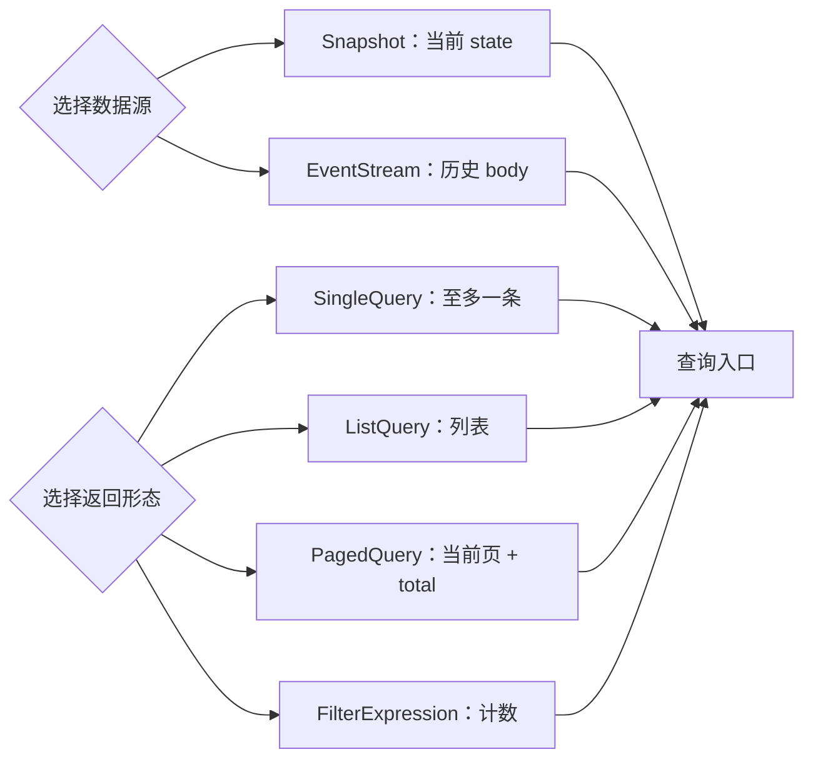

# 数据查询

这里的“数据查询”是文档分类，不是名为 `DataQuery` 的源码类型。公共查询合同由 `SingleQuery`、`ListQuery`、`PagedQuery` 和直接使用 `FilterExpression` 的 count 组成；过滤条件的 JSON 与 Kotlin DSL 见[过滤条件](./filter-expression.md)。

## 四种查询形态

| 形态 | 请求重点 | 返回值 |
| --- | --- | --- |
| `SingleQuery` | `filter`、`projection`、`sort` | 至多一条数据 |
| `ListQuery` | `filter`、`projection`、`sort`、`limit` | 数据列表 |
| `PagedQuery` | `filter`、`projection`、`sort`、`pagination` | 当前页数据和总数 |
| Count | 直接提交 `FilterExpression` | 精确计数（`Long`） |



这些形态可以作用于不同的数据模型；字段路径和模型默认行为分别见[快照查询](./snapshot-query.md)与[事件流查询](./event-stream-query.md)。本页不预设 `state.*` 或 `body.*` 路径。

## SingleQuery

`SingleQuery` 最多返回一条匹配数据。`filter` 决定匹配范围，`projection` 控制返回字段，`sort` 在存在多条匹配时决定哪一条排在最前面。没有匹配时的空值或错误语义由具体查询入口决定。

## ListQuery

`ListQuery` 返回列表，可用 `limit` 限制最多返回的条数。JVM 查询中 `limit = 0` 表示不限；HTTP 入口仍可能依据请求保护策略设置上限。它不包含分页页码，需要分页时使用 `PagedQuery`。

## PagedQuery

`PagedQuery` 返回 `PagedList`：`total` 是所有匹配数据的总数，`list` 是当前页数据。页码从 1 开始，`size` 是每页条数；`sort` 应提供稳定的排序以避免翻页时结果漂移。

```kotlin
val query = PagedQuery(
    filter = filterExpression { "status" eq "READY" },
    projection = Projection(include = listOf("id", "status")),
    sort = listOf(Sort("updatedAt", Sort.Direction.DESC)),
    pagination = Pagination(index = 1, size = 20)
)
```

等价的 JSON 请求形状如下。`status`、`updatedAt` 等字段只是中性示例，实际逻辑字段由数据模型页面提供：

```json
{
  "filter": { "op": "EQ", "field": "status", "value": "READY" },
  "projection": { "include": ["id", "status"] },
  "sort": [{ "field": "updatedAt", "direction": "DESC" }],
  "pagination": { "index": 1, "size": 20 }
}
```

其中：`index` 是从 1 开始的页码，`size` 是页大小；`sort` 是按逻辑字段排列的字段和方向；`filter` 是一个 `FilterExpression`。`projection` 可用 `include` 或 `exclude` 控制字段，空投影表示返回全部字段。

## Count

Count 请求体直接是 `FilterExpression`，没有额外的 `filter` 包装：

```json
{ "op": "EQ", "field": "status", "value": "READY" }
```

JVM 中可使用 `filter.count(queryGateway)`。计数是否可执行以及精确性遵循所选后端合同；HTTP 成本保护可能拒绝高成本或无过滤请求。Count 不返回数据列表。

## 排序与分页

排序字段必须是当前查询模型支持的逻辑字段，方向为 `ASC` 或 `DESC`。分页只改变返回窗口，不改变 `total`；当数据可能在多次请求之间变化时，应使用稳定且足够区分记录的排序。`ListQuery.limit` 与 `PagedQuery.pagination` 是两种互斥的取数方式，不应在同一个形态中混用。

## 返回值与空结果

查询可以返回类型化（typed）、仅状态（state-only）或 `ObjectNode` 结果，具体入口决定可用形态和解包方式。Gateway 在通用结果 Filter 完成后按需用 Jackson 物化 typed 结果。当前 V9 临时不提供自动 Mask，字段值不会被 Gateway 遮蔽。空结果也由具体入口决定：JVM、WebFlux 和 API Client 的 404、空值或空列表语义在各自子页面及客户端页面解释；本页不把一种传输语义推广到所有入口。

## 选择快照还是事件流

| 需求 | 入口 |
| --- | --- |
| 读取聚合当前状态、面向业务状态字段查询 | [快照查询](./snapshot-query.md) |
| 读取完整事件历史、面向事件流字段查询 | [事件流查询](./event-stream-query.md) |

两种模型都支持公共数据查询形态，但字段根、删除语义、可用传输入口和结果模型可能不同。先按数据的事实来源选择模型，再在对应页面确认字段路径、入口和空结果行为。
