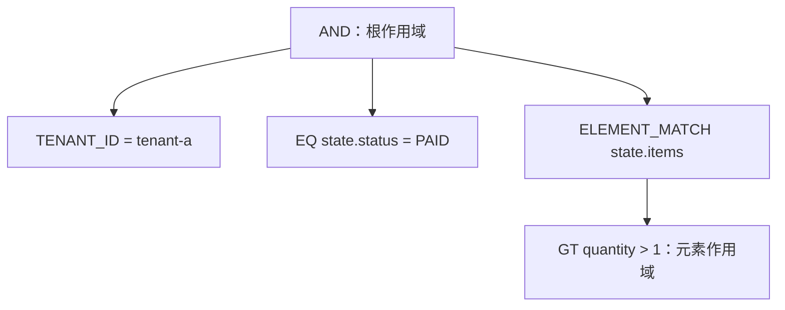

# 过滤条件

`FilterExpression` 是当前过滤合同。JSON 以 `op` 判别过滤器类型；嵌套的过滤器也必须使用 `op`。逻辑字段是点分路径：第一段必须是命名段，后续段可以是命名段或十进制数组下标；命名段可带 `@` 前缀，名称以 ASCII 字母或 `_` 开头，后续可含 ASCII 字母、数字、`_` 或 `-`。

## FilterExpression 结构

每个过滤器都是一个对象。字段过滤器使用 `field`，值使用 `value`、`values` 或范围边界；逻辑过滤器使用非空的 `operands`。

```json
{
  "op": "AND",
  "operands": [
    { "op": "EQ", "field": "state.status", "value": "PAID" },
    { "op": "GTE", "field": "state.total", "value": 100 }
  ]
}
```

`EQ` 和 `NE` 的 HTTP JSON 值必须是标量；范围、集合值和 JSON 的其他标量限制由各过滤器的规范形状定义。空 `AND`、`OR`、`NOR` 无效。

## 逻辑与常量操作符

| 操作符 | JSON 形状 | Kotlin DSL |
| --- | --- | --- |
| `MATCH_ALL` / `MATCH_NONE` | `{ "op": "MATCH_ALL" }` | `matchAll()` / `matchNone()` |
| `AND` / `OR` / `NOR` | `{ "op": "AND", "operands": [ ... ] }` | `and { ... }` / `or { ... }` / `nor { ... }` |

一个 `filterExpression { ... }` 块中并列的表达式会构成隐式 `AND`；需要改变组合语义时使用显式 `and`、`or` 或 `nor`。

`AND` 要求所有 operand 都匹配；`OR` 要求至少一个 operand 匹配；`NOR` 要求所有 operand 都不匹配。`MATCH_ALL` 与 `MATCH_NONE` 分别表示当前查询作用域中的全部和无任何结果。过滤器执行前会进行规范化：例如 `MATCH_ALL` 不改变 `AND`，而 `MATCH_NONE` 会使 `AND` 变为 `MATCH_NONE`；`OR` 与 `NOR` 也会应用对应的恒等项和吸收项规则。

## 标识与租户操作符

| 操作符 | JSON 形状 | Kotlin DSL |
| --- | --- | --- |
| `ID` / `IDS` | `{ "op": "ID", "value": "..." }` / `{ "op": "IDS", "values": ["..."] }` | `id("...")` / `ids("...")` |
| `AGGREGATE_ID` / `AGGREGATE_IDS` | `{ "op": "AGGREGATE_ID", "value": "..." }` | `aggregateId("...")` / `aggregateIds("...")` |
| `TENANT_ID` / `OWNER_ID` / `SPACE_ID` | `{ "op": "TENANT_ID", "value": "..." }` | `tenantId("...")` / `ownerId("...")` / `spaceId("...")` |

系统标识、租户、owner 与 space 必须使用这些专用操作符，不要手写看似等价的字段路径来绕过它们的语义。

`ID`/`IDS` 按存储记录标识过滤，`AGGREGATE_ID`/`AGGREGATE_IDS` 按聚合标识过滤。快照中两者通常都对应聚合文档标识；事件流中 `ID` 对应事件记录标识，`AGGREGATE_ID` 对应事件所属聚合。`IDS` 和 `AGGREGATE_IDS` 的 `values` 必须非空；如果业务集合可能为空，应在构造过滤器前显式选择 `MATCH_NONE` 或 `MATCH_ALL` 的语义。

## 比较与字符串操作符

| 操作符 | JSON 形状 | Kotlin DSL |
| --- | --- | --- |
| `EQ` / `NE` | `{ "op": "EQ", "field": "state.status", "value": "PAID" }` | `"status" eq "PAID"` / `"status" ne "CANCELLED"` |
| `GT` / `GTE` / `LT` / `LTE` | `{ "op": "GTE", "field": "state.total", "value": 100 }` | `"total" gte 100` |
| `CONTAINS` / `STARTS_WITH` / `ENDS_WITH` | `{ "op": "CONTAINS", "field": "state.note", "value": "vip", "stringComparison": "CASE_INSENSITIVE" }` | `"note".containsText("vip", StringComparison.CASE_INSENSITIVE)` |
| `IS_EMPTY_STRING` / `IS_NOT_EMPTY_STRING` | `{ "op": "IS_EMPTY_STRING", "field": "state.note" }` | `"note".isEmptyString()` / `"note".isNotEmptyString()` |

字符串比较默认 `CASE_SENSITIVE`。比较和字符串能力由后端及其发布的 Schema 决定。
无操作数的空字符串操作符仅适用于具备精确匹配能力的单值字符串字段。`IS_EMPTY_STRING` 只匹配 `""`；`IS_NOT_EMPTY_STRING` 要求字段存在、非 `null` 且不等于 `""`。仅含空白的字符串不视为空字符串。

`CONTAINS`、`STARTS_WITH` 和 `ENDS_WITH` 是字面量匹配，不使用全文 analyzer：MongoDB 使用转义后的正则表达式，Elasticsearch 使用 wildcard/prefix 查询。`CASE_INSENSITIVE` 会改变后端查询选项，可能比大小写敏感查询更昂贵；HTTP 查询保护关闭 expensive operators 时，这些操作符的部分形式会被拒绝。

## 集合与存在性操作符

| 操作符 | JSON 形状 | Kotlin DSL |
| --- | --- | --- |
| `IN` / `NOT_IN` | `{ "op": "IN", "field": "state.status", "values": ["PAID", "SHIPPED"] }` | `"status" isIn listOf("PAID", "SHIPPED")` |
| `BETWEEN` | `{ "op": "BETWEEN", "field": "state.total", "lowerBound": 100, "upperBound": 200 }` | `"total".between(100, 200)` |
| `CONTAINS_ALL` | `{ "op": "CONTAINS_ALL", "field": "state.tags", "values": ["vip", "new"] }` | `"tags" containsAll listOf("vip", "new")` |
| `IS_EMPTY` | `{ "op": "IS_EMPTY", "field": "state.items" }` | `"items".isEmptyCollection()` |
| `IS_NULL` / `IS_NOT_NULL` | `{ "op": "IS_NULL", "field": "state.note" }` | `"note".isNull()` / `"note".isNotNull()` |
| `EXISTS` / `NOT_EXISTS` | `{ "op": "EXISTS", "field": "state.note" }` | `"note".exists()` / `"note".notExists()` |

要求可比较值的 `GT`、`GTE`、`LT`、`LTE` 以及 `BETWEEN` 的两个边界不接受 `null`。`BETWEEN` 包含下界和上界；相对时间过滤器规范化后的上界则通常是排他的。`IN`、`NOT_IN` 与 `CONTAINS_ALL` 的 `values` 不能为空，也不能包含 `null`。检查 null、存在性或空集合时使用无操作数的专用操作符 `IS_NULL`、`IS_NOT_NULL`、`EXISTS`、`NOT_EXISTS` 或 `IS_EMPTY`。

`FilterDsl` 中的 `"field" eq null` 和 `"field" ne null` 会直接构造为 `IS_NULL` 和 `IS_NOT_NULL`。这些操作符最终使用后端原生的 null、缺失和存在性语义：

| 操作符 | MongoDB 编译形式 | Elasticsearch 编译形式 |
| --- | --- | --- |
| `IS_NULL` | `field = null` | `must_not exists` |
| `IS_NOT_NULL` | `field != null` | `exists` |
| `EXISTS` | `exists(field)` | `exists` |
| `NOT_EXISTS` | `exists(field, false)` | `must_not exists` |
| `IS_EMPTY` | `size(field, 0)` | `must_not exists` |

MongoDB 中，`IS_NULL` 的 `field = null` 匹配 null 或缺失字段；`IS_NOT_NULL` 的 `field != null` 匹配存在且非 null 的字段；`EXISTS` 也包含值为 null 的字段；`NOT_EXISTS` 只匹配缺失字段；`IS_EMPTY` 的 `$size: 0` 只匹配实际的空数组。详见 [MongoDB 的 null 与缺失字段语义](https://www.mongodb.com/docs/manual/tutorial/query-for-null-fields/) 和 [$size](https://www.mongodb.com/docs/manual/reference/operator/query/size/)。

因此 Elasticsearch 中 `IS_NULL` 与 `NOT_EXISTS`、`IS_NOT_NULL` 与 `EXISTS` 的结果分别相同；在未配置 `null_value` 等特殊 mapping 时，`null` 和空数组不会产生可查询的 indexed value，`IS_EMPTY` 也可能匹配缺失或 null 字段。详见 [Elasticsearch exists 查询](https://www.elastic.co/docs/reference/query-languages/query-dsl/query-dsl-exists-query)。特殊 mapping 或 ignored 值可能改变 `exists` 的结果。

## 数组元素匹配

`ELEMENT_MATCH` 要求同一个数组元素满足其 `predicate`。谓词中的字段以元素为根，不是数组的完整路径：

```json
{
  "op": "ELEMENT_MATCH",
  "field": "state.items",
  "predicate": { "op": "GT", "field": "quantity", "value": 1 }
}
```

```kotlin
"items".elementMatch {
    "quantity" gt 1
}
```

元素谓词不能包含 root-only 的 `ID`、`IDS`、`AGGREGATE_ID`、`AGGREGATE_IDS`、`TENANT_ID`、`OWNER_ID`、`SPACE_ID`、`DELETION` 或 `SEARCH`，即使它们嵌套在 `AND`、`OR`、`NOR` 或另一个 `ELEMENT_MATCH` 中。

MongoDB 将 `ELEMENT_MATCH` 编译为 `$elemMatch`；Elasticsearch 将其编译为 `nested` 查询，因此 Elasticsearch 需要对应字段使用 `nested` mapping。是否存在可用的元素作用域由 Query Schema 的 `ELEMENT_SCOPE` 能力决定；普通对象数组与 nested 数组不能互相推断。

## 删除标记与全文搜索

| 操作符 | JSON 形状 | Kotlin DSL |
| --- | --- | --- |
| `DELETION` | `{ "op": "DELETION", "state": "ACTIVE" }` | `deletion(DeletionState.ACTIVE)` |
| `SEARCH` | `{ "op": "SEARCH", "query": "wireless", "fields": ["state.note"], "mode": "TERMS" }` | `search("wireless", "note")` |

删除标记使用 `DELETION`，不要以字段路径模拟。快照查询默认追加 `DELETION = ACTIVE`；事件流查询保留完整历史，不追加该 guard。

`DELETION` 的 `state` 还可以是 `DELETED` 或 `ALL`，分别只查询已删除数据，或同时包含已删除和未删除数据。快照查询中的显式删除条件只有位于根表达式或根 `AND` 合取树中时，才会覆盖默认的 `ACTIVE` 范围；放在 `OR` 或 `NOR` 内部不会移除该默认条件。

### SearchFilter

`SearchFilter` 表示全文搜索，不是普通字符串的 `CONTAINS` 匹配。搜索文本会交给后端的全文索引和 analyzer 处理，因此是否命中、如何分词以及结果如何排序取决于后端配置。

| 属性 | 说明 |
| --- | --- |
| `query` | 搜索文本，不能是空字符串或全空白字符串。 |
| `fields` | 可选的逻辑字段集合。为空时使用后端默认的全文搜索字段；不为空时请求限定到这些字段，但最终是否保留字段范围取决于 Schema 校验结果。 |
| `mode` | `TERMS` 或 `PHRASE`，默认是 `TERMS`。 |

直接构造或使用 DSL：

```kotlin
import me.ahoo.wow.api.query.QueryField
import me.ahoo.wow.api.query.SearchFilter
import me.ahoo.wow.api.query.SearchMode
import me.ahoo.wow.query.dsl.filterExpression

SearchFilter("wireless")

SearchFilter(
    query = "event sourcing",
    fields = setOf(QueryField("state.description")),
    mode = SearchMode.PHRASE,
)

filterExpression {
    search("wireless", "state.title", "state.description")
    search("event sourcing", SearchMode.PHRASE, "state.description")
}
```

对应的 JSON：

```json
{
  "op": "SEARCH",
  "query": "event sourcing",
  "fields": ["state.description"],
  "mode": "PHRASE"
}
```

`TERMS` 是分词后的普通全文搜索，不要求原始字符串完整连续出现；`event sourcing` 可能按两个 term 参与匹配。`PHRASE` 是短语搜索，要求分析后的词项按顺序和位置匹配，但仍受 analyzer 影响，并不等同于原始字符串相等。

后端编译前，Query Schema 会先解析 `fields`。所有字段都能精确解析时，字段范围会保留（必要时改写为后端物理路径）；如果字段不能全部精确解析、但模型支持对应的全文能力，兼容校验模式会清空 `fields`，退化为后端默认范围，并将结果标记为 `COMPATIBLE`。这可能扩大搜索范围；严格校验模式只接受 `EXACT`，会拒绝这种请求。

#### 后端实现

- **MongoDB**：转换为 MongoDB 的 `$text` 查询。`TERMS` 直接使用查询文本；`PHRASE` 会将查询文本包装为双引号短语，查询文本本身不能包含双引号。collection 必须存在 text index，可搜索字段由该 text index 决定。当前 MongoDB 转换器不会把 `fields` 编译成逐字段限制；显式字段通常会在 Schema 层以 `COMPATIBLE` 方式降级为不带字段的 `$text` 查询，严格校验模式会拒绝它。
- **Elasticsearch**：转换为 `multi_match` 查询。指定 `fields` 且精确解析时，字段会映射为 Elasticsearch 的物理字段路径；不指定时由 `index.query.default_field` 决定，并设置 `lenient`。如果显式字段没有精确解析，兼容校验模式同样可能先将其清空，再执行默认字段范围的搜索。`TERMS` 使用 `multi_match` 默认的 `best_fields` 语义，即各字段分别执行 `match`，使用最佳字段的相关性得分；`PHRASE` 设置 `type: phrase`，相当于对各字段执行 `match_phrase`。字段是否支持全文或短语搜索由 Elasticsearch mapping 和 Query Schema 决定。

`SEARCH` 是 root-only 过滤器，不能放入 `ELEMENT_MATCH` 的元素谓词中。需要字面量的包含、前缀或后缀匹配时，应使用 `CONTAINS`、`STARTS_WITH` 或 `ENDS_WITH`。

## 相对时间操作符

| 操作符 | JSON 形状 | Kotlin DSL |
| --- | --- | --- |
| `TODAY` / `YESTERDAY` / `BEFORE_TODAY` / `TOMORROW` | `{ "op": "TODAY", "field": "state.createTime", "zoneId": "Asia/Shanghai", "timeUnit": "MILLISECONDS" }`；`BEFORE_TODAY` 另有 `time` | `"createTime".today()` / `.yesterday()` / `.beforeToday(LocalTime.NOON)` / `.tomorrow()` |
| `THIS_WEEK` / `NEXT_WEEK` / `LAST_WEEK` | `{ "op": "THIS_WEEK", "field": "state.createTime" }` | `"createTime".thisWeek()` / `.nextWeek()` / `.lastWeek()` |
| `THIS_MONTH` / `NEXT_MONTH` / `LAST_MONTH` | `{ "op": "THIS_MONTH", "field": "state.createTime" }` | `"createTime".thisMonth()` / `.nextMonth()` / `.lastMonth()` |
| `LAST_YEAR` / `THIS_YEAR` / `NEXT_YEAR` | `{ "op": "THIS_YEAR", "field": "state.createTime" }` | `"createTime".lastYear()` / `.thisYear()` / `.nextYear()` |
| `RECENT_DAYS` / `EARLIER_DAYS` | `{ "op": "RECENT_DAYS", "field": "state.createTime", "days": 7 }` | `"createTime".recentDays(7)` / `.earlierDays(7)` |

可选 `zoneId`、`datePattern` 与 `timeUnit` 适用于相对时间过滤器；默认 `timeUnit` 是 `MILLISECONDS`，配置 `datePattern` 时忽略它。`RECENT_DAYS` 和 `EARLIER_DAYS` 的 `days` 至少为 `1`。时区、日期格式和物理时间字段能力仍由 Schema 与后端确定。

有明确时间窗口的相对时间过滤器会在后端编译前按半开区间 `[start, end)` 规范化；`BEFORE_TODAY` 和 `EARLIER_DAYS` 使用排他的上界：

- `TODAY`、`YESTERDAY`、`TOMORROW` 分别表示指定时区的日历日；`BEFORE_TODAY(time)` 表示早于今天该时刻。
- `THIS_WEEK`、`NEXT_WEEK`、`LAST_WEEK` 使用周一作为周起点；月和年过滤器使用对应日历月、日历年。
- `RECENT_DAYS(7)` 包含今天和此前六个日历日；`EARLIER_DAYS(7)` 表示早于这七个日历日窗口的时间。
- 未指定 `zoneId` 时使用进程默认时区。`datePattern` 只适用于 Schema 声明为格式化时间的字段，且必须与 Schema 中的 pattern 相同；数值 epoch 字段或原生日期字段不能配置 `datePattern`。数值字段的 `timeUnit` 以 Schema 声明为准，配置 `datePattern` 后则生成格式化字符串并忽略 `timeUnit`。

## JSON 与 Kotlin DSL 对照

下列快照查询在同一逻辑 `AND` 中限定租户、状态和数组元素数量：

```json
{
  "op": "AND",
  "operands": [
    { "op": "TENANT_ID", "value": "tenant-a" },
    { "op": "EQ", "field": "state.status", "value": "PAID" },
    {
      "op": "ELEMENT_MATCH",
      "field": "state.items",
      "predicate": { "op": "GT", "field": "quantity", "value": 1 }
    }
  ]
}
```

```kotlin
import me.ahoo.wow.query.dsl.filterExpression
import me.ahoo.wow.query.snapshot.pathState

val filter = filterExpression {
    tenantId("tenant-a")
    pathState {
        "status" eq "PAID"
        "items".elementMatch {
            "quantity" gt 1
        }
    }
}
```

`pathState` 将内部字段补为 `state.*`，而 `items.elementMatch` 创建独立的单元素作用域，所以 `quantity` 不会被补成 `state.items.quantity`。`path { ... }` 内的多个表达式同样形成一个隐式 `AND`。



## 字段路径规则

`field` 是逻辑路径，不是任意后端的物理字段名。根路径取决于查询模型：快照的业务字段位于 `state`；事件流的根字段与展开后的事件字段不同，事件 payload 位于 `body.body`。因此不要把快照的 `state.*` 路径复制到事件流查询，也不要从物理 mapping 猜测逻辑字段。

`path` 只做词法路径作用域：在 `"state".path { "status" eq "PAID" }` 中得到 `state.status`；已以当前前缀开头的路径保持不变。`elementMatch` 则建立独立元素作用域，谓词字段相对元素。

## 安全与兼容边界

查询模型 Schema 负责把逻辑字段解析为后端已证明的能力；请参阅[查询总览中的 Schema 说明](./query-model-schema.md)。MongoDB、Elasticsearch 或自定义后端可以支持不同的比较、存在性、全文搜索或时间语义，公共操作符列表不承诺跨后端一致性。

HTTP 请求在 WebFlux `ServerRequest` context 中会经过 `HttpQueryGuardFilter`。`wow.webflux.query.allow-expensive-operators=false` 时，会拒绝 `NE`、`NOT_IN`、`NOR`、`IS_NULL`、`IS_NOT_NULL`、`NOT_EXISTS`、`IS_EMPTY`、`IS_NOT_EMPTY_STRING`、`CONTAINS`、`ENDS_WITH`，以及空字符串或大小写不敏感的 `STARTS_WITH`；HTTP guard 还限制 filter 节点和值数量。该配置的兼容默认值不是容量证明，详见[基础设施配置](../../reference/config/infrastructure)。进程内查询不因这项 HTTP 专用保护而获得或失去后端能力。

V9 的规范 JVM API 是 `FilterExpression` 与 `FilterDsl`。V9.x 暂时保留已弃用的 `Condition`、`Operator`、`ConditionDsl`、旧查询构造器和 count 客户端重载，并在执行前统一转换为 `FilterExpression`；这些兼容 API 计划在 10.0.0 删除。WebFlux REST 边界同期接受 V8 list/paged/single 请求的 `condition` 字段，以及 count 请求的裸 `operator` 形状；规范 `filter`、OpenAPI 与出站 JSON 仍只使用 `op`。`filter` 与 `condition` 不能同时出现，`op` 与 `operator` 也不能混用。
