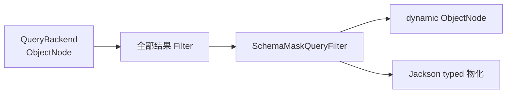

# 字段脱敏

## 适用范围与执行顺序

字段脱敏由受管 `QueryGateway` 响应链中的框架内建 `SchemaMaskQueryFilter` 承担，并要求 Gateway 接收在 `QueryBackendBinding` 中与 Backend 配对的 `schemaProvider`。该 Filter 由框架强制装配在最外层；它的结果阶段固定在全部通用结果 Filter 完成之后、typed 结果由 Jackson 物化之前：



该链路覆盖 Snapshot 与 EventStream 的 typed/dynamic `single`、`list`、`paged`、`cursor` 结果，以及经 Snapshot Gateway 加载的 state-only/aggregate-state 结果。Mask 只修改当前响应节点，不重写存储文档、领域对象或应用的通用 Jackson 序列化合同；`count` 与聚合结果也不经过结果 Mask。

## 内建注解

Kotlin 属性通常使用字段 use-site：

```kotlin
import me.ahoo.wow.api.query.mask.KeepMask
import me.ahoo.wow.api.query.mask.Mask

data class AccountState(
    @field:Mask
    val password: String,
    @field:KeepMask(prefix = 3, suffix = 4)
    val phone: String?,
)
```

Mask 注解只能用于 JVM `String`/`String?` 属性；enum、UUID 等类型即使序列化后的 JSON 形状是 String，也会在 Schema 构建时失败关闭，避免 typed 结果无法重新物化。

- `@Mask` 按 Unicode code point 数量把每个 code point 替换为一个 `*`，例如 `A中😀` 变为 `***`。
- `@KeepMask(prefix, suffix)` 按 code point 保留前后部分并遮蔽中间；值太短、无法同时保留两端时全量遮蔽，例如 `13800138000` 变为 `138****8000`，`1234567` 变为 `*******`。
- 缺失值与 `null` 不变，空字符串仍为空字符串。嵌套对象、集合和嵌套字符串数组按 Schema 路径递归处理。

## 自定义 meta-annotation

领域专用规则由带 `@Masking(strategy)` 的运行时注解声明。Strategy 在 Schema 构建时实现 `MaskStrategy<A>.compile`，返回查询时复用的 `CompiledMask`；该过程不需要 KSP。

```kotlin
import me.ahoo.wow.api.query.mask.CompiledMask
import me.ahoo.wow.api.query.mask.MaskStrategy
import me.ahoo.wow.api.query.mask.Masking
import kotlin.annotation.AnnotationRetention.RUNTIME
import kotlin.annotation.AnnotationTarget.FIELD
import kotlin.annotation.AnnotationTarget.PROPERTY_GETTER

@Target(FIELD, PROPERTY_GETTER)
@Retention(RUNTIME)
@Masking(strategy = RedactStrategy::class)
annotation class Redact(val replacement: String = "[redacted]")

object RedactStrategy : MaskStrategy<Redact> {
    override fun compile(annotation: Redact): CompiledMask {
        require(annotation.replacement.isNotEmpty())
        return CompiledMask { value ->
            if (value.isEmpty()) value else annotation.replacement
        }
    }
}
```

Strategy 可以是 Kotlin `object` 或公开无参类。示例不按 UTF-16 code unit 截断输入，并显式保留空字符串；需要保留字符位置时，应像内建实现一样按 Unicode code point 处理。

## Query Schema 合同

`JsonQuerySchemaSource` 在运行时发现字段、Jackson 可见的非 public getter，以及从父类 Kotlin property 或接口 getter 继承的有效注解。规则随 Query Schema 合并和后端 adapter 传递，但公开 `QueryModelSchemaMetadata` 只暴露字段级 `masked: Boolean`；Strategy 类型、注解参数、编译后的规则和可执行函数只存在于内存中。

Gateway 每次订阅在创建 `QueryContext` 前读取一次 Provider 当前 Schema，`SchemaMaskQueryFilter` 直接使用 `QueryContext.schema`；Filter、Resolver、Backend 与 Mask 因而共享同一实例。refresh 发布新实例后，新的订阅会取得它并重新编译 Masker。Schema 加载失败不会被缓存，后续订阅或 `retry` 可以重新加载；失败的订阅不会创建 Context，也不会执行 Filter 或 Backend。根 Schema 没有 `masked` 字段时，复用空 Mask 判定走 O(1) 快速路径：不创建 masker、不遍历 JSON，也不为每条结果追加 `map`。

## 行为矩阵

| 查询或结果 | 行为 |
|---|---|
| Snapshot/EventStream typed `single`、`list`、`paged` | 在 typed 物化前脱敏 |
| Snapshot/EventStream dynamic `single`、`list`、`paged` | 返回已脱敏的 `ObjectNode` |
| Snapshot/EventStream typed/dynamic `cursor` | 对 `CursorPage.list` 脱敏，原样保留 `nextCursor` |
| Snapshot state-only / aggregate-state load | 复用 Snapshot Gateway，同样脱敏 |
| 普通 filter、全文 search、sort | 允许引用 Mask 字段；后端按原值匹配或排序，响应仍脱敏 |
| `CursorQuery` 有效 sort | 必须精确解析、是单值字段、不能带 Mask 规则，也不能通过 projection 或物理 binding alias 指向 masked 字段；否则在 Backend 前拒绝，避免原始排序值或多值数组进入 `nextCursor` |
| 数据查询 `count` | 计数不变；Gateway 仍加载 Schema 完成准入，但 Mask 层不处理字段值 |
| 聚合 group、字段 metric、数值 expression | 引用 Mask 字段时解析为 `INCOMPATIBLE` 并在 Backend 执行前拒绝 |
| 聚合所需 Schema 不可用 | 失败关闭；即使聚合只含 `COUNT` 也不降级执行 |

## 失败关闭边界

| 条件 | 结果 |
|---|---|
| 字段不是 JVM String，或 Schema alternative 不是 String wire shape | Schema 构建失败 |
| 同一成员有多个有效 Mask 注解，或 Schema 分支规则冲突 | Schema conflict |
| Strategy 无法构造，或 `compile` 抛错 | Schema 构建失败，错误保留 |
| 响应值为非 String/非 String 数组，Strategy 执行抛错，或自定义 `CompiledMask` 返回 `null` | 当前结果 Publisher 失败，不返回原值 |
| EventStream event item 含非 null payload，但 `bodyType` 缺失、不是字符串或未知 | 当前结果 Publisher 失败 |
| EventStream 顶层 `body` 不是数组，或数组包含非 object event item | 当前结果 Publisher 失败 |

Event projection 完全没有顶层 `body`，或把该事件数组投影为 `null` 时，Mask 安全跳过。顶层 `body` 存在时必须是数组，且每个 event item 都必须是 object。合法 event item 内的 payload 属性 `body` 缺失或为 null，表示 metadata-only 或 payload 已排除；此时没有敏感 payload 可泄漏，不要求 `bodyType`。非 null payload 仍必须携带已知的字符串 `bodyType`；缺失、非字符串或未知类型都会在 Mask 前失败关闭。

## 受信原始值边界

- 直接调用 Factory 返回 binding；受信原始访问为 `factory.create(namedAggregate).backend`，会绕过整个 Gateway，包括查询 Filter、错误观察和 Mask。
- 自定义 Factory 在 `QueryBackendBinding` 中配对 Backend 与 `QueryModelSchemaProvider`；自定义 Backend 从不实现 Provider。Provider 不可用时在 Context 与订阅 Backend 前失败关闭，不会跳过 Mask 返回原值。

两者都只适合存储扩展、Backend 合同测试和受信诊断，不能作为普通业务查询入口。

## 迁移与验证

从 V8 Registry/Filter Mask 迁移时，先按 [V9 查询迁移](./v9-query-migration.md)删除旧类型并把规则移到领域字段，再完成以下检查：

1. 通过[查询模型 Schema](./query-model-schema.md)端点确认目标字段只新增 `masked: true`，没有公开策略或参数。
2. 分别验证 Snapshot/EventStream 的 typed、dynamic 与 state-only/aggregate-state load 响应。
3. 验证普通 filter/search/sort 与数据查询 `count` 保持可用；masked cursor sort、group、字段 metric、数值 expression 和 Schema unavailable 聚合失败关闭。
4. 仅在受信测试中验证 direct Factory 返回原始值，并确认存储文档与通用 Jackson 序列化未被改写。

完整执行位置、Filter 顺序和绕过条件见[查询网关](./query-gateway.md)。
