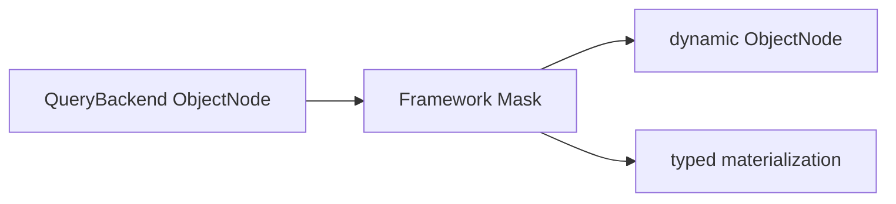

# 字段脱敏

## 适用范围与执行顺序

Gateway 在 Backend 返回节点之后、typed 物化之前固定执行 `SchemaMasker`。该步骤不能由通用请求 Filter 替换或绕过：



Snapshot 与 EventStream 的 typed/dynamic single、list、paged、cursor 以及经 Snapshot Gateway 的 state-only/aggregate-state load 使用同一路径。Mask 只处理当前响应，不修改存储文档、领域对象或通用 Jackson 序列化；count 和聚合行不经过结果 Mask。

## 声明敏感字段

在领域字段上标注 `@Sensitive`。Kotlin 属性通常使用字段 use-site：

```kotlin
import me.ahoo.wow.api.query.annotation.Mask
import me.ahoo.wow.api.query.annotation.Sensitive
import me.ahoo.wow.api.query.annotation.SensitivityLevel

data class AccountState(
    @field:Sensitive(SensitivityLevel.CONFIDENTIAL)
    val password: String,
    @field:Sensitive(SensitivityLevel.DISPLAY, mask = Mask(keepPrefix = 3, keepSuffix = 4))
    val phone: String?,
)
```

敏感等级只能在领域字段上声明，不能通过声明文件或字符串路径声明：字段改名后规则会静默失效，等于数据泄露。

`@Sensitive` 只支持 JVM `String`/`String?` 属性。Enum、UUID 等 JVM 类型即使序列化后的 JSON wire shape 是 String，也会在 Schema 构建时失败关闭，避免 typed 结果重新物化失败。

### 敏感等级

两种等级都会在每个结果中遮挡取值，区别在于查询能对原值做什么：

| 等级 | 结果 | 过滤、分页排序 | 分组、`ANY`、字段指标、算术引用、游标排序 |
|---|---|---|---|
| `DISPLAY` | 遮挡 | 允许；能力描述标明 `"comparable": true` | 拒绝 |
| `CONFIDENTIAL` | 遮挡 | 拒绝（`PROTECTED_COMPARISON`） | 拒绝 |

- 允许比较的 `DISPLAY` 字段可以被范围条件逐步逼近原值。不能接受时，改用 `CONFIDENTIAL`，或者设置 `wow.query.sensitivity.display-comparable=false`：此后 `DISPLAY` 字段与 `CONFIDENTIAL` 一样拒绝过滤和分页排序，能力描述标明 `"comparable": false` 且不列出运算符。
- 不带 `fields` 的全模型 `SEARCH` 会匹配所有可检索字段，而哪些字段可检索由存储决定。因此只要模型中有不允许比较的字段，全模型检索就会被拒绝（`MODEL_SEARCH_UNSUPPORTED`），请改为检索指定字段。
- 能力描述从不列出受保护字段的枚举值。

### 遮挡方式

- `Mask()`（默认）按 Unicode code point 数量把每个 code point 替换为一个 `*`，例如 `A中😀` 变为 `***`。
- `Mask(keepPrefix, keepSuffix)` 按 code point 保留前后部分并遮蔽中间；值太短、无法同时保留两端时全量遮蔽，例如 `13800138000` 变为 `138****8000`，`1234567` 变为 `*******`。
- 缺失和 `null` 保持不变，空字符串仍为空；嵌套对象、集合和嵌套字符串数组按 Schema 路径递归处理。

自定义 `MaskStrategy` 替代内建遮挡。它必须是 Kotlin `object` 或带公开无参构造器的类，且 `keepPrefix`/`keepSuffix` 必须保持为 `0`：

```kotlin
import me.ahoo.wow.api.query.annotation.MaskStrategy

object RedactStrategy : MaskStrategy {
    override fun mask(value: String): String = if (value.isEmpty()) value else "[redacted]"
}

data class NoteState(
    @field:Sensitive(SensitivityLevel.DISPLAY, mask = Mask(strategy = RedactStrategy::class))
    val note: String,
)
```

需要保留字符位置时，应像内建遮挡一样按 Unicode code point 处理。要复用同一份声明，可以把 `@Sensitive` 标在一个注解类上，再用这个注解标注字段。

## Query Schema 合同

`JsonQuerySchemaSource` 在运行时发现字段、Jackson 可见的非 public getter，以及从父类 Kotlin property 或接口 getter 继承的有效 `@Sensitive` 注解。规则随 Query Schema 合并和后端 adapter 传递，但公开的能力描述只以字段的 `sensitivity`（等级与是否允许比较）暴露它们；Strategy 类型、遮挡参数和可执行函数只存在于内存中。

Gateway 每次订阅只取得一次 Schema，prepare、公共校验、Backend 与响应 Mask 使用同一实例。Mask 遍历定义在 Schema 发布时构建，订阅只使用这一代不可变数据；refresh 发布新实例不会改变在途订阅。Schema 获取失败不会跳过脱敏返回原值。没有 Mask 声明时不遍历响应 JSON。

## 行为矩阵

| 查询或结果 | 行为 |
|---|---|
| Snapshot/EventStream typed `single`、`list`、`paged` | 在 typed 物化前脱敏 |
| Snapshot/EventStream dynamic `single`、`list`、`paged` | 返回已脱敏的 `ObjectNode` |
| Snapshot/EventStream typed/dynamic `cursor` | 对 `CursorPage.list` 脱敏，原样保留 `nextCursor` |
| Snapshot state-only / aggregate-state load | 复用 Snapshot Gateway，同样脱敏 |
| State 路由（按 id/版本/时间加载、tracing） | 仅在 `wow.webflux.state.point-read-admission=true` 时脱敏；见 [State 点读](../data-access.md#state-点读) |
| 普通 filter、全文 search、sort | 允许引用可比较的 `DISPLAY` 字段；后端按原值匹配或排序，响应仍脱敏。`CONFIDENTIAL` 字段，以及关闭了比较的 `DISPLAY` 字段，在 Backend 前被拒绝 |
| `CursorQuery` 有效 sort | 必须具有已证明的 CURSOR_SORT binding、是单值字段、不能带 Mask 规则，也不能通过 projection 或物理 binding alias 指向 masked 字段；否则在 Backend 前拒绝，避免原始排序值或多值数组进入 `nextCursor` |
| 数据查询 `count` | 计数不变；Gateway 仍加载 Schema 完成准入，但 Mask 层不处理字段值 |
| 聚合 group、字段 metric、数值 expression | 公共校验在 Backend 执行前拒绝受 Mask 保护的字段或源别名 |
| 聚合所需 Schema 不可用 | 失败关闭；即使聚合只含 `COUNT` 也不降级执行 |

## 失败关闭边界

| 条件 | 结果 |
|---|---|
| 注解成员不是 JVM String，或被规则覆盖的值域不是字符串/字符串数组，或含 UNKNOWN | Schema 构建失败 |
| 同一成员有多个不同的有效 `@Sensitive` 注解，或 Schema 分支规则冲突 | Schema conflict |
| 自定义 Strategy 无法构造，或与 `keepPrefix`/`keepSuffix` 同时使用 | Schema 构建失败，错误保留 |
| 被规则覆盖的响应值为非 String/非 String 数组，Strategy 执行抛错，或自定义 `MaskStrategy` 返回 `null` | 当前结果 Publisher 失败，不返回原值 |
| EventStream event item 含非 null payload，但 `bodyType` 缺失、不是字符串或未知 | 当前结果 Publisher 失败 |
| EventStream 顶层 `body` 不是数组，或数组包含非 object event item | 当前结果 Publisher 失败 |

Event projection 完全没有顶层 `body`，或把该事件数组投影为 `null` 时，Mask 安全跳过。顶层 `body` 存在时必须是数组，且每个 event item 都必须是 object。合法 event item 内的 payload 属性 `body` 缺失或为 null，表示 metadata-only 或 payload 已排除；此时没有敏感 payload 可泄漏，不要求 `bodyType`。非 null payload 仍必须携带已知的字符串 `bodyType`；缺失、非字符串或未知类型都会在 Mask 前失败关闭。


明确的未脱敏联合分支（例如 INTEGER）保留原值；字符串分支继续脱敏。Map 的明确 property 优先于 additionalProperties，数组 Item 层级与原生别名必须按共享 Schema 保留，不能扩大到无关兄弟字段。

## 受信原始值边界

- 直接调用 Factory 返回 binding；受信原始访问为 `factory.create(namedAggregate).backend`，会绕过整个 Gateway，包括查询 Filter、错误观察和 Mask。
- 自定义 Factory 在 `QueryBackendBinding` 中配对 Backend 与 `QueryModelSchemaProvider`；自定义 Backend 从不实现 Provider。Provider 不可用时在 Context 与订阅 Backend 前失败关闭，不会跳过 Mask 返回原值。

两者都只适合存储扩展、Backend 合同测试和受信诊断，不能作为普通业务查询入口。

## 迁移与验证

`@Mask`、`@KeepMask`、`@Masking` 与旧的 `MaskStrategy<A>` 已删除，仍使用它们的代码无法编译。按下表替换：

| 之前 | 之后 |
|---|---|
| `@field:Mask` | `@field:Sensitive(SensitivityLevel.DISPLAY)` |
| `@field:KeepMask(prefix = 3, suffix = 4)` | `@field:Sensitive(SensitivityLevel.DISPLAY, mask = Mask(keepPrefix = 3, keepSuffix = 4))` |
| 带 `@Masking(strategy)` 的自定义注解 | `mask = Mask(strategy = MyStrategy::class)`，`MyStrategy : MaskStrategy` 负责遮挡单个取值 |

`DISPLAY` 保持已删除注解的行为；绝不能被比较的取值使用 `CONFIDENTIAL`。从 V8 Registry/Filter Mask 迁移时，先按 [V9 查询迁移](./v9-query-migration.md)删除旧类型并把规则移到领域字段，再完成以下检查：

1. 通过[查询模型 Schema](./query-model-schema.md)端点确认目标字段报告了 `sensitivity`，没有公开策略或参数。
2. 分别验证 Snapshot/EventStream 的 typed、dynamic 与 state-only/aggregate-state load 响应。
3. 验证 `DISPLAY` 字段的普通 filter/search/sort 与数据查询 `count` 保持可用、`CONFIDENTIAL` 字段的这些操作被拒绝；masked cursor sort、group、字段 metric、数值 expression 和 Schema unavailable 聚合失败关闭。
4. 仅在受信测试中验证 direct Factory 返回原始值，并确认存储文档与通用 Jackson 序列化未被改写。

完整执行位置、Filter 顺序和绕过条件见[查询网关](./query-gateway.md)。
