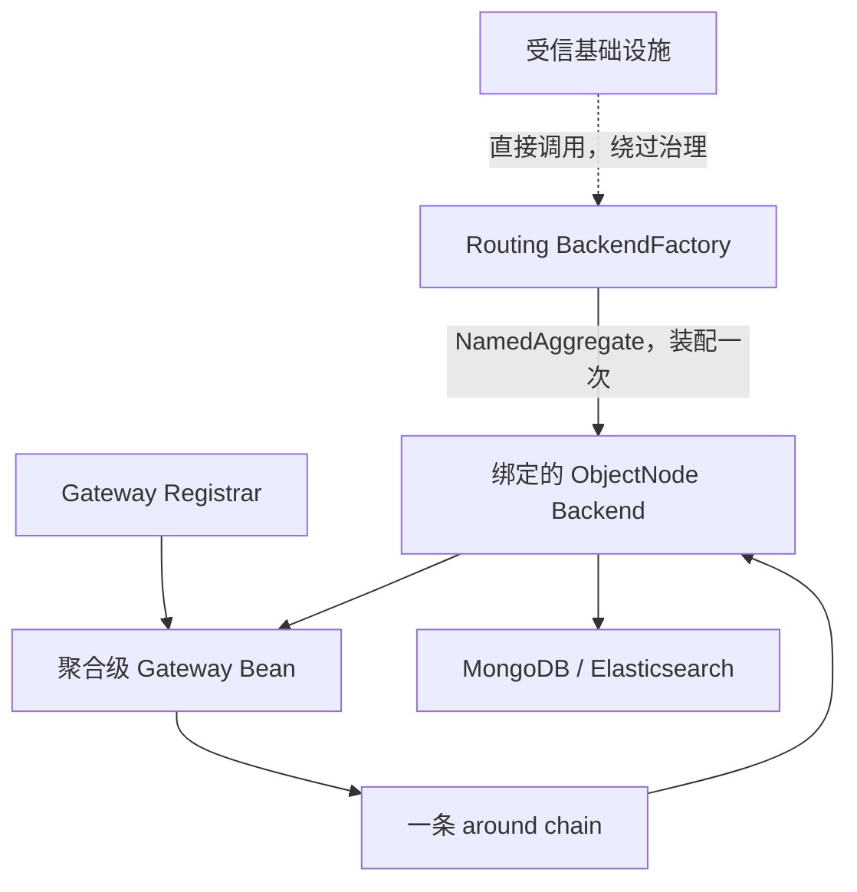

# 查询后端

## QueryBackend 契约

`QueryBackend` 是聚合绑定的低层合同。六个执行方法只接受由 Gateway 准备的 `ResolvedQuery`：

```kotlin
fun single(query: ResolvedQuery<ISingleQuery>): Mono<ObjectNode>
fun list(query: ResolvedQuery<IListQuery>): Flux<ObjectNode>
fun paged(query: ResolvedQuery<IPagedQuery>): Mono<PagedList<ObjectNode>>
fun cursor(query: ResolvedQuery<ICursorQuery>): Mono<CursorPage<ObjectNode>>
fun count(query: ResolvedQuery<FilterExpression>): Mono<Long>
fun aggregate(query: ResolvedQuery<AggregationQuery>): Flux<ObjectNode>
```

不存在接收原始 Query 的兼容重载。Backend 不获取或解析 Schema，也不决定 `QuerySchemaValidationMode`；它只用 `ResolvedQuery.query` 和非空的 `ResolvedQuery.schema` 编译并执行查询。Projection 与 Aggregation Compiler 都接收这个 Schema 实例。single、list、paged、cursor 与 aggregate 返回 `tools.jackson.databind.node.ObjectNode`，count 返回 `Long`；cursor 把节点包装在 `CursorPage<ObjectNode>` 中。`SnapshotQueryBackend` 和 `EventStreamQueryBackend` 区分数据模型；typed 物化属于 Gateway，不属于 Backend。自定义 Backend 从不实现或委托 `QueryModelSchemaProvider`。

## 节点所有权约束

Backend 返回的 Publisher 每次订阅都必须创建由该订阅独占的可变 `ObjectNode`；`retry`、`repeat` 和并发订阅也分别拥有新节点。Backend 不得跨订阅缓存或共享节点，不得发布缓存节点，也不得在节点发出后异步继续修改。

Backend 边界只允许标准 JSON tree。MongoDB `Document`、Elasticsearch source `Map`、BSON 值、`POJONode` 和任意 POJO 必须在 Backend 内规范化或被拒绝，不能泄漏到 Gateway。



## 注入类型化的 SnapshotQueryGateway Bean

Spring 可按状态类型注入快照 Gateway：

```kotlin
@Component
class OrderReader(
    private val queryGateway: SnapshotQueryGateway<OrderState>,
) {
    fun find(query: PagedQuery): Mono<PagedList<MaterializedSnapshot<OrderState>>> =
        queryGateway.paged(query)
}
```

这是应用内 JVM 入口；请求与结果都经过[查询网关](query-gateway.md)的同一条策略链。

## Bean 注册与命名

`SnapshotQueryGatewayRegistrar` 使用 `ResolvableType` 注册 `SnapshotQueryGateway<STATE>`，Bean 名为 `{contextAlias.}{aggregateName}.SnapshotQueryGateway`。`EventStreamQueryGatewayRegistrar` 注册 `EventStreamQueryGateway`，Bean 名为 `{contextAlias.}{aggregateName}.EventStreamQueryGateway`。

存在同名 Gateway Bean 时，Registrar 保留该 Bean。自定义 Bean 自己负责完整治理合同；它不是 Backend Factory 的替代别名。

## Gateway 如何绑定 Backend

Registrar 创建 Gateway 时，以该 `NamedAggregate` 调用一次 `SnapshotQueryBackendFactory` 或 `EventStreamQueryBackendFactory`。Factory 返回一个 `QueryBackendBinding`，Registrar 将完整 binding 传给 Gateway。Routing Factory 此时选择聚合专属路由或默认路由，Gateway 随后始终使用这对绑定对象，不在每次请求中重复选择。

## Factory、缓存与存储路由

`SnapshotQueryBackendFactory` 与 `EventStreamQueryBackendFactory` 返回 `QueryBackendBinding<Backend>`；其抽象基类按 materialized aggregate 缓存完整 binding。自定义 Factory 显式配对 Backend 与 `QueryModelSchemaProvider`，Routing Factory 原子转发这对对象。MongoDB、Elasticsearch 或其他配置实现最终把已准入的 `ResolvedQuery` 编译为物理查询，并规范化为 `ObjectNode`。

直接 Factory 调用不经过 Gateway。应用代码应使用 Spring 注册的聚合级 Gateway；只有低层诊断、合同测试与存储扩展直接使用 Factory。

## EventStreamQueryGateway Bean

事件流 Gateway 没有 `STATE` 泛型；存在多个候选时，应按精确 Bean 名限定，而不是依赖泛型消歧。

## 原始后端访问

直接使用 Factory 适合受信基础设施扩展或明确要求原始后端语义的场景：`factory.create(namedAggregate).backend`。它绕过 Gateway 的请求过滤、ABAC、结果 Filter、脱敏与错误观察，调用方必须自行承担这些责任。

## 游标执行与 token

`QueryModelSchema.resolve(ICursorQuery)` 在验证前追加模型专属唯一 tie-breaker：Snapshot 使用 `aggregateId`，EventStream 使用流记录 `id`。Backend 接收的 `ResolvedQuery<ICursorQuery>` 已包含该排序，不再追加或二次解析。MongoDB 用 keyset filter，Elasticsearch 用不带 PIT 的 `search_after`；两者都请求 `size + 1` 判断是否还有下一页，不执行 count、offset，也不返回 total。游标只向后移动，没有跨请求快照；并发写入可能改变后续页看到的数据。

后端把有效排序值编码为无 padding 的 Base64URL continuation。token 不加密、不签名、不承载授权，也不应记录到日志；框架没有游标加密密钥配置。调用方只应原样传回 token，不应解析或构造它。

有效 sort 必须由 Query Schema 精确解析、是单值字段、不能携带任何 Mask rule，也不能通过 projection 或物理 binding alias 指向 masked 字段。请求字段及解析后的物理 sort 都不能是 `_score`、`_doc` 或 `_shard_doc`。Mask rule 包括 `@Mask`、`@KeepMask` 与自定义 `@Masking` meta-annotation 编译出的规则；Schema 不可用时失败关闭。非法 token 以 `Invalid cursor.` 拒绝，不回显其内容。

## Schema 使用同一路由

Snapshot 与 EventStream Schema HTTP handler 都解包 `factory.create(namedAggregate).schemaProvider`。因为它们与 Registrar 使用同一个 routed binding，Schema 与查询执行使用同一条存储路由和同一个 Provider；Provider 不可用时明确失败，不会回退到另一后端。

WebFlux 已分别发布 `snapshot/schema`、`snapshot/schema/refresh`、`event/schema` 与 `event/schema/refresh` 路由。运行时路由以 [WebFlux](../extensions/webflux.md) 为准，已发布 HTTP/OpenAPI 合同以 [OpenAPI](../open-api.md) 为准，客户端边界以 [API Client](./query-api-client.md) 为准。`wow-apiclient.query` 仍只提供 Snapshot 查询接口，没有 EventStream 查询接口。
