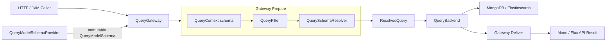
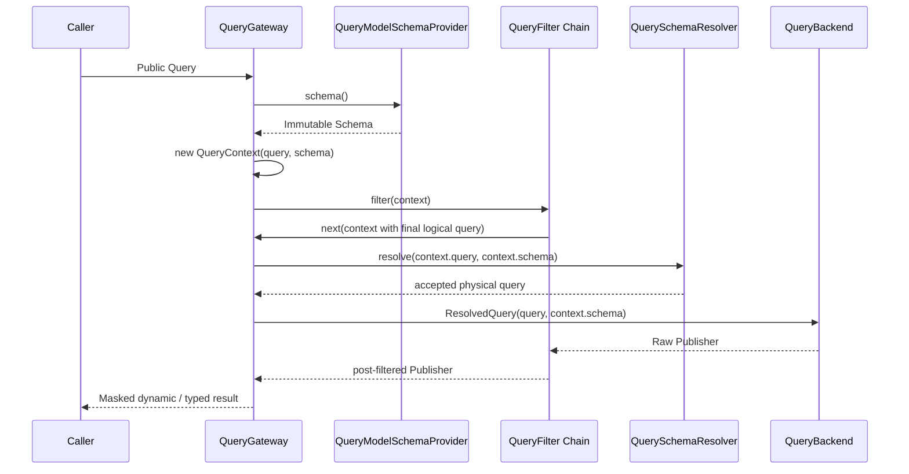

# QueryGateway ResolvedQuery 一阶段演进设计

> 状态：设计已确认，尚未实现。本文描述目标架构，不代表当前运行时行为。

## 目标

第一阶段只建立两条边界：

1. `QueryBackend` 只接收 `ResolvedQuery`，不再解析 Schema；
2. `QueryModelSchema` 成为 `QueryContext.schema` 的一级、非空、不可变属性，由 Gateway 在构造 Context 时提供。

`QueryGateway` 公共 API 保持不变。Factory、Spring 路由、HTTP Guard 与 QueryFilter 模型不在本阶段重构。

## 架构边界



顶层职责不增加：

- `QueryGateway` 获取 Schema、构造 Context、执行过滤链、解析查询并交付结果；
- `QueryModelSchemaProvider` 加载、刷新和发布不可变 Schema；
- `QueryBackend` 编译并执行已经解析的查询。

`QuerySchemaResolver` 是现有 Schema 内部的纯解析能力，不升级为新的顶层组件。

## QueryContext Schema 快照

`QueryContext` 在构造时必须获得 Schema：

```kotlin
interface QueryContext<Q : Any, R : Any> {
    val schema: QueryModelSchema
}
```

约束：

- `schema` 非空；
- `schema` 使用 `val`，没有 setter；
- Schema 不放入 `attributes`，也不通过 Reactor Context 传递；
- 每次订阅重新获取 Provider 当前发布的 Schema，并构造独立 Context；
- 同一次订阅的 Filter、解析、Backend 输入和 Deliver 使用同一个 Schema 实例；
- Schema 获取失败时不构造 Context，也不订阅 Backend，错误直接传播。

Schema 必须先于 Context，因此 Filter 从进入过滤链开始即可读取确定的 Schema 快照。Filter 完成逻辑查询改写后，Gateway 再解析最终查询。

## ResolvedQuery

`ResolvedQuery` 是 Gateway 与 Backend 之间唯一的查询输入：

```kotlin
data class ResolvedQuery<out Q : Any>(
    val query: Q,
    val schema: QueryModelSchema,
)
```

它只表达两个事实：

- `query` 已按 `schema` 完成字段映射并通过当前验证模式；
- `schema` 是完成本次解析的不可变快照。

不加入 `QueryType`、`QueryContext`、Backend、结果映射器或错误状态。现有 `ResolvedAggregationQuery` 由通用 `ResolvedQuery<AggregationQuery>` 替代，不保留两套概念。

必须满足以下同一性约束：

```kotlin
resolvedQuery.schema === queryContext.schema
```

## QueryBackend 合同

```kotlin
interface QueryBackend : NamedAggregateDecorator {
    fun single(query: ResolvedQuery<ISingleQuery>): Mono<ObjectNode>
    fun list(query: ResolvedQuery<IListQuery>): Flux<ObjectNode>
    fun paged(query: ResolvedQuery<IPagedQuery>): Mono<PagedList<ObjectNode>>
    fun cursor(query: ResolvedQuery<ICursorQuery>): Mono<CursorPage<ObjectNode>>
    fun count(query: ResolvedQuery<FilterExpression>): Mono<Long>
    fun aggregate(query: ResolvedQuery<AggregationQuery>): Flux<ObjectNode>
}
```

Backend 只负责：

1. 把已解析查询编译为 MongoDB、Elasticsearch 等后端原生查询；
2. 执行查询；
3. 按既有合同返回订阅独占的标准 JSON tree、分页、游标或计数结果。

Backend 不再：

- 调用 `QueryModelSchemaProvider.schema()` 或 `refresh()`；
- 决定 `QuerySchemaValidationMode`；
- 执行逻辑字段到物理字段的 Schema 解析；
- 通过 Reactor Context 查找 Schema。

阶段一允许具体 Backend 暂时继续实现 `QueryModelSchemaProvider`，供现有 Factory、Schema HTTP 路由和 Gateway 装配复用；但 Backend 的六个执行方法不得使用该能力。Provider 与 Backend 的对象所有权拆分留到后续阶段。

## 订阅执行顺序



一次订阅只读取一次 Schema。`retry`、`repeat` 和独立并发订阅会重新进入 Gateway，分别获得当时 Provider 发布的 Schema，并拥有独立 Context 与结果节点。

## 验证模式与失败语义

`QuerySchemaValidationMode` 从 MongoDB、Elasticsearch Backend 移入 Gateway 的 Prepare 配置。它只决定解析得到的兼容级别是否可接受：

- `COMPATIBLE` 接受 `EXACT` 与 `COMPATIBLE`；
- `STRICT` 只接受 `EXACT`；
- 两者都拒绝 `INCOMPATIBLE`。

受管 Gateway 不再使用“Schema unavailable 时保留原查询”的回退：Context 的 Schema 非空是执行前置条件，Schema 不可用时全部查询形态失败关闭且不订阅 Backend。

直接调用现有 `QueryModelSchemaProvider.resolve(...)` 的兼容回退不属于本阶段 Gateway 合同；阶段一不依赖它，是否删除留待 Schema 专项审查。

## Schema Mask

`SchemaMaskQueryFilter` 改为读取 `QueryContext.schema`：

- 不再从 Backend 判断或取得 Provider；
- 不再重复调用 Provider；
- 不再用 Reactor Context 把 Schema 传回 Backend；
- 使用 Context 中的同一 Schema 完成 Masker 选择和结果脱敏。

typed 物化仍在 Mask 之后执行，Backend 的 `ObjectNode` 所有权与标准 JSON tree 合同保持不变。

## 装配过渡

Gateway 必须显式接收 `QueryModelSchemaProvider`。为控制第一阶段范围，Registrar 可以继续从 routed Backend 取得现有 Provider，并把 Backend 与 Provider 作为两个明确参数传入 Gateway；Gateway 内部禁止再进行类型判断。

本阶段不改变 Backend Factory 与 Schema HTTP 路由。后续只有在审查证明对象所有权仍造成耦合时，才拆分 Factory 或 Provider 生命周期。

## 验收标准

1. `QueryGateway` 十个公共方法及 Reactor 返回形态保持不变；
2. 六个 Backend 方法只接收对应泛型的 `ResolvedQuery`；
3. MongoDB 与 Elasticsearch Backend 的执行路径不再解析或获取 Schema；NoOp Backend 只适配新的方法签名；
4. `QueryContext.schema` 构造必填、非空、不可变；
5. Filter、Resolver、Backend 输入和 Deliver 观察到同一个 Schema 实例；
6. Schema 不可用时所有 Gateway 查询失败，且 Backend 未被订阅；
7. `repeat`、`retry` 与并发订阅仍保持 Context 和可变 `ObjectNode` 隔离；
8. Snapshot 与 EventStream 的 single、list、paged、cursor、count、aggregate 合同测试全部通过；
9. MongoDB、Elasticsearch 集成测试证明物理字段解析结果与改造前一致；
10. 删除 `ResolvedAggregationQuery` 与查询执行路径中的 Reactor Context Schema 桥接，不保留兼容包装层。

## 非目标

第一阶段不做：

- 统一 `execute(ResolvedQuery<*>)`；
- Planner、Engine、Registry、Binding 或 PreparedQuery；
- QueryFilter、QueryType、错误处理或 HTTP Guard 重构；
- Backend 原生查询计划缓存；
- Factory 路由和 Schema HTTP API 重构；
- `ObjectNode` 边界替换。

这些内容只有在后续审查或基准证明现有边界不足时才进入设计。
