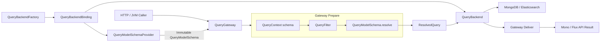
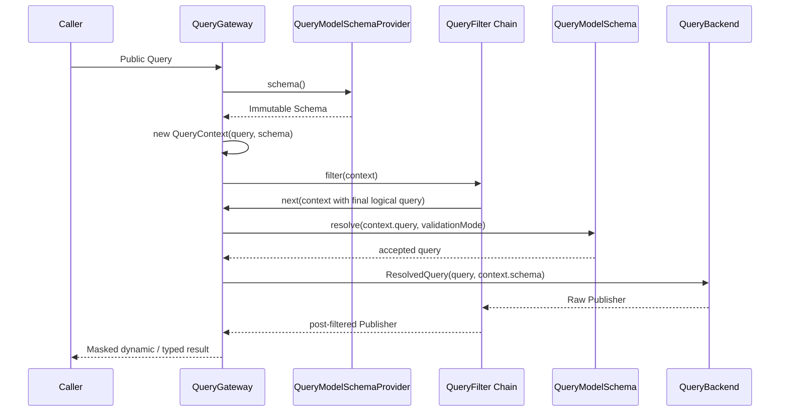

# QueryGateway ResolvedQuery 架构设计

> 状态：已实现。

## 目标

查询架构建立三条边界：

1. `QueryBackend` 只接收 `ResolvedQuery`，不再获取 Schema 或决定解析准入；
2. `QueryModelSchema` 是 `QueryContext.schema` 的一级、非空、不可变属性，由 Gateway 在构造 Context 时提供；
3. `QueryBackendFactory` 创建并缓存显式配对 Backend 与 Provider 的 `QueryBackendBinding`，Backend 不再实现或持有 Provider。

`QueryGateway` 公共 API、存储路由选择规则、Schema HTTP wire、HTTP Guard 与 QueryFilter 模型保持不变。

## 架构边界



顶层职责不增加：

- `QueryGateway` 获取 Schema、构造 Context、执行过滤链、解析查询并交付结果；
- `QueryModelSchemaProvider` 加载、刷新和发布不可变 Schema；
- `QueryBackend` 编译并执行已经解析的查询；
- `QueryBackendFactory` 按聚合创建并缓存 Backend 与 Provider 的组合，不承担查询解析或执行。

`QuerySchemaResolver` 是 `QueryModelSchema` 内部的解析实现，不升级为新的顶层组件或 Schema Service。

## Schema 模型层级

Schema 保持三层语义，不压平为一个数据载体：

```text
QuerySchemaDeclaration
    ↓ merge
LogicalQuerySchema
    ↓ backend facts binding
QueryModelSchema
```

- `QuerySchemaDeclaration` 是可合并的部分声明，区分未设置与显式设置；
- `LogicalQuerySchema` 是完成来源合并后的后端无关逻辑模型；
- `QueryModelSchema` 是发布给查询运行时的富模型，包含物理 binding、字段能力、动态字段解析、查询解析、Mask 派生索引和公开 metadata 投影所需的完整状态。

Gateway 与 Backend 面向 `QueryModelSchema` 的行为编程，不自行遍历字段 Map 重建 Schema 规则。Backend Compiler 可以通过 Schema 的领域行为取得已验证字段的物理 binding、storage type 与 temporal semantic；这属于原生查询编译，不属于 Provider 访问或兼容性准入。

### 不可变约束

`QueryModelSchema` 的不可变性采用所有权合同，不在每层增加防御性深复制：

- 构造完成后，Schema 及其集合、字段和 JsonNode 不再修改；
- Provider 发布后只共享该实例；
- refresh 构造并发布新实例，不修改旧实例；
- Context 与 ResolvedQuery 只保存同一个只读引用；
- 自定义 Source、Adapter 与 Provider 必须遵守相同合同。

框架使用 Kotlin 只读集合表达边界，不为每次发布、Context 构造或查询订阅复制 Schema。只有存在已证明的不受信可变输入边界时，才在该边界局部快照。

## QueryContext Schema 快照

`QueryContext` 在构造时必须获得 Schema：

```kotlin
interface QueryContext<Q : Any, R : Any> {
    val schema: QueryModelSchema
}
```

约束：

- `schema` 非空；
- `schema` 使用 `val`，没有 setter；
- Schema 不放入 `attributes`，也不通过 Reactor Context 传递；
- 每次订阅重新获取 Provider 当前发布的 Schema，并构造独立 Context；
- 同一次订阅的 Filter、解析、Backend 输入和 Deliver 使用同一个 Schema 实例；
- Schema 获取失败时不构造 Context，也不订阅 Backend，错误直接传播。

Schema 必须先于 Context，因此 Filter 从进入过滤链开始即可读取确定的 Schema 快照。Filter 完成逻辑查询改写后，Gateway 再解析最终查询。

## ResolvedQuery

`ResolvedQuery` 是 Gateway 与 Backend 之间唯一的查询输入：

```kotlin
data class ResolvedQuery<out Q : Any>(
    val query: Q,
    val schema: QueryModelSchema,
)
```

它只表达两个事实：

- `query` 已按 `schema` 完成查询级解析并通过当前验证模式；
- `schema` 是完成本次解析的不可变快照。

查询级解析不承诺把所有嵌套字段提前替换成物理字符串。Filter 与 Sort 只执行 Schema 语义所要求的字段准入及 `resolvedField` 改写，Projection 保持后端无关的逻辑 QueryField；Backend Compiler 通过同一 Schema 的 binding 与 semantic 行为把 Filter、Projection、Sort 及聚合表达式编译为后端原生查询。

不加入 `QueryType`、`QueryContext`、Backend、结果映射器或错误状态。现有 `ResolvedAggregationQuery` 由通用 `ResolvedQuery<AggregationQuery>` 替代，不保留两套概念。

必须满足以下同一性约束：

```kotlin
resolvedQuery.schema === queryContext.schema
```

### Cursor 唯一排序

Cursor 的唯一排序是公共查询执行语义，不属于存储编译。`QueryModelSchema.resolve(ICursorQuery)` 在执行字段准入与改写前，按 `schema.model` 补充稳定的唯一排序字段：

- `QueryModel.SNAPSHOT` 使用 `aggregateId`；
- `QueryModel.EVENT_STREAM` 使用 `id`。

两者不能统一为同一个字段名：Snapshot 的记录身份是 `aggregateId`，而 EventStream 中同一 `aggregateId` 可以对应多条流记录，只有流记录 `id` 唯一。框架统一的是补充与验证机制，不引入虚拟 `id`、Schema alias 或额外的 Cursor Planner。

`QueryBackend` 收到的 Cursor Query 已包含唯一排序。Backend 不再补充唯一字段，也不再次调用 Schema 解析。

## QueryBackend 合同

```kotlin
interface QueryBackend : NamedAggregateDecorator {
    fun single(query: ResolvedQuery<ISingleQuery>): Mono<ObjectNode>
    fun list(query: ResolvedQuery<IListQuery>): Flux<ObjectNode>
    fun paged(query: ResolvedQuery<IPagedQuery>): Mono<PagedList<ObjectNode>>
    fun cursor(query: ResolvedQuery<ICursorQuery>): Mono<CursorPage<ObjectNode>>
    fun count(query: ResolvedQuery<FilterExpression>): Mono<Long>
    fun aggregate(query: ResolvedQuery<AggregationQuery>): Flux<ObjectNode>
}
```

Backend 只负责：

1. 使用 `ResolvedQuery.query` 与 `ResolvedQuery.schema` 把已准入查询编译为 MongoDB、Elasticsearch 等后端原生查询；
2. 执行查询；
3. 按既有合同返回订阅独占的标准 JSON tree、分页、游标或计数结果。

Backend 不再：

- 调用 `QueryModelSchemaProvider.schema()` 或 `refresh()`；
- 实现、委托或持有 `QueryModelSchemaProvider`；
- 决定 `QuerySchemaValidationMode`；
- 再次执行兼容性计算或准入判断；
- 通过 Reactor Context 查找 Schema。

聚合 Compiler 可以读取 Schema 的 binding、storage type 与 temporal semantic 完成物理编译，但不得绕过 Schema 行为自行实现另一套字段兼容性规则。

## QueryBackendBinding 合同

`QueryBackendBinding` 是组合根创建的不可变配对值，不是新的运行时服务：

```kotlin
data class QueryBackendBinding<out B : QueryBackend>(
    val backend: B,
    val schemaProvider: QueryModelSchemaProvider,
)
```

Snapshot 与 EventStream Factory 返回对应 Backend 的 Binding：

```kotlin
interface SnapshotQueryBackendFactory {
    fun create(namedAggregate: NamedAggregate): QueryBackendBinding<SnapshotQueryBackend>
}

fun interface EventStreamQueryBackendFactory {
    fun create(namedAggregate: NamedAggregate): QueryBackendBinding<EventStreamQueryBackend>
}
```

约束：

- Binding 只保存 Backend 与 Provider，不代理两者行为；
- Factory 以物化后的 `NamedAggregate` 为键缓存完整 Binding，不分别缓存 Backend 与 Provider；
- Routing Factory 把 Binding 作为整体路由，不能独立选择或重新组合 Backend 与 Provider；
- Spring Registrar 从同一个 Binding 向 Gateway 传入 Backend 与 Provider；
- Schema HTTP 路由只读取同一个 Binding 的 Provider；
- MongoDB、Elasticsearch 的具体 Backend 构造器只接收查询执行依赖；Provider 由对应 Factory 构造；
- NoOp 与 Unavailable Factory 均显式配对 Backend 与 unavailable Provider，使受管 Gateway 在 Backend 执行前失败关闭；直接获得有效 `ResolvedQuery` 的受信调用方仍可单独使用 NoOp Backend；
- 不提供 Backend 到 Provider 的强制转换、兼容扩展、默认 Provider 构造器或双重 Factory API。

Snapshot Factory 原有未参与输入或输出类型推导的 `<S : Any>` 泛型一并删除。Factory 的产品是 ObjectNode Backend Binding，不再保留旧 typed QueryService 的类型痕迹。

## 订阅执行顺序



一次订阅只读取一次 Schema。`retry`、`repeat` 和独立并发订阅会重新进入 Gateway，分别获得当时 Provider 发布的 Schema，并拥有独立 Context 与结果节点。

## 验证模式与失败语义

`QuerySchemaValidationMode` 从 MongoDB、Elasticsearch Backend 移入 Gateway 的 Prepare 配置。它只决定解析得到的兼容级别是否可接受：

- `COMPATIBLE` 接受 `EXACT` 与 `COMPATIBLE`；
- `STRICT` 只接受 `EXACT`；
- 两者都拒绝 `INCOMPATIBLE`。

受管 Gateway 不再使用“Schema unavailable 时保留原查询”的回退：Context 的 Schema 非空是执行前置条件，Schema 不可用时全部查询形态失败关闭且不订阅 Backend。

`AbstractQueryGateway` 显式接收 `QueryModelSchemaProvider` 与 `QuerySchemaValidationMode`。Spring Boot 继续使用现有 `wow.query.schema.validation-mode` 配置；`QuerySchemaAutoConfiguration` 发布对应的 `QuerySchemaValidationMode` Bean，Snapshot 与 EventStream Registrar 从 routed Binding 取得 Backend 与 Provider，并把 Provider 与 Mode 作为独立参数传给 Gateway。MongoDB、Elasticsearch Backend 及其 Factory 不保存 Mode。

`QueryModelSchemaProvider` 只负责 Schema 生命周期。旧的 Provider 解析扩展与 unavailable 兼容回退已经删除；查询解析和准入统一由持有具体 Schema 实例的调用方完成。

## Schema Mask

`SchemaMaskQueryFilter` 改为读取 `QueryContext.schema`：

- 不再从 Backend 判断或取得 Provider；
- 不再重复调用 Provider；
- 不再用 Reactor Context 把 Schema 传回 Backend；
- 使用 Context 中的同一 Schema 完成 Masker 选择和结果脱敏。

typed 物化仍在 Mask 之后执行，Backend 的 `ObjectNode` 所有权与标准 JSON tree 合同保持不变。

## 装配流程

受管装配只接受 Factory 返回的 Backend 与 Provider Binding：

```kotlin
val binding = queryBackendFactory.create(namedAggregate)
DefaultSnapshotQueryGateway(
    namedAggregate = namedAggregate,
    backend = binding.backend,
    schemaProvider = binding.schemaProvider,
    validationMode = validationMode,
    filters = filters,
    errorHandler = errorHandler,
)
```

Schema HTTP handler 使用 `queryBackendFactory.create(namedAggregate).schemaProvider`。Abstract Factory 缓存完整 Binding，因此 Gateway 与 Schema HTTP 在同一进程、同一聚合、同一路由下观察到同一个 Provider 实例。Gateway 和 Handler 不执行 Backend 类型判断。

## 兼容性边界

- `SnapshotQueryBackendFactory.create` 与 `EventStreamQueryBackendFactory.create` 返回类型改为 `QueryBackendBinding`，属于源码和二进制 breaking change；
- Snapshot Factory 删除无意义的 `<S : Any>` 类型参数；
- MongoDB、Elasticsearch Backend 构造器删除 `schemaProvider` 参数；
- `requiredQueryModelSchemaProvider()` 删除；
- 不提供旧返回类型重载、Backend Provider 委托或适配器；
- Query JSON、Schema HTTP 路径及响应、Gateway 公共方法均无 wire change。

## 被拒绝的方案

### 独立 BackendFactory 与 SchemaProviderFactory

该方案表面上拆分 Factory 职责，但需要复制存储路由、按聚合缓存和 unavailable 选择规则，并允许两个 Factory 选择出不匹配的存储实例。配对是组合根的真实约束，应由一个 Binding 原子表达。

### QueryBackend 继承 QueryModelSchemaProvider

该方案改动较小，但会把查询执行与 Schema 生命周期永久合并，继续允许 Backend 执行路径访问 Provider，因此不采用。

## 验收标准

1. `QueryGateway` 十个公共方法及 Reactor 返回形态保持不变；
2. 六个 Backend 方法只接收对应泛型的 `ResolvedQuery`；
3. MongoDB 与 Elasticsearch Backend 的执行路径不再获取 Provider、计算兼容性或决定准入；聚合 Compiler 只通过 ResolvedQuery Schema 完成原生编译；
4. `QueryContext.schema` 构造必填、非空、不可变；
5. Filter、Resolver、Backend 输入和 Deliver 观察到同一个 Schema 实例；
6. Schema 不可用时所有 Gateway 查询失败，且 Backend 未被订阅；
7. `repeat`、`retry` 与并发订阅仍保持 Context 和可变 `ObjectNode` 隔离；
8. Snapshot 与 EventStream 的 single、list、paged、cursor、count、aggregate 合同测试全部通过；
9. MongoDB、Elasticsearch 集成测试证明物理字段解析结果与改造前一致；
10. Cursor 唯一排序在 `QueryModelSchema.resolve(ICursorQuery)` 中按 QueryModel 补充并验证，Backend 不再补充或二次解析；
11. 删除 `ResolvedAggregationQuery` 与查询执行路径中的 Reactor Context Schema 桥接，不保留兼容包装层；
12. Snapshot 与 EventStream Factory 创建并缓存完整 `QueryBackendBinding`，Routing Factory 原子转发 Binding；
13. Backend 不实现、不委托、不持有 `QueryModelSchemaProvider`，生产代码不存在 Backend 到 Provider 的类型转换；
14. Gateway Registrar 与 Schema HTTP 路由从同一 Binding 取得同一个 Provider 实例；
15. Snapshot Factory 不再暴露无意义的泛型类型参数；
16. 自定义 Backend 无需实现未声明的 Provider 能力，只需由 Factory 显式配对 Provider。

## 非目标

本次架构不引入：

- 统一 `execute(ResolvedQuery<*>)`；
- Planner、Engine、Registry 或 PreparedQuery；
- 新的 Schema Service、Schema Resolver 接口或并行 Schema 模型；
- 独立的 SchemaProviderFactory 或第二套路由表；
- QueryFilter、QueryType、错误处理或 HTTP Guard 重构；
- Backend 原生查询计划缓存；
- 存储路由选择算法或 Schema HTTP wire 重构；
- `ObjectNode` 边界替换。

这些内容不属于本架构。
