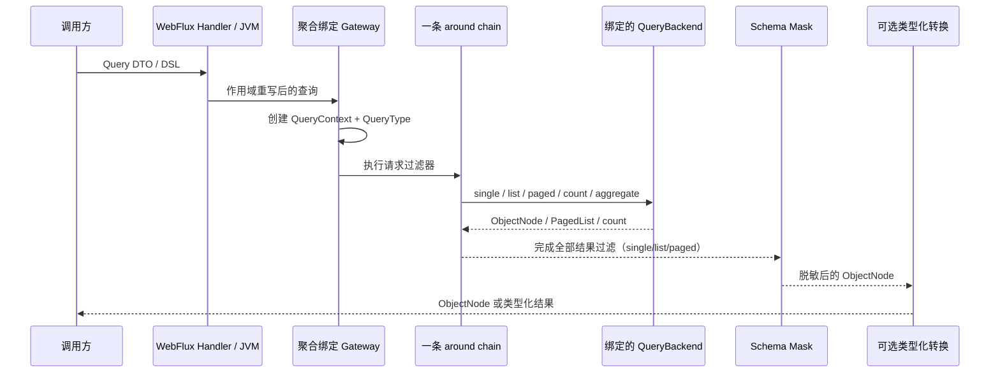

# 查询网关

## 为什么查询先经过 Gateway

`SnapshotQueryGateway<S>` 与 `EventStreamQueryGateway` 是业务查询入口，也是策略执行边界。Spring 为每个聚合注册绑定后的 Gateway，使请求重写、HTTP 护栏、权限过滤和通用结果处理在同一条 around chain 中执行。

业务代码通常不应绕过 Gateway。只有基础设施扩展或明确需要原始后端语义时，才直接使用 Factory；这种调用不会执行 Gateway 策略链。

## 执行链

完整链路如下：

Registrar 在装配 Gateway 时按 `NamedAggregate` 调用一次路由 Factory，并把选中的 Backend 绑定到 Gateway；每次请求不会再次路由。Backend 统一产生 `ObjectNode`，结果过滤器先处理节点；每次 single/list/paged 结果查询再读取 Provider 当前 Schema 并脱敏，同一 Schema 实例复用 Masker，refresh 新实例会重新编译，typed 结果最后才由 Jackson 物化。Schema 不可用时这些受管结果查询失败关闭且不订阅 Backend；count 保持 `Long` 并且不读取 Mask Schema，aggregation 保持 `ObjectNode` 行，并由 Schema 拒绝对 Mask 字段的分组、metric 与 expression 引用。

## QueryContext 与 QueryType

Gateway 在每次订阅时创建独立的 `QueryContext`，因此同一个响应式 Publisher 的不同订阅不会共享查询、结果或属性。Context 保存聚合标识、查询对象、结果和 `QueryType`，供过滤器重写查询或结果。

`QueryType` 只有 `SINGLE`、`LIST`、`PAGED`、`COUNT` 与 `AGGREGATION`；typed 与 `ObjectNode` 返回共享同一种操作类型。具体查询模型、入口和协议暴露能力仍可能不同。

## 快照与事件流过滤链

`SnapshotQueryGateway` 与 `EventStreamQueryGateway` 使用同一种 `QueryFilter<QueryContext<*, *>>` 合同。通用 `QueryFilter` 不需要 `@FilterType`，会进入两种 Gateway；只属于某个模型的过滤器才用 `@FilterType(SnapshotQueryGateway::class)` 或 `@FilterType(EventStreamQueryGateway::class)` 限定。

## WebFlux 请求边界

`RewriteRequestFilter` 在 Gateway 之前补入 tenant、owner 和 space 条件，快照与事件流 WebFlux 请求都会经过这一步。进程内调用不会自动获得这些 HTTP 请求作用域。

`HttpQueryGuardFilter` 同时属于两个 Gateway，但只有 Reactor Context 中存在 `ServerRequest` 时才生效；它不会改变普通进程内查询的约束。

## ABAC 与字段脱敏

内建 `AbacQueryFilter` 位于快照查询网关。对于提供 `QueryModelSchemaProvider` 的 Backend，Gateway 会在全部通用结果 Filter 完成后、typed 物化前执行 Schema 驱动的字段脱敏；Snapshot 与 EventStream 的 typed、dynamic 和 aggregate-state load 入口共享这条受管路径。注解、缓存、行为矩阵与失败关闭规则见[字段脱敏](./masking.md)。

认证、Principal 绑定和完整的失败关闭策略请参阅[数据权限](../data-access.md)。

## 原始 Factory 边界

直接调用 `SnapshotQueryBackendFactory` 或 `EventStreamQueryBackendFactory` 会绕过整条 Gateway 治理链，包括 ABAC、结果 Filter 与字段脱敏。没有 `QueryModelSchemaProvider` 的自定义 Backend 也无法建立脱敏合同。这两类路径都是返回原始值的受信低层边界，只适合存储扩展、聚焦诊断和后端合同测试；常规应用代码应注入聚合绑定的 Gateway。

## Bean 名

聚合级 Bean 名精确为 `{contextAlias.}{aggregateName}.SnapshotQueryGateway` 与 `{contextAlias.}{aggregateName}.EventStreamQueryGateway`；没有 context alias 时省略前缀。快照 Gateway 还以状态泛型注册，事件流 Gateway 没有状态泛型，多候选时应按 Bean 名限定。

## 验证策略边界

Gateway 负责策略链，不替代后端字段能力、Schema 解析或应用业务校验。JSON 数组/SSE 流若已输出部分行后失败，已输出行不会回滚；SSE 会尝试发送一个 `ErrorInfo` 错误事件。`RequestExceptionHandler` 失败，或该错误事件生成、渲染、序列化失败时，只要失败不同于原始错误且尚未记录，就附加为 suppressed error；原始终止错误始终继续传播，部分失败绝不会成功完成。
