# 查询网关

`SnapshotQueryGateway<S>` 与 `EventStreamQueryGateway` 是业务查询入口。Spring Registrar 装配时按聚合取得 `QueryBackendBinding`，固定使用其中的 Backend 与 Provider；每次查询不重新路由。

## 固定执行顺序

每次订阅独立执行：

1. 从 Provider 取得一个 Schema。
2. 按顺序执行 `QueryFilter.prepare`，每个 Filter 只返回一个准备后的逻辑 Query。
3. 追加 Reactor Context 中的请求 scope。
4. Snapshot 与 EventStream Gateway 通过公共策略链追加已配置 `QueryPolicy` 的规则条件；普通 Filter 不能把它提前删除。
5. Gateway 唯一负责模型默认条件：Snapshot 未明确覆盖时补充 `DELETION = ACTIVE`，EventStream 不补充删除条件；游标追加模型唯一排序字段。
6. 公共校验最终 Query，再调用 `backend.operation(query, schema)`。
7. 对查询节点按同一 Schema 脱敏，然后按需进行 typed 物化。
8. `QueryObserver` 观察完成、错误或取消。

```mermaid
flowchart LR
    Provider --> Prepare["QueryFilter.prepare"]
    Prepare --> Scope["Request scope"]
    Scope --> Policy["QueryPolicy.evaluate"]
    Policy --> Validate["Defaults + public validation"]
    Validate --> Backend["Backend query + schema"]
    Backend --> Mask["Mask"]
    Mask --> Result["ObjectNode / typed result"]
    Result --> Observer["Terminal observer"]
```



Filter、校验、Backend、Mask 始终使用该次订阅捕获的 Schema。Schema 获取失败或 prepare 空完成都是错误，Backend 不执行。retry/repeat 会重新订阅并重新取得 Schema。count 返回 Long，不执行结果 Mask；aggregation 在执行前拒绝受保护的分组/metric/expression，不依靠修改聚合结果掩盖泄漏。

## 请求准备扩展

`QueryContext<Q>` 只包含 `query`、`namedAggregate` 和 `schema`。Filter 没有 continuation、结果对象或结果处理权限。它只负责准备请求，不能包围或重复调用 Backend：

```kotlin
interface QueryFilter {
    fun <Q : RewritableFilter<Q>> prepare(context: QueryContext<Q>): Mono<Q>
}
```

`SnapshotQueryFilter` 与 `EventStreamQueryFilter` 限定适用模型；普通 `QueryFilter` 可供两者使用。`@Order` 决定准备顺序。改写后的请求使用逻辑路径，仍须通过最终 Schema 校验。

## 请求准备与强制约束

| 扩展点 | 返回值 | 组合规则 |
| --- | --- | --- |
| `QueryFilter.prepare` | 准备后的 Query | 后续 prepare 可以替换其 Query/filter |
| `QueryPolicy.evaluate` | 附加的逻辑 FilterExpression 或错误 | Gateway 在全部 prepare 之后以 AND 合并 |

两者都能构造过滤条件。允许被覆盖的请求准备使用 QueryFilter；必须在全部 prepare 后仍生效的条件使用 QueryPolicy。例如，必须满足的 `state.visible = true`、数据生命周期限制和权限条件都属于 Policy。QueryPolicy 的规则领域是通用的，执行权限限于追加约束或拒绝查询。内置模型默认值、Schema 校验、Backend 执行和结果处理保留原有职责。

## 请求作用域与策略

WebFlux Handler 用 `QueryRequestScope` 解析 tenant/owner/space，把结果放入 Reactor Context，再调用 Gateway。`HttpQueryGuard` 在 HTTP 边界执行成本及响应限制；它不是 Gateway Filter。

JVM 调用可以显式提供受信 scope：

```kotlin
queryGateway.dynamicList(query)
    .contextWrite { context ->
        context.withQueryScope(TenantIdFilter("tenant-1"))
    }
```

`withQueryScope` 组合已有 scope。身份认证仍由应用承担；不要把未验证的请求字段当作身份。`QueryContext` 还带有操作类型（`queryType`）与查询入口，过滤器或策略可据此区分 count 与 list、HTTP 查询与进程内查询。Snapshot 与 EventStream 的 Spring 注册器都会装配 `QueryPolicy`，公共 Gateway 统一执行策略。策略可读取 `QueryContext` 判断适用范围；不适用时返回 `MatchAllFilter`。`AbacQueryPolicy` 仅对 Snapshot 解析 Principal 标签并生成标签条件，在其他模型上返回 `MatchAllFilter`，不读取标签。其他策略可直接实现 `QueryPolicy.evaluate`，表达数据生命周期或业务查询约束，无需提供 Principal 标签。

策略返回附加的逻辑过滤条件或错误，由 Gateway 在固定阶段以 AND 合并，再应用模型默认值和公共校验；不能替换 Query、调用 Backend 或变换结果。返回 `Mono.empty()` 是协议错误，不能用于表达“不适用”。策略失败会终止查询，Backend 不执行。完整权限合同见[数据权限](../data-access.md)。

### 范围来源

调用方范围的每一部分都有来源：`AUTHENTICATED`（来自凭证，或由受信组件担保）或 `DECLARED`（请求自报，即路径变量或请求头）。两者都限制查询，只有已认证的范围构成安全边界。

- `QueryRequestScope` 返回 `QueryScope(authenticated, declared)`。`DefaultQueryRequestScope` 把聚合的静态租户记为已认证，从请求读取的一切记为自报；`CoSecQueryRequestScope` 相同。
- 当某个值由受信组件掌控（例如会剥离客户端自带租户请求头的认证网关），继承 `AbstractQueryRequestScope` 并覆盖 `tenantIdProvenance`、`ownerIdProvenance` 或 `spaceIdProvenance`，返回 `AUTHENTICATED`。
- 进程内调用方用 `withQueryScope(QueryScope(authenticated = TenantIdFilter(tenantId)))` 写入已认证范围；`withQueryScope(filter)` 记为自报。
- `wow.query.require-authenticated-scope=true` 拒绝已认证范围未固定 `tenantId` 的 Snapshot 或 EventStream `HTTP` 查询：返回 `403`，错误码 `IllegalAccessQueryScope`，发生在任何后端 I/O 之前。自报的租户仍会过滤查询，但不满足这项检查。开关默认关闭，保持旧行为，即信任自报范围。

## 查询入口

每个查询都在 Reactor context 中带着一个入口：`HTTP`、`IN_PROCESS` 或 `UNSPECIFIED`。内置的 REST 查询路由在它们共用的那一处连同请求范围一起写入 `HTTP`。Gateway 在查询被订阅时读取一次入口。

- `UNSPECIFIED` 按进程内处理，现有的 `QueryGateway` 调用方不受影响。设置 `wow.query.require-explicit-entry=true` 后，未声明入口的查询会被拒绝。
- 在 `QueryFilter`、`QueryPolicy` 或缓存加载器内部发起的查询，不应继承 HTTP 调用方的范围与入口。用 `asInProcessQuery()` 包裹，它会清掉两者并以 `IN_PROCESS` 执行：

```kotlin
snapshotQueryGateway.dynamicList(lookup).asInProcessQuery()
```

## 被拒绝的查询

客户端写错的查询返回 HTTP 400 与 `ErrorInfo`。请求本身与预算的问题，`errorCode` 为 `IllegalArgument`；模型不提供的字段与能力，`errorCode` 为 `QuerySchemaValidation`。`errorMsg` 用文字说明错在哪里，`bindingErrors` 带一条可供程序判断的记录：

```json
{
  "errorCode": "QuerySchemaValidation",
  "errorMsg": "Unknown logical field [state.missing].",
  "bindingErrors": [{ "name": "state.missing", "msg": "Unknown logical field [state.missing].", "code": "UNKNOWN_FIELD" }]
}
```

`code` 取自 `QueryErrorCodes`，也作为 OpenAPI 中 `BindingError.code` 的枚举公开。代码只增不改名，遇到未知代码按一般错误处理。请求体的问题，`name` 是 JSON 路径（无路径时为 `body`）；准入的问题，`name` 是逻辑字段的绝对路径（元素作用域内的字段写完整路径，例如 `state.items.price`；模型级问题为空）。

| 代码 | 含义 |
|---|---|
| `INVALID_JSON`、`BODY_NOT_OBJECT`、`EMPTY_BODY` | 请求体不是 JSON 对象 |
| `UNKNOWN_PROPERTY`、`UNKNOWN_TYPE`、`UNKNOWN_VALUE`、`INVALID_VALUE` | JSON 与查询类型不符：未知属性、未知 `op` 或指标类型、未知枚举值，或取值类型错误、缺失 |
| `INVALID_REQUEST` | 其他请求规则，`msg` 写明是哪条 |
| `CURSOR_SORT_DUPLICATE`、`CURSOR_SORT_TOO_MANY` | 游标排序重复了某个字段（`name`），或追加身份字段作为唯一排序后超出字段上限 |
| `UNKNOWN_FIELD`、`UNSUPPORTED_CAPABILITY`、`ELEMENT_SCOPE_REQUIRED`、`VALUE_MISMATCH`、`NOT_COLLECTION`、`NOT_SINGLE_STRING`、`MODEL_SEARCH_UNSUPPORTED`、`CURSOR_NOT_ALLOWED`、`PROTECTED_AGGREGATION`、`PROTECTED_COMPARISON`、`MISSING_KEY_REQUIRES_STRING`、`ANY_REQUIRES_SINGLE_VALUE`、`INCOMPLETE_PROJECTION`、`METRIC_FILTER_SEARCH`、`METRIC_FILTER_ELEMENT_MATCH`、`METRIC_FILTER_ARRAY_FIELD`、`NOT_PROJECTABLE`、`EVENT_PROJECTION_TYPE_REQUIRED`、`TEMPORAL_REPRESENTATION_REQUIRED`、`TEMPORAL_CONFIGURATION_CONFLICT`、`PARALLEL_ARRAY_SORT`、`ARRAY_EQUALITY`、`FIRST_LAST_REQUIRES_SINGLE_VALUE`、`FIRST_LAST_REQUIRES_ORDER_BY` | 模型在准入时拒绝 |

HTTP 预算的拒绝（`HTTP list query limit[...]` 等）暂不带 `bindingErrors`。

## 结果与观察

Backend 每次订阅返回独占 ObjectNode。框架固定在 typed 物化前执行 Mask，没有通用结果 Filter。`QueryObserver` 只有终止回调，不能替换结果或错误；普通 observer 异常被记录，不能重试查询或触发第二次 Backend 执行。默认实现为 `QueryLogObserver`。

设置 `audits = true` 的 observer 还会在每次订阅终止时收到一个 `QueryAudit`，其中包括：

- 查询入口、模型及其内容哈希 `modelVersion`；
- 调用方所提交查询的形状 `fingerprint`：运算符、字段、排序、投影与大小，不含任何取值、检索文本与游标，形状相同的查询会得到相同的指纹；
- 调用方范围限制的字段 `scopeFields`，以及实际施加了限制的 `policies`；
- 返回的行数 `rows`、响应中带有的脱敏字段 `maskedFields`、结果 `outcome`，以及失败时的 `errorCode`（有规则代码时一并给出）；
- 订阅上下文 `context`，应用从中读取主体：身份不归 Wow 管。

审计中永远不含过滤条件的取值，`toString()` 也不输出上下文，因此记录审计不会把个人数据写进日志。不做审计的 observer 没有额外开销：只有需要时 Gateway 才构建审计。

直接调用 Factory 的 Backend 会绕过这些治理步骤，见[查询后端](./query-backend.md)。Mask 与 Schema 的细节见[字段脱敏](./masking.md)和[查询模型 Schema](./query-model-schema.md)。
