# 查询网关

`SnapshotQueryGateway<S>` 与 `EventStreamQueryGateway` 是业务查询入口。Spring Registrar 装配时按聚合取得 `QueryBackendBinding`，固定使用其中的 Backend 与 Provider；每次查询不重新路由。

## 固定执行顺序

每次订阅独立执行：

1. 从 Provider 取得一个 Schema。
2. 按顺序执行 `QueryFilter.prepare`，每个 Filter 只返回一个准备后的逻辑 Query。
3. 追加 Reactor Context 中的请求 scope。
4. Snapshot Gateway 追加已配置 `QueryPolicy` 的规则条件；普通 Filter 不能把它提前删除。
5. Gateway 唯一负责模型默认条件：Snapshot 未明确覆盖时补充 `DELETION = ACTIVE`，EventStream 不补充删除条件；游标追加模型唯一排序字段。
6. 公共校验最终 Query，再调用 `backend.operation(query, schema)`。
7. 对查询节点按同一 Schema 脱敏，然后按需进行 typed 物化。
8. `QueryObserver` 观察完成、错误或取消。

```mermaid
flowchart LR
    Provider --> Prepare["QueryFilter.prepare"]
    Prepare --> Scope["Request scope"]
    Scope --> Policy["Snapshot ABAC policy"]
    Policy --> Validate["Defaults + public validation"]
    Validate --> Backend["Backend query + schema"]
    Backend --> Mask["Mask"]
    Mask --> Result["ObjectNode / typed result"]
    Result --> Observer["Terminal observer"]
```



Filter、校验、Backend、Mask 始终使用该次订阅捕获的 Schema。Schema 获取失败或 prepare 空完成都是错误，Backend 不执行。retry/repeat 会重新订阅并重新取得 Schema。count 返回 Long，不执行结果 Mask；aggregation 在执行前拒绝受保护的分组/metric/expression，不依靠修改聚合结果掩盖泄漏。

## 请求准备扩展

`QueryContext<Q>` 只包含 `query`、`namedAggregate` 和 `schema`。Filter 没有 continuation、结果对象或结果处理权限。它只负责准备请求，不能包围或重复调用 Backend：

```kotlin
interface QueryFilter {
    fun <Q : RewritableFilter<Q>> prepare(context: QueryContext<Q>): Mono<Q>
}
```

`SnapshotQueryFilter` 与 `EventStreamQueryFilter` 限定适用模型；普通 `QueryFilter` 可供两者使用。`@Order` 决定准备顺序。改写后的请求使用逻辑路径，仍须通过最终 Schema 校验。

## 请求准备与强制约束

| 扩展点 | 返回值 | 组合规则 |
| --- | --- | --- |
| `QueryFilter.prepare` | 准备后的 Query | 后续 prepare 可以替换其 Query/filter |
| `QueryPolicy.evaluate` | 附加的逻辑 FilterExpression 或错误 | Gateway 在全部 prepare 之后以 AND 合并 |

两者都能构造过滤条件。允许被覆盖的请求准备使用 QueryFilter；必须在全部 prepare 后仍生效的条件使用 QueryPolicy。例如，必须满足的 `state.visible = true`、数据生命周期限制和权限条件都属于 Policy。QueryPolicy 的规则领域是通用的，执行权限限于追加约束或拒绝查询。内置模型默认值、Schema 校验、Backend 执行和结果处理保留原有职责。

## 请求作用域与策略

WebFlux Handler 用 `QueryRequestScope` 解析 tenant/owner/space，把结果放入 Reactor Context，再调用 Gateway。`HttpQueryGuard` 在 HTTP 边界执行成本及响应限制；它不是 Gateway Filter。

JVM 调用可以显式提供受信 scope：

```kotlin
queryGateway.dynamicList(query)
    .contextWrite { context ->
        context.withQueryScope(TenantIdFilter("tenant-1"))
    }
```

`withQueryScope` 组合已有 scope。身份认证仍由应用承担；不要把未验证的请求字段当作身份。Snapshot Gateway 与 Spring 注册器依赖 `QueryPolicy`；`AbacQueryPolicy` 实现该接口，负责标签条件。其他策略可直接实现 `QueryPolicy.evaluate`，表达数据生命周期或业务查询约束，无需提供 Principal 标签。策略返回附加的逻辑过滤条件或错误，由 Gateway 在固定阶段以 AND 合并，再应用模型默认值和公共校验；不能替换 Query、调用 Backend 或变换结果。返回 `Mono.empty()` 是协议错误。EventStream 不自动运行 Snapshot 策略。完整权限合同见[数据权限](../data-access.md)。

## 结果与观察

Backend 每次订阅返回独占 ObjectNode。框架固定在 typed 物化前执行 Mask，没有通用结果 Filter。`QueryObserver` 只有终止回调，不能替换结果或错误；普通 observer 异常被记录，不能重试查询或触发第二次 Backend 执行。默认实现为 `QueryLogObserver`。

直接调用 Factory 的 Backend 会绕过这些治理步骤，见[查询后端](./query-backend.md)。Mask 与 Schema 的细节见[字段脱敏](./masking.md)和[查询模型 Schema](./query-model-schema.md)。
