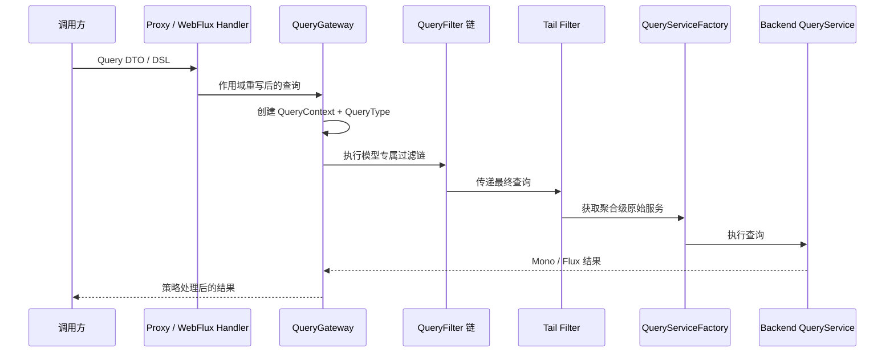

# 查询网关

## 为什么查询先经过 Gateway

`QueryGateway` 是查询策略的执行边界。Spring 注册的聚合级 `QueryService` 会由 `QueryServiceProxy` 转发到 Gateway，使查询重写、HTTP 护栏、已配置的权限过滤与结果脱敏在到达原始后端前按同一条链执行。

业务代码通常不应绕过 Gateway。只有基础设施扩展或明确需要原始后端语义时，才直接使用 Factory；这种调用不会执行 Gateway 策略链。

## 执行链

完整链路如下：

`QueryServiceProxy` 供进程内的类型化 Bean 使用；WebFlux Handler 在反序列化和请求重写后调用同一类服务。Tail Filter 按聚合创建原始服务并写入结果，随后由 Gateway 返回对应的 `Mono` 或 `Flux`。

## QueryContext 与 QueryType

Gateway 在每次订阅时创建独立的 `QueryContext`，因此同一个响应式 Publisher 的不同订阅不会共享查询、结果或属性。Context 保存聚合标识、查询对象、结果和 `QueryType`，供过滤器重写查询或结果。

`QueryType` 覆盖单条、列表、游标分页、页码分页、计数、聚合和它们的动态文档形态；具体查询模型、入口和协议暴露能力仍可能不同。游标请求也经过相同的 Gateway/filter 链。调用方必须保持后续请求的 filter/sort 不变，但 cursor 不携带二者的指纹，服务端不会验证绑定关系；服务端会重新应用请求作用域/安全过滤，并由所选后端解密及校验 cursor 结构、arity 与物理值类型。

`CURSOR` 与 `DYNAMIC_CURSOR` 是新增的公开 enum 成员。外部代码如果对 `QueryType` 使用无 `else` 的穷尽 `when`，升级时必须显式处理这两个分支；本功能不对这种调用方声明完整源码兼容。

## 快照与事件流过滤链

`SnapshotQueryGateway` 与 `EventStreamQueryGateway` 选择各自模型的 `QueryFilter` 链，并分别由快照或事件流 Tail Filter 取得 Factory 创建的原始服务。模型专属过滤器不能假定会在另一条链中运行。

## WebFlux 请求边界

`RewriteRequestFilter` 在 Gateway 之前补入 tenant、owner 和 space 条件，快照与事件流 WebFlux 请求都会经过这一步。进程内调用不会自动获得这些 HTTP 请求作用域。

`HttpQueryGuardFilter` 同时属于两个 Gateway，但只有 Reactor Context 中存在 `ServerRequest` 时才生效；它不会改变普通进程内查询的约束。

## ABAC 与结果脱敏

内建 `AbacQueryFilter` 位于快照查询网关。快照结果脱敏不处理计数与聚合；事件流动态结果脱敏只覆盖当前支持的动态查询形态，不覆盖 typed 结果或聚合。

认证、Principal 绑定和完整的失败关闭策略请参阅[数据权限](../data-access.md)。

## 原始 Factory 与自定义 Bean

直接调用 `SnapshotQueryServiceFactory` 或 `EventStreamQueryServiceFactory` 会绕过查询重写、ABAC 和结果脱敏。注册在生成服务名下的同名自定义 Bean 也会按原样保留，不会再包装为代理；Gateway 缺失时，Registrar 同样返回原始服务。这些是受信基础设施边界，不是常规业务扩展点。

## 从 QueryHandler 迁移

将旧的 `QueryHandler` / `AbstractQueryHandler`、`SnapshotQueryHandler` 和 `EventStreamQueryHandler` 替换为对应的 Gateway 类型与实现；Bean 名从 `snapshotQueryHandler` / `eventStreamQueryHandler` 改为 `snapshotQueryGateway` / `eventStreamQueryGateway`。

自定义过滤器的 `@FilterType` 应指向对应 `QueryGateway`。自定义 Gateway 不再实现 `Handler` 或公开 `handle(QueryContext)`：它需要实现 `aggregate`，并且 `count` 只接收 `FilterExpression`。

## 验证策略边界

Gateway 负责策略链，不替代后端字段能力、Schema 解析或应用业务校验。Factory 直连、自定义同名 Bean 和缺失 Gateway 都绕过该边界；需要这些路径时，应由基础设施代码明确承担相应的安全与查询语义。
