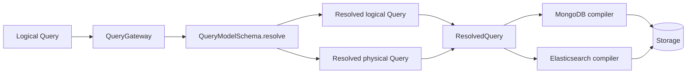

# QueryModelSchema 物理字段绑定统一设计

> 状态：提案。

## 背景

当前查询链路同时保存并使用两种逻辑字段到物理字段的映射：

- `QueryFieldBinding.physicalField` 在 Query Schema 阶段记录后端实际字段；
- `FieldConverter` 在 MongoDB 的过滤、投影、排序和 Schema adapter 中再次按字符串转换字段。

MongoDB 的 Snapshot 与 EventStream 还分别通过 `SnapshotFieldConverter` 和
`EventStreamFieldConverter` 把模型身份字段映射到 `_id`。因此同一条查询的字段语义分别由 Schema、Converter 和部分硬编码的 MongoDB 路径共同决定。

这会造成三个问题：

1. Schema 判断通过的字段与最终执行字段可能来自不同的映射逻辑；
2. 缺少元数据时，Resolver 的兼容性兜底与 Backend 的字段转换边界不清晰；
3. Cursor、Element scope、投影和聚合需要分别维护逻辑路径与物理路径，容易出现重复转换或遗漏转换。

本设计把 `QueryFieldBinding.physicalField` 设为唯一的物理字段来源，并保留逻辑 Query 与物理 Query 两份执行视图。

## 目标与非目标

### 目标

- 由 Query Schema 一次性完成字段解析和物理字段绑定；
- MongoDB 与 Elasticsearch Backend 只编译物理 Query，不再执行逻辑字段映射；
- 缺少字段元数据时继续使用 `COMPATIBLE` 宽松策略，并将原始路径作为物理路径兜底；
- 正确保留 Snapshot `aggregateId -> _id` 与 EventStream `id -> _id` 的存储语义；
- 保留逻辑字段用于 Cursor 协议、结果字段和用户可见语义；
- 删除 `FieldConverter` 及其相关运行时适配层。

### 非目标

- 不改变 MongoDB 或 Elasticsearch 的存储布局；
- 不改变 Query JSON、Schema HTTP 响应和 Cursor wire 格式；
- 不改变 `EXACT`、`COMPATIBLE`、`INCOMPATIBLE` 的准入规则；
- 不新增 Query Planner、缓存层、Schema Service 或新的顶层 Gateway 抽象；
- 不为缺少元数据的字段增加额外的存储验证。

## 核心模型

`QueryFieldBinding` 继续保存绝对路径：

```kotlin
data class QueryFieldBinding(
    val resolvedField: QueryField,
    val physicalField: QueryField,
    val storageType: QueryStorageType?,
)
```

`resolvedField` 是逻辑查询解析后的路径，供 Query Schema 的重写和 capability 判断使用；`physicalField` 是 Backend 可以直接提交给存储引擎的路径。二者不再由 Backend 再次互相转换。

Gateway 在 Schema 准入后构造双视图的 `ResolvedQuery`：

```kotlin
data class ResolvedQuery<out Q : Any>(
    val query: Q,
    val schema: QueryModelSchema,
    val physicalQuery: Q,
)
```

- `query` 保留已经完成逻辑解析的 Query；
- `physicalQuery` 由同一次 Schema 解析产生，只替换字段路径，不改变操作符、值、别名、分页和 Cursor 参数；
- `ResolvedQuery.query` 与 `ResolvedQuery.physicalQuery` 必须来自同一个不可变 Schema 实例的同一次解析；
- 直接构造 `ResolvedQuery(query, schema)` 的旧构造合同不再保留，所有 Backend 输入必须明确提供物理视图。

执行流如下：



## 字段解析规则

Query Schema Resolver 在一次遍历中同时维护 `logicalParent`、`resolvedParent` 和 `physicalParent`。现有 Element scope 的相对路径规则保持不变：

- Binding 保存绝对的 `resolvedField` 和 `physicalField`；
- Element predicate 内只写入相对于当前容器的字段；
- 下一层 Element 使用当前容器的绝对三种 parent；
- 任一物理相对路径无法建立时，该 capability 仍为 `INCOMPATIBLE`。

每个字段的物理路径按以下顺序取得：

1. 使用当前 capability 对应的 `binding.physicalField`；
2. 对动态字段使用动态祖先 binding 的物理路径加相对路径；
3. 没有字段 Schema 或没有 binding 且查询已按宽松策略接受时，使用原始逻辑路径；
4. 不允许在 Backend 再调用字符串转换器补充映射。

因此，`COMPATIBLE` 只表示“Schema 没有足够事实证明该字段不可用”，不表示物理路径未知后可以跳过执行。对于普通动态字段，原始路径就是正确的物理路径。

## 系统身份字段

MongoDB adapter 在构造 `QueryModelSchema` 时直接创建模型相关的 binding：

| QueryModel | 逻辑字段 | 物理字段 |
|---|---|---|
| `SNAPSHOT` | `aggregateId` | `_id` |
| `EVENT_STREAM` | `id` | `_id` |
| `EVENT_STREAM` | `aggregateId` | `aggregateId` |

`IdFilter` 和 `IdsFilter` 由 Query Schema 按模型选择 `id` 或 `aggregateId` 的 binding；`AggregateIdFilter` 始终使用 `aggregateId` 的 binding。MongoDB 的 `_id` 只作为最终存储路径出现，不再由 `FieldConverter` 决定。

文档读出时仍由 Snapshot/EventStream Backend 把 `_id` 恢复为公共逻辑字段。读出映射与查询字段绑定是两个方向相反但边界明确的职责，不合并为一个字符串转换器。

## 投影路径

`QueryFieldSchema.projectionField` 的语义统一为“物理投影路径”：

- MongoDB adapter 从 `PRESENCE` binding 的 `physicalField` 生成；
- Elasticsearch adapter 保留 mapping 计算出的 `projectionPath`；
- 没有 projection binding 的未知字段使用原始路径并保持 `COMPATIBLE`。

`projectionField` 不参与过滤或排序的 capability 绑定。过滤、排序和聚合分别使用对应 capability 的 `physicalField`，从而保留 Elasticsearch multi-field 选择与 MongoDB 普通字段投影的差异。

## Cursor 与聚合

Cursor 同时需要逻辑和物理排序字段：

- `query.sort` 用于保持公共 Cursor 参数和结果语义；
- `physicalQuery.sort` 用于 MongoDB 的 `.sort(...)`、Cursor continuation filter 和从文档取 Cursor 值；
- 下一页 Cursor 的编码格式不变，只编码排序值，不编码字段路径。

聚合 Compiler 使用 `physicalQuery` 的字段和 Schema binding 的 storage type、temporal semantic。只有 Resolver 已判定为 `INCOMPATIBLE` 的字段才在 Schema 阶段拒绝；已按 `COMPATIBLE` 接受但缺少 binding 的动态字段使用原始路径，Compiler 不再自行调用 Converter 兜底。

## Backend 责任

### Query Gateway

- 获取一次 Schema；
- 完成逻辑 Query 的准入和重写；
- 从同一遍解析结果生成物理 Query；
- 将两份 Query 封装到 `ResolvedQuery`。

### MongoDB / Elasticsearch Backend

- 只读取 `ResolvedQuery.physicalQuery` 编译后端语法；
- 只使用 `ResolvedQuery.query` 完成 Cursor 展示、结果映射和公共语义；
- 不调用 `FieldConverter`；
- 不自行重新解析 Schema 或决定兼容性。

### Query Schema Adapter

- 结合逻辑声明与实际存储事实创建 `QueryFieldBinding`；
- MongoDB adapter 直接设置模型身份字段的物理路径；
- 不向 Backend 暴露字段转换器；
- MongoDB validator/index lookup 使用即将写入 binding 的物理路径。

## API 变更

这是内部实现 API 的明确破坏性变更：

- 删除 `FieldConverter`；
- 删除 `SnapshotFieldConverter` 和 `EventStreamFieldConverter`；
- 删除依赖 `FieldConverter` 的 `AbstractProjectionConverter` 和 `AbstractSortConverter`；
- 修改 `ResolvedQuery`，增加强制的 `physicalQuery`；
- MongoDB filter、projection、sort 和 aggregation compiler 删除逻辑字段转换参数；
- 更新所有 Backend、Factory、测试和 Benchmark 的构造调用；
- 不保留 deprecated bridge、旧构造器、typealias 或兼容重载。

## 实施阶段

### 阶段一：建立双视图解析合同

在 `wow-query` 中扩展 Resolver，使 Filter、Projection、Sort、Cursor 和 Aggregation 都能从同一次 Schema 解析得到逻辑值与物理值。先覆盖动态字段、Element scope、模型身份字段和缺少 metadata 的 COMPATIBLE 兜底测试。

### 阶段二：切换 Gateway 与公共 Backend 边界

Gateway 构造带 `physicalQuery` 的 `ResolvedQuery`。更新 Backend 合同测试，禁止只提供逻辑 Query 的执行入口。

### 阶段三：迁移 MongoDB

更新 `MongoQuerySchemaAdapter`、`AbstractMongoFilterConverter`、`MongoProjectionConverter`、`MongoSortConverter`、`MongoAggregationCompiler`、Cursor 执行链和 Snapshot/EventStream Factory。所有 Mongo 编译器直接消费物理字段。

### 阶段四：对齐 Elasticsearch 与清理旧 API

让 Elasticsearch Projection、Sort、Filter 和 Aggregation 统一消费物理 Query；随后删除旧 Converter 类型，清理生产代码、测试、Benchmark 与文档引用。

### 阶段五：文档与回归验证

更新 `query-model-schema.md`、`query-model-schema-phase-zero-design.md` 和 Backend 文档，说明 physical binding 的唯一来源及 COMPATIBLE 兜底规则。

## 验收标准

- 生产代码中不再存在 `FieldConverter` 引用；
- Snapshot `aggregateId` 的过滤、投影、排序和 Cursor 使用 `_id`；
- EventStream `id` 的过滤、投影、排序和 Cursor 使用 `_id`；
- EventStream 缺少删除字段 metadata 时仍为 `COMPATIBLE`；
- 缺少普通字段 metadata 的查询保留原始物理路径；
- 多层 Element scope 不发生绝对路径泄漏或二次转换；
- 聚合、Projection、Sort、Cursor 与普通 Filter 使用同一个 physical binding；
- Query JSON、Schema HTTP 和 Cursor wire 格式不变；
- `:wow-query:check`、`:wow-mongo:check`、`:wow-elasticsearch:check` 和完整 `test` 通过。
