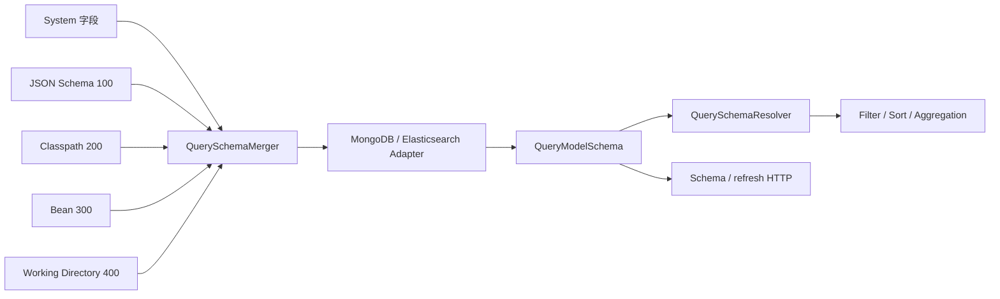

# 查询模型 Schema

## Schema 解决什么问题

Query Model Schema 是运行时查询能力合同，分别描述 `QueryModel.SNAPSHOT` 与 `QueryModel.EVENT_STREAM`。它把请求中的逻辑字段解析为后端物理路径，并记录值类型、基数、时间语义、动态子字段、投影路径以及每种操作的 capability。`QuerySchemaResolver` 据此重写并校验过滤、投影、排序和[聚合查询](./aggregation-query.md)，而不是仅凭 DTO 中存在某个属性就假定后端可以查询。

它与[通用 JSON Schema](../advanced/schema.md)不同：JSON Schema 描述序列化形状并可参与 OpenAPI 生成；Query Model Schema 还必须由所选 MongoDB 或 Elasticsearch adapter 结合实际存储事实解析，才能证明某个操作可用。

## 来源优先级与合并

运行时来源链如下，括号内数字越大，优先级越高：

- `System` 为 Snapshot 和 EventStream 提供各自的系统字段。扩展只能位于 Snapshot 的 `state` 或 EventStream 的 `body.body` 根下；已经由系统设置的字段叶不能被覆盖。
- `JsonQuerySchemaSource (100)` 从聚合状态的 JSON 形状推断 Snapshot 字段，并从领域事件 payload 推断 EventStream 的 `body.body.*` 字段。
- `ClasspathQuerySchemaSource (200)` 读取 `wow-query-schema/{context}/{aggregate}/{model}.json`；`WorkingDirectoryQuerySchemaSource (400)` 从 `config/` 下的同一相对路径读取。`model` 文件名使用小写，例如 `snapshot.json`、`event_stream.json`。
- `BeanQuerySchemaSource (300)` 合并当前上下文注册的 `QuerySchemaRegistration`。

`QuerySchemaMerger` 按数字从小到大合并，后来的高优先级来源只覆盖其显式设置的叶，未设置的叶沿用低优先级值。同一优先级的多个声明若对同一叶给出不同值会抛出 Schema conflict，而不是依赖加载顺序。刷新只重新加载当前进程中的来源与后端事实并替换缓存；它不会修改索引、mapping、validator 或历史数据。

## 后端适配

[MongoDB](../extensions/mongo.md) adapter 把逻辑字段经 `FieldConverter` 映射到文档路径，读取集合索引和可选的 `$jsonSchema` validator 来证明存储类型。Element scope 候选先来自逻辑声明中的 `MANY` + `OBJECT`；validator 为该字段提供物理类型约束时，adapter 再用 array/object 类型确认或否决该候选。未配置 validator 或该字段没有类型约束时会保留逻辑候选，但不具备物理类型证明。adapter 只在存在合适 text index 时发布模型级全文能力。

[Elasticsearch](../extensions/elasticsearch.md) adapter 读取目标 mapping，并分别考虑字段类型、multi-field、nested、doc values、alias 与 runtime field。全文字段可以绑定到 text 路径，精确匹配、排序或 TERMS 聚合可能绑定到 keyword multi-field；对象数组只有在对应 nested mapping 成立时才获得 Element scope。

两种 adapter 共享公共 capability 名称，但不会产生相同的物理路径、全文语义、数组作用域或时间能力。自定义 filter converter 会使内置 Query Model Schema 不可用；只有调用方同时提供与该 converter 一致的 Provider/adapter 实现，才能重新建立能力合同。

## 字段能力

当前内置 capability 共十一种：

| Capability | 用途 |
|---|---|
| `PRESENCE` | 判断存在、缺失、null 或空值，并作为默认投影物理路径的依据 |
| `EXACT_MATCH` | `EQ`、`NE`、`IN`、`NOT_IN` 和集合全包含等精确值匹配 |
| `LITERAL_MATCH` | `CONTAINS`、`STARTS_WITH`、`ENDS_WITH` 等字面字符串匹配 |
| `RANGE` | 大小比较、`BETWEEN` 与相对时间范围 |
| `FULL_TEXT_TERMS` | 全文 terms 搜索 |
| `FULL_TEXT_PHRASE` | 全文 phrase 搜索 |
| `SORT` | 按字段排序 |
| `ELEMENT_SCOPE` | 在数组/嵌套对象中建立独立元素作用域，供 `elementMatch` 与聚合 Elements 使用 |
| `AGGREGATE_TERMS` | TERMS 分组与 `ANY` 展示值 |
| `AGGREGATE_NUMERIC` | 数值直方图、数值 metric 与数值表达式 |
| `AGGREGATE_TEMPORAL` | 日期直方图与时间分桶 |

字段还携带 `valueTypes`、`cardinality`、`semanticType`、`dynamicChildren` 和 `masked`。即使 capability 存在，值类型、集合基数或当前 Element scope 不匹配，解析仍可能得到 `INCOMPATIBLE`。

## 字段脱敏元数据

`JsonQuerySchemaSource` 在运行时把领域字段注解编译为内存规则，并随 Schema 合并与后端 adapter 传递；公开 Schema 只暴露 `masked: Boolean`，不序列化策略、参数或可执行规则。内建注解、自定义 `@Masking(strategy)`、成员继承、结果行为与失败关闭合同统一见[字段脱敏](./masking.md)。

## COMPATIBLE 与 STRICT

一次解析的兼容级别为：

- `EXACT`：字段和所需 capability 都有已证明的物理绑定；
- `COMPATIBLE`：无法精确绑定，但兼容模式允许保留原路径，例如未声明字段或可接受的动态子字段；
- `INCOMPATIBLE`：字段已知但缺少所需 capability，或值类型、基数、Element scope 不符合合同。

`QuerySchemaValidationMode.COMPATIBLE` 接受 `EXACT` 与 `COMPATIBLE`，拒绝 `INCOMPATIBLE`；`QuerySchemaValidationMode.STRICT` 只接受 `EXACT`。模式控制解析结果是否被接受，不会为后端补建索引或 mapping。

## 系统标签与回退

Schema 来源或后端事实不可用时，只有 `COMPATIBLE` 模式可以让不引用系统 `tags` 的过滤请求按原路径回退。过滤条件直接或通过逻辑组合、搜索、相对时间、Element predicate 在作用域解析后引用根系统 `tags` 或 `tags.*` 时仍传播 `QuerySchemaUnavailableException`，保持失败关闭；元素自身名为 `tags` 的业务字段不等于根系统标签。`STRICT` 对所有请求都不回退。

因此不能把回退理解为“Schema 关闭后所有字段可查询”。回退只保留原请求，不证明字段能力，也不会放宽系统标签查询。字段已明确解析为 `INCOMPATIBLE`、来源冲突或普通校验失败同样不会触发 unavailable 回退。这个 `COMPATIBLE` unavailable 回退只适用于直接 `QueryModelSchemaProvider.resolve(...)` 的请求解析；受管 Gateway 必须在返回数据前取得 Schema 执行 Mask，Schema 不可用时 `single`、`list`、`paged` 失败关闭且不会订阅 Backend，只有 `count` 不读取 Mask Schema。系统标签的授权语义见[数据权限](../data-access.md)。

## HTTP 与 OpenAPI 扩展

Snapshot 与 EventStream 都发布无作用域变体的 Schema 与 refresh HTTP 路由：

| 模型 | 读取当前 Schema | 刷新当前进程缓存 |
|---|---|---|
| Snapshot | `GET /{aggregate}/snapshot/schema` | `POST /{aggregate}/snapshot/schema/refresh` |
| EventStream | `GET /{aggregate}/event/schema` | `POST /{aggregate}/event/schema/refresh` |

这四条模型级路由没有 tenant、owner 或 aggregate-ID 变体。响应是公开的 `QueryModelSchemaMetadata`，包含模型、模型级 capability 和字段 capability；实际路径及 operationId 以生成的 [OpenAPI](../open-api.md) 为准。

`x-wow-query-fields` 是 aggregate-specific Snapshot query request-body component 上的静态 OpenAPI 扩展。它由 Snapshot 系统字段与 `JsonQuerySchemaSource` 推断字段组成，用于生成器发现候选逻辑字段；它不是请求 JSON 属性，不含后端物理绑定，也不证明运行时 capability。EventStream 请求没有对应扩展，当前也没有 EventStream API Client 或客户端字段发现；Snapshot API Client 同样不会读取运行时 Schema 代替服务端校验。客户端边界见 [API Client](./query-api-client.md)。

## Provider 与存储路由

`SnapshotSchemaHandlerFunction` 从 `SnapshotQueryBackendFactory` 创建的 routed Backend 读取 `QueryModelSchemaProvider`，EventStream handler 同样使用 `EventStreamQueryBackendFactory`。因此 Schema 读取、refresh 与实际查询按同一个 `NamedAggregate` 选择同一 Backend 路由；不能绕过 routing Factory 从另一存储拼接 Schema。Provider 不可用时明确抛出 `QuerySchemaUnavailableException`。Factory 与 Gateway 的职责见[查询后端](./query-backend.md)。

## 排查字段不可查询

1. 调用对应模型的 `GET .../schema`，确认字段存在且包含当前操作所需 capability；Snapshot 的 `state.*` 与 EventStream 的 `body.body.*` 不可混用。
2. 检查 `100/200/300/400` 来源链。确认扩展根正确、同优先级没有冲突、高优先级声明没有意外覆盖较低优先级叶。
3. 检查实际后端事实：MongoDB 的索引与 validator，或 Elasticsearch 的 mapping、multi-field、nested、doc values 与 runtime field。不要从另一种后端的结果类推。
4. 区分 `INCOMPATIBLE`、Schema conflict、Schema unavailable 与请求 DTO 错误，并核对当前使用 `COMPATIBLE` 还是 `STRICT`。
5. 若刚修改声明或 mapping，可调用 refresh 重新读取当前进程视图；若 mapping 或历史文档本身不满足条件，refresh 不会修复数据。
6. 若使用自定义 converter，确认 routed Backend 仍提供与转换规则一致的 `QueryModelSchemaProvider`。
